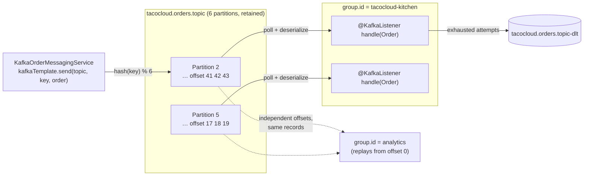

## Objective

JMS e AMQP (os conceitos `spring-jms-messaging` e `spring-rabbitmq-messaging`)
modelam mensageria como *consumo de fila*: o broker rastreia o estado de
entrega de uma mensagem, um consumidor a confirma, e o broker então a
esquece. Kafka inverte isso. Um tópico Kafka é um **log** particionado e
somente-anexação em disco; uma mensagem não é removida quando é lida, ela
simplesmente fica num offset até a janela de retenção expirar. Consumidores
rastreiam sua própria posição, então um segundo grupo de consumidores
independente pode ler o mesmo tópico a partir do offset 0 sem perturbar o
primeiro, e um consumidor que teve um bug pode retroceder e reprocessar. É
isso que faz do Kafka um substrato de streaming de eventos de alto
throughput em vez de uma fila de trabalho. O Spring para Apache Kafka
(`spring-kafka`) envolve a API crua de produtor/consumidor
`org.apache.kafka.clients` na mesma estrutura de template-mais-listener que o
Spring usa em todo lugar: um `KafkaTemplate<K, V>` autoconfigurado para
enviar e `@KafkaListener` para receber, com serializadores, threading de
consumidor, commits de offset, e ciclo de vida do container tratados para
você. Este conceito é sobre *usar* o Kafka a partir de uma aplicação Spring —
para como o próprio broker particiona, replica, e coordena grupos de
consumidores internamente, veja o conceito
`distributed-message-queue-design` em System Design.

## Use Cases

- **Streaming de eventos de alto throughput com vários consumidores
  independentes.** Um tópico `orders` lido simultaneamente por um serviço de
  fulfillment, um de billing, e um carregador de analytics — cada um seu
  próprio grupo de consumidores, cada um com seus próprios offsets, sem
  nenhum competindo pelas mesmas mensagens como workers numa fila JMS
  fariam.
- **Event sourcing e logs de auditoria.** Quando o log *é* o sistema de
  registro, o modelo de retenção do Kafka significa que a sequência de
  eventos é durável e relegível; reconstruir uma projeção é uma questão de
  resetar os offsets de um grupo de consumidores para o início em vez de
  restaurar um backup.
- **Alimentando um pipeline de stream processing.** Kafka é a entrada/saída
  padrão para Kafka Streams, Flink, e Spark Structured Streaming; uma
  aplicação Spring que publica eventos de domínio com `KafkaTemplate` ganha
  esses pipelines de graça a jusante.
- **Reprocessando depois de uma correção de bug.** Um consumidor que
  processou mal uma semana de mensagens pode ser apontado de volta a um
  offset anterior e reexecutado — impossível num broker que apaga na
  confirmação.
- **Bufferizando um firehose na frente de um sistema mais lento.** Kafka
  absorve picos em disco de forma barata (escritas sequenciais) e deixa
  consumidores puxarem no seu próprio ritmo, então um pico não precisa ser
  dimensionado pelo banco de dados a jusante.

## Deep Dive

### Configuração: a dependência e `spring.kafka.*`

A própria biblioteca client do Kafka é configurada com um mapa
`java.util.Properties` de chaves string — `bootstrap.servers`,
`key.serializer`, `value.serializer`, `group.id` — passado a um construtor
`KafkaProducer` ou `KafkaConsumer`. Essa forma crua ainda funciona, mas numa
aplicação Spring Boot você nunca a escreve: a autoconfiguração vincula
propriedades `spring.kafka.*` a um objeto `KafkaProperties` e constrói as
factories de produtor/consumidor, o `KafkaTemplate`, e a factory do container
de listener a partir dele.

```yaml
spring:
  kafka:
    bootstrap-servers:
      - kafka.tacocloud.com:9092
      - kafka.tacocloud.com:9093
      - kafka.tacocloud.com:9094
    template:
      default-topic: tacocloud.orders.topic
    producer:
      key-serializer: org.apache.kafka.common.serialization.StringSerializer
      value-serializer: org.springframework.kafka.support.serializer.JsonSerializer
    consumer:
      group-id: tacocloud-kitchen
      auto-offset-reset: earliest
      value-deserializer: org.springframework.kafka.support.serializer.JsonDeserializer
      properties:
        spring.json.trusted.packages: tacos
```

`bootstrap-servers` é plural e recebe uma lista — esses são apenas os pontos
de contato *iniciais*; o client descobre o resto do cluster e os líderes de
partição a partir de qualquer broker que responder primeiro, então listar
dois ou três já é o suficiente para a conexão sobreviver a um deles estar
fora do ar. O default é `localhost:9092`, motivo pelo qual um broker rodando
localmente não precisa de nenhuma configuração.

Qualquer coisa que o client Kafka suporte mas o Spring não exponha como
propriedade tipada passa pelo mapa de passthrough:

```yaml
spring:
  kafka:
    producer:
      properties:
        compression.type: lz4
        linger.ms: 20
```

Tópicos podem ser criados no startup declarando um bean `NewTopic`; o
`KafkaAdmin` autoconfigurado o reconcilia contra o cluster e o ignora se o
tópico já existir:

```java
@Bean
public NewTopic ordersTopic() {
    return new NewTopic("tacocloud.orders.topic", 6, (short) 3);
}
```

Seis partições e um fator de replicação de 3 — a contagem de partições é o
teto de quantos consumidores num grupo podem trabalhar em paralelo, então
vale a pena superprovisionar de antemão (aumentar depois é fácil, diminuir
não é).

### Enviando com `KafkaTemplate`

`KafkaTemplate<K, V>` é genericamente tipado sobre a chave e o valor, motivo
pelo qual não tem uma contraparte `convertAndSend()` como o `JmsTemplate` —
todo `send()` já recebe o objeto de domínio e o passa pelo serializador
configurado. As sobrecargas aceitam, em ordem de especificidade crescente:
tópico, partição, chave, timestamp, payload.

```java
CompletableFuture<SendResult<K, V>> send(String topic, V data);
CompletableFuture<SendResult<K, V>> send(String topic, K key, V data);
CompletableFuture<SendResult<K, V>> send(String topic, Integer partition, K key, V data);
CompletableFuture<SendResult<K, V>> send(String topic, Integer partition, Long timestamp, K key, V data);
CompletableFuture<SendResult<K, V>> send(ProducerRecord<K, V> record);
CompletableFuture<SendResult<K, V>> send(Message<?> message);

CompletableFuture<SendResult<K, V>> sendDefault(V data);
CompletableFuture<SendResult<K, V>> sendDefault(K key, V data);
CompletableFuture<SendResult<K, V>> sendDefault(Integer partition, K key, V data);
CompletableFuture<SendResult<K, V>> sendDefault(Integer partition, Long timestamp, K key, V data);
```

A implementação do serviço não é notável — injete o template, chame
`send()`:

```java
package tacos.messaging;

import org.springframework.kafka.core.KafkaTemplate;
import org.springframework.stereotype.Service;

@Service
public class KafkaOrderMessagingService implements OrderMessagingService {

    private final KafkaTemplate<String, Order> kafkaTemplate;

    public KafkaOrderMessagingService(KafkaTemplate<String, Order> kafkaTemplate) {
        this.kafkaTemplate = kafkaTemplate;
    }

    @Override
    public void sendOrder(Order order) {
        kafkaTemplate.send("tacocloud.orders.topic", order);
    }
}
```

Com `spring.kafka.template.default-topic` definido, o nome do tópico
desaparece da chamada por completo:

```java
@Override
public void sendOrder(Order order) {
    kafkaTemplate.sendDefault(order);
}
```

O detalhe importante que o livro ignora: **`send()` é assíncrono e o future
retornado é o único lugar onde uma falha aparece.** Ignorá-lo significa que
um erro de serialização ou um broker inalcançável é engolido em silêncio. Ou
você anexa um callback:

```java
kafkaTemplate.send("tacocloud.orders.topic", order.getId(), order)
    .whenComplete((result, ex) -> {
        if (ex != null) {
            log.error("Failed to publish order {}", order.getId(), ex);
        } else {
            RecordMetadata meta = result.getRecordMetadata();
            log.info("Published to partition {} at offset {}",
                     meta.partition(), meta.offset());
        }
    });
```

...ou bloqueia, quando quem chama genuinamente precisa que o envio tenha
sido concluído antes de continuar:

```java
SendResult<String, Order> result =
        kafkaTemplate.send("tacocloud.orders.topic", order.getId(), order)
                     .get(10, TimeUnit.SECONDS);
```

Note o segundo argumento em ambos: a **chave**. Kafka roteia por
`hash(key) % partitions`, então passar `order.getId()` garante que todo
evento de um pedido caia na mesma partição e portanto seja consumido em
ordem. Enviar sem chave e os registros são espalhados entre partições em
round-robin, o que maximiza throughput e destrói qualquer ordenação por
entidade. A chave é o único parâmetro "opcional" que quase nunca é opcional
na prática.

### Recebendo com `@KafkaListener`

`KafkaTemplate` não tem `receive()` — diferente de `JmsTemplate` e
`RabbitTemplate`, não há uma API pull no lado do Spring, porque um
consumidor Kafka é um objeto de longa duração, coordenado em grupo, que faz
commit de offset e não cabe numa chamada de recebimento única. A única forma
de consumir é um listener:

```java
package tacos.kitchen.messaging.kafka.listener;

import org.springframework.kafka.annotation.KafkaListener;
import org.springframework.stereotype.Component;
import tacos.Order;
import tacos.kitchen.KitchenUI;

@Component
public class OrderListener {

    private final KitchenUI ui;

    public OrderListener(KitchenUI ui) {
        this.ui = ui;
    }

    @KafkaListener(topics = "tacocloud.orders.topic", groupId = "tacocloud-kitchen")
    public void handle(Order order) {
        ui.displayOrder(order);
    }
}
```

Por trás da annotation, um `KafkaMessageListenerContainer` (ou um
concorrente) faz polling do broker na sua própria thread, desserializa cada
registro, invoca o método, e confirma o offset depois. `groupId` é a
unidade de balanceamento de carga: toda instância desta aplicação
compartilhando `tacocloud-kitchen` divide as partições do tópico entre elas,
enquanto um id de grupo *diferente* em outro serviço lê os mesmos registros
de forma independente.

Quando o payload não é suficiente, o método pode receber o `ConsumerRecord`
bruto (ou o `Message` do Spring) junto:

```java
@KafkaListener(topics = "tacocloud.orders.topic")
public void handle(Order order, ConsumerRecord<String, Order> record) {
    log.info("Received key={} from partition {} at offset {} (ts {})",
             record.key(), record.partition(), record.offset(), record.timestamp());
    ui.displayOrder(order);
}
```

```java
@KafkaListener(topics = "tacocloud.orders.topic")
public void handle(Order order, Message<Order> message) {
    MessageHeaders headers = message.getHeaders();
    log.info("Received from partition {} with timestamp {}",
             headers.get(KafkaHeaders.RECEIVED_PARTITION),
             headers.get(KafkaHeaders.RECEIVED_TIMESTAMP));
    ui.displayOrder(order);
}
```

Valores de header individuais também podem ser puxados diretamente com
`@Header`, o que geralmente é mais organizado do que buscar dentro do mapa
`MessageHeaders`:

```java
@KafkaListener(topics = "tacocloud.orders.topic")
public void handle(@Payload Order order,
                   @Header(KafkaHeaders.RECEIVED_KEY) String key,
                   @Header(KafkaHeaders.RECEIVED_PARTITION) int partition) {
    ui.displayOrder(order);
}
```

Como o Kafka busca em lotes de qualquer forma, um listener pode ser
configurado para receber o lote inteiro em vez de um registro por invocação
— um commit de offset por lote em vez de por registro, o que é um grande
ganho de throughput para sinks que conseguem escrever em massa:

```yaml
spring:
  kafka:
    listener:
      type: batch
```

```java
@KafkaListener(topics = "tacocloud.orders.topic")
public void handleBatch(List<Order> orders) {
    ui.displayOrders(orders);   // one commit for the whole list
}
```

### Tratamento de falhas: `@RetryableTopic` e dead-letter topics

Um registro que falha numa partição Kafka é um problema mais difícil do que
numa fila: não há "rejeitar e recolocar na fila", e como uma partição é uma
sequência estrita, retentar no lugar *bloqueia todo registro subsequente
naquela partição*. O `spring-kafka` resolve isso com retries não
bloqueantes — o registro que falhou é encaminhado para um tópico de retry
gerado com um delay, a partição principal segue em frente, e um registro
que esgota suas tentativas cai num tópico de dead-letter:

```java
@RetryableTopic(
    attempts = "4",
    backoff = @Backoff(delay = 1000, multiplier = 2.0),
    dltTopicSuffix = "-dlt")
@KafkaListener(topics = "tacocloud.orders.topic")
public void handle(Order order) {
    ui.displayOrder(order);
}

@DltHandler
public void handleDlt(Order order, @Header(KafkaHeaders.RECEIVED_TOPIC) String topic) {
    log.error("Order {} landed in DLT from {}", order.getId(), topic);
}
```

A annotation provisiona `tacocloud.orders.topic-retry-0`, `-retry-1`, … e
`tacocloud.orders.topic-dlt`, além dos listeners que os esvaziam.



> **Livro vs. hoje.** Três detalhes concretos do livro mudaram.
> **(1) As assinaturas.** Todo overload `send()`/`sendDefault()` no texto ao
> redor da listagem 8.8 retorna `ListenableFuture<SendResult<K, V>>`; o
> spring-kafka 3.0 (lançado com o Spring Boot 3.0) substituiu o
> `ListenableFuture` caseiro do Spring pelo `CompletableFuture` do JDK em
> toda a API, então o idioma de callback agora é `.whenComplete(...)` em vez
> de `.addCallback(...)`. O mesmo release renomeou as constantes de header
> que o livro usa — `KafkaHeaders.RECEIVED_PARTITION_ID` →
> `RECEIVED_PARTITION`, `RECEIVED_MESSAGE_KEY` → `RECEIVED_KEY`.
> **(2) A dependência.** O livro afirma que "não existe um Spring Boot
> starter para Kafka" e faz você adicionar
> `org.springframework.kafka:spring-kafka` diretamente — correto até o Boot
> 3.x, onde a mera presença desse jar já disparava a autoconfiguração. O
> Spring Boot 4.0 modularizou a autoconfiguração para fora do jar
> monolítico `spring-boot-autoconfigure`, e agora existe um
> `org.springframework.boot:spring-boot-starter-kafka` de verdade que é
> *obrigatório*: com apenas `spring-kafka` num classpath Boot 4, nenhum bean
> `KafkaTemplate` é criado e as propriedades `spring.kafka.*` são
> completamente ignoradas. **(3) O broker.** Em 2019 todo cluster Kafka
> rodava junto com um ensemble ZooKeeper mantendo metadados do cluster.
> KRaft — o quorum Raft interno do próprio Kafka para esses metadados — foi
> marcado como pronto para produção para clusters novos no Kafka 3.3 (2022),
> sua ferramenta de migração no 3.7, e **o Kafka 4.0 (março de 2025) removeu
> o suporte ao ZooKeeper por completo**; KRaft agora é o único modo. Nada no
> `KafkaTemplate` ou `@KafkaListener` mudou por causa disso, mas "suba o
> ZooKeeper, depois o Kafka" não é mais como você consegue um broker rodando
> localmente. Enquanto isso, o spring-kafka 4.0 (novembro de 2025, Spring
> Framework 7 / Boot 4) acompanha o kafka-clients 4.1 e adiciona
> `@ShareKafkaListener` para o novo modo de share-consumer "fila" do Kafka —
> o Kafka recuperando a semântica ponto-a-ponto com a qual este conceito o
> contrasta. O modelo de programação central `KafkaTemplate.send()` /
> `@KafkaListener` que o livro ensina está, no mais, intacto sete anos
> depois.

## Trade-offs

- **Retenção e replay tornam o broker um sistema de registro — e dão a ele
  o peso operacional desse sistema.** Poder resetar um grupo de consumidores
  para o offset 0 e reconstruir uma projeção é genuinamente algo que um
  broker JMS ou AMQP não consegue fazer, mas o outro lado é que agora você
  está fazendo capacity planning, replicando, e protegendo semanas de dados
  de negócio em discos do broker. Um consumidor que fica fora do ar além da
  janela de retenção não recebe um backlog esperando por ele — recebe uma
  lacuna, e `auto-offset-reset` decide silenciosamente se ele retoma no
  registro sobrevivente mais antigo ou pula para o mais novo:
  ```yaml
  spring:
    kafka:
      consumer:
        auto-offset-reset: earliest   # replay what's left  (vs. "latest": skip the gap)
  ```
- **Operar um cluster Kafka custa mais do que operar RabbitMQ.** Contagem de
  partições, fatores de replicação, configurações de réplicas in-sync,
  políticas de retenção, rebalanceamento de broker, monitoramento de lag de
  grupo de consumidores — nada disso tem equivalente no RabbitMQ que você é
  forçado a pensar no primeiro dia. O KRaft removeu o ensemble ZooKeeper,
  que era a maior peça isolada desse overhead, mas um cluster Kafka ainda é
  um sistema distribuído com estado que você mantém. Se o requisito é
  "alguns milhares de jobs por minuto, consumidos uma vez, ordem não
  importa", RabbitMQ ou Artemis é a resposta menor e os conceitos irmãos
  `spring-rabbitmq-messaging` / `spring-jms-messaging` cobrem isso.
- **Ordenação é por partição, não por tópico — e a chave é o que torna isso
  útil.** Um broker JMS de fila única dá FIFO sobre tudo; Kafka dá FIFO
  somente dentro de uma partição, e deliberadamente não há ordem global de
  tópico. Conseguir a garantia que você provavelmente quer significa rotear
  por uma chave de negócio, e esquecer a chave é um bug que só aparece sob
  concorrência:
  ```java
  kafkaTemplate.send(TOPIC, order);                  // round-robin: events for one
                                                     // order can land on 3 partitions
  kafkaTemplate.send(TOPIC, order.getId(), order);   // same key → same partition → ordered
  ```
- **Paralelismo é limitado pela contagem de partições, não pela contagem de
  instâncias.** Dentro de um grupo de consumidores cada partição é atribuída
  a exatamente um consumidor, então escalar um deployment de
  `@KafkaListener` de 6 pods para 12 contra um tópico de 6 partições não
  compra nada — os seis extras ficam ociosos. Uma fila JMS de
  competing-consumers não tem esse teto; você só adiciona workers. A
  contagem de partições é uma decisão de capacidade tomada no momento de
  criação do tópico e incômoda de reduzir depois.
- **`send()` é fire-and-forget a menos que você o torne diferente.** O
  `CompletableFuture` retornado é o único canal para uma falha de
  serialização ou um broker inalcançável, e uma chamada cujo resultado é
  descartado reporta um sucesso que não pode conhecer. Bloquear em `.get()`
  restaura o erro mas também restaura a latência que o produtor assíncrono
  existe para esconder — e a configuração `acks` do produtor ainda decide o
  que "entregue" sequer significa (apenas o líder vs. todas as réplicas
  in-sync).
- **At-least-once é o default realista, então consumidores precisam ser
  idempotentes.** Com offsets confirmados depois do processamento, um
  consumidor que trava no meio do trabalho reprocessa ao reiniciar. Kafka
  oferece exactly-once via transações
  (`spring.kafka.producer.transaction-id-prefix` mais
  `KafkaTransactionManager` no Spring), mas a garantia termina na própria
  fronteira do Kafka — no momento em que seu listener faz uma chamada HTTP
  ou escreve num banco de dados fora da transação, você precisa de
  idempotência lá de qualquer forma. A maioria dos times entrega
  at-least-once com um sink idempotente e pula a maquinaria transacional
  por completo; veja `distributed-message-queue-design` para entender por
  quê.
- **Retry não bloqueante é uma melhoria genuína sobre reentrega bloqueante,
  mas quebra a ordenação para os registros retentados.** `@RetryableTopic`
  evita que um registro venenoso pare toda sua partição, ao custo desse
  registro ser reentregue de um tópico *diferente* depois, fora de
  sequência com seus vizinhos. Se ordenação estrita por chave importa mais
  do que throughput, retry bloqueante na partição principal é a escolha
  correta — e mais lenta.

## Documentation Links

- Craig Walls, "Spring in Action", 5th Edition (Manning, 2019) — Chapter 8,
  "Sending messages asynchronously", section 8.3 "Messaging with Kafka",
  p. 202-208 — doc
- [Spring for Apache Kafka Reference — Sending Messages (KafkaTemplate)](https://docs.spring.io/spring-kafka/reference/kafka/sending-messages.html) — doc
- [Spring for Apache Kafka Reference — Receiving Messages (@KafkaListener)](https://docs.spring.io/spring-kafka/reference/kafka/receiving-messages.html) — doc
- [Spring for Apache Kafka Reference — Non-Blocking Retries (@RetryableTopic)](https://docs.spring.io/spring-kafka/reference/retrytopic.html) — doc
- [Spring Boot Reference — Messaging: Apache Kafka Support](https://docs.spring.io/spring-boot/reference/messaging/kafka.html) — doc
- [Apache Kafka Documentation — Design (log storage, partitioning, delivery semantics)](https://kafka.apache.org/documentation/#design) — doc
- [Apache Kafka 4.0.0 Release Announcement — KRaft-only, ZooKeeper removed](https://kafka.apache.org/blog/2025/03/18/apache-kafka-4.0.0-release-announcement/) — doc
