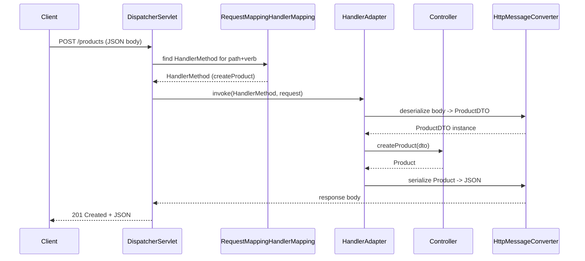

## Objective

A `@RestController` method with a `@GetMapping` looks like plain Java, but getting from an incoming HTTP request to that method call — and back out to a JSON response — passes through a specific, inspectable pipeline: the `DispatcherServlet` (the Front Controller every request enters through), `RequestMappingHandlerMapping` (which route maps to which method), a `HandlerAdapter` (which invokes it), argument resolvers (which fill in its parameters), and `HttpMessageConverter`s (which handle serialization both ways). None of this is magic — it's a fixed sequence of well-named Spring classes doing one job each, and knowing the sequence explains a lot of Spring MVC's error messages and extension points.

## Use Cases

- Debugging a "no handler found" (404) vs. a "handler found but argument resolution failed" (400) — these are two different pipeline stages failing, not the same kind of error.
- Adding a custom `HttpMessageConverter` (e.g. for Protobuf or XML) and knowing exactly where in the pipeline it plugs in — both for reading `@RequestBody` and writing the return value.
- Writing a `HandlerInterceptor` or `@ControllerAdvice` and understanding which point in the request lifecycle it actually runs at, relative to handler mapping and invocation.
- Explaining, precisely, why a controller method's parameter order and annotations (`@PathVariable`, `@RequestParam`, `@RequestBody`) are enough for Spring to populate them correctly with no manual parsing code.

## Deep Dive

### Step 1 — Handler mapping: matching a request to a method

At startup, Spring's component scan finds every `@Controller`/`@RestController` bean and, via reflection, inspects each method for `@GetMapping`/`@PostMapping`/`@RequestMapping`. Every match is registered in `RequestMappingHandlerMapping` as a `RequestMappingInfo` (the HTTP verb + URI pattern + required headers/content-type) paired with a `HandlerMethod` (the controller instance, the `Method` reference, and its parameter metadata):

```java
@RestController
@RequestMapping("/products")
public class ProductController {

    @GetMapping("/{id}")
    public Product getProductById(@PathVariable Long id) {
        return productService.findById(id);
    }

    @PostMapping
    public Product createProduct(@RequestBody ProductDTO dto) {
        return productService.save(dto);
    }
}
```

This registers two routes — `GET /products/{id}` and `POST /products` — before a single request has arrived. When a request comes in, `RequestMappingHandlerMapping` doesn't scan linearly through every registered route; it matches the request path against pre-parsed `PathPattern`s (the current default matching strategy, since Spring Framework 5.3 — the older string-based `AntPathMatcher` is deprecated), which is what makes lookup fast even with hundreds of registered routes.

### Step 2 — Handler adaptation and argument resolution

Once `DispatcherServlet` has a matching `HandlerMethod`, a `HandlerAdapter` is what actually invokes it — but not before resolving every method parameter via argument resolvers, one strategy per annotation:

```java
public class ProductDTO {
    private String name;
    private BigDecimal price;
    // getters and setters
}
```

```
POST /products HTTP/1.1
Content-Type: application/json

{"name": "Bluetooth Speaker", "price": 99.99}
```

- `@PathVariable Long id` — extracted from the matched URI template variable.
- `@RequestParam` — pulled from the query string.
- `@RequestBody ProductDTO dto` — the request body is handed to an `HttpMessageConverter`; for `application/json`, that's `MappingJackson2HttpMessageConverter`, which delegates to Jackson's `ObjectMapper` to deserialize the JSON into a `ProductDTO` instance via reflection (locate the constructor/record components, invoke setters or assign fields).

Each resolver only knows how to fill in the one kind of parameter it owns — the `HandlerAdapter` runs the whole set against the method's declared parameters before invocation, in order.

### Step 3 — Invocation and response serialization

With every argument resolved, the `HandlerAdapter` invokes the controller method via reflection and gets back a return value. For a `@RestController`, that return value doesn't go to a view — Spring assumes it should be serialized directly, running the same `HttpMessageConverter` machinery in reverse:

```java
public class Product {
    private Long id;
    private String name;
    private BigDecimal price;
}
```

```
HTTP/1.1 201 Created
Content-Type: application/json

{"id": 42, "name": "Bluetooth Speaker", "price": 99.99}
```

`MappingJackson2HttpMessageConverter` hands the returned object to Jackson's `ObjectMapper`, which serializes it to JSON and writes it to the response's `OutputStream`, setting `Content-Type: application/json`. Field-level control over this step (`@JsonProperty`, `@JsonIgnore`, `@JsonFormat`, `@JsonTypeInfo`) or global control (a custom `ObjectMapper` bean — naming strategy, visibility, extra modules) both hook into this same converter step, not a separate serialization layer.

### The full round trip



## Trade-offs

- **This pipeline explains two distinct 4xx failure modes** — a path that matches no `RequestMappingInfo` fails at the handler-mapping step (404, "no handler found"); a path that matches but whose body can't satisfy an argument resolver (malformed JSON for a `@RequestBody`, a non-numeric `@PathVariable`) fails one step later (400, argument resolution) — same HTTP-level symptom category, different root cause and different place to look.
- **Every stage is an extension point, not a black box** — a `HandlerInterceptor` runs around handler mapping/invocation, `@ControllerAdvice` centralizes exception handling that would otherwise need to be duplicated per controller, and a custom `HttpMessageConverter` (for Protobuf, XML, or a custom media type) plugs into exactly the same slot Jackson's converter already occupies — nothing about this pipeline is closed for extension.
- **Reflection-based invocation costs something, and Spring accepts that cost deliberately** — `HandlerAdapter` invoking controller methods via reflection is slower per-call than a direct method call would be, but the routing/decoupling/extensibility this buys (declarative mapping, converter pluggability, interceptor chains) is judged worth it for virtually all web application workloads; hand-rolled dispatch (as in a from-scratch HTTP server) avoids the reflection cost but reimplements all of this machinery by hand.
```java
// What HandlerAdapter effectively does, stripped of error handling:
Method m = handlerMethod.getMethod();
Object result = m.invoke(controllerInstance, resolvedArgs);
```
- **Book vs. today**: routing lookup is often described loosely as "tries/prefix structures" — today's precise mechanism is `PathPattern` (a pre-parsed, tree-based pattern matched against a pre-parsed `PathContainer`), the default matching strategy since Spring Framework 5.3. The older string-based `AntPathMatcher` still exists but is deprecated in favor of it — the "trie-like" characterization is directionally right, `PathPattern` is just the concrete, current implementation of that idea.

## Documentation Links

- [Java Web Internals: Unlock the secrets of Java web servers, frameworks, and application architecture (Packt, 2025) — Chapter 7, "Understanding internally how a request works in the Spring framework"](https://www.packtpub.com/en-us/product/java-web-internals-9781835889738) — doc
- [Spring Framework Reference — Annotated Controllers: @RequestMapping](https://docs.spring.io/spring-framework/reference/web/webmvc/mvc-controller/ann-requestmapping.html) — doc
- [Spring Framework Reference — Method Arguments (argument resolvers)](https://docs.spring.io/spring-framework/reference/web/webmvc/mvc-controller/ann-methods/arguments.html) — doc
- [Spring Framework Reference — HttpMessageConverter](https://docs.spring.io/spring-framework/reference/web/webmvc/message-converters.html) — doc
- [Spring Framework Reference — DispatcherServlet](https://docs.spring.io/spring-framework/reference/web/webmvc/dispatcher-servlet.html) — doc
