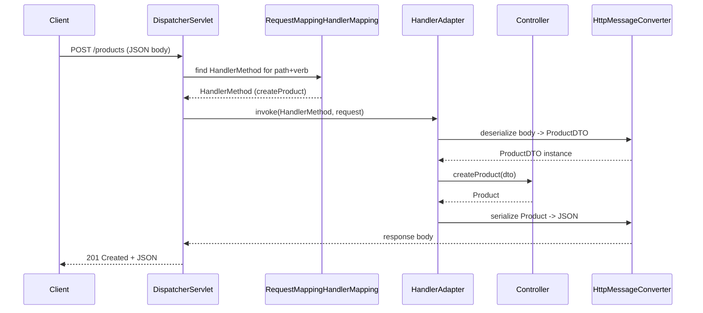

## Objective

Um método `@RestController` com um `@GetMapping` parece Java puro, mas ir de
uma requisição HTTP de entrada até a chamada desse método — e voltar até uma
resposta JSON — passa por um pipeline específico e inspecionável: o
`DispatcherServlet` (o Front Controller por onde toda requisição entra), o
`RequestMappingHandlerMapping` (que rota mapeia para qual método), um
`HandlerAdapter` (que o invoca), argument resolvers (que preenchem seus
parâmetros), e `HttpMessageConverter`s (que cuidam da serialização nos dois
sentidos). Nada disso é mágica — é uma sequência fixa de classes Spring bem
nomeadas, cada uma fazendo um trabalho, e conhecer a sequência explica boa
parte das mensagens de erro e dos pontos de extensão do Spring MVC.

## Use Cases

- Debugar um "no handler found" (404) vs. um "handler encontrado, mas
  resolução de argumento falhou" (400) — esses são dois estágios diferentes
  do pipeline falhando, não o mesmo tipo de erro.
- Adicionar um `HttpMessageConverter` customizado (por exemplo, para Protobuf
  ou XML) e saber exatamente onde no pipeline ele se encaixa — tanto para
  ler `@RequestBody` quanto para escrever o valor de retorno.
- Escrever um `HandlerInterceptor` ou `@ControllerAdvice` e entender em qual
  ponto do ciclo de vida da requisição ele de fato roda, em relação ao
  handler mapping e à invocação.
- Explicar, com precisão, por que a ordem e as annotations dos parâmetros de
  um método de controller (`@PathVariable`, `@RequestParam`,
  `@RequestBody`) bastam para que o Spring os preencha corretamente sem
  nenhum código de parsing manual.

## Deep Dive

### Passo 1 — Handler mapping: casando uma requisição com um método

Na inicialização, o component scan do Spring encontra todo bean
`@Controller`/`@RestController` e, via reflection, inspeciona cada método
por `@GetMapping`/`@PostMapping`/`@RequestMapping`. Todo match é registrado
em `RequestMappingHandlerMapping` como um `RequestMappingInfo` (o verbo HTTP
+ padrão de URI + headers/content-type exigidos) pareado com um
`HandlerMethod` (a instância do controller, a referência ao `Method`, e os
metadados de seus parâmetros):

```java
@RestController
@RequestMapping("/products")
public class ProductController {

    @GetMapping("/{id}")
    public Product getProductById(@PathVariable Long id) {
        return productService.findById(id);
    }

    @PostMapping
    public Product createProduct(@RequestBody ProductDTO dto) {
        return productService.save(dto);
    }
}
```

Isso registra duas rotas — `GET /products/{id}` e `POST /products` — antes
de uma única requisição chegar. Quando uma requisição chega, o
`RequestMappingHandlerMapping` não varre linearmente cada rota registrada;
ele casa o path da requisição contra `PathPattern`s pré-parseados (a
estratégia de matching padrão atual, desde o Spring Framework 5.3 — o
`AntPathMatcher` mais antigo, baseado em string, está deprecated), o que é
o que torna o lookup rápido mesmo com centenas de rotas registradas.

### Passo 2 — Adaptação do handler e resolução de argumentos

Uma vez que o `DispatcherServlet` tem um `HandlerMethod` que deu match, um
`HandlerAdapter` é quem de fato o invoca — mas não antes de resolver todo
parâmetro do método via argument resolvers, uma estratégia por annotation:

```java
public class ProductDTO {
    private String name;
    private BigDecimal price;
    // getters and setters
}
```

```
POST /products HTTP/1.1
Content-Type: application/json

{"name": "Bluetooth Speaker", "price": 99.99}
```

- `@PathVariable Long id` — extraído da variável de template de URI que
  deu match.
- `@RequestParam` — retirado da query string.
- `@RequestBody ProductDTO dto` — o corpo da requisição é entregue a um
  `HttpMessageConverter`; para `application/json`, esse é o
  `MappingJackson2HttpMessageConverter`, que delega ao `ObjectMapper` do
  Jackson para deserializar o JSON numa instância de `ProductDTO` via
  reflection (localizar o construtor/componentes do record, invocar setters
  ou atribuir campos).

Cada resolver só sabe preencher o único tipo de parâmetro que possui — o
`HandlerAdapter` roda o conjunto inteiro contra os parâmetros declarados do
método antes da invocação, em ordem.

### Passo 3 — Invocação e serialização da resposta

Com todo argumento resolvido, o `HandlerAdapter` invoca o método do
controller via reflection e recebe de volta um valor. Para um
`@RestController`, esse valor de retorno não vai para uma view — o Spring
assume que ele deve ser serializado diretamente, rodando a mesma máquina de
`HttpMessageConverter` em sentido reverso:

```java
public class Product {
    private Long id;
    private String name;
    private BigDecimal price;
}
```

```
HTTP/1.1 201 Created
Content-Type: application/json

{"id": 42, "name": "Bluetooth Speaker", "price": 99.99}
```

`MappingJackson2HttpMessageConverter` entrega o objeto retornado ao
`ObjectMapper` do Jackson, que o serializa para JSON e o escreve no
`OutputStream` da resposta, definindo `Content-Type: application/json`.
Controle no nível de campo sobre esse passo (`@JsonProperty`, `@JsonIgnore`,
`@JsonFormat`, `@JsonTypeInfo`) ou controle global (um bean `ObjectMapper`
customizado — estratégia de nomenclatura, visibilidade, módulos extras) se
conectam ambos a esse mesmo passo de converter, não a uma camada de
serialização separada.

### O round trip completo



## Trade-offs

- **Este pipeline explica dois modos de falha 4xx distintos** — um path que
  não dá match em nenhum `RequestMappingInfo` falha no passo de handler
  mapping (404, "no handler found"); um path que dá match mas cujo corpo
  não consegue satisfazer um argument resolver (JSON malformado para um
  `@RequestBody`, um `@PathVariable` não numérico) falha um passo depois
  (400, resolução de argumento) — a mesma categoria de sintoma no nível
  HTTP, mas causa raiz e lugar para procurar diferentes.
- **Todo estágio é um ponto de extensão, não uma caixa preta** — um
  `HandlerInterceptor` roda em torno do handler mapping/invocação, o
  `@ControllerAdvice` centraliza o tratamento de exceptions que de outra
  forma precisaria ser duplicado por controller, e um `HttpMessageConverter`
  customizado (para Protobuf, XML, ou um media type customizado) se encaixa
  exatamente no mesmo slot que o converter do Jackson já ocupa — nada
  neste pipeline é fechado para extensão.
- **Invocação baseada em reflection custa algo, e o Spring aceita esse
  custo deliberadamente** — o `HandlerAdapter` invocando métodos de
  controller via reflection é mais lento por chamada do que uma chamada de
  método direta seria, mas o roteamento/desacoplamento/extensibilidade que
  isso compra (mapeamento declarativo, pluggability de converters, chains
  de interceptor) é julgado como valendo a pena para praticamente toda
  carga de trabalho de aplicação web; dispatch feito à mão (como num
  servidor HTTP construído do zero) evita o custo de reflection, mas
  reimplementa toda essa máquina manualmente.
```java
// What HandlerAdapter effectively does, stripped of error handling:
Method m = handlerMethod.getMethod();
Object result = m.invoke(controllerInstance, resolvedArgs);
```
- **Livro vs. hoje**: o lookup de roteamento é frequentemente descrito de
  forma solta como "estruturas de trie/prefixo" — o mecanismo preciso hoje
  é o `PathPattern` (um padrão pré-parseado, baseado em árvore, casado
  contra um `PathContainer` pré-parseado), a estratégia de matching padrão
  desde o Spring Framework 5.3. O `AntPathMatcher` mais antigo, baseado em
  string, ainda existe mas está deprecated em favor dele — a
  caracterização "trie-like" está direcionalmente correta, `PathPattern` é
  só a implementação concreta e atual dessa ideia.

## Documentation Links

- [Java Web Internals: Unlock the secrets of Java web servers, frameworks, and application architecture (Packt, 2025) — Chapter 7, "Understanding internally how a request works in the Spring framework"](https://www.packtpub.com/en-us/product/java-web-internals-9781835889738) — doc
- [Spring Framework Reference — Annotated Controllers: @RequestMapping](https://docs.spring.io/spring-framework/reference/web/webmvc/mvc-controller/ann-requestmapping.html) — doc
- [Spring Framework Reference — Method Arguments (argument resolvers)](https://docs.spring.io/spring-framework/reference/web/webmvc/mvc-controller/ann-methods/arguments.html) — doc
- [Spring Framework Reference — HttpMessageConverter](https://docs.spring.io/spring-framework/reference/web/webmvc/message-converters.html) — doc
- [Spring Framework Reference — DispatcherServlet](https://docs.spring.io/spring-framework/reference/web/webmvc/dispatcher-servlet.html) — doc
