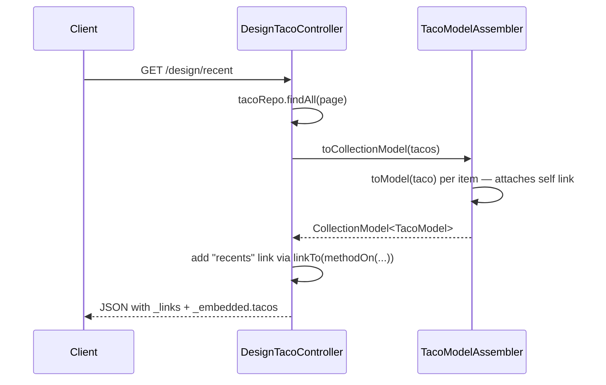

## Objective

A plain REST response only carries data — a client has to already know (usually
hardcoded) that it can append a taco's `id` to `/design` to fetch it, or an
ingredient's `id` to `/ingredients`. HATEOAS (Hypermedia as the Engine of
Application State) has the API describe its own URLs instead: each resource
carries a `_links` map of relation names to URLs, so a client asks for the
`self` or `recents` relation rather than building the URL itself. Spring
HATEOAS adds this to a Spring MVC API with a small set of wrapper types
(`RepresentationModel`, `EntityModel`, `CollectionModel`) and a fluent link
builder (`linkTo(methodOn(...))`) that derives URLs from the controller's own
mappings, so no hostname or path is ever hand-typed.

## Use Cases

- A list endpoint (`GET /design/recent`) whose entries should carry a `self`
  link, so clients can fetch or mutate a specific item without hardcoding
  `/design/{id}`.
- Nested resources (an ingredient inside a taco) that need their own
  addressable links independent of the parent's URL scheme.
- Multi-step or state-machine resources (an order that can move from `paid` to
  `shipped` to `delivered`) where the set of valid next actions is best
  expressed as links/affordances rather than documented out-of-band.
- Long-lived API clients (mobile apps with slow update cycles, IoT devices)
  that can't be redeployed the moment the server's URL scheme changes.

## Deep Dive

### The problem: hardcoded URLs in the response

Without hypermedia, a list of tacos is just data — the `id` field is the only
thing a client has to build a URL from:

```json
[
  {
    "id": 4,
    "name": "Veg-Out",
    "createdAt": "2018-01-31T20:15:53.219+0000",
    "ingredients": [
      {"id": "FLTO", "name": "Flour Tortilla", "type": "WRAP"}
    ]
  }
]
```

The client has to know, out-of-band, that `/design/{id}` gets a taco and
`/ingredients/{id}` gets an ingredient. If the API's URL scheme ever changes,
every client coded that way breaks.

### The HAL shape: `_links` and `_embedded`

With hypermedia enabled, the same list looks like this instead (HAL —
Hypertext Application Language — is the JSON convention Spring HATEOAS uses by
default):

```json
{
  "_embedded": {
    "tacos": [
      {
        "name": "Veg-Out",
        "createdAt": "2018-01-31T20:15:53.219+0000",
        "ingredients": [
          {
            "name": "Flour Tortilla", "type": "WRAP",
            "_links": { "self": { "href": "http://localhost:8080/ingredients/FLTO" } }
          }
        ],
        "_links": { "self": { "href": "http://localhost:8080/design/4" } }
      }
    ]
  },
  "_links": { "recents": { "href": "http://localhost:8080/design/recent" } }
}
```

Every level — the list itself, each taco, each ingredient — carries its own
`_links`. A client that wants to operate on a specific taco follows its `self`
link; it never constructs a URL by hand.

### Wrapping a response: `EntityModel` and `CollectionModel`

The Spring HATEOAS types that carry links are `RepresentationModel<T>` (a
single object that owns a list of `Link`s), `EntityModel<T>` (wraps one
domain object), and `CollectionModel<T>` (wraps a collection of them):

```java
@GetMapping("/recent")
public CollectionModel<EntityModel<Taco>> recentTacos() {
    PageRequest page = PageRequest.of(0, 12, Sort.by("createdAt").descending());
    List<Taco> tacos = tacoRepo.findAll(page).getContent();

    CollectionModel<EntityModel<Taco>> recentResources =
            CollectionModel.wrap(tacos);

    recentResources.add(new Link("http://localhost:8080/design/recent", "recents"));
    return recentResources;
}
```

This works, but the `Link` above is hardcoded to `localhost:8080` — exactly
the brittleness HATEOAS is supposed to remove.

### Deriving URLs from the controller: `linkTo(methodOn(...))`

Spring HATEOAS's link builder resolves the base URL from the running
application, so nothing needs to be hardcoded. The idiomatic form calls a
method on the controller through `methodOn()` and lets the builder derive the
full mapped path — class-level `@RequestMapping` plus the method's own
mapping:

```java
import static org.springframework.hateoas.server.mvc.WebMvcLinkBuilder.linkTo;
import static org.springframework.hateoas.server.mvc.WebMvcLinkBuilder.methodOn;

CollectionModel<EntityModel<Taco>> recentResources = CollectionModel.wrap(tacos);
recentResources.add(
    linkTo(methodOn(DesignTacoController.class).recentTacos())
        .withRel("recents"));
```

`methodOn(DesignTacoController.class).recentTacos()` is intercepted rather
than actually invoked — the builder reads the method's mapping annotations to
determine the path, combines it with the controller's base path, and resolves
the hostname from the current request. No portion of the URL is typed by
hand.

### Custom resource types and assemblers

A dedicated resource type (a `RepresentationModel` subclass) keeps the API's
shape independent of the domain type — it can drop internal fields like a
database `id` and it's the natural place to attach links:

```java
public class TacoModel extends RepresentationModel<TacoModel> {
    private final String name;
    private final Date createdAt;
    private final List<IngredientModel> ingredients;

    public TacoModel(Taco taco) {
        this.name = taco.getName();
        this.createdAt = taco.getCreatedAt();
        this.ingredients = /* converted via an IngredientModelAssembler */ List.of();
    }
    // getters omitted
}
```

Converting a whole list of domain objects one by one would mean repeating the
same loop everywhere a list is returned. A `RepresentationModelAssemblerSupport`
subclass centralizes that conversion and automatically attaches a `self` link
derived from the entity's id:

```java
public class TacoModelAssembler
        extends RepresentationModelAssemblerSupport<Taco, TacoModel> {

    public TacoModelAssembler() {
        super(DesignTacoController.class, TacoModel.class);
    }

    @Override
    protected TacoModel instantiateModel(Taco taco) {
        return new TacoModel(taco);
    }

    @Override
    public TacoModel toModel(Taco taco) {
        return createModelWithId(taco.getId(), taco);
    }
}
```

`toModel()` is the mandatory override — it builds the `TacoModel` and gives it
a `self` link. `toCollectionModel()` (inherited) applies `toModel()` across an
entire list, so the controller no longer loops by hand:

```java
@GetMapping("/recent")
public CollectionModel<TacoModel> recentTacos() {
    PageRequest page = PageRequest.of(0, 12, Sort.by("createdAt").descending());
    List<Taco> tacos = tacoRepo.findAll(page).getContent();

    CollectionModel<TacoModel> recentModels =
            new TacoModelAssembler().toCollectionModel(tacos);

    recentModels.add(
        linkTo(methodOn(DesignTacoController.class).recentTacos())
            .withRel("recents"));
    return recentModels;
}
```

### Naming the embedded collection with `@Relation`

By default the `_embedded` field name is derived from the Java class name
(e.g. a list of `TacoModel` would embed under `"tacoModelList"`) — an
implementation detail that leaks into the wire format and breaks clients if
the class is ever renamed. `@Relation` decouples the two:

```java
@Relation(value = "taco", collectionRelation = "tacos")
public class TacoModel extends RepresentationModel<TacoModel> {
    // ...
}
```

This fixes the JSON's `_embedded` key at `"tacos"` (and a single instance at
`"taco"`) regardless of what the class is later renamed to.



> **Book vs. today.** The book (2019, Spring HATEOAS 0.x) uses
> `ResourceSupport`, `Resource<T>`, `Resources<T>`, `ResourceAssemblerSupport`
> with `toResource()`/`toResources()`, and `ControllerLinkBuilder`. Spring
> HATEOAS 1.0 (aligned with Spring Boot 2.2, well before Boot 3's Jakarta
> rename) renamed all of these: `RepresentationModel`, `EntityModel<T>`,
> `CollectionModel<T>`, `RepresentationModelAssemblerSupport` with
> `toModel()`/`toCollectionModel()`, and `WebMvcLinkBuilder`. The
> `linkTo(methodOn(...))` idiom itself is unchanged — only the class names
> around it moved. Functionally the model is the same today; only the vocabulary
> changed, and the renamed types are what current `docs.spring.io` describes.

## Trade-offs

- **Self-describing links remove hardcoded client URLs, at the cost of extra
  code on the server.** Every list endpoint needs an assembler and a
  `linkTo(methodOn(...))` call instead of just returning the domain object —
  the book itself concedes HATEOAS "did add several lines of code that you
  wouldn't otherwise need."
- **A separate resource type (`EntityModel`/custom `RepresentationModel`
  subclass) keeps the domain model free of API concerns, but doubles the
  number of classes** — a `Taco` and a `TacoModel` evolve in parallel, and a
  field added to one has to be remembered on the other.
- **In practice, HATEOAS has become a niche choice rather than a default.**
  Teams building an API consumed mainly by their own typed frontend clients
  increasingly reach for OpenAPI-generated clients instead — a single spec
  document gives type-safe SDKs across languages without runtime link
  traversal. HATEOAS still earns its cost for APIs with genuinely long-lived,
  independently-updated clients or complex state machines (order → paid →
  shipped → delivered), where a `_links` map communicates which transitions
  are currently valid better than out-of-band documentation. This is a
  judgment call about client lifecycle and API complexity, not something a
  single snippet demonstrates.
- **`@Relation` decouples wire format from Java naming, but it's opt-in and
  easy to forget** — leaving it off means a class rename silently changes the
  `_embedded` key and breaks any client parsing that key by name:
  ```java
  // no @Relation: _embedded key follows the class name ("tacoModelList")
  public class TacoModel extends RepresentationModel<TacoModel> { }

  // with @Relation: _embedded key is fixed regardless of future renames
  @Relation(value = "taco", collectionRelation = "tacos")
  public class TacoModel extends RepresentationModel<TacoModel> { }
  ```

## Documentation Links

- Craig Walls, "Spring in Action", 5th Edition (Manning, 2019) — Chapter 6,
  "Creating REST services", section 6.2 "Enabling hypermedia", p. 150-159 — doc
- [Spring HATEOAS Reference — Fundamentals (RepresentationModel, EntityModel, CollectionModel)](https://docs.spring.io/spring-hateoas/docs/current/reference/html/#fundamentals) — doc
- [Spring HATEOAS Reference — Server-side support (WebMvcLinkBuilder, RepresentationModelAssembler)](https://docs.spring.io/spring-hateoas/docs/current/reference/html/#server) — doc
- [Spring HATEOAS API — WebMvcLinkBuilder](https://docs.spring.io/spring-hateoas/docs/current/api/org/springframework/hateoas/server/mvc/WebMvcLinkBuilder.html) — doc
- [Spring HATEOAS Reference — Media types (HAL)](https://docs.spring.io/spring-hateoas/docs/current/reference/html/#mediatypes.hal) — doc
