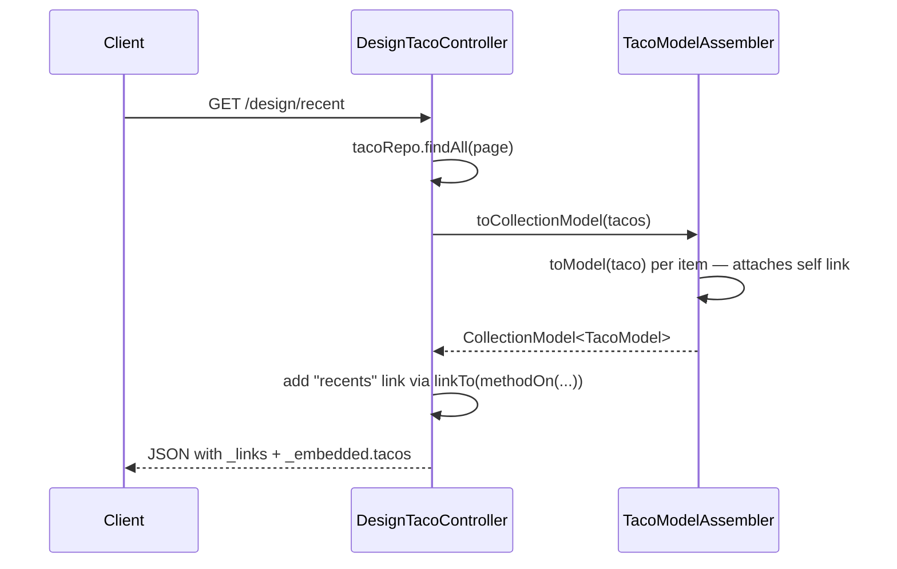

## Objective

Uma resposta REST simples só carrega dados — um client precisa já saber
(geralmente hardcoded) que pode anexar o `id` de um taco a `/design` para
buscá-lo, ou o `id` de um ingrediente a `/ingredients`. HATEOAS (Hypermedia as
the Engine of Application State) faz a API descrever suas próprias URLs em
vez disso: cada recurso carrega um mapa `_links` de nomes de relação para
URLs, então um client pede a relação `self` ou `recents` em vez de construir a
URL ele mesmo. O Spring HATEOAS adiciona isso a uma API Spring MVC com um
pequeno conjunto de tipos wrapper (`RepresentationModel`, `EntityModel`,
`CollectionModel`) e um link builder fluente (`linkTo(methodOn(...))`) que
deriva URLs a partir dos próprios mapeamentos do controller, então nenhum
hostname ou caminho é jamais digitado à mão.

## Use Cases

- Um endpoint de listagem (`GET /design/recent`) cujas entradas devem
  carregar um link `self`, para que clients possam buscar ou modificar um
  item específico sem hardcodar `/design/{id}`.
- Recursos aninhados (um ingrediente dentro de um taco) que precisam de seus
  próprios links endereçáveis, independentes do esquema de URL do pai.
- Recursos de múltiplas etapas ou máquina de estados (um pedido que pode
  passar de `paid` para `shipped` para `delivered`) onde o conjunto de
  próximas ações válidas é melhor expresso como links/affordances do que
  documentado fora de banda.
- Clients de API de longa vida (apps mobile com ciclos de atualização lentos,
  dispositivos IoT) que não podem ser reimplantados no instante em que o
  esquema de URL do servidor muda.

## Deep Dive

### O problema: URLs hardcoded na resposta

Sem hipermídia, uma lista de tacos é só dados — o campo `id` é a única coisa
que um client tem para construir uma URL:

```json
[
  {
    "id": 4,
    "name": "Veg-Out",
    "createdAt": "2018-01-31T20:15:53.219+0000",
    "ingredients": [
      {"id": "FLTO", "name": "Flour Tortilla", "type": "WRAP"}
    ]
  }
]
```

O client precisa saber, fora de banda, que `/design/{id}` obtém um taco e
`/ingredients/{id}` obtém um ingrediente. Se o esquema de URL da API alguma
vez mudar, todo client codificado dessa forma quebra.

### O formato HAL: `_links` e `_embedded`

Com hipermídia habilitada, a mesma lista fica assim em vez disso (HAL —
Hypertext Application Language — é a convenção JSON que o Spring HATEOAS usa
por padrão):

```json
{
  "_embedded": {
    "tacos": [
      {
        "name": "Veg-Out",
        "createdAt": "2018-01-31T20:15:53.219+0000",
        "ingredients": [
          {
            "name": "Flour Tortilla", "type": "WRAP",
            "_links": { "self": { "href": "http://localhost:8080/ingredients/FLTO" } }
          }
        ],
        "_links": { "self": { "href": "http://localhost:8080/design/4" } }
      }
    ]
  },
  "_links": { "recents": { "href": "http://localhost:8080/design/recent" } }
}
```

Todo nível — a lista em si, cada taco, cada ingrediente — carrega seu próprio
`_links`. Um client que quer operar sobre um taco específico segue seu link
`self`; ele nunca constrói uma URL à mão.

### Envolvendo uma resposta: `EntityModel` e `CollectionModel`

Os tipos do Spring HATEOAS que carregam links são `RepresentationModel<T>`
(um objeto único que possui uma lista de `Link`s), `EntityModel<T>` (envolve
um objeto de domínio) e `CollectionModel<T>` (envolve uma coleção deles):

```java
@GetMapping("/recent")
public CollectionModel<EntityModel<Taco>> recentTacos() {
    PageRequest page = PageRequest.of(0, 12, Sort.by("createdAt").descending());
    List<Taco> tacos = tacoRepo.findAll(page).getContent();

    CollectionModel<EntityModel<Taco>> recentResources =
            CollectionModel.wrap(tacos);

    recentResources.add(new Link("http://localhost:8080/design/recent", "recents"));
    return recentResources;
}
```

Isso funciona, mas o `Link` acima está hardcoded para `localhost:8080` —
exatamente a fragilidade que o HATEOAS deveria eliminar.

### Derivando URLs a partir do controller: `linkTo(methodOn(...))`

O link builder do Spring HATEOAS resolve a URL base a partir da aplicação em
execução, então nada precisa ser hardcoded. A forma idiomática chama um
método no controller através de `methodOn()` e deixa o builder derivar o
caminho mapeado completo — `@RequestMapping` em nível de classe mais o
mapeamento próprio do método:

```java
import static org.springframework.hateoas.server.mvc.WebMvcLinkBuilder.linkTo;
import static org.springframework.hateoas.server.mvc.WebMvcLinkBuilder.methodOn;

CollectionModel<EntityModel<Taco>> recentResources = CollectionModel.wrap(tacos);
recentResources.add(
    linkTo(methodOn(DesignTacoController.class).recentTacos())
        .withRel("recents"));
```

`methodOn(DesignTacoController.class).recentTacos()` é interceptado em vez de
realmente invocado — o builder lê as annotations de mapeamento do método para
determinar o caminho, combina isso com o caminho base do controller, e
resolve o hostname a partir do request atual. Nenhuma parte da URL é digitada
à mão.

### Tipos de recurso customizados e assemblers

Um tipo de recurso dedicado (uma subclasse de `RepresentationModel`) mantém o
formato da API independente do tipo de domínio — pode descartar campos
internos como um `id` de banco de dados e é o lugar natural para anexar
links:

```java
public class TacoModel extends RepresentationModel<TacoModel> {
    private final String name;
    private final Date createdAt;
    private final List<IngredientModel> ingredients;

    public TacoModel(Taco taco) {
        this.name = taco.getName();
        this.createdAt = taco.getCreatedAt();
        this.ingredients = /* converted via an IngredientModelAssembler */ List.of();
    }
    // getters omitted
}
```

Converter uma lista inteira de objetos de domínio um por um significaria
repetir o mesmo loop em todo lugar que uma lista é retornada. Uma subclasse de
`RepresentationModelAssemblerSupport` centraliza essa conversão e anexa
automaticamente um link `self` derivado do id da entidade:

```java
public class TacoModelAssembler
        extends RepresentationModelAssemblerSupport<Taco, TacoModel> {

    public TacoModelAssembler() {
        super(DesignTacoController.class, TacoModel.class);
    }

    @Override
    protected TacoModel instantiateModel(Taco taco) {
        return new TacoModel(taco);
    }

    @Override
    public TacoModel toModel(Taco taco) {
        return createModelWithId(taco.getId(), taco);
    }
}
```

`toModel()` é o override obrigatório — ele constrói o `TacoModel` e dá a ele
um link `self`. `toCollectionModel()` (herdado) aplica `toModel()` em toda
uma lista, então o controller não precisa mais fazer o loop à mão:

```java
@GetMapping("/recent")
public CollectionModel<TacoModel> recentTacos() {
    PageRequest page = PageRequest.of(0, 12, Sort.by("createdAt").descending());
    List<Taco> tacos = tacoRepo.findAll(page).getContent();

    CollectionModel<TacoModel> recentModels =
            new TacoModelAssembler().toCollectionModel(tacos);

    recentModels.add(
        linkTo(methodOn(DesignTacoController.class).recentTacos())
            .withRel("recents"));
    return recentModels;
}
```

### Nomeando a coleção embutida com `@Relation`

Por padrão, o nome do campo `_embedded` é derivado do nome da classe Java
(por exemplo, uma lista de `TacoModel` embutiria sob `"tacoModelList"`) — um
detalhe de implementação que vaza para o formato de wire e quebra clients se
a classe alguma vez for renomeada. `@Relation` desacopla os dois:

```java
@Relation(value = "taco", collectionRelation = "tacos")
public class TacoModel extends RepresentationModel<TacoModel> {
    // ...
}
```

Isso fixa a chave `_embedded` do JSON em `"tacos"` (e uma instância única em
`"taco"`) independentemente de como a classe seja renomeada depois.



> **Livro vs. hoje.** O livro (2019, Spring HATEOAS 0.x) usa
> `ResourceSupport`, `Resource<T>`, `Resources<T>`, `ResourceAssemblerSupport`
> com `toResource()`/`toResources()`, e `ControllerLinkBuilder`. O Spring
> HATEOAS 1.0 (alinhado com o Spring Boot 2.2, bem antes do rename para
> Jakarta no Boot 3) renomeou tudo isso: `RepresentationModel`,
> `EntityModel<T>`, `CollectionModel<T>`, `RepresentationModelAssemblerSupport`
> com `toModel()`/`toCollectionModel()`, e `WebMvcLinkBuilder`. O idioma
> `linkTo(methodOn(...))` em si permanece inalterado — só os nomes das
> classes ao redor mudaram de lugar. Funcionalmente o modelo é o mesmo hoje;
> só o vocabulário mudou, e os tipos renomeados são o que o `docs.spring.io`
> atual descreve.

## Trade-offs

- **Links autodescritivos eliminam URLs hardcoded no client, ao custo de
  código extra no servidor.** Todo endpoint de listagem precisa de um
  assembler e de uma chamada `linkTo(methodOn(...))` em vez de simplesmente
  retornar o objeto de domínio — o próprio livro admite que o HATEOAS "de
  fato adicionou várias linhas de código que de outra forma não seriam
  necessárias."
- **Um tipo de recurso separado (`EntityModel`/subclasse customizada de
  `RepresentationModel`) mantém o modelo de domínio livre de preocupações de
  API, mas dobra o número de classes** — um `Taco` e um `TacoModel` evoluem
  em paralelo, e um campo adicionado a um precisa ser lembrado no outro.
- **Na prática, o HATEOAS se tornou uma escolha de nicho em vez de um
  default.** Times construindo uma API consumida principalmente pelo próprio
  frontend tipado cada vez mais recorrem a clients gerados a partir de
  OpenAPI em vez disso — um único documento de especificação dá SDKs
  type-safe em várias linguagens sem travessia de link em runtime. O HATEOAS
  ainda justifica seu custo para APIs com clients genuinamente de longa vida
  e atualizados de forma independente, ou máquinas de estado complexas (um
  pedido → paid → shipped → delivered), onde um mapa `_links` comunica quais
  transições são válidas no momento melhor do que documentação fora de
  banda. Isso é um julgamento sobre ciclo de vida do client e complexidade
  da API, não algo que um único snippet demonstre.
- **`@Relation` desacopla o formato de wire da nomenclatura Java, mas é
  opt-in e fácil de esquecer** — deixá-lo de fora significa que renomear uma
  classe muda silenciosamente a chave `_embedded` e quebra qualquer client
  que faça parse dessa chave pelo nome:
  ```java
  // no @Relation: _embedded key follows the class name ("tacoModelList")
  public class TacoModel extends RepresentationModel<TacoModel> { }

  // with @Relation: _embedded key is fixed regardless of future renames
  @Relation(value = "taco", collectionRelation = "tacos")
  public class TacoModel extends RepresentationModel<TacoModel> { }
  ```

## Documentation Links

- Craig Walls, "Spring in Action", 5th Edition (Manning, 2019) — Chapter 6,
  "Creating REST services", section 6.2 "Enabling hypermedia", p. 150-159 — doc
- [Spring HATEOAS Reference — Fundamentals (RepresentationModel, EntityModel, CollectionModel)](https://docs.spring.io/spring-hateoas/docs/current/reference/html/#fundamentals) — doc
- [Spring HATEOAS Reference — Server-side support (WebMvcLinkBuilder, RepresentationModelAssembler)](https://docs.spring.io/spring-hateoas/docs/current/reference/html/#server) — doc
- [Spring HATEOAS API — WebMvcLinkBuilder](https://docs.spring.io/spring-hateoas/docs/current/api/org/springframework/hateoas/server/mvc/WebMvcLinkBuilder.html) — doc
- [Spring HATEOAS Reference — Media types (HAL)](https://docs.spring.io/spring-hateoas/docs/current/reference/html/#mediatypes.hal) — doc
