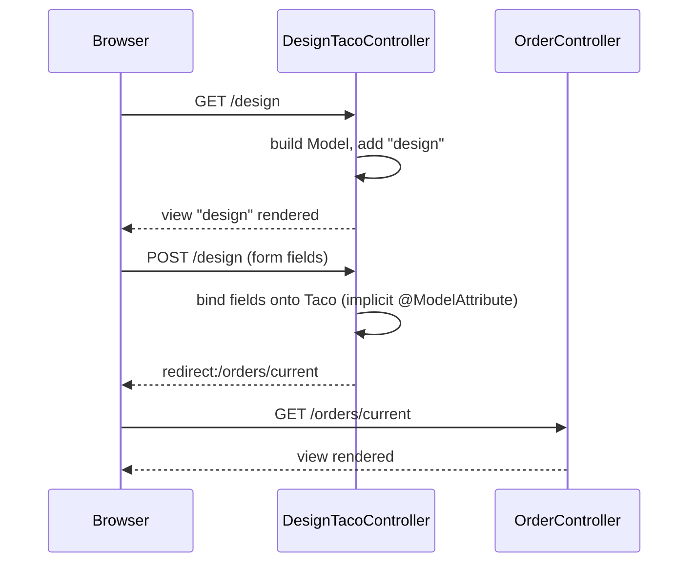

## Objective

O Spring MVC divide uma requisição web em três peças: uma classe de domínio
que modela os dados, um `@Controller` que decide o que acontece para um dado
método e path HTTP, e uma view que renderiza o resultado. Um handler
`@GetMapping` constrói um `Model` e o entrega a uma view; um handler
`@PostMapping` recebe um objeto Java simples cujos campos o Spring já
preencheu a partir do formulário submetido, sem nenhum código de binding
explícito.

## Use Cases

- Uma página com formulário (como uma página de cadastro ou checkout) onde
  um `GET` renderiza o formulário vazio e um `POST` no mesmo path processa
  a submissão.
- Qualquer controller que precise canalizar vários métodos HTTP relacionados
  (`GET`, `POST`, `PUT`, `DELETE`) sob um único path base via um
  `@RequestMapping` em nível de classe.
- Fluxos de múltiplos passos onde o `POST` de um handler redireciona o
  browser para o `GET` de um controller diferente (`redirect:/orders/current`),
  em vez de retornar uma view diretamente.

## Deep Dive

### Classes de domínio com Lombok

Uma classe de domínio só precisa declarar seus campos; o Lombok gera os
getters, setters, `equals()`, `hashCode()`, e `toString()` em tempo de
compilação.

```java
@Data
@RequiredArgsConstructor
public class Ingredient {
    private final String id;
    private final String name;
    private final Type type;

    public enum Type { WRAP, PROTEIN, VEGGIES, CHEESE, SAUCE }
}
```

`@Data` cobre accessors e `equals`/`hashCode`/`toString`;
`@RequiredArgsConstructor` adiciona um construtor para os campos `final`.
Uma classe de domínio mutável usada puramente para carregar dados de
formulário (sem campos `final`) só precisa de `@Data`:

```java
@Data
public class Taco {
    private String name;
    private List<String> ingredients;
}
```

### Classe controller e annotations de request-mapping

Um `@RequestMapping` em nível de classe define o path base; `@GetMapping` /
`@PostMapping` em nível de método o restringem a um método HTTP específico.

```java
@Controller
@RequestMapping("/design")
public class DesignTacoController {

    @GetMapping
    public String showDesignForm(Model model) {
        List<Ingredient> ingredients = /* ... */;
        for (Ingredient.Type type : Ingredient.Type.values()) {
            model.addAttribute(type.toString().toLowerCase(),
                filterByType(ingredients, type));
        }
        model.addAttribute("design", new Taco());
        return "design";
    }
}
```

`Model` é o objeto de repasse: atributos adicionados aqui são copiados para
atributos de requisição que o template da view lê. O valor de retorno do
método ("design") é o nome lógico da view, não um path — o Spring o resolve
para um template real.

### Vinculando submissões de formulário a um command object

Um handler `@PostMapping` pode receber um objeto de domínio simples como
parâmetro. O Spring MVC vincula cada campo submetido do formulário à
propriedade correspondente nesse objeto — sem annotation `@ModelAttribute`
e sem chamadas manuais a `request.getParameter(...)`:

```java
@PostMapping
public String processDesign(Taco design) {
    log.info("Processing design: " + design);
    return "redirect:/orders/current";
}
```

Isso funciona porque `Taco` não é um tipo de valor simples (`String`,
`int`, ...) e nenhum outro argument resolver reivindica esse parâmetro,
então o Spring o trata como um `@ModelAttribute` implícito e roda sua
máquina de data-binding contra os parâmetros da requisição.

### Views de redirecionamento

Retornar um nome de view prefixado com `redirect:` diz ao Spring para emitir
um redirect HTTP em vez de renderizar um template — o browser faz uma nova
requisição `GET` ao path de destino:

```java
@PostMapping
public String processOrder(Order order) {
    log.info("Order submitted: " + order);
    return "redirect:/";
}
```

Isso é o que conecta `processDesign()` (que redireciona para
`/orders/current`) ao handler `@GetMapping("/current")` de um
`OrderController` separado — dois controllers compostos através de um
redirect em vez de um único controller fazendo tudo.



## Trade-offs

- **O Lombok remove boilerplate, mas adiciona uma dependência de
  build-time.** Todo desenvolvedor e toda IDE precisam do annotation
  processor do Lombok instalado, ou o projeto não compila corretamente no
  editor deles. Para classes imutáveis, de campos `final`, como
  `Ingredient`, um `record` Java ganha os mesmos `equals`/`hashCode`/`toString`
  gerados e o construtor nativamente, sem nenhum annotation processor:
  ```java
  public record Ingredient(String id, String name, Type type) {
      public enum Type { WRAP, PROTEIN, VEGGIES, CHEESE, SAUCE }
  }
  ```
  Isso não cobre todo caso do livro — `Taco` e `Order` são mutáveis (o
  data binding do Spring MVC define seus campos via setters após a
  construção), então eles permanecem como classes `@Data`; só tipos de
  domínio de campos `final`, construídos via construtor, como
  `Ingredient`, são candidatos diretos a record.
- **O binding implícito de command object é conciso mas não é óbvio à
  primeira vista.** Um leitor precisa conhecer a regra de resolução de
  argumento do Spring (parâmetro de tipo não-simples, nenhum outro
  resolver reivindica → `@ModelAttribute` implícito) para perceber que
  `processDesign(Taco design)` está vinculando parâmetros de requisição —
  não há nenhuma annotation para dar grep. A própria documentação do Spring
  agora recomenda adicionar `@ModelAttribute` explicitamente para builds de
  imagem nativa GraalVM, já que o binding implícito não pode ser inferido
  para hints de reflection do AOT.
- **`@RequestMapping` em nível de classe mais `@GetMapping`/`@PostMapping`
  em nível de método mantém as declarações de rota DRY, mas o path completo
  de qualquer handler fica dividido em duas annotations** — ler
  `showDesignForm()` isoladamente não diz que ele trata `GET /design` sem
  também checar a declaração da classe.

## Documentation Links

- Craig Walls, "Spring in Action", 5th Edition (Manning, 2019) — Chapter 2,
  "Developing web applications", sections 2.1 "Displaying information" and 2.2
  "Processing form submission", p. 29-44 — doc
- [Spring Framework Reference — Mapping Requests (@GetMapping, @PostMapping)](https://docs.spring.io/spring-framework/reference/web/webmvc/mvc-controller/ann-requestmapping.html) — doc
- [Spring Framework Reference — @ModelAttribute Method Arguments (implicit binding, GraalVM note)](https://docs.spring.io/spring-framework/reference/web/webmvc/mvc-controller/ann-methods/modelattrib-method-args.html) — doc
- [Spring Data JPA Reference — Class-based Projections/DTOs (records as a Lombok alternative)](https://docs.spring.io/spring-data/jpa/reference/repositories/projections.html) — doc
- [Spring Boot 3.0 Migration Guide — javax → jakarta package rename](https://github.com/spring-projects/spring-boot/wiki/Spring-Boot-3.0-Migration-Guide) — doc
