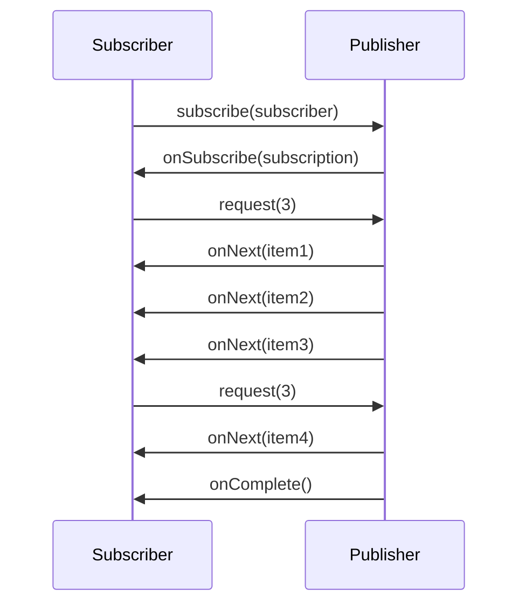

## Objective

Imperative code is a list of instructions executed one at a time: each step must
finish — and the data it works on must be fully in hand — before the next step
runs. When a step is I/O (a database write, an HTTP call to a remote service),
the thread that invoked it sits blocked, holding memory and a slot in the pool
while doing no work. Reactive programming inverts that: instead of pulling a
value you already have, you *describe a pipeline* that data flows through as it
becomes available, pushed to you by a producer, with no assumption about which
thread each stage runs on. Project Reactor is the implementation of that model
underneath Spring's reactive stack, and it exposes exactly two core types —
`Mono<T>`, an asynchronous 0-or-1 result, and `Flux<T>`, an asynchronous
sequence of 0-to-N items. Both are Reactive Streams `Publisher`s, so both carry
backpressure: the consumer tells the producer how much it is willing to receive,
rather than being flooded.

## Use Cases

- High-concurrency HTTP APIs where a thread-per-request model would exhaust the
  pool — thousands of mostly-idle connections (long polling, SSE, WebSocket) held
  by a handful of event-loop threads instead of one thread each.
- Composing several slow I/O calls — an aggregating endpoint that fans out to
  three downstream services — without a thread parked waiting on each one.
- Streaming a large or unbounded dataset (a live price feed, a tail of a log,
  a multi-million-row export) where the consumer must be able to say "send me
  256 more" rather than being overwhelmed by an arbitrarily fast source.
- Bridging genuinely push-shaped sources — Kafka consumers, message brokers,
  change-data-capture feeds — where data arrives when it arrives and there is no
  meaningful "call and wait for the result" step.
- Anywhere Spring's reactive stack is already in play (WebFlux controllers,
  `WebClient`, R2DBC repositories), since those APIs speak `Mono`/`Flux` natively
  and mixing in a blocking call breaks the model.

## Deep Dive

### Why reactive: blocked threads are wasted threads

The imperative version of "uppercase a name and greet with it" is a sequence of
statements, each blocking the current thread until it completes:

```java
String name = "Craig";
String capitalName = name.toUpperCase();
String greeting = "Hello, " + capitalName + "!";
System.out.println(greeting);
```

Nothing is wrong with this for CPU-bound work. The problem appears when a step
is I/O. A servlet container assigns one thread per in-flight request; that
thread calls a database, and then does nothing at all — while still consuming a
stack and a pool slot — until the response comes back. Under load the pool is
exhausted not by work but by waiting. Spinning up more threads is easy in Java
but doesn't solve it: more threads mean more memory, more context switching, and
more concurrency to reason about.

Reactive code describes the same transformation as a pipeline:

```java
Mono.just("Craig")
    .map(n -> n.toUpperCase())
    .map(cn -> "Hello, " + cn + "!")
    .subscribe(System.out::println);
```

This *looks* step-by-step, but it isn't a sequence of statements — it's a
declaration of what should happen to each value as it flows through. There are
three `Mono`s here, not one: `just()` creates the first, the first `map()`
produces a second from its emitted value, the second `map()` produces a third.
Nothing runs until `subscribe()` is called, and no stage assumes it is on the
same thread as the previous one. The book's analogy: imperative code is a water
balloon (the whole payload arrives at once, and scaling means more balloons),
reactive code is a garden hose (the payload flows continuously, and the same
hose scales).

### The Reactive Streams contract

Reactive Streams is a specification — started in 2013 by engineers from Netflix,
Lightbend, and Pivotal — for *asynchronous stream processing with non-blocking
backpressure*. It is four interfaces, nothing more. A `Publisher` produces data
for a `Subscriber` under the terms of a `Subscription`:

```java
public interface Publisher<T> {
    void subscribe(Subscriber<? super T> subscriber);
}

public interface Subscriber<T> {
    void onSubscribe(Subscription sub);
    void onNext(T item);
    void onError(Throwable ex);
    void onComplete();
}

public interface Subscription {
    void request(long n);
    void cancel();
}
```

The handshake is what makes backpressure work. `subscribe()` does not start the
data flowing; it calls `onSubscribe()` and hands the subscriber a
`Subscription`. Only when the subscriber calls `request(n)` does the publisher
send up to `n` items, each via `onNext()`. When those are consumed, the
subscriber requests more. A stream ends with exactly one `onComplete()` (no more
data ever) or one `onError()` (abnormal termination) — never both, and never
anything after. `cancel()` unsubscribes early.



The fourth interface, `Processor`, is just both ends at once — it subscribes to
an upstream publisher, transforms what it receives, and republishes downstream:

```java
public interface Processor<T, R> extends Subscriber<T>, Publisher<R> {}
```

That's the whole spec. What it deliberately does *not* provide is any way to
compose these pieces fluently — implementing a pipeline directly against
`Publisher`/`Subscriber` means hand-writing subscription bookkeeping at every
stage. Reactor is an implementation of the spec that adds the functional API on
top.

> Reactive Streams is not the same thing as `java.util.stream`. Java Streams are
> synchronous, finite, and pull-based — a functional way to iterate a collection
> you already have. Reactive Streams are asynchronous, support unbounded
> datasets, process data as it arrives, and carry backpressure. The operator
> names overlap (`map`, `filter`, `flatMap`) precisely because the functional
> vocabulary is the same; the execution model is not.

### Reactor's two core types: `Mono` and `Flux`

Both are `Publisher` implementations, and the only distinction is cardinality:

- `Flux<T>` — an asynchronous sequence of **0 to N** items, possibly infinite.
- `Mono<T>` — a specialization for a dataset known to hold **at most one** item.
  It exists because "0 or 1" allows optimizations and, more importantly, because
  it documents intent in a method signature: `Mono<User> findById(String id)`
  says something `Flux<User>` would not.

`Mono` is what a reactive repository lookup or a single HTTP response returns;
`Flux` is what a query returning many rows, or a stream of events, returns.
Creating either from values already in hand is trivial:

```java
Mono<String> mono = Mono.just("Craig");
Mono<String> empty = Mono.empty();

Flux<String> fromValues = Flux.just("Apple", "Orange", "Grape", "Banana");
Flux<String> fromList   = Flux.fromIterable(List.of("Apple", "Orange"));
Flux<Integer> range     = Flux.range(1, 5);
Flux<Long> ticks        = Flux.interval(Duration.ofSeconds(1)); // infinite
```

Nothing above has emitted anything yet. Reactor publishers are **cold and lazy**:
the pipeline is a description, and it only executes when something subscribes.

```java
Flux.just("Apple", "Orange")
    .map(String::toUpperCase)
    .subscribe(System.out::println);   // nothing happens without this line
```

Adding Reactor to a Spring Boot build needs no version — the Boot BOM manages
it — and the test artifact is worth adding from the start, because verifying a
reactive pipeline means asserting on a sequence of signals, not a return value:

```xml
<dependency>
  <groupId>io.projectreactor</groupId>
  <artifactId>reactor-core</artifactId>
</dependency>
<dependency>
  <groupId>io.projectreactor</groupId>
  <artifactId>reactor-test</artifactId>
  <scope>test</scope>
</dependency>
```

### Reading marble diagrams

Reactor's Javadoc documents nearly every operator with a *marble diagram*, so
being able to read one is a prerequisite for using the API. The shape is always
the same: a timeline of the source `Flux`/`Mono` on top, the operator in the
middle, the resulting `Flux`/`Mono` on the bottom. Time flows left to right,
each marble is an emitted item, a vertical bar `|` is `onComplete()`, and an `X`
is `onError()`.

```text
source:   --1----2----3----4----|
                 map(x -> x * 10)
result:   --10---20---30---40---|
```

For a `Mono` the top timeline holds at most one marble before terminating. The
diagrams make the differences that matter visible at a glance — whether an
operator preserves ordering, whether it can emit before the source completes,
whether it terminates the stream on error or continues.

### Where the operators live

`Mono` and `Flux` together expose over 500 operators, grouped roughly into
creation, combination, transformation, and logic/filtering operations. They are
the substance of day-to-day Reactor work, and they get their own concept —
see [Reactor Operators](spring-reactor-operators) for the catalog: `just`,
`fromIterable`, `range`, `interval` for creation; `mergeWith`, `zip`, `first`
for combination; `map`, `flatMap`, `buffer`, `collectList` for transformation;
`filter`, `distinct`, `take`, `skip`, `all`, `any` for filtering and logic.

> **Book vs. today.** Everything above still holds verbatim. The Reactive Streams
> specification reached 1.0 before the book was written and its final revision is
> 1.0.4 (May 2022) — the four interfaces are unchanged, and JDK 9+ ships the same
> contract as `java.util.concurrent.Flow`, described by the spec as "1:1
> semantically equivalent"; Reactor bridges the two with
> `JdkFlowAdapter.flowPublisherToFlux(...)` and
> `publisherToFlowPublisher(...)`. Reactor itself is on 3.8.x, and its reference
> guide still defines `Flux<T>` as "a standard `Publisher<T>` that represents an
> asynchronous sequence of 0 to N emitted items". The book's release-train BOM
> coordinate (`Bismuth-RELEASE`) is the one stale detail — Reactor dropped codenamed
> trains for plain semantic versions of `reactor-bom`, and on Spring Boot you never
> declare a version anyway. What *has* changed is the surrounding argument. In 2019,
> reactive was the only mainstream answer in Java to "how do I serve tens of
> thousands of concurrent I/O-bound requests without a thread each." Java 21
> (Project Loom) added virtual threads, and Spring Boot enables them with a single
> property, `spring.threads.virtual.enabled=true` — blocking imperative code on a
> virtual thread parks the *virtual* thread and frees the carrier, giving much of
> reactive's thread-efficiency benefit with ordinary, debuggable, stack-trace-friendly
> code. The current consensus is that virtual threads are the default answer for
> plain request/response scalability, and reactive earns its complexity where its
> *other* properties matter: backpressure over unbounded streams, and declarative
> composition of concurrent flows (fan-out, merge, take-first, timeout, retry) that
> imperative code expresses far more awkwardly.

## Trade-offs

- **Scalability under I/O concurrency, paid for with a steeper learning curve.**
  Reactive code is declarative and functional — you build a pipeline rather than
  write steps — and that is a genuinely different mental model. Debugging is the
  sharpest edge: because operators run on whatever thread the scheduler chose, a
  stack trace shows Reactor's internals rather than your call path. Reactor
  mitigates this (`Hooks.onOperatorDebug()`, `checkpoint()`, the
  `reactor-tools` agent), but mitigation is not the same as a plain stack trace.
- **Reactive has to go all the way down.** One blocking call anywhere in an
  otherwise-reactive chain parks an event-loop thread — of which there are only
  a handful — and can stall far more than the one request that made it:
  ```java
  // defeats the entire point: blocks a Netty event-loop thread
  Flux.fromIterable(ids)
      .map(id -> jdbcTemplate.queryForObject(...))  // blocking JDBC
      .subscribe();
  ```
  Going reactive means a reactive HTTP client (`WebClient`), a reactive driver
  (R2DBC, reactive Mongo), and reactive everything else — or explicitly
  offloading the blocking part with `subscribeOn(Schedulers.boundedElastic())`,
  which works but reintroduces a thread per blocking call.
- **Nothing runs until you subscribe, which is easy to forget.** A pipeline built
  and never subscribed to is a silently constructed no-op — a whole method's
  worth of logic that never executes and raises no error:
  ```java
  userRepo.save(user).map(this::audit);   // never runs — result discarded
  return userRepo.save(user).map(this::audit); // returned, subscribed by the framework
  ```
- **Virtual threads now cover much of the same ground at a fraction of the
  complexity.** For a conventional request/response service that is slow only
  because it waits on I/O, Java 21+ virtual threads plus
  `spring.threads.virtual.enabled=true` deliver comparable thread efficiency
  while keeping imperative code, ordinary stack traces, working thread-locals,
  and standard debuggers and profilers. Choosing reactive today should be
  justified by backpressure or composition needs, not by scalability alone.
- **Backpressure is a real capability, not a free one.** The `request(n)`
  protocol only helps if the source honours it. Wrapping a genuinely
  push-without-limits source (a callback API, an unthrottled socket) still
  requires deciding what to do with the overflow — buffer, drop, error — via
  operators like `onBackpressureBuffer`/`onBackpressureDrop`. Reactive Streams
  gives you a place to make that decision; it does not make it for you.
- **The operator surface is enormous.** Over 500 operations across `Mono` and
  `Flux` means the hard part is usually knowing that the right operator already
  exists — teams routinely hand-roll something `flatMap`, `zip`, or `buffer`
  already does. Reading marble diagrams fluently is the practical skill that
  makes the catalog navigable.

## Documentation Links

- Craig Walls, "Spring in Action", 5th Edition (Manning, 2019) — Chapter 10,
  "Introducing Reactor", sections 10.1-10.2, p. 241-247 — doc
- [Reactor 3 Reference Guide — Flux, an Asynchronous Sequence of 0-N Items](https://projectreactor.io/docs/core/release/reference/coreFeatures/flux.html) — doc
- [Reactor 3 Reference Guide — Mono, an Asynchronous 0-1 Result](https://projectreactor.io/docs/core/release/reference/coreFeatures/mono.html) — doc
- [Reactive Streams — specification and JDK 9 Flow equivalence](https://www.reactive-streams.org/) — doc
- [Spring Boot Reference — Task Execution and Scheduling (spring.threads.virtual.enabled)](https://docs.spring.io/spring-boot/reference/features/task-execution-and-scheduling.html) — doc
