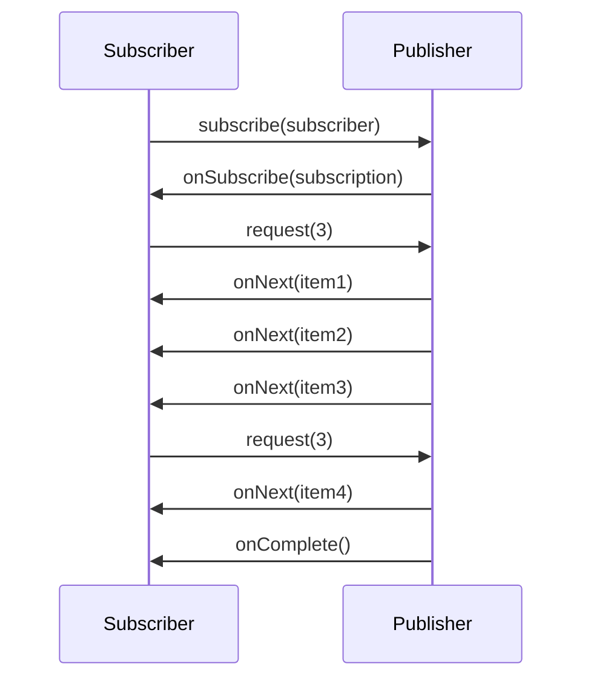

## Objective

Código imperativo é uma lista de instruções executadas uma de cada vez: cada
passo precisa terminar — e o dado sobre o qual ele trabalha precisa estar
totalmente em mãos — antes que o próximo passo rode. Quando um passo é I/O
(uma escrita em banco de dados, uma chamada HTTP para um serviço remoto), a
thread que o invocou fica bloqueada, segurando memória e uma vaga no pool
enquanto não faz trabalho nenhum. Programação reativa inverte isso: em vez de
puxar um valor que você já tem, você *descreve um pipeline* pelo qual o dado
flui conforme fica disponível, empurrado a você por um producer, sem nenhuma
suposição sobre em qual thread cada estágio roda. Project Reactor é a
implementação desse modelo por baixo do stack reativo do Spring, e expõe
exatamente dois tipos centrais — `Mono<T>`, um resultado assíncrono de 0 ou 1
item, e `Flux<T>`, uma sequência assíncrona de 0 a N itens. Ambos são
`Publisher`s de Reactive Streams, então ambos carregam backpressure: o
consumer diz ao producer quanto está disposto a receber, em vez de ser
inundado.

## Use Cases

- APIs HTTP de alta concorrência onde um modelo de thread-por-request
  esgotaria o pool — milhares de conexões majoritariamente ociosas (long
  polling, SSE, WebSocket) mantidas por um punhado de threads de event loop
  em vez de uma thread cada.
- Compor várias chamadas de I/O lentas — um endpoint agregador que se
  ramifica para três serviços downstream — sem uma thread parada esperando
  cada uma.
- Fazer streaming de um dataset grande ou ilimitado (um feed de preços ao
  vivo, o tail de um log, um export de múltiplos milhões de linhas) onde o
  consumer precisa poder dizer "me mande mais 256" em vez de ser sobrecarregado
  por uma fonte arbitrariamente rápida.
- Conectar-se a fontes genuinamente push-shaped — consumers Kafka, message
  brokers, feeds de change-data-capture — onde o dado chega quando chega e
  não existe um passo significativo de "chamar e esperar o resultado".
- Em qualquer lugar onde o stack reativo do Spring já está em jogo
  (controllers WebFlux, `WebClient`, repositórios R2DBC), já que essas APIs
  falam `Mono`/`Flux` nativamente e misturar uma chamada bloqueante quebra o
  modelo.

## Deep Dive

### Por que reativo: threads bloqueadas são threads desperdiçadas

A versão imperativa de "deixar um nome maiúsculo e cumprimentar com ele" é
uma sequência de statements, cada um bloqueando a thread atual até completar:

```java
String name = "Craig";
String capitalName = name.toUpperCase();
String greeting = "Hello, " + capitalName + "!";
System.out.println(greeting);
```

Não há nada de errado nisso para trabalho CPU-bound. O problema aparece
quando um passo é I/O. Um container servlet atribui uma thread por request
em andamento; essa thread chama um banco de dados, e então não faz nada — ao
mesmo tempo consumindo uma stack e uma vaga no pool — até a resposta voltar.
Sob carga, o pool se esgota não por trabalho mas por espera. Subir mais
threads é fácil em Java mas não resolve: mais threads significam mais
memória, mais troca de contexto, e mais concorrência para raciocinar.

Código reativo descreve a mesma transformação como um pipeline:

```java
Mono.just("Craig")
    .map(n -> n.toUpperCase())
    .map(cn -> "Hello, " + cn + "!")
    .subscribe(System.out::println);
```

Isso *parece* passo a passo, mas não é uma sequência de statements — é uma
declaração do que deveria acontecer a cada valor conforme flui pelo
pipeline. Há três `Mono`s aqui, não um: `just()` cria o primeiro, o primeiro
`map()` produz um segundo a partir do valor que ele emite, o segundo `map()`
produz um terceiro. Nada roda até que `subscribe()` seja chamado, e nenhum
estágio assume que está na mesma thread que o anterior. A analogia do livro:
código imperativo é um balão d'água (todo o payload chega de uma vez, e
escalar significa mais balões), código reativo é uma mangueira de jardim (o
payload flui continuamente, e a mesma mangueira escala).

### O contrato do Reactive Streams

Reactive Streams é uma especificação — iniciada em 2013 por engenheiros da
Netflix, Lightbend e Pivotal — para *processamento de stream assíncrono com
backpressure não-bloqueante*. São quatro interfaces, nada mais. Um
`Publisher` produz dados para um `Subscriber` sob os termos de uma
`Subscription`:

```java
public interface Publisher<T> {
    void subscribe(Subscriber<? super T> subscriber);
}

public interface Subscriber<T> {
    void onSubscribe(Subscription sub);
    void onNext(T item);
    void onError(Throwable ex);
    void onComplete();
}

public interface Subscription {
    void request(long n);
    void cancel();
}
```

O handshake é o que faz a backpressure funcionar. `subscribe()` não começa a
fazer o dado fluir; ele chama `onSubscribe()` e entrega ao subscriber uma
`Subscription`. Só quando o subscriber chama `request(n)` é que o publisher
envia até `n` itens, cada um via `onNext()`. Quando esses são consumidos, o
subscriber pede mais. Um stream termina com exatamente um `onComplete()`
(sem mais dados nunca) ou um `onError()` (encerramento anormal) — nunca os
dois, e nunca nada depois. `cancel()` cancela a inscrição antecipadamente.



A quarta interface, `Processor`, é só as duas pontas de uma vez — ela se
inscreve num publisher upstream, transforma o que recebe, e republica
downstream:

```java
public interface Processor<T, R> extends Subscriber<T>, Publisher<R> {}
```

Essa é toda a spec. O que ela deliberadamente *não* fornece é qualquer forma
de compor essas peças fluentemente — implementar um pipeline diretamente
contra `Publisher`/`Subscriber` significa escrever à mão o gerenciamento de
subscription em cada estágio. Reactor é uma implementação da spec que
adiciona a API funcional por cima.

> Reactive Streams não é a mesma coisa que `java.util.stream`. Java Streams
> são síncronas, finitas, e pull-based — uma forma funcional de iterar uma
> collection que você já tem. Reactive Streams são assíncronas, suportam
> datasets ilimitados, processam dados conforme chegam, e carregam
> backpressure. Os nomes de operadores se sobrepõem (`map`, `filter`,
> `flatMap`) precisamente porque o vocabulário funcional é o mesmo; o modelo
> de execução não é.

### Os dois tipos centrais do Reactor: `Mono` e `Flux`

Ambos são implementações de `Publisher`, e a única distinção é a
cardinalidade:

- `Flux<T>` — uma sequência assíncrona de **0 a N** itens, possivelmente
  infinita.
- `Mono<T>` — uma especialização para um dataset conhecido por ter **no
  máximo um** item. Ela existe porque "0 ou 1" permite otimizações e, mais
  importante, porque documenta intenção numa assinatura de método:
  `Mono<User> findById(String id)` diz algo que `Flux<User>` não diria.

`Mono` é o que um lookup de repositório reativo ou uma resposta HTTP única
retorna; `Flux` é o que uma query retornando várias linhas, ou um stream de
eventos, retorna. Criar qualquer um deles a partir de valores já em mãos é
trivial:

```java
Mono<String> mono = Mono.just("Craig");
Mono<String> empty = Mono.empty();

Flux<String> fromValues = Flux.just("Apple", "Orange", "Grape", "Banana");
Flux<String> fromList   = Flux.fromIterable(List.of("Apple", "Orange"));
Flux<Integer> range     = Flux.range(1, 5);
Flux<Long> ticks        = Flux.interval(Duration.ofSeconds(1)); // infinite
```

Nada acima emitiu nada ainda. Publishers do Reactor são **cold e lazy**: o
pipeline é uma descrição, e só executa quando algo se inscreve.

```java
Flux.just("Apple", "Orange")
    .map(String::toUpperCase)
    .subscribe(System.out::println);   // nothing happens without this line
```

Adicionar Reactor a um build Spring Boot não precisa de versão — o BOM do
Boot a gerencia — e o artefato de teste vale a pena adicionar desde o
início, porque verificar um pipeline reativo significa fazer assert numa
sequência de sinais, não num valor de retorno:

```xml
<dependency>
  <groupId>io.projectreactor</groupId>
  <artifactId>reactor-core</artifactId>
</dependency>
<dependency>
  <groupId>io.projectreactor</groupId>
  <artifactId>reactor-test</artifactId>
  <scope>test</scope>
</dependency>
```

### Lendo diagramas de marbles

O Javadoc do Reactor documenta quase todo operador com um *marble diagram*,
então saber ler um é pré-requisito para usar a API. A forma é sempre a
mesma: uma timeline do `Flux`/`Mono` de origem em cima, o operador no meio,
o `Flux`/`Mono` resultante embaixo. O tempo flui da esquerda para a direita,
cada marble é um item emitido, uma barra vertical `|` é `onComplete()`, e um
`X` é `onError()`.

```text
source:   --1----2----3----4----|
                 map(x -> x * 10)
result:   --10---20---30---40---|
```

Para um `Mono`, a timeline superior segura no máximo um marble antes de
terminar. Os diagramas tornam visíveis à primeira vista as diferenças que
importam — se um operador preserva ordenação, se pode emitir antes que a
origem complete, se termina o stream em caso de erro ou continua.

### Onde os operadores vivem

`Mono` e `Flux` juntos expõem mais de 500 operadores, agrupados
aproximadamente em criação, combinação, transformação, e operações de
lógica/filtragem. Eles são a substância do trabalho cotidiano com Reactor, e
ganham seu próprio conceito — veja [Reactor Operators](spring-reactor-operators)
para o catálogo: `just`, `fromIterable`, `range`, `interval` para criação;
`mergeWith`, `zip`, `first` para combinação; `map`, `flatMap`, `buffer`,
`collectList` para transformação; `filter`, `distinct`, `take`, `skip`,
`all`, `any` para filtragem e lógica.

> **Livro vs. hoje.** Tudo acima continua valendo palavra por palavra. A
> especificação Reactive Streams alcançou 1.0 antes do livro ser escrito e
> sua revisão final é 1.0.4 (maio de 2022) — as quatro interfaces estão
> inalteradas, e o JDK 9+ entrega o mesmo contrato como
> `java.util.concurrent.Flow`, descrito pela spec como "1:1 semanticamente
> equivalente"; o Reactor faz a ponte entre os dois com
> `JdkFlowAdapter.flowPublisherToFlux(...)` e
> `publisherToFlowPublisher(...)`. O próprio Reactor está na versão 3.8.x, e
> seu guia de referência ainda define `Flux<T>` como "um `Publisher<T>`
> padrão que representa uma sequência assíncrona de 0 a N itens emitidos". A
> coordenada BOM da release train do livro (`Bismuth-RELEASE`) é o único
> detalhe obsoleto — o Reactor abandonou trains com codinomes em favor de
> versões semânticas simples de `reactor-bom`, e no Spring Boot você nunca
> declara uma versão de qualquer forma. O que *mudou* foi o argumento ao
> redor. Em 2019, reativo era a única resposta mainstream em Java para "como
> eu sirvo dezenas de milhares de requests concorrentes bound a I/O sem uma
> thread cada". Java 21 (Project Loom) adicionou virtual threads, e o Spring
> Boot as habilita com uma única propriedade,
> `spring.threads.virtual.enabled=true` — bloquear código imperativo numa
> virtual thread estaciona a thread *virtual* e libera a carrier, dando boa
> parte do benefício de eficiência de threads do reativo com código
> imperativo comum, depurável, e amigável a stack traces. O consenso atual é
> que virtual threads são a resposta default para escalabilidade simples de
> request/response, e o reativo ganha sua complexidade onde suas *outras*
> propriedades importam: backpressure sobre streams ilimitados, e composição
> declarativa de fluxos concorrentes (fan-out, merge, take-first, timeout,
> retry) que código imperativo expressa muito mais desajeitadamente.

## Trade-offs

- **Escalabilidade sob concorrência de I/O, paga com uma curva de
  aprendizado mais íngreme.** Código reativo é declarativo e funcional —
  você constrói um pipeline em vez de escrever passos — e isso é um modelo
  mental genuinamente diferente. Debugging é o ponto mais afiado: como
  operadores rodam em qualquer thread que o scheduler escolheu, um stack
  trace mostra internals do Reactor em vez do seu caminho de chamadas. O
  Reactor mitiga isso (`Hooks.onOperatorDebug()`, `checkpoint()`, o agent
  `reactor-tools`), mas mitigação não é o mesmo que um stack trace comum.
- **Reativo precisa ir até o fim.** Uma chamada bloqueante em qualquer lugar
  de uma cadeia por outro lado reativa estaciona uma thread de event loop —
  das quais existem só um punhado — e pode travar bem mais do que o único
  request que a fez:
  ```java
  // defeats the entire point: blocks a Netty event-loop thread
  Flux.fromIterable(ids)
      .map(id -> jdbcTemplate.queryForObject(...))  // blocking JDBC
      .subscribe();
  ```
  Ir reativo significa um client HTTP reativo (`WebClient`), um driver
  reativo (R2DBC, Mongo reativo), e tudo o mais reativo — ou explicitamente
  descarregar a parte bloqueante com
  `subscribeOn(Schedulers.boundedElastic())`, o que funciona mas
  reintroduz uma thread por chamada bloqueante.
- **Nada roda até você se inscrever, o que é fácil de esquecer.** Um
  pipeline construído e nunca subscrito é um no-op silenciosamente
  construído — a lógica de um método inteiro que nunca executa e não gera
  nenhum erro:
  ```java
  userRepo.save(user).map(this::audit);   // never runs — result discarded
  return userRepo.save(user).map(this::audit); // returned, subscribed by the framework
  ```
- **Virtual threads agora cobrem boa parte do mesmo terreno com uma fração
  da complexidade.** Para um serviço convencional de request/response que é
  lento só porque espera por I/O, virtual threads do Java 21+ mais
  `spring.threads.virtual.enabled=true` entregam eficiência de thread
  comparável mantendo código imperativo, stack traces comuns, thread-locals
  funcionando, e debuggers e profilers padrão. Escolher reativo hoje deveria
  ser justificado por necessidades de backpressure ou composição, não só por
  escalabilidade.
- **Backpressure é uma capacidade real, não gratuita.** O protocolo
  `request(n)` só ajuda se a origem o respeitar. Envolver uma fonte
  genuinamente push-sem-limite (uma API de callback, um socket sem
  throttling) ainda exige decidir o que fazer com o overflow — bufferizar,
  descartar, dar erro — via operadores como
  `onBackpressureBuffer`/`onBackpressureDrop`. Reactive Streams dá a você um
  lugar para tomar essa decisão; não a toma por você.
- **A superfície de operadores é enorme.** Mais de 500 operações entre
  `Mono` e `Flux` significa que a parte difícil geralmente é saber que o
  operador certo já existe — times rotineiramente fazem na mão algo que
  `flatMap`, `zip`, ou `buffer` já faz. Ler marble diagrams fluentemente é a
  habilidade prática que torna o catálogo navegável.

## Documentation Links

- Craig Walls, "Spring in Action", 5th Edition (Manning, 2019) — Chapter 10,
  "Introducing Reactor", sections 10.1-10.2, p. 241-247 — doc
- [Reactor 3 Reference Guide — Flux, an Asynchronous Sequence of 0-N Items](https://projectreactor.io/docs/core/release/reference/coreFeatures/flux.html) — doc
- [Reactor 3 Reference Guide — Mono, an Asynchronous 0-1 Result](https://projectreactor.io/docs/core/release/reference/coreFeatures/mono.html) — doc
- [Reactive Streams — specification and JDK 9 Flow equivalence](https://www.reactive-streams.org/) — doc
- [Spring Boot Reference — Task Execution and Scheduling (spring.threads.virtual.enabled)](https://docs.spring.io/spring-boot/reference/features/task-execution-and-scheduling.html) — doc
