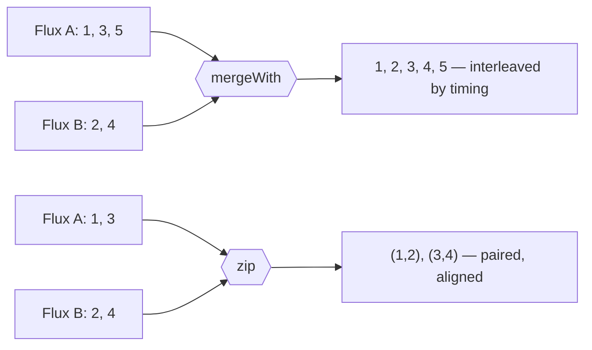

## Objective

A `Mono` or a `Flux` on its own is just a promise that data will eventually flow —
see [Reactor Fundamentals](spring-reactor-fundamentals) for what those two types
are and how the Reactive Streams contract drives them. What turns them into a
useful program is the *operator vocabulary*: the several hundred methods on `Flux`
and `Mono` that create a stream out of data you already have, combine two streams
into one, transform and filter values as they pass through, and reduce a whole
stream down to a single logical answer. Reactor groups them into four families —
creation, combination, transformation/filtering, and logic — and a real pipeline
is almost always one operator from each, chained together.

## Use Cases

- Combining the results of two independent async calls (a user profile service
  and an order service) into one response object with `zip()`, without blocking
  on either.
- Flattening a stream of database ids into a stream of the fetched entities:
  each id maps to a `Mono<Entity>`, and `flatMap()` flattens those inner
  publishers into one output `Flux`.
- Filtering a stream of incoming events down to just the ones matching a
  condition — a `Flux` of all order events narrowed to `SHIPPED` only, with
  `filter()`.
- Turning an in-memory `List` or array into a reactive source so it can feed a
  pipeline that a WebFlux controller returns (`fromIterable()`, `fromArray()`).
- Answering a yes/no question about an entire stream — "did every item validate?"
  — with `all()`, which collapses a `Flux` into a `Mono<Boolean>`.
- Collecting a finite `Flux` back into a `List` or `Map` at the edge of the
  reactive world (`collectList()`, `collectMap()`).

## Deep Dive

### Creating reactive types

Most of the time a `Flux` arrives from a repository or a WebClient call, but when
you need to make one yourself, the workhorse is `Flux.just()` — it publishes the
objects you hand it, in order, then completes:

```java
@Test
public void createAFlux_just() {
    Flux<String> fruitFlux = Flux
        .just("Apple", "Orange", "Grape", "Banana", "Strawberry");

    StepVerifier.create(fruitFlux)
        .expectNext("Apple")
        .expectNext("Orange")
        .expectNext("Grape")
        .expectNext("Banana")
        .expectNext("Strawberry")
        .verifyComplete();
}
```

The important detail is what happens *without* `StepVerifier`: creating the
`Flux` emits nothing. A publisher is cold and lazy — no subscriber, no data. The
`StepVerifier` (from `reactor-test`) subscribes, asserts each item as it arrives,
and finally asserts that the stream completed. That's the shape every example
below uses.

The rest of the creation family differs only in where the data comes from:

| Operator | Source |
| --- | --- |
| `Flux.just(a, b, c)` | a varargs list of objects |
| `Flux.fromArray(arr)` | a Java array |
| `Flux.fromIterable(list)` | any `Iterable` — `List`, `Set`, … |
| `Flux.fromStream(stream)` | a `java.util.stream.Stream` |
| `Flux.empty()` | nothing; completes immediately |
| `Flux.range(1, 5)` | a counter: 1, 2, 3, 4, 5 |
| `Flux.interval(Duration.ofSeconds(1))` | 0, 1, 2, … one per second, **forever** |

`interval()` is the one with a trap: it has no end value, so it runs until
cancelled. Pair it with `take()` or the test never finishes:

```java
Flux<Long> intervalFlux = Flux.interval(Duration.ofSeconds(1)).take(5);
// emits 0L, 1L, 2L, 3L, 4L then completes
```

### Combining reactive types

When two streams need to become one, the choice is between *interleaving* and
*pairing*. `mergeWith()` interleaves — items appear in whatever order the sources
emit them, which is fine for a firehose but gives no alignment guarantee. `zip()`
pairs — it waits until both sources have produced an item and emits them
together, which is what you want for "call two services, combine the answers":

```java
@Test
public void zipFluxesToObject() {
    Flux<String> characterFlux = Flux
        .just("Garfield", "Kojak", "Barbossa");
    Flux<String> foodFlux = Flux
        .just("Lasagna", "Lollipops", "Apples");

    Flux<String> zippedFlux =
        Flux.zip(characterFlux, foodFlux, (c, f) -> c + " eats " + f);

    StepVerifier.create(zippedFlux)
        .expectNext("Garfield eats Lasagna")
        .expectNext("Kojak eats Lollipops")
        .expectNext("Barbossa eats Apples")
        .verifyComplete();
}
```

Two things to notice. First, `zip()` is a **static** operation on `Flux`, not an
instance method like `mergeWith()` — it's creating a new stream from two peers,
not attaching one to another. Second, the two-argument form
(`Flux.zip(a, b)`) emits `Tuple2<String, String>` values; passing a `BiFunction`
as the third argument, as above, lets you produce your own type instead of
unpacking `getT1()`/`getT2()` downstream.

The siblings: `mergeWith()` interleaves by timing (the merged output alternates
only if both sources happen to emit at similar rates — it is *not* a guaranteed
back-and-forth), and `Flux.firstWithSignal()` races two publishers and forwards
only the values of whichever one signals first, ignoring the loser entirely.



### Transforming and filtering reactive streams

This is the family you reach for constantly, and the single most important
distinction in it is `map()` vs `flatMap()`. `map()` applies a synchronous
`Function` to each item — one in, one out, same order:

```java
@Test
public void map() {
    Flux<Player> playerFlux = Flux
        .just("Michael Jordan", "Scottie Pippen", "Steve Kerr")
        .map(n -> {
            String[] split = n.split("\\s");
            return new Player(split[0], split[1]);
        });

    StepVerifier.create(playerFlux)
        .expectNext(new Player("Michael", "Jordan"))
        .expectNext(new Player("Scottie", "Pippen"))
        .expectNext(new Player("Steve", "Kerr"))
        .verifyComplete();
}
```

`flatMap()` is for when the transformation *itself* is asynchronous — it maps
each item to a whole new `Mono` or `Flux` (an inner publisher), then flattens all
those inner publishers into a single output stream. Combined with
`subscribeOn()`, the inner work runs on a scheduler's worker threads:

```java
@Test
public void flatMap() {
    Flux<Player> playerFlux = Flux
        .just("Michael Jordan", "Scottie Pippen", "Steve Kerr")
        .flatMap(n -> Mono.just(n)
            .map(p -> {
                String[] split = p.split("\\s");
                return new Player(split[0], split[1]);
            })
            .subscribeOn(Schedulers.parallel())
        );

    List<Player> playerList = Arrays.asList(
        new Player("Michael", "Jordan"),
        new Player("Scottie", "Pippen"),
        new Player("Steve", "Kerr"));

    StepVerifier.create(playerFlux)
        .expectNextMatches(p -> playerList.contains(p))
        .expectNextMatches(p -> playerList.contains(p))
        .expectNextMatches(p -> playerList.contains(p))
        .verifyComplete();
}
```

Note what the assertions had to become. Because the inner publishers run in
parallel with no guarantee about which finishes first, the test can no longer
assert an *order* — only that three items arrive and each is one of the expected
players. That loss of ordering is the price of `flatMap()` + `subscribeOn()`; if
you need order back, `concatMap()` is the sequential variant.

`subscribeOn()` is not `subscribe()`: `subscribe()` is the verb that starts the
flow, while `subscribeOn()` merely *describes* which `Schedulers` worker the
subscription should happen on — `immediate()`, `single()`, `newSingle()`,
`parallel()` (a fixed pool sized to CPU cores), or `boundedElastic()` for
blocking I/O.

The rest of this family, briefly:

| Operator | Effect |
| --- | --- |
| `filter(predicate)` | keeps only items matching the `Predicate` |
| `skip(n)` / `skip(Duration)` | drops the first *n* items, or everything before a deadline |
| `take(n)` / `take(Duration)` | keeps only the first *n* items, then cancels upstream |
| `distinct()` | drops items already seen |
| `buffer(n)` | groups items into a `Flux<List<T>>` of chunks of *n* |
| `collectList()` | collects everything into a `Mono<List<T>>` |
| `collectMap(keyFn)` | collects into a `Mono<Map<K, T>>`, later keys overwriting earlier |

`buffer(n)` is worth one extra line, because on its own it looks
counterproductive — turning a reactive stream into non-reactive `List`s. Its
point is what comes next: chained into `flatMap()`, each buffered chunk becomes
its own inner `Flux` processed on its own thread.

```java
Flux.just("apple", "orange", "banana", "kiwi", "strawberry")
    .buffer(3)
    .flatMap(chunk -> Flux.fromIterable(chunk)
        .map(String::toUpperCase)
        .subscribeOn(Schedulers.parallel()))
    .subscribe();
// chunk 1 (apple/orange/banana) runs on parallel-1,
// chunk 2 (kiwi/strawberry) on parallel-2
```

### Performing logic operations on reactive types

The logic family answers a question *about the whole stream*, so every one of
them collapses a `Flux<T>` into a `Mono<Boolean>`. `all()` is the representative
— it emits `true` only if every item satisfies the predicate:

```java
@Test
public void all() {
    Flux<String> animalFlux = Flux.just(
        "aardvark", "elephant", "koala", "eagle", "kangaroo");

    Mono<Boolean> hasAMono = animalFlux.all(a -> a.contains("a"));
    StepVerifier.create(hasAMono)
        .expectNext(true)
        .verifyComplete();

    Mono<Boolean> hasKMono = animalFlux.all(a -> a.contains("k"));
    StepVerifier.create(hasKMono)
        .expectNext(false)
        .verifyComplete();
}
```

Every animal name contains an `a`, so the first `Mono` emits `true`; `elephant`
has no `k`, so the second emits `false` — and it can short-circuit the moment it
sees that first counterexample. Its siblings are `any(predicate)` (`true` if at
least one item matches, short-circuiting on the first hit) and `hasElements()`
(`true` if the stream emitted anything at all — the reactive equivalent of
`!list.isEmpty()`).

> **Book vs. today.** The operator core of this chapter has aged extremely well:
> `just()`, `fromIterable()`, `range()`, `interval()`, `mergeWith()`, `zip()`,
> `map()`, `flatMap()`, `filter()`, `take()`, `skip()`, `distinct()`,
> `buffer()`, `collectList()`, `collectMap()`, `all()`, and `any()` all exist
> today, unchanged in signature and semantics, on `Flux` in current reactor-core
> (3.8.x). Two names around the edges did move. `Flux.first(...)` was deprecated
> in Reactor 3.4 in favour of the clearer `firstWithSignal(...)` (first source to
> signal *anything*, including an error or empty completion) and
> `firstWithValue(...)` (first source to actually emit a value), and is gone from
> the current API — that's the one code sample in this chapter that no longer
> compiles as printed. And `Schedulers.elastic()` from the book's concurrency
> table was deprecated and removed in favour of `Schedulers.boundedElastic()`,
> because the unbounded pool hid backpressure problems by spawning threads
> without limit. Everything else in section 10.3 is still current.

## Trade-offs

- **`map()` vs `flatMap()` is the mistake every Reactor beginner makes once.**
  If the transformation returns a publisher and you use `map()`, the type system
  lets it through and you end up with a nested `Flux<Mono<Player>>` that never
  resolves — items are inner publishers nobody subscribed to. `flatMap()`
  subscribes to each inner publisher and merges its values into the output.
  ```java
  // wrong: nested publisher, inner Monos are never subscribed
  Flux<Mono<Player>> broken = ids.map(id -> repo.findById(id));

  // right: inner publishers are subscribed and flattened
  Flux<Player> fixed = ids.flatMap(id -> repo.findById(id));
  ```
- **`flatMap()` buys concurrency and pays with ordering.** Inner publishers run
  interleaved and complete in whatever order they finish, so the output order is
  not the input order — which is exactly why the `flatMap()` test above had to
  drop `expectNext(...)` for `expectNextMatches(...)`. When order matters, use
  `concatMap()` (subscribes to inner publishers one at a time, order preserved,
  no concurrency) or `flatMapSequential()` (concurrent execution, output
  re-ordered to match input, at the cost of buffering).
- **Operators are lazy and declarative, which reads well but debugs badly.**
  Building a chain of ten operators executes none of them; nothing runs until
  something subscribes, so a stack trace from deep in a pipeline shows Reactor's
  internal assembly frames rather than the line of your code that composed the
  broken step. `log()` in the chain and `Hooks.onOperatorDebug()` (or the
  `reactor-tools` agent) exist specifically to buy back that lost context, and
  both cost performance — the debug hook is not something to leave on in
  production.
- **`collectList()` and `buffer()` undo backpressure on purpose.** Collecting an
  unbounded `Flux` into a `Mono<List<T>>` holds every element in memory at once,
  which is fine at the edge of a pipeline over a bounded result set and an
  out-of-memory error over a live event stream. `buffer(n)` is the bounded
  compromise — chunks of known size — but an argument-less `buffer()` has the
  same unbounded problem as `collectList()`.
- **Over 500 operators is a discoverability problem, not just an API surface.**
  The hard part of Reactor is rarely writing the operator; it's knowing that
  `switchIfEmpty`, `flatMapSequential`, or `windowUntil` is the thing you needed.
  Reactor's own answer is the "Which operator do I need?" appendix, organized by
  intent rather than alphabetically — it's the page to reach for before inventing
  a chain of three operators to do what one already does. This is a judgment call
  about familiarity, not something a snippet demonstrates.
- **Every operator hop has a cost.** Each one wraps the sequence in another
  subscriber, so a chain of twenty small operators does measurably more work than
  an equivalent chain of five. It rarely dominates a pipeline whose real cost is
  I/O, but it does mean "just add another `map()`" is not free the way it feels.

## Documentation Links

- Craig Walls, "Spring in Action", 5th Edition (Manning, 2019) — Chapter 10,
  "Introducing Reactor", section 10.3 "Applying common reactive operations",
  p. 248-268 — doc
- [Reactor Core API — Flux (full operator javadoc)](https://projectreactor.io/docs/core/release/api/reactor/core/publisher/Flux.html) — doc
- [Reactor Core API — Mono](https://projectreactor.io/docs/core/release/api/reactor/core/publisher/Mono.html) — doc
- [Reactor 3 Reference Guide — "Which operator do I need?" (operator catalog by intent)](https://projectreactor.io/docs/core/release/reference/apdx-operatorChoice.html) — doc
- [Reactor 3 Reference Guide — Threading and Schedulers](https://projectreactor.io/docs/core/release/reference/coreFeatures/schedulers.html) — doc
