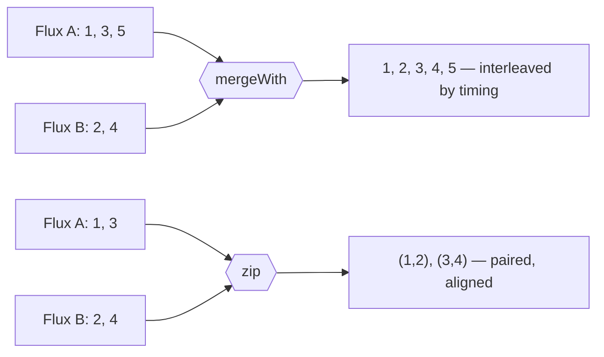

## Objective

Um `Mono` ou um `Flux` sozinho é apenas uma promessa de que o dado vai
eventualmente fluir — veja [Reactor Fundamentals](spring-reactor-fundamentals)
para o que esses dois tipos são e como o contrato Reactive Streams os
governa. O que os transforma num programa útil é o *vocabulário de
operadores*: os várias centenas de métodos em `Flux` e `Mono` que criam um
stream a partir de dados que você já tem, combinam dois streams num só,
transformam e filtram valores conforme passam, e reduzem um stream inteiro a
uma única resposta lógica. O Reactor os agrupa em quatro famílias — criação,
combinação, transformação/filtragem, e lógica — e um pipeline real é quase
sempre um operador de cada uma, encadeados.

## Use Cases

- Combinar os resultados de duas chamadas assíncronas independentes (um
  serviço de perfil de usuário e um serviço de pedidos) num único objeto de
  resposta com `zip()`, sem bloquear em nenhuma delas.
- Achatar um stream de ids de banco de dados num stream das entidades
  buscadas: cada id mapeia para um `Mono<Entity>`, e `flatMap()` achata esses
  publishers internos num único `Flux` de saída.
- Filtrar um stream de eventos recebidos até só os que combinam com uma
  condição — um `Flux` de todos os eventos de pedido restrito só a `SHIPPED`,
  com `filter()`.
- Transformar uma `List` ou array em memória numa fonte reativa para que
  alimente um pipeline que um controller WebFlux retorna (`fromIterable()`,
  `fromArray()`).
- Responder uma pergunta sim/não sobre um stream inteiro — "todo item
  validou?" — com `all()`, que colapsa um `Flux` num `Mono<Boolean>`.
- Coletar um `Flux` finito de volta numa `List` ou `Map` na borda do mundo
  reativo (`collectList()`, `collectMap()`).

## Deep Dive

### Criando tipos reativos

Na maior parte do tempo um `Flux` chega de um repositório ou de uma chamada
WebClient, mas quando você precisa criar um você mesmo, o cavalo de batalha
é `Flux.just()` — ele publica os objetos que você entrega a ele, em ordem,
depois completa:

```java
@Test
public void createAFlux_just() {
    Flux<String> fruitFlux = Flux
        .just("Apple", "Orange", "Grape", "Banana", "Strawberry");

    StepVerifier.create(fruitFlux)
        .expectNext("Apple")
        .expectNext("Orange")
        .expectNext("Grape")
        .expectNext("Banana")
        .expectNext("Strawberry")
        .verifyComplete();
}
```

O detalhe importante é o que acontece *sem* `StepVerifier`: criar o `Flux`
não emite nada. Um publisher é cold e lazy — sem subscriber, sem dado. O
`StepVerifier` (de `reactor-test`) se inscreve, faz assert de cada item
conforme chega, e finalmente confirma que o stream completou. É essa a
forma que todo exemplo abaixo usa.

O resto da família de criação difere só em de onde o dado vem:

| Operador | Fonte |
| --- | --- |
| `Flux.just(a, b, c)` | uma lista varargs de objetos |
| `Flux.fromArray(arr)` | um array Java |
| `Flux.fromIterable(list)` | qualquer `Iterable` — `List`, `Set`, … |
| `Flux.fromStream(stream)` | um `java.util.stream.Stream` |
| `Flux.empty()` | nada; completa imediatamente |
| `Flux.range(1, 5)` | um contador: 1, 2, 3, 4, 5 |
| `Flux.interval(Duration.ofSeconds(1))` | 0, 1, 2, … um por segundo, **para sempre** |

`interval()` é o que tem uma armadilha: não tem valor final, então roda até
ser cancelado. Combine com `take()` ou o teste nunca termina:

```java
Flux<Long> intervalFlux = Flux.interval(Duration.ofSeconds(1)).take(5);
// emits 0L, 1L, 2L, 3L, 4L then completes
```

### Combinando tipos reativos

Quando dois streams precisam virar um só, a escolha é entre *interleaving*
(intercalar) e *pairing* (parear). `mergeWith()` intercala — itens aparecem
na ordem em que as fontes os emitem, o que é bom para uma torrente mas não
dá nenhuma garantia de alinhamento. `zip()` pareia — espera até que ambas as
fontes tenham produzido um item e os emite juntos, o que é o que você quer
para "chamar dois serviços, combinar as respostas":

```java
@Test
public void zipFluxesToObject() {
    Flux<String> characterFlux = Flux
        .just("Garfield", "Kojak", "Barbossa");
    Flux<String> foodFlux = Flux
        .just("Lasagna", "Lollipops", "Apples");

    Flux<String> zippedFlux =
        Flux.zip(characterFlux, foodFlux, (c, f) -> c + " eats " + f);

    StepVerifier.create(zippedFlux)
        .expectNext("Garfield eats Lasagna")
        .expectNext("Kojak eats Lollipops")
        .expectNext("Barbossa eats Apples")
        .verifyComplete();
}
```

Duas coisas para notar. Primeiro, `zip()` é uma operação **estática** em
`Flux`, não um método de instância como `mergeWith()` — está criando um novo
stream a partir de dois pares, não anexando um ao outro. Segundo, a forma de
dois argumentos (`Flux.zip(a, b)`) emite valores `Tuple2<String, String>`;
passar um `BiFunction` como terceiro argumento, como acima, permite produzir
seu próprio tipo em vez de desempacotar `getT1()`/`getT2()` downstream.

Os irmãos: `mergeWith()` intercala por timing (a saída mesclada só alterna
se ambas as fontes emitirem em taxas parecidas — *não* é um vai-e-volta
garantido), e `Flux.firstWithSignal()` faz uma corrida entre dois publishers
e repassa só os valores de quem sinaliza primeiro, ignorando o perdedor
completamente.



### Transformando e filtrando streams reativos

Essa é a família que você usa constantemente, e a distinção mais importante
nela é `map()` vs `flatMap()`. `map()` aplica uma `Function` síncrona a cada
item — um dentro, um fora, mesma ordem:

```java
@Test
public void map() {
    Flux<Player> playerFlux = Flux
        .just("Michael Jordan", "Scottie Pippen", "Steve Kerr")
        .map(n -> {
            String[] split = n.split("\\s");
            return new Player(split[0], split[1]);
        });

    StepVerifier.create(playerFlux)
        .expectNext(new Player("Michael", "Jordan"))
        .expectNext(new Player("Scottie", "Pippen"))
        .expectNext(new Player("Steve", "Kerr"))
        .verifyComplete();
}
```

`flatMap()` é para quando a transformação *em si* é assíncrona — mapeia cada
item para um `Mono` ou `Flux` inteiramente novo (um publisher interno),
depois achata todos esses publishers internos num único stream de saída.
Combinado com `subscribeOn()`, o trabalho interno roda nas worker threads de
um scheduler:

```java
@Test
public void flatMap() {
    Flux<Player> playerFlux = Flux
        .just("Michael Jordan", "Scottie Pippen", "Steve Kerr")
        .flatMap(n -> Mono.just(n)
            .map(p -> {
                String[] split = p.split("\\s");
                return new Player(split[0], split[1]);
            })
            .subscribeOn(Schedulers.parallel())
        );

    List<Player> playerList = Arrays.asList(
        new Player("Michael", "Jordan"),
        new Player("Scottie", "Pippen"),
        new Player("Steve", "Kerr"));

    StepVerifier.create(playerFlux)
        .expectNextMatches(p -> playerList.contains(p))
        .expectNextMatches(p -> playerList.contains(p))
        .expectNextMatches(p -> playerList.contains(p))
        .verifyComplete();
}
```

Note no que os asserts tiveram que virar. Como os publishers internos rodam
em paralelo sem nenhuma garantia sobre qual termina primeiro, o teste não
pode mais fazer assert de uma *ordem* — só que três itens chegam e cada um é
um dos jogadores esperados. Essa perda de ordenação é o preço de
`flatMap()` + `subscribeOn()`; se você precisa da ordem de volta,
`concatMap()` é a variante sequencial.

`subscribeOn()` não é `subscribe()`: `subscribe()` é o verbo que inicia o
fluxo, enquanto `subscribeOn()` apenas *descreve* em qual worker de
`Schedulers` a subscription deveria acontecer — `immediate()`, `single()`,
`newSingle()`, `parallel()` (um pool fixo dimensionado para os cores da
CPU), ou `boundedElastic()` para I/O bloqueante.

O resto dessa família, resumidamente:

| Operador | Efeito |
| --- | --- |
| `filter(predicate)` | mantém só itens que combinam com o `Predicate` |
| `skip(n)` / `skip(Duration)` | descarta os primeiros *n* itens, ou tudo antes de um prazo |
| `take(n)` / `take(Duration)` | mantém só os primeiros *n* itens, depois cancela upstream |
| `distinct()` | descarta itens já vistos |
| `buffer(n)` | agrupa itens num `Flux<List<T>>` de blocos de tamanho *n* |
| `collectList()` | coleta tudo num `Mono<List<T>>` |
| `collectMap(keyFn)` | coleta num `Mono<Map<K, T>>`, chaves posteriores sobrescrevendo anteriores |

`buffer(n)` merece uma linha extra, porque sozinho parece contraproducente —
transformar um stream reativo em `List`s não-reativas. O ponto dele é o que
vem a seguir: encadeado em `flatMap()`, cada bloco bufferizado vira seu
próprio `Flux` interno processado em sua própria thread.

```java
Flux.just("apple", "orange", "banana", "kiwi", "strawberry")
    .buffer(3)
    .flatMap(chunk -> Flux.fromIterable(chunk)
        .map(String::toUpperCase)
        .subscribeOn(Schedulers.parallel()))
    .subscribe();
// chunk 1 (apple/orange/banana) runs on parallel-1,
// chunk 2 (kiwi/strawberry) on parallel-2
```

### Realizando operações lógicas sobre tipos reativos

A família de lógica responde uma pergunta *sobre o stream inteiro*, então
cada uma delas colapsa um `Flux<T>` num `Mono<Boolean>`. `all()` é a
representante — emite `true` só se todo item satisfaz o predicate:

```java
@Test
public void all() {
    Flux<String> animalFlux = Flux.just(
        "aardvark", "elephant", "koala", "eagle", "kangaroo");

    Mono<Boolean> hasAMono = animalFlux.all(a -> a.contains("a"));
    StepVerifier.create(hasAMono)
        .expectNext(true)
        .verifyComplete();

    Mono<Boolean> hasKMono = animalFlux.all(a -> a.contains("k"));
    StepVerifier.create(hasKMono)
        .expectNext(false)
        .verifyComplete();
}
```

Todo nome de animal contém um `a`, então o primeiro `Mono` emite `true`;
`elephant` não tem `k`, então o segundo emite `false` — e pode fazer
short-circuit no momento em que vê esse primeiro contraexemplo. Seus irmãos
são `any(predicate)` (`true` se ao menos um item combina, com short-circuit
no primeiro hit) e `hasElements()` (`true` se o stream emitiu qualquer
coisa — o equivalente reativo de `!list.isEmpty()`).

> **Livro vs. hoje.** O núcleo de operadores deste capítulo envelheceu
> extremamente bem: `just()`, `fromIterable()`, `range()`, `interval()`,
> `mergeWith()`, `zip()`, `map()`, `flatMap()`, `filter()`, `take()`,
> `skip()`, `distinct()`, `buffer()`, `collectList()`, `collectMap()`,
> `all()`, e `any()` todos existem hoje, inalterados em assinatura e
> semântica, em `Flux` no reactor-core atual (3.8.x). Dois nomes nas bordas
> se moveram. `Flux.first(...)` foi deprecated no Reactor 3.4 em favor do
> mais claro `firstWithSignal(...)` (primeira fonte a sinalizar *qualquer
> coisa*, incluindo um erro ou uma conclusão vazia) e `firstWithValue(...)`
> (primeira fonte a de fato emitir um valor), e sumiu da API atual — esse é
> o único code sample deste capítulo que não compila mais como impresso. E
> `Schedulers.elastic()` da tabela de concorrência do livro foi deprecated e
> removido em favor de `Schedulers.boundedElastic()`, porque o pool
> ilimitado escondia problemas de backpressure gerando threads sem limite.
> Todo o resto da seção 10.3 continua atual.

## Trade-offs

- **`map()` vs `flatMap()` é o erro que todo iniciante em Reactor comete uma
  vez.** Se a transformação retorna um publisher e você usa `map()`, o
  sistema de tipos deixa passar e você acaba com um `Flux<Mono<Player>>`
  aninhado que nunca resolve — os itens são publishers internos que ninguém
  se inscreveu. `flatMap()` se inscreve em cada publisher interno e funde
  seus valores na saída.
  ```java
  // wrong: nested publisher, inner Monos are never subscribed
  Flux<Mono<Player>> broken = ids.map(id -> repo.findById(id));

  // right: inner publishers are subscribed and flattened
  Flux<Player> fixed = ids.flatMap(id -> repo.findById(id));
  ```
- **`flatMap()` compra concorrência e paga com ordenação.** Publishers
  internos rodam intercalados e completam na ordem em que terminam, então a
  ordem de saída não é a ordem de entrada — o que é exatamente por que o
  teste `flatMap()` acima teve que trocar `expectNext(...)` por
  `expectNextMatches(...)`. Quando ordem importa, use `concatMap()` (se
  inscreve nos publishers internos um de cada vez, ordem preservada, sem
  concorrência) ou `flatMapSequential()` (execução concorrente, saída
  reordenada para combinar com a entrada, ao custo de buffering).
- **Operadores são lazy e declarativos, o que lê bem mas debuga mal.**
  Construir uma cadeia de dez operadores não executa nenhum deles; nada roda
  até que algo se inscreva, então um stack trace vindo de dentro de um
  pipeline mostra frames de assembly interno do Reactor em vez da linha do
  seu código que compôs o passo quebrado. `log()` na cadeia e
  `Hooks.onOperatorDebug()` (ou o agent `reactor-tools`) existem
  especificamente para recomprar esse contexto perdido, e os dois custam
  performance — o hook de debug não é algo para deixar ligado em produção.
- **`collectList()` e `buffer()` desfazem backpressure de propósito.**
  Coletar um `Flux` ilimitado num `Mono<List<T>>` mantém todo elemento em
  memória de uma vez, o que é bom na borda de um pipeline sobre um resultado
  limitado e um erro de falta de memória sobre um stream de eventos ao vivo.
  `buffer(n)` é o meio-termo limitado — blocos de tamanho conhecido — mas um
  `buffer()` sem argumento tem o mesmo problema ilimitado de `collectList()`.
- **Mais de 500 operadores é um problema de descoberta, não só de superfície
  de API.** A parte difícil do Reactor raramente é escrever o operador; é
  saber que `switchIfEmpty`, `flatMapSequential`, ou `windowUntil` é a coisa
  que você precisava. A própria resposta do Reactor é o apêndice "Which
  operator do I need?", organizado por intenção em vez de alfabeticamente —
  é a página para consultar antes de inventar uma cadeia de três operadores
  para fazer o que um já faz. Isso é um julgamento sobre familiaridade, não
  algo que um snippet demonstra.
- **Cada salto de operador tem um custo.** Cada um envolve a sequência em
  outro subscriber, então uma cadeia de vinte operadores pequenos faz
  mensuravelmente mais trabalho do que uma cadeia equivalente de cinco.
  Raramente domina um pipeline cujo custo real é I/O, mas significa que
  "simplesmente adicionar mais um `map()`" não é grátis do jeito que parece.

## Documentation Links

- Craig Walls, "Spring in Action", 5th Edition (Manning, 2019) — Chapter 10,
  "Introducing Reactor", section 10.3 "Applying common reactive operations",
  p. 248-268 — doc
- [Reactor Core API — Flux (full operator javadoc)](https://projectreactor.io/docs/core/release/api/reactor/core/publisher/Flux.html) — doc
- [Reactor Core API — Mono](https://projectreactor.io/docs/core/release/api/reactor/core/publisher/Mono.html) — doc
- [Reactor 3 Reference Guide — "Which operator do I need?" (operator catalog by intent)](https://projectreactor.io/docs/core/release/reference/apdx-operatorChoice.html) — doc
- [Reactor 3 Reference Guide — Threading and Schedulers](https://projectreactor.io/docs/core/release/reference/coreFeatures/schedulers.html) — doc
