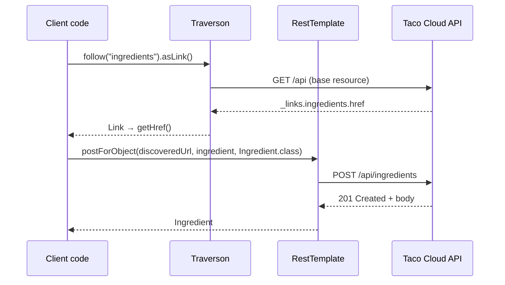

## Objective

A Spring application is rarely only a server — it also calls other people's REST
APIs, and doing that with a raw HTTP library means the same boilerplate every
time: build a client, build a request, execute it, read the status, deserialize
the body, handle the exception. Spring's answer has two facets. `RestTemplate`
covers the mechanical side — one method per HTTP verb (`getForObject`,
`postForLocation`, `put`, `delete`, `exchange`), each handling URL variable
substitution and JSON-to-object conversion for you. `Traverson` covers the
hypermedia side: given only an API's base URI, it walks the `_links` map by
relation name (`follow("tacos", "recents")`) so the client never hardcodes a
path beyond the entry point — the consumer-side counterpart to serving HATEOAS
links, covered in `spring-mvc-hateoas-hypermedia`.

## Use Cases

- A Spring service calling another internal microservice's REST API — fetching
  a user profile or a pricing quote over HTTP with the response deserialized
  straight into a domain type.
- A scheduled batch job pulling data from a third-party API (currency rates, a
  shipping carrier's tracking feed) where a blocking, synchronous call inside
  the job's thread is exactly the right execution model.
- Following a hypermedia API's `_links` from a single configured base URI, so a
  server-side URL scheme change doesn't require redeploying the client.
- Writing to a hypermedia API: discovering the collection's URL by relation
  name, then POSTing to that discovered URL rather than a compiled-in path.
- Integration tests and CLI tools that need a few HTTP calls without pulling in
  a full reactive stack.

## Deep Dive

### Getting a client: instance or bean

`RestTemplate` is a plain object — construct it where you need it:

```java
RestTemplate rest = new RestTemplate();
```

or declare it once and inject it, which is what you want in an application so
that message converters, interceptors, and timeouts are configured in one place:

```java
@Bean
public RestTemplate restTemplate() {
    return new RestTemplate();
}
```

The class exposes 12 distinct operations — `delete`, `exchange`, `execute`,
`getForEntity`, `getForObject`, `headForHeaders`, `optionsForAllow`,
`patchForObject`, `postForEntity`, `postForLocation`, `postForObject`, `put` —
overloaded into 41 methods total. The overloads are not 41 different ideas:
almost every operation comes in three forms that differ only in how the URL is
supplied.

### GETting: `getForObject()` returns the body, `getForEntity()` returns the response

The simplest read binds the response body directly to a domain type:

```java
public Ingredient getIngredientById(String ingredientId) {
    return rest.getForObject("http://localhost:8080/ingredients/{id}",
                             Ingredient.class, ingredientId);
}
```

The second argument is the type the (JSON) response body is deserialized into;
everything after it fills the `{}` placeholders **positionally**, in the order
given. When the client needs more than the payload — a status code, a header —
`getForEntity()` returns the whole `ResponseEntity` instead:

```java
public Ingredient getIngredientById(String ingredientId) {
    ResponseEntity<Ingredient> responseEntity =
        rest.getForEntity("http://localhost:8080/ingredients/{id}",
                          Ingredient.class, ingredientId);

    log.info("Fetched time: " + responseEntity.getHeaders().getDate());
    return responseEntity.getBody();
}
```

### Three ways to specify the URL

Every `…For…` operation is overloaded across the same three URL forms. Varargs
substitute by position:

```java
rest.getForObject("http://localhost:8080/ingredients/{id}",
                  Ingredient.class, ingredientId);
```

A `Map` substitutes by name, which stops the positional-order bug once a URL has
more than one placeholder:

```java
Map<String, String> urlVariables = new HashMap<>();
urlVariables.put("id", ingredientId);

rest.getForObject("http://localhost:8080/ingredients/{id}",
                  Ingredient.class, urlVariables);
```

A prebuilt `java.net.URI` takes no variables at all — expansion has already
happened, so this is the form to use when the URL comes from somewhere else
(a discovered hypermedia link, a config value) or needs custom encoding:

```java
URI url = UriComponentsBuilder
        .fromHttpUrl("http://localhost:8080/ingredients/{id}")
        .build(urlVariables);

rest.getForObject(url, Ingredient.class);
```

### PUTting and DELETEing

`put()` serializes the object you hand it and returns `void` — a PUT replaces
the resource at the URL, so there is nothing to bind:

```java
public void updateIngredient(Ingredient ingredient) {
    rest.put("http://localhost:8080/ingredients/{id}",
             ingredient,
             ingredient.getId());
}
```

Note the argument order: URL, then the body object, then the URL variables.
`delete()` has no body at all:

```java
public void deleteIngredient(Ingredient ingredient) {
    rest.delete("http://localhost:8080/ingredients/{id}",
                ingredient.getId());
}
```

### POSTing: three methods for three different things you might want back

A POST creates a resource, and there are three plausible answers a client might
want. The created representation:

```java
public Ingredient createIngredient(Ingredient ingredient) {
    return rest.postForObject("http://localhost:8080/ingredients",
                              ingredient,
                              Ingredient.class);
}
```

Just the URL of what was created — read off the response's `Location` header,
with the body discarded:

```java
public URI createIngredient(Ingredient ingredient) {
    return rest.postForLocation("http://localhost:8080/ingredients",
                                ingredient);
}
```

Or both, via the full `ResponseEntity`:

```java
public Ingredient createIngredient(Ingredient ingredient) {
    ResponseEntity<Ingredient> responseEntity =
        rest.postForEntity("http://localhost:8080/ingredients",
                           ingredient,
                           Ingredient.class);

    log.info("New resource created at " +
             responseEntity.getHeaders().getLocation());
    return responseEntity.getBody();
}
```

### `exchange()`: the general-purpose form

The verb-specific methods have no parameter for request headers, and their
`Class<T>` response type can't express a generic like `List<Ingredient>` through
erasure. `exchange()` is the escape hatch for both — it takes an explicit
`HttpMethod`, an `HttpEntity` carrying headers and/or body, and a
`ParameterizedTypeReference<T>`:

```java
HttpHeaders headers = new HttpHeaders();
headers.setBearerAuth(token);

ResponseEntity<List<Ingredient>> response = rest.exchange(
        "http://localhost:8080/ingredients",
        HttpMethod.GET,
        new HttpEntity<>(headers),
        new ParameterizedTypeReference<List<Ingredient>>() {});

List<Ingredient> ingredients = response.getBody();
```

The anonymous subclass of `ParameterizedTypeReference` is what preserves the
generic type at runtime; `Class<T>` alone cannot. `execute()` sits one level
lower still, exposing request/response callbacks for cases where even
`exchange()` doesn't fit.

### Traverson: navigate by relation name, not by path

`RestTemplate` can fetch a HAL document, but then you're parsing `_links`
yourself. `Traverson` (from Spring HATEOAS, named for the JavaScript library of
the same idea) is built for it. It is configured once with a base URI and the
media type it should expect — and that base URI is the only URL the client ever
hardcodes:

```java
Traverson traverson = new Traverson(
        URI.create("http://localhost:8080/api"), MediaTypes.HAL_JSON);
```

From there, `follow()` takes relation names and `toObject()` ingests whatever
you landed on:

```java
CollectionModel<Ingredient> ingredientRes =
    traverson
        .follow("ingredients")
        .toObject(new TypeReferences.CollectionModelType<Ingredient>() {});

Collection<Ingredient> ingredients = ingredientRes.getContent();
```

Hops chain, so a relation nested inside another resource is reached by following
each link in turn — mechanically the same as clicking through pages in a browser:

```java
CollectionModel<Taco> tacoRes =
    traverson
        .follow("tacos")
        .follow("recents")
        .toObject(new TypeReferences.CollectionModelType<Taco>() {});
```

`follow()` also accepts a trail of relation names in a single call, which is the
form worth defaulting to:

```java
CollectionModel<Taco> tacoRes =
    traverson
        .follow("tacos", "recents")
        .toObject(new TypeReferences.CollectionModelType<Taco>() {});
```

Each hop is a real HTTP GET — `follow("tacos", "recents")` issues a request for
the base resource, reads its `tacos` link, GETs that, reads its `recents` link,
and GETs that. Traversal is not free.

### Using both: Traverson finds the URL, RestTemplate writes to it

Traverson is read-only — it has no POST, PUT, or DELETE. `RestTemplate` writes
but doesn't navigate. The two compose: stop the traversal one step early with
`asLink()`, take the `href`, and hand it to `RestTemplate`:

```java
private Ingredient addIngredient(Ingredient ingredient) {
    String ingredientsUrl = traverson
        .follow("ingredients")
        .asLink()
        .getHref();

    return rest.postForObject(ingredientsUrl,
                              ingredient,
                              Ingredient.class);
}
```

The POST target is discovered at runtime from the server's own `_links`, so the
only compiled-in URL remains the API's base URI.



> **Book vs. today.** The book's three-client lineup (RestTemplate, Traverson,
> WebClient) has gained a fourth member that changes the recommendation.
> `RestClient`, introduced in **Spring Framework 6.1**, is a synchronous,
> fluent-API HTTP client — explicitly *not* reactive, so it needs no Reactor on
> the classpath and no `.block()` — and it shares `RestTemplate`'s underlying
> infrastructure (request factories, interceptors, message converters), which
> makes migration incremental (`RestClient.create(restTemplate)` adapts an
> existing instance). `RestTemplate`'s status has moved in two distinct steps,
> and the distinction matters: from Spring 5 through 6.x its javadoc said only
> that the class was "in maintenance mode, with only minor requests for changes
> and bugs to be accepted going forward" — deliberately *not* a deprecation, and
> the 6.1 note merely added that `RestClient` "offers a more modern API for
> synchronous HTTP access." That changed with **Spring Framework 7.0** (November
> 2025), whose reference documentation now states that "As of Spring Framework
> 7.0, `RestTemplate` is deprecated in favor of `RestClient` and will be removed
> in a future version." The announced schedule is documentation-level
> deprecation in 7.0, the formal `@Deprecated` annotation in 7.1 (provisional
> November 2026), and removal in 8.0 — so on current 7.0.x the class still
> compiles without a deprecation warning, and every snippet above still runs.
> New synchronous code should use `RestClient`; `WebClient` remains the answer
> for reactive and streaming scenarios. `Traverson`, by contrast, is unchanged
> and not deprecated — it is still the client-side hypermedia API in current
> Spring HATEOAS. Only its type vocabulary moved in HATEOAS 1.0: the book's
> `Resources<T>` is today's `CollectionModel<T>`, and the raw
> `ParameterizedTypeReference<Resources<T>>` is better written as the purpose-built
> `TypeReferences.CollectionModelType<T>`.

## Trade-offs

- **The one-method-per-verb design is instantly readable but stops short at
  anything unusual.** `getForObject()` is a single self-explanatory line, yet
  it has nowhere to put a request header, and its `Class<T>` parameter can't
  express `List<Ingredient>` through erasure. The moment either is needed you
  drop to `exchange()`, which is markedly more verbose — a fluent client folds
  both cases back into the same call chain:
  ```java
  // RestTemplate: a header or a generic type forces exchange()
  rest.exchange(url, HttpMethod.GET, new HttpEntity<>(headers),
                new ParameterizedTypeReference<List<Ingredient>>() {});

  // RestClient: same call shape as the simple case
  restClient.get().uri(url).header("Authorization", "Bearer " + token)
            .retrieve().body(new ParameterizedTypeReference<List<Ingredient>>() {});
  ```
- **Every call blocks the calling thread, which is a feature until it isn't.**
  For a batch job or a request-per-thread MVC handler, synchronous is the
  correct and simplest model. For fan-out — twenty downstream calls to assemble
  one response — it means twenty serialized round trips on one thread, where
  `WebClient` would overlap them. Neither `RestTemplate` nor `RestClient` offers
  a way out of that; the choice is made at the client level, not per call.
- **Traverson buys URL independence by paying an HTTP request per hop.** A
  `follow("tacos", "recents")` is two GETs before the one you actually wanted,
  every time, with no caching of the link graph. Against a chatty API or a
  latency-sensitive path, hardcoding the final URL is measurably faster — the
  trade is decoupling from the server's URL scheme against round trips, and it
  only pays off if that scheme actually changes.
- **Traverson reads; it cannot write.** There is no `follow(...).post(...)` —
  writing means ending the traversal at `asLink().getHref()` and handing the URL
  to a separate client. That is a clean seam, but it means a hypermedia-aware
  client always carries two objects with two configurations (base URI, media
  type, timeouts, auth) that must be kept consistent.
- **Errors surface as unchecked exceptions, not as return values.** A `404` from
  `getForObject()` throws `HttpClientErrorException.NotFound` rather than
  returning `null`, so a caller that forgets a try/catch fails loudly at runtime
  rather than at compile time. `RestClient` makes the handling explicit and
  local via `onStatus`:
  ```java
  // RestTemplate: throws unless the caller wraps the call
  try {
      return rest.getForObject(url, Ingredient.class, id);
  } catch (HttpClientErrorException.NotFound e) {
      return null;
  }

  // RestClient: status handling attached to the request itself
  return restClient.get().uri(url, id)
          .retrieve()
          .onStatus(HttpStatusCode::is4xxClientError, (req, res) -> { })
          .body(Ingredient.class);
  ```
- **Choosing between them today is a migration-window question, not a
  correctness one.** Existing `RestTemplate` code is not broken and will keep
  compiling through the 7.x line; new code written against it is code that has a
  known removal date attached. Because both clients share the same request
  factories and interceptors, the pragmatic path is to configure the transport
  once and swap the facade — a judgment call about codebase age and upgrade
  cadence rather than anything a snippet decides.

## Documentation Links

- Craig Walls, "Spring in Action", 5th Edition (Manning, 2019) — Chapter 7,
  "Consuming REST services", p. 169-177 — doc
- [Spring Framework Reference — REST Clients (RestClient, WebClient, RestTemplate)](https://docs.spring.io/spring-framework/reference/integration/rest-clients.html) — doc
- [Spring Framework API — RestTemplate](https://docs.spring.io/spring-framework/docs/current/javadoc-api/org/springframework/web/client/RestTemplate.html) — doc
- [Spring Framework API — RestClient](https://docs.spring.io/spring-framework/docs/current/javadoc-api/org/springframework/web/client/RestClient.html) — doc
- [Spring HATEOAS Reference — Client-side support (Traverson)](https://docs.spring.io/spring-hateoas/docs/current/reference/html/#client.traverson) — doc
