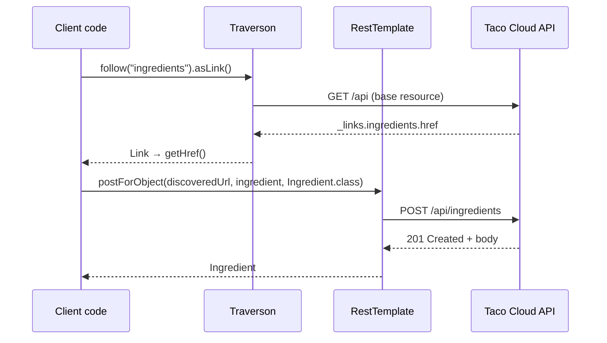

## Objective

Uma aplicação Spring raramente é só um servidor — ela também chama APIs REST
de outras pessoas, e fazer isso com uma biblioteca HTTP crua significa o
mesmo boilerplate toda vez: montar um client, montar um request, executá-lo,
ler o status, desserializar o corpo, tratar a exception. A resposta do
Spring tem duas facetas. `RestTemplate` cobre o lado mecânico — um método
por verbo HTTP (`getForObject`, `postForLocation`, `put`, `delete`,
`exchange`), cada um cuidando da substituição de variáveis na URL e da
conversão JSON-para-objeto para você. `Traverson` cobre o lado hipermídia:
dado apenas a URI base de uma API, ele percorre o mapa `_links` por nome de
relação (`follow("tacos", "recents")`) para que o client nunca hardcode um
caminho além do ponto de entrada — a contraparte do lado do consumer para
servir links HATEOAS, coberto em `spring-mvc-hateoas-hypermedia`.

## Use Cases

- Um serviço Spring chamando a API REST de outro microsserviço interno —
  buscando um perfil de usuário ou uma cotação de preço via HTTP com a
  resposta desserializada diretamente num tipo de domínio.
- Um job de batch agendado puxando dados de uma API de terceiro (cotações de
  moeda, o feed de rastreamento de uma transportadora) onde uma chamada
  bloqueante e síncrona dentro da thread do job é exatamente o modelo de
  execução certo.
- Seguir os `_links` de uma API hipermídia a partir de uma única URI base
  configurada, para que uma mudança no esquema de URL do lado do servidor
  não exija reimplantar o client.
- Escrever numa API hipermídia: descobrir a URL da coleção pelo nome de
  relação, depois fazer POST para essa URL descoberta em vez de um caminho
  compilado.
- Testes de integração e ferramentas CLI que precisam de poucas chamadas
  HTTP sem trazer um stack reativo completo.

## Deep Dive

### Obtendo um client: instância ou bean

`RestTemplate` é um objeto simples — construa onde você precisar:

```java
RestTemplate rest = new RestTemplate();
```

ou declare uma vez e injete, que é o que você quer numa aplicação para que
message converters, interceptors, e timeouts sejam configurados num só
lugar:

```java
@Bean
public RestTemplate restTemplate() {
    return new RestTemplate();
}
```

A classe expõe 12 operações distintas — `delete`, `exchange`, `execute`,
`getForEntity`, `getForObject`, `headForHeaders`, `optionsForAllow`,
`patchForObject`, `postForEntity`, `postForLocation`, `postForObject`, `put`
— sobrecarregadas em 41 métodos no total. Os overloads não são 41 ideias
diferentes: quase toda operação vem em três formas que diferem só em como a
URL é fornecida.

### GETting: `getForObject()` retorna o corpo, `getForEntity()` retorna a resposta

A leitura mais simples vincula o corpo da resposta diretamente a um tipo de
domínio:

```java
public Ingredient getIngredientById(String ingredientId) {
    return rest.getForObject("http://localhost:8080/ingredients/{id}",
                             Ingredient.class, ingredientId);
}
```

O segundo argumento é o tipo para o qual o corpo (JSON) da resposta é
desserializado; tudo depois dele preenche os placeholders `{}`
**posicionalmente**, na ordem dada. Quando o client precisa de mais do que
o payload — um status code, um header — `getForEntity()` retorna o
`ResponseEntity` inteiro em vez disso:

```java
public Ingredient getIngredientById(String ingredientId) {
    ResponseEntity<Ingredient> responseEntity =
        rest.getForEntity("http://localhost:8080/ingredients/{id}",
                          Ingredient.class, ingredientId);

    log.info("Fetched time: " + responseEntity.getHeaders().getDate());
    return responseEntity.getBody();
}
```

### Três formas de especificar a URL

Toda operação `…For…` é sobrecarregada nas mesmas três formas de URL.
Varargs substituem por posição:

```java
rest.getForObject("http://localhost:8080/ingredients/{id}",
                  Ingredient.class, ingredientId);
```

Um `Map` substitui por nome, o que interrompe o erro de ordem posicional
assim que uma URL tem mais de um placeholder:

```java
Map<String, String> urlVariables = new HashMap<>();
urlVariables.put("id", ingredientId);

rest.getForObject("http://localhost:8080/ingredients/{id}",
                  Ingredient.class, urlVariables);
```

Uma `java.net.URI` já pronta não recebe nenhuma variável — a expansão já
aconteceu, então essa é a forma a usar quando a URL vem de outro lugar (um
link hipermídia descoberto, um valor de config) ou precisa de encoding
customizado:

```java
URI url = UriComponentsBuilder
        .fromHttpUrl("http://localhost:8080/ingredients/{id}")
        .build(urlVariables);

rest.getForObject(url, Ingredient.class);
```

### PUTting e DELETEing

`put()` serializa o objeto que você entrega e retorna `void` — um PUT
substitui o recurso na URL, então não há nada a vincular:

```java
public void updateIngredient(Ingredient ingredient) {
    rest.put("http://localhost:8080/ingredients/{id}",
             ingredient,
             ingredient.getId());
}
```

Note a ordem dos argumentos: URL, depois o objeto do corpo, depois as
variáveis da URL. `delete()` não tem corpo nenhum:

```java
public void deleteIngredient(Ingredient ingredient) {
    rest.delete("http://localhost:8080/ingredients/{id}",
                ingredient.getId());
}
```

### POSTing: três métodos para três coisas diferentes que você pode querer de volta

Um POST cria um recurso, e existem três respostas plausíveis que um client
pode querer. A representação criada:

```java
public Ingredient createIngredient(Ingredient ingredient) {
    return rest.postForObject("http://localhost:8080/ingredients",
                              ingredient,
                              Ingredient.class);
}
```

Só a URL do que foi criado — lida a partir do header `Location` da resposta,
com o corpo descartado:

```java
public URI createIngredient(Ingredient ingredient) {
    return rest.postForLocation("http://localhost:8080/ingredients",
                                ingredient);
}
```

Ou ambos, via o `ResponseEntity` completo:

```java
public Ingredient createIngredient(Ingredient ingredient) {
    ResponseEntity<Ingredient> responseEntity =
        rest.postForEntity("http://localhost:8080/ingredients",
                           ingredient,
                           Ingredient.class);

    log.info("New resource created at " +
             responseEntity.getHeaders().getLocation());
    return responseEntity.getBody();
}
```

### `exchange()`: a forma de propósito geral

Os métodos específicos por verbo não têm parâmetro para headers de request,
e seu tipo de resposta `Class<T>` não consegue expressar um genérico como
`List<Ingredient>` por causa de type erasure. `exchange()` é a escotilha de
escape para os dois — recebe um `HttpMethod` explícito, uma `HttpEntity`
carregando headers e/ou corpo, e um `ParameterizedTypeReference<T>`:

```java
HttpHeaders headers = new HttpHeaders();
headers.setBearerAuth(token);

ResponseEntity<List<Ingredient>> response = rest.exchange(
        "http://localhost:8080/ingredients",
        HttpMethod.GET,
        new HttpEntity<>(headers),
        new ParameterizedTypeReference<List<Ingredient>>() {});

List<Ingredient> ingredients = response.getBody();
```

A subclasse anônima de `ParameterizedTypeReference` é o que preserva o tipo
genérico em runtime; `Class<T>` sozinho não consegue. `execute()` fica um
nível abaixo ainda, expondo callbacks de request/response para casos onde
mesmo `exchange()` não serve.

### Traverson: navegar por nome de relação, não por caminho

`RestTemplate` consegue buscar um documento HAL, mas depois você está
parseando `_links` sozinho. `Traverson` (do Spring HATEOAS, batizado com o
nome da biblioteca JavaScript com a mesma ideia) é feito para isso. É
configurado uma vez com uma URI base e o media type que deveria esperar — e
essa URI base é a única URL que o client sempre hardcoda:

```java
Traverson traverson = new Traverson(
        URI.create("http://localhost:8080/api"), MediaTypes.HAL_JSON);
```

A partir daí, `follow()` recebe nomes de relação e `toObject()` ingere o que
quer que você tenha chegado:

```java
CollectionModel<Ingredient> ingredientRes =
    traverson
        .follow("ingredients")
        .toObject(new TypeReferences.CollectionModelType<Ingredient>() {});

Collection<Ingredient> ingredients = ingredientRes.getContent();
```

Os saltos se encadeiam, então uma relação aninhada dentro de outro recurso é
alcançada seguindo cada link por vez — mecanicamente igual a clicar por
páginas num browser:

```java
CollectionModel<Taco> tacoRes =
    traverson
        .follow("tacos")
        .follow("recents")
        .toObject(new TypeReferences.CollectionModelType<Taco>() {});
```

`follow()` também aceita uma trilha de nomes de relação numa única chamada,
que é a forma a preferir por padrão:

```java
CollectionModel<Taco> tacoRes =
    traverson
        .follow("tacos", "recents")
        .toObject(new TypeReferences.CollectionModelType<Taco>() {});
```

Cada salto é um GET HTTP de verdade — `follow("tacos", "recents")` emite um
request para o recurso base, lê seu link `tacos`, faz GET nele, lê seu link
`recents`, e faz GET nele. Travessia não é grátis.

### Usando os dois: Traverson encontra a URL, RestTemplate escreve nela

Traverson é somente leitura — não tem POST, PUT, ou DELETE. `RestTemplate`
escreve mas não navega. Os dois se compõem: pare a travessia um passo antes
com `asLink()`, pegue o `href`, e entregue ao `RestTemplate`:

```java
private Ingredient addIngredient(Ingredient ingredient) {
    String ingredientsUrl = traverson
        .follow("ingredients")
        .asLink()
        .getHref();

    return rest.postForObject(ingredientsUrl,
                              ingredient,
                              Ingredient.class);
}
```

O alvo do POST é descoberto em runtime a partir dos próprios `_links` do
servidor, então a única URL compilada no código continua sendo a URI base
da API.



> **Livro vs. hoje.** A lista de três clients do livro (RestTemplate,
> Traverson, WebClient) ganhou um quarto membro que muda a recomendação.
> `RestClient`, introduzido no **Spring Framework 6.1**, é um client HTTP
> síncrono, de API fluente — explicitamente *não* reativo, então não precisa
> de Reactor no classpath e nenhum `.block()` — e compartilha a
> infraestrutura subjacente do `RestTemplate` (request factories,
> interceptors, message converters), o que torna a migração incremental
> (`RestClient.create(restTemplate)` adapta uma instância existente). O
> status do `RestTemplate` se moveu em dois passos distintos, e a distinção
> importa: do Spring 5 até o 6.x seu javadoc dizia apenas que a classe
> estava "em modo de manutenção, com apenas pequenos pedidos de mudanças e
> correções de bugs aceitos daqui para frente" — deliberadamente *não* uma
> deprecação, e a nota do 6.1 só acrescentou que o `RestClient` "oferece uma
> API mais moderna para acesso HTTP síncrono." Isso mudou com o **Spring
> Framework 7.0** (novembro de 2025), cuja documentação de referência agora
> declara que "A partir do Spring Framework 7.0, `RestTemplate` está
> deprecated em favor do `RestClient` e será removido numa versão futura."
> O cronograma anunciado é depreciação em nível de documentação no 7.0, a
> annotation formal `@Deprecated` no 7.1 (provisoriamente novembro de 2026),
> e remoção no 8.0 — então na versão atual 7.0.x a classe ainda compila sem
> aviso de depreciação, e todo snippet acima ainda roda. Código síncrono
> novo deveria usar `RestClient`; `WebClient` permanece a resposta para
> cenários reativos e de streaming. `Traverson`, em contraste, está
> inalterado e não deprecated — continua sendo a API hipermídia do lado do
> client no Spring HATEOAS atual. Só seu vocabulário de tipos se moveu no
> HATEOAS 1.0: o `Resources<T>` do livro é hoje `CollectionModel<T>`, e o
> `ParameterizedTypeReference<Resources<T>>` cru é melhor escrito como o
> `TypeReferences.CollectionModelType<T>` feito sob medida.

## Trade-offs

- **O design de um-método-por-verbo é instantaneamente legível mas para
  curto diante de algo incomum.** `getForObject()` é uma linha só,
  autoexplicativa, mas não tem onde colocar um header de request, e seu
  parâmetro `Class<T>` não consegue expressar `List<Ingredient>` por type
  erasure. No momento em que qualquer um dos dois é necessário você cai para
  `exchange()`, que é marcadamente mais verboso — um client fluente dobra
  os dois casos de volta na mesma cadeia de chamada:
  ```java
  // RestTemplate: a header or a generic type forces exchange()
  rest.exchange(url, HttpMethod.GET, new HttpEntity<>(headers),
                new ParameterizedTypeReference<List<Ingredient>>() {});

  // RestClient: same call shape as the simple case
  restClient.get().uri(url).header("Authorization", "Bearer " + token)
            .retrieve().body(new ParameterizedTypeReference<List<Ingredient>>() {});
  ```
- **Toda chamada bloqueia a thread chamadora, o que é um recurso até deixar
  de ser.** Para um job de batch ou um handler MVC de um-request-por-thread,
  síncrono é o modelo correto e mais simples. Para fan-out — vinte chamadas
  downstream para montar uma resposta — significa vinte idas e voltas
  serializadas numa única thread, onde `WebClient` as sobreporia. Nem
  `RestTemplate` nem `RestClient` oferecem uma saída disso; a escolha é
  feita no nível do client, não por chamada.
- **Traverson compra independência de URL pagando um request HTTP por
  salto.** Um `follow("tacos", "recents")` são dois GETs antes daquele que
  você realmente queria, toda vez, sem cache do grafo de links. Contra uma
  API tagarela ou um caminho sensível a latência, hardcodar a URL final é
  mensuravelmente mais rápido — a troca é desacoplamento do esquema de URL
  do servidor contra idas e voltas, e só compensa se esse esquema realmente
  mudar.
- **Traverson lê; não consegue escrever.** Não existe um
  `follow(...).post(...)` — escrever significa terminar a travessia em
  `asLink().getHref()` e entregar a URL a um client separado. Isso é uma
  costura limpa, mas significa que um client consciente de hipermídia
  sempre carrega dois objetos com duas configurações (URI base, media type,
  timeouts, auth) que precisam ser mantidas consistentes.
- **Erros aparecem como exceptions unchecked, não como valores de
  retorno.** Um `404` de `getForObject()` lança
  `HttpClientErrorException.NotFound` em vez de retornar `null`, então um
  chamador que esquece um try/catch falha ruidosamente em runtime em vez de
  em tempo de compilação. `RestClient` torna o tratamento explícito e local
  via `onStatus`:
  ```java
  // RestTemplate: throws unless the caller wraps the call
  try {
      return rest.getForObject(url, Ingredient.class, id);
  } catch (HttpClientErrorException.NotFound e) {
      return null;
  }

  // RestClient: status handling attached to the request itself
  return restClient.get().uri(url, id)
          .retrieve()
          .onStatus(HttpStatusCode::is4xxClientError, (req, res) -> { })
          .body(Ingredient.class);
  ```
- **Escolher entre eles hoje é uma questão de janela de migração, não de
  correção.** Código `RestTemplate` existente não está quebrado e vai
  continuar compilando durante toda a linha 7.x; código novo escrito contra
  ele é código que tem uma data de remoção conhecida anexada. Como os dois
  clients compartilham as mesmas request factories e interceptors, o
  caminho pragmático é configurar o transporte uma vez e trocar a fachada —
  um julgamento sobre a idade do código-base e o ritmo de upgrade, não algo
  que um snippet decide.

## Documentation Links

- Craig Walls, "Spring in Action", 5th Edition (Manning, 2019) — Chapter 7,
  "Consuming REST services", p. 169-177 — doc
- [Spring Framework Reference — REST Clients (RestClient, WebClient, RestTemplate)](https://docs.spring.io/spring-framework/reference/integration/rest-clients.html) — doc
- [Spring Framework API — RestTemplate](https://docs.spring.io/spring-framework/docs/current/javadoc-api/org/springframework/web/client/RestTemplate.html) — doc
- [Spring Framework API — RestClient](https://docs.spring.io/spring-framework/docs/current/javadoc-api/org/springframework/web/client/RestClient.html) — doc
- [Spring HATEOAS Reference — Client-side support (Traverson)](https://docs.spring.io/spring-hateoas/docs/current/reference/html/#client.traverson) — doc
