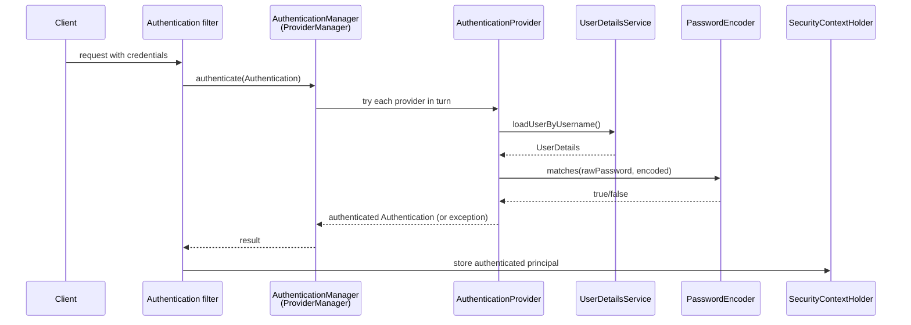

## Objective

Understand the chain of components Spring Security uses to authenticate a request — an authentication filter delegates to an `AuthenticationManager`, which delegates to one or more `AuthenticationProvider`s, which use a `UserDetailsService` and a `PasswordEncoder` to validate credentials and store the result in the `SecurityContextHolder` — and how to wire that chain today with a `SecurityFilterChain` bean instead of the deprecated `WebSecurityConfigurerAdapter`.

## Use Cases

- Securing a REST API by default (every endpoint requires authentication) with zero explicit configuration, then progressively overriding the pieces you need — a custom `UserDetailsService`, a real `PasswordEncoder` — while leaving the rest on Spring Boot's defaults.
- Replacing the in-memory, single-user default with a `UserDetailsService` backed by a database, without touching the rest of the authentication flow.
- Writing a custom `AuthenticationProvider` when authentication doesn't fit the username/password shape at all (an API key, a signed header) and the default provider chain has nothing to offer.
- Reading a stack trace or a config class in a legacy Spring Security codebase and recognizing which architectural role (`filter`, `manager`, `provider`, `context`) each piece plays.

## Deep Dive

### The default project authenticates everything with HTTP Basic

Adding only `spring-boot-starter-web` and `spring-boot-starter-security` is enough to secure every endpoint. Spring Boot registers one user (`user`) with a random UUID password printed to the console at startup:

```
Using generated security password: 93a01cf0-794b-4b98-86ef-54860f36f7f3
```

```java
@RestController
public class HelloController {

  @GetMapping("/hello")
  public String hello() {
    return "Hello!";
  }
}
```

```
curl http://localhost:8080/hello
# {"status":401,"error":"Unauthorized","message":"Unauthorized","path":"/hello"}

curl -u user:93a01cf0-794b-4b98-86ef-54860f36f7f3 http://localhost:8080/hello
# Hello!
```

Nothing here is configured by hand — it's the visible effect of a chain of autoconfigured beans, detailed next.

### The authentication chain: filter → manager → provider → context

Six components, wired together, handle every authentication request:

1. An **authentication filter** intercepts the incoming request.
2. It delegates the authentication attempt to an `AuthenticationManager`.
3. The manager delegates to an `AuthenticationProvider`, which implements the actual authentication logic.
4. The provider finds the user through a `UserDetailsService` and validates the password through a `PasswordEncoder`.
5. The result of the authentication is returned back up to the filter.
6. On success, the filter stores the authenticated principal in the `SecurityContextHolder`, where the rest of the request-handling code can read it.

The default `AuthenticationManager` implementation is `ProviderManager`: it holds a list of `AuthenticationProvider`s and tries each in turn until one can authenticate the request (or none can, which raises `ProviderNotFoundException`). The default `AuthenticationProvider` in a Basic-auth setup delegates directly to the autoconfigured `UserDetailsService` and `PasswordEncoder` — the two beans Spring Boot creates for you when it sees `spring-boot-starter-security` on the classpath with nothing else configured.



### Overriding `UserDetailsService` and `PasswordEncoder`

Declaring your own `UserDetailsService` bean replaces the single generated user with credentials you control. `InMemoryUserDetailsManager` is the simplest built-in implementation — suitable for examples, not production:

```java
@Configuration
public class ProjectConfig {

  @Bean
  public UserDetailsService userDetailsService() {
    var userDetailsService = new InMemoryUserDetailsManager();

    var user = User.withUsername("john")
        .password("12345")
        .authorities("read")
        .build();

    userDetailsService.createUser(user);
    return userDetailsService;
  }

  @Bean
  public PasswordEncoder passwordEncoder() {
    return NoOpPasswordEncoder.getInstance(); // plain text — examples only
  }
}
```

Once you supply a custom `UserDetailsService`, Spring Boot's autoconfigured `PasswordEncoder` no longer applies either — omitting the second bean fails authentication with `IllegalArgumentException: There is no PasswordEncoder mapped for the id "null"`, because the two beans are configured as a pair.

### Writing a custom `AuthenticationProvider`

When the default username/password flow doesn't apply, implementing `AuthenticationProvider` directly replaces both `UserDetailsService` and `PasswordEncoder` with your own logic:

```java
@Component
public class CustomAuthenticationProvider implements AuthenticationProvider {

  @Override
  public Authentication authenticate(Authentication authentication) throws AuthenticationException {
    String username = authentication.getName();
    String password = String.valueOf(authentication.getCredentials());

    if ("john".equals(username) && "12345".equals(password)) {
      return new UsernamePasswordAuthenticationToken(username, password, Arrays.asList());
    }
    throw new AuthenticationCredentialsNotFoundException("Error in authentication!");
  }

  @Override
  public boolean supports(Class<?> authenticationType) {
    return UsernamePasswordAuthenticationToken.class.isAssignableFrom(authenticationType);
  }
}
```

This is a deliberate escape hatch, not the default path: bypassing `UserDetailsService`/`PasswordEncoder` means you also give up the separation of concerns they provide (see Trade-offs).

### Book vs. today: `WebSecurityConfigurerAdapter` → `SecurityFilterChain`

The book (2020, Spring Security 5.1) configures everything by extending `WebSecurityConfigurerAdapter` and overriding `configure(HttpSecurity http)`:

```java
@Configuration
public class ProjectConfig extends WebSecurityConfigurerAdapter {

  @Override
  protected void configure(HttpSecurity http) throws Exception {
    http.httpBasic();
    http.authorizeRequests()
        .anyRequest().authenticated();
  }
}
```

`WebSecurityConfigurerAdapter` is deprecated and removed as of Spring Security 6.0. Today the same configuration is a `SecurityFilterChain` `@Bean`, built with the `HttpSecurity` lambda DSL — no subclassing, no overriding a `configure` method:

```java
@Configuration
@EnableWebSecurity
public class WebSecurityConfig {

  @Bean
  public SecurityFilterChain filterChain(HttpSecurity http) throws Exception {
    http
        .authorizeHttpRequests(authorize -> authorize
            .anyRequest().authenticated())
        .httpBasic(Customizer.withDefaults());
    return http.build();
  }
}
```

The underlying architecture — filter, `AuthenticationManager`/`ProviderManager`, `AuthenticationProvider`, `UserDetailsService`, `PasswordEncoder`, `SecurityContextHolder` — is unchanged; only the way you *assemble* the filter chain moved from inheritance to a bean-returning method. The lambda DSL also makes it natural to declare multiple `SecurityFilterChain` beans, each scoped to a URL pattern via `securityMatcher()`, where the old adapter effectively assumed a single chain per application.

## Trade-offs

- **`NoOpPasswordEncoder` and `InMemoryUserDetailsManager` are examples-only tools** — the former stores passwords in clear text and is marked `@Deprecated` specifically to discourage production use; the latter never persists anything.
- **The architecture is loosely coupled by design, which invites mixed configuration styles** — the book explicitly warns against combining a `@Bean`-declared `PasswordEncoder` with an `AuthenticationManagerBuilder`-declared `UserDetailsService` in the same class: it works, but makes the link between the two beans harder to trace than either style used consistently.
- **A custom `AuthenticationProvider` trades reusability for control** — replacing `UserDetailsService`/`PasswordEncoder` with inline logic (as in the API-key case) means you also lose whatever built-in `UserDetailsService` implementations (JDBC, LDAP) would have given you for free; it's the right call only when the credential shape genuinely isn't username/password.
- **HTTP Basic sends credentials on every request** — Base64 is an encoding, not encryption, so Basic auth is only acceptable over HTTPS and is a poor fit once a system needs to avoid resending credentials on each call (the book's own reason for later moving to OAuth 2 / token-based flows for frontend-backend architectures).

## Documentation Links

- [Spring Security in Action (Manning, 2020) — Chapter 1: "Security today", p. 14-31 and Chapter 2: "Hello Spring Security", p. 33-58](https://www.manning.com/books/spring-security-in-action) — doc
- [Spring Security Reference — Authentication Architecture](https://docs.spring.io/spring-security/reference/servlet/authentication/architecture.html) — doc
- [Spring Security Reference — Java Configuration (SecurityFilterChain)](https://docs.spring.io/spring-security/reference/servlet/configuration/java.html) — doc
- [OWASP — Top 10 Web Application Security Risks](https://owasp.org/www-project-top-ten/) — doc
