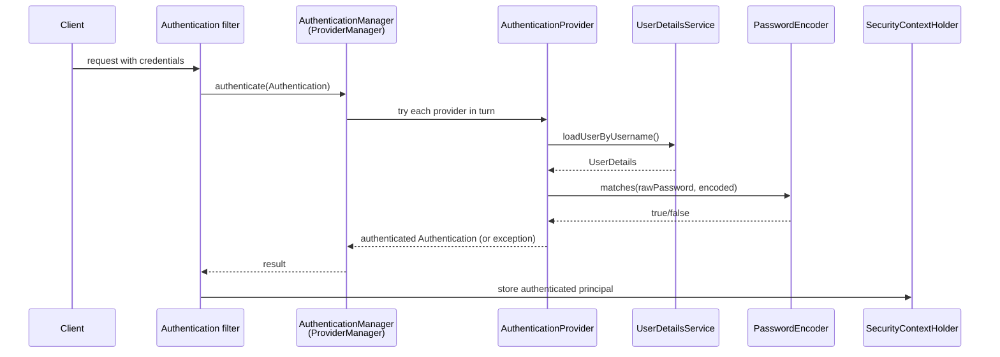

## Objective

Entenda a cadeia de componentes que o Spring Security usa para autenticar uma requisição — um filtro de autenticação delega para um `AuthenticationManager`, que delega para um ou mais `AuthenticationProvider`s, que usam um `UserDetailsService` e um `PasswordEncoder` para validar credenciais e armazenar o resultado no `SecurityContextHolder` — e como configurar essa cadeia hoje com um bean `SecurityFilterChain` em vez do já deprecated `WebSecurityConfigurerAdapter`.

## Use Cases

- Proteger uma API REST por padrão (todo endpoint exige autenticação) com zero configuração explícita, e depois sobrescrever progressivamente as peças que você precisa — um `UserDetailsService` customizado, um `PasswordEncoder` de verdade — deixando o resto nos padrões do Spring Boot.
- Substituir o usuário único em memória padrão por um `UserDetailsService` apoiado em um banco de dados, sem tocar no resto do fluxo de autenticação.
- Escrever um `AuthenticationProvider` customizado quando a autenticação não se encaixa de forma alguma no formato usuário/senha (uma API key, um header assinado) e a cadeia de providers padrão não tem nada a oferecer.
- Ler um stack trace ou uma classe de configuração num código legado de Spring Security e reconhecer qual papel arquitetural (`filter`, `manager`, `provider`, `context`) cada peça desempenha.

## Deep Dive

### O projeto padrão autentica tudo com HTTP Basic

Adicionar apenas `spring-boot-starter-web` e `spring-boot-starter-security` já é suficiente para proteger todo endpoint. O Spring Boot registra um usuário (`user`) com uma senha UUID aleatória impressa no console na inicialização:

```
Using generated security password: 93a01cf0-794b-4b98-86ef-54860f36f7f3
```

```java
@RestController
public class HelloController {

  @GetMapping("/hello")
  public String hello() {
    return "Hello!";
  }
}
```

```
curl http://localhost:8080/hello
# {"status":401,"error":"Unauthorized","message":"Unauthorized","path":"/hello"}

curl -u user:93a01cf0-794b-4b98-86ef-54860f36f7f3 http://localhost:8080/hello
# Hello!
```

Nada aqui é configurado à mão — é o efeito visível de uma cadeia de beans autoconfigurados, detalhada a seguir.

### A cadeia de autenticação: filter → manager → provider → context

Seis componentes, conectados entre si, lidam com toda requisição de autenticação:

1. Um **filtro de autenticação** intercepta a requisição de entrada.
2. Ele delega a tentativa de autenticação a um `AuthenticationManager`.
3. O manager delega a um `AuthenticationProvider`, que implementa a lógica de autenticação de fato.
4. O provider encontra o usuário através de um `UserDetailsService` e valida a senha através de um `PasswordEncoder`.
5. O resultado da autenticação é devolvido para o filtro.
6. Em caso de sucesso, o filtro armazena o principal autenticado no `SecurityContextHolder`, onde o resto do código de tratamento da requisição pode lê-lo.

A implementação padrão de `AuthenticationManager` é `ProviderManager`: ele mantém uma lista de `AuthenticationProvider`s e tenta cada um por vez até que um consiga autenticar a requisição (ou nenhum consiga, o que gera `ProviderNotFoundException`). O `AuthenticationProvider` padrão numa configuração Basic-auth delega diretamente para o `UserDetailsService` e o `PasswordEncoder` autoconfigurados — os dois beans que o Spring Boot cria para você quando vê `spring-boot-starter-security` no classpath sem mais nada configurado.



### Sobrescrevendo `UserDetailsService` e `PasswordEncoder`

Declarar seu próprio bean `UserDetailsService` substitui o único usuário gerado por credenciais que você controla. `InMemoryUserDetailsManager` é a implementação embutida mais simples — adequada para exemplos, não para produção:

```java
@Configuration
public class ProjectConfig {

  @Bean
  public UserDetailsService userDetailsService() {
    var userDetailsService = new InMemoryUserDetailsManager();

    var user = User.withUsername("john")
        .password("12345")
        .authorities("read")
        .build();

    userDetailsService.createUser(user);
    return userDetailsService;
  }

  @Bean
  public PasswordEncoder passwordEncoder() {
    return NoOpPasswordEncoder.getInstance(); // plain text — examples only
  }
}
```

Uma vez que você fornece um `UserDetailsService` customizado, o `PasswordEncoder` autoconfigurado do Spring Boot também deixa de se aplicar — omitir o segundo bean faz a autenticação falhar com `IllegalArgumentException: There is no PasswordEncoder mapped for the id "null"`, porque os dois beans são configurados como um par.

### Escrevendo um `AuthenticationProvider` customizado

Quando o fluxo padrão de usuário/senha não se aplica, implementar `AuthenticationProvider` diretamente substitui tanto `UserDetailsService` quanto `PasswordEncoder` pela sua própria lógica:

```java
@Component
public class CustomAuthenticationProvider implements AuthenticationProvider {

  @Override
  public Authentication authenticate(Authentication authentication) throws AuthenticationException {
    String username = authentication.getName();
    String password = String.valueOf(authentication.getCredentials());

    if ("john".equals(username) && "12345".equals(password)) {
      return new UsernamePasswordAuthenticationToken(username, password, Arrays.asList());
    }
    throw new AuthenticationCredentialsNotFoundException("Error in authentication!");
  }

  @Override
  public boolean supports(Class<?> authenticationType) {
    return UsernamePasswordAuthenticationToken.class.isAssignableFrom(authenticationType);
  }
}
```

Isso é uma válvula de escape deliberada, não o caminho padrão: contornar `UserDetailsService`/`PasswordEncoder` significa também abrir mão da separação de responsabilidades que eles proporcionam (veja Trade-offs).

### O livro vs. hoje: `WebSecurityConfigurerAdapter` → `SecurityFilterChain`

O livro (2020, Spring Security 5.1) configura tudo estendendo `WebSecurityConfigurerAdapter` e sobrescrevendo `configure(HttpSecurity http)`:

```java
@Configuration
public class ProjectConfig extends WebSecurityConfigurerAdapter {

  @Override
  protected void configure(HttpSecurity http) throws Exception {
    http.httpBasic();
    http.authorizeRequests()
        .anyRequest().authenticated();
  }
}
```

`WebSecurityConfigurerAdapter` está deprecated e foi removido a partir do Spring Security 6.0. Hoje a mesma configuração é um `@Bean` `SecurityFilterChain`, construído com a DSL de lambda `HttpSecurity` — sem subclasses, sem sobrescrever um método `configure`:

```java
@Configuration
@EnableWebSecurity
public class WebSecurityConfig {

  @Bean
  public SecurityFilterChain filterChain(HttpSecurity http) throws Exception {
    http
        .authorizeHttpRequests(authorize -> authorize
            .anyRequest().authenticated())
        .httpBasic(Customizer.withDefaults());
    return http.build();
  }
}
```

A arquitetura subjacente — filter, `AuthenticationManager`/`ProviderManager`, `AuthenticationProvider`, `UserDetailsService`, `PasswordEncoder`, `SecurityContextHolder` — não mudou; só a forma de *montar* a cadeia de filtros migrou de herança para um método que retorna um bean. A DSL de lambda também torna natural declarar múltiplos beans `SecurityFilterChain`, cada um restrito a um padrão de URL via `securityMatcher()`, onde o antigo adapter basicamente assumia uma única cadeia por aplicação.

## Trade-offs

- **`NoOpPasswordEncoder` e `InMemoryUserDetailsManager` são ferramentas só para exemplos** — o primeiro armazena senhas em texto puro e é marcado `@Deprecated` especificamente para desencorajar uso em produção; o segundo nunca persiste nada.
- **A arquitetura é fracamente acoplada por design, o que convida a estilos de configuração misturados** — o livro alerta explicitamente contra combinar um `PasswordEncoder` declarado via `@Bean` com um `UserDetailsService` declarado via `AuthenticationManagerBuilder` na mesma classe: funciona, mas torna a ligação entre os dois beans mais difícil de rastrear do que qualquer um dos dois estilos usado de forma consistente.
- **Um `AuthenticationProvider` customizado troca reusabilidade por controle** — substituir `UserDetailsService`/`PasswordEncoder` por lógica inline (como no caso da API key) significa também perder quaisquer implementações embutidas de `UserDetailsService` (JDBC, LDAP) que você ganharia de graça; é a decisão certa apenas quando o formato da credencial genuinamente não é usuário/senha.
- **HTTP Basic envia credenciais em toda requisição** — Base64 é uma codificação, não criptografia, então o Basic auth só é aceitável sobre HTTPS e é uma escolha ruim assim que um sistema precisa evitar reenviar credenciais a cada chamada (o próprio motivo do livro para depois migrar para OAuth 2/fluxos baseados em token em arquiteturas frontend-backend).

## Documentation Links

- [Spring Security in Action (Manning, 2020) — Chapter 1: "Security today", p. 14-31 and Chapter 2: "Hello Spring Security", p. 33-58](https://www.manning.com/books/spring-security-in-action) — doc
- [Spring Security Reference — Authentication Architecture](https://docs.spring.io/spring-security/reference/servlet/authentication/architecture.html) — doc
- [Spring Security Reference — Java Configuration (SecurityFilterChain)](https://docs.spring.io/spring-security/reference/servlet/configuration/java.html) — doc
- [OWASP — Top 10 Web Application Security Risks](https://owasp.org/www-project-top-ten/) — doc
