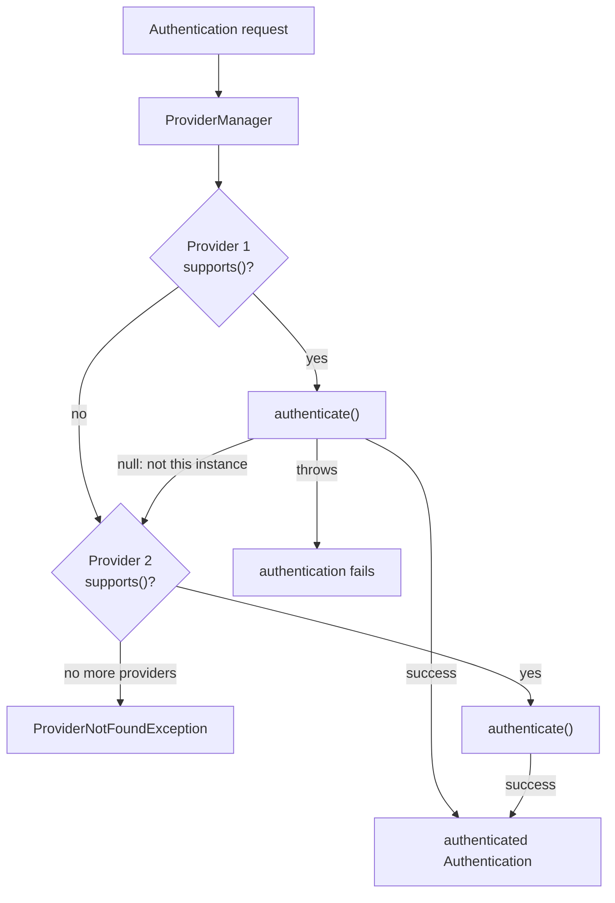

## Objective

Understand the two contracts that sit underneath every authentication attempt in
Spring Security — `Authentication`, which represents a request in progress (or a
completed, successful login) and always answers "who is this and are they
authenticated?", and `AuthenticationProvider`, which owns the actual authentication
*logic* behind an `AuthenticationManager` — and the two-method design
(`authenticate()`/`supports()`) that lets several providers coexist and be tried
in turn without any of them needing to know about the others.

## Use Cases

- Supporting more than one credential shape in the same application (username/password
  *and* an SMS code, say) by registering one `AuthenticationProvider` per shape and
  letting the `AuthenticationManager` pick the one that fits.
- Writing a custom `AuthenticationProvider` that still delegates to
  `UserDetailsService` and `PasswordEncoder` internally — custom orchestration,
  standard building blocks — instead of reinventing user lookup and password
  checking from scratch.
- Diagnosing an authentication request that silently fails or a
  `ProviderNotFoundException`: understanding exactly when a provider should return
  `null` versus throw, and how that interacts with the other registered providers.

## Deep Dive

### The `Authentication` interface: representing a request, in progress or done

`Authentication` extends the JDK's own `Principal`, and is the object that flows
through the whole authentication process — before it succeeds, it holds the raw
credentials being checked; after it succeeds, it holds the authenticated identity
and its authorities:

```java
public interface Authentication extends Principal, Serializable {

    Collection<? extends GrantedAuthority> getAuthorities();
    Object getCredentials();
    Object getDetails();
    Object getPrincipal();
    boolean isAuthenticated();
    void setAuthenticated(boolean isAuthenticated)
        throws IllegalArgumentException;
}
```

The three methods worth knowing first:

- `isAuthenticated()` — `false` while the request is still being validated, `true`
  once an `AuthenticationProvider` has confirmed the credentials.
- `getCredentials()` — the secret being checked (a password, most commonly).
- `getAuthorities()` — the permissions granted to the request, populated once
  authentication succeeds.

Extending `Principal` (rather than inventing a parallel concept) is a deliberate
compatibility choice: any code written against the plain Java Security API's
`Principal` already understands half of what an `Authentication` object offers,
which eases migrating existing authentication code onto Spring Security.

### The `AuthenticationProvider` contract: `authenticate()` and `supports()`

```java
public interface AuthenticationProvider {

    Authentication authenticate(Authentication authentication)
        throws AuthenticationException;

    boolean supports(Class<?> authentication);
}
```

`authenticate()` is where the actual logic lives, and it follows three rules:

- Throw `AuthenticationException` (or a subclass, like `BadCredentialsException`)
  if authentication fails outright.
- Return `null` if the `Authentication` object passed in isn't one this provider
  knows how to handle — this is what lets several providers, each built for a
  different credential type, sit side by side.
- Return a fully authenticated `Authentication` instance (`isAuthenticated()` true)
  on success — and, as good practice, one with the password/credential stripped
  out, since it's no longer needed and keeping it around is a needless exposure.

`supports(Class<?> authentication)` is a coarser, cheaper first filter: it answers
"do I handle *this type* of `Authentication` object at all?" before `authenticate()`
is even called. The two checks are deliberately separate — a provider can say yes
to `supports()` (the object is the right *type*) and still return `null` from
`authenticate()` (that specific instance isn't one it can validate), the same way a
lock built for cards might recognize "this is a card" but still reject a card from
a different building.

### One manager, several providers

An `AuthenticationManager` doesn't authenticate anything itself — `ProviderManager`,
its default implementation, holds a list of `AuthenticationProvider`s and delegates
to whichever one claims the request, trying each in turn (the book's own analogy:
a lock that accepts either a keycard or a physical key delegates to whichever
provider understands the object it was handed, and shrugs at neither). A provider
that doesn't recognize the type says so via `supports()` and is skipped; one that
recognizes the type but rejects the specific object returns `null` from
`authenticate()`, and the manager moves on to the next provider. If none of them
succeeds, authentication fails with `ProviderNotFoundException`.



### Writing a custom provider that still uses `UserDetailsService`/`PasswordEncoder`

Implementing `AuthenticationProvider` from scratch doesn't mean abandoning the
existing building blocks — the book's own example wires the standard
`UserDetailsService` and `PasswordEncoder` *into* custom logic, rather than
replacing them:

```java
@Component
public class CustomAuthenticationProvider implements AuthenticationProvider {

    @Autowired
    private UserDetailsService userDetailsService;

    @Autowired
    private PasswordEncoder passwordEncoder;

    @Override
    public Authentication authenticate(Authentication authentication) {
        String username = authentication.getName();
        String password = authentication.getCredentials().toString();

        UserDetails u = userDetailsService.loadUserByUsername(username);

        if (passwordEncoder.matches(password, u.getPassword())) {
            return new UsernamePasswordAuthenticationToken(
                username, password, u.getAuthorities());
        } else {
            throw new BadCredentialsException("Something went wrong!");
        }
    }

    @Override
    public boolean supports(Class<?> authenticationType) {
        return authenticationType
            .equals(UsernamePasswordAuthenticationToken.class);
    }
}
```

`supports()` narrows this provider to standard username/password requests
(`UsernamePasswordAuthenticationToken`, the type produced when nothing custom is
configured at the HTTP-filter level). `authenticate()` loads the user, checks the
password, and either returns a fully authenticated token — authorities included,
ready for the `SecurityContext` — or throws. Marking the class `@Component` is
enough for Spring to find it; how it then gets wired into the provider chain is
covered next.

## Trade-offs

- **`null` vs. throw is a real design decision, not an implementation detail.**
  Returning `null` from `authenticate()` politely defers to the next provider;
  throwing ends the whole authentication attempt immediately. Making `supports()`
  too broad (claiming a type this provider can't really validate) forces it into
  awkward `null` returns instead of a clean "not mine" via `supports()`.
- **Delegating to `UserDetailsService`/`PasswordEncoder` from inside a custom
  provider is usually the better middle ground.** It's tempting to reinvent user
  lookup and password checking once you're already implementing
  `AuthenticationProvider`, but doing so throws away whatever built-in
  `UserDetailsService` implementations (JDBC, LDAP) would otherwise be reusable —
  reach for a fully custom, dependency-free `authenticate()` only when the
  credential shape genuinely isn't username/password (an API key, a signed
  header).
- **One misbehaving provider can mask another.** With several providers
  registered, a bug that makes one throw instead of returning `null` for a type it
  doesn't truly own aborts authentication for every other provider too — the
  manager never gets the chance to try the rest.
- **Book vs. today: registering the provider no longer needs
  `WebSecurityConfigurerAdapter`.** The book plugs `CustomAuthenticationProvider`
  in by overriding `configure(AuthenticationManagerBuilder auth)` on
  `WebSecurityConfigurerAdapter` — a class deprecated in 5.7 and removed since
  Spring Security 6.0 / Spring Boot 3. Today, exposing the provider as a plain
  `@Bean`/`@Component` of type `AuthenticationProvider` (or `UserDetailsService`,
  or `AuthenticationManager`) is enough: per the current Spring Boot reference,
  Spring Boot's security auto-configuration backs off once such a bean exists,
  and `ProviderManager` picks it up automatically — no subclassing, no builder,
  confirmed via the current official Spring Boot and Spring Security docs.
  `AuthenticationManagerBuilder` itself still exists and isn't deprecated as a
  class; it's just no longer the necessary path for this simple case.
- **Book vs. today: `DaoAuthenticationProvider`'s constructor tightened.** Unrelated
  to this book section but relevant to the same chapter's default provider — since
  Spring Security 6.5, `DaoAuthenticationProvider` requires a `UserDetailsService`
  in its constructor; the earlier no-arg constructor and `setUserDetailsService()`
  setter are deprecated (and dropped entirely as of the current 7.x API docs),
  pushing every default-flow setup toward constructor injection instead of
  JavaBean-style configuration.
- **Book vs. today (new capability, not a correction): `Authentication` gained
  `toBuilder()` in Spring Security 7.0**, returning an `Authentication.Builder`
  that can mutate credentials/details/principal/authorities and derive a new,
  authenticated instance from an existing one — something the book's 2020-era
  contract didn't offer and couldn't have described.

## Documentation Links

- Laurențiu Spilcă, "Spring Security in Action" (Manning, 2020) — Chapter 5, "Implementing authentication", section 5.1, p. 104-112 — doc
- [Spring Security Reference — Authentication Architecture](https://docs.spring.io/spring-security/reference/servlet/authentication/architecture.html) — doc
- [Spring Security API — AuthenticationProvider](https://docs.spring.io/spring-security/reference/api/java/org/springframework/security/authentication/AuthenticationProvider.html) — doc
- [Spring Security API — Authentication](https://docs.spring.io/spring-security/reference/api/java/org/springframework/security/core/Authentication.html) — doc
