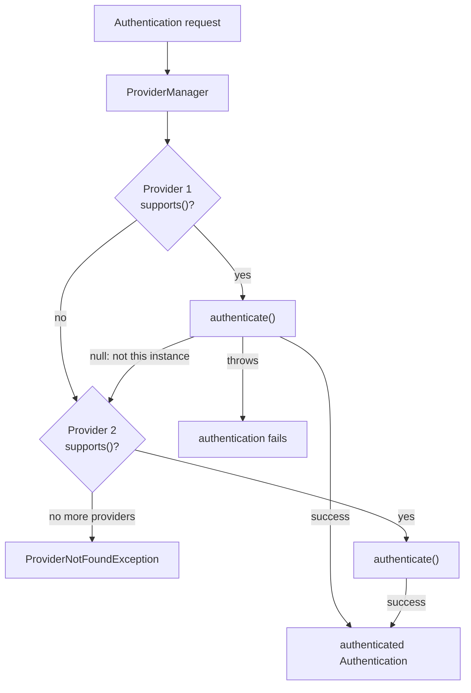

## Objective

Entender os dois contratos que ficam por baixo de toda tentativa de
autenticação no Spring Security — `Authentication`, que representa uma
requisição em andamento (ou um login completo e bem-sucedido) e sempre
responde "quem é esse e está autenticado?", e `AuthenticationProvider`, que
possui a *lógica* real de autenticação por trás de um `AuthenticationManager`
— e o design de dois métodos (`authenticate()`/`supports()`) que permite que
vários providers coexistam e sejam tentados em sequência sem que nenhum deles
precise saber dos outros.

## Use Cases

- Suportar mais de um formato de credencial na mesma aplicação (usuário/senha
  *e* um código por SMS, digamos) registrando um `AuthenticationProvider` por
  formato e deixando o `AuthenticationManager` escolher o que se encaixa.
- Escrever um `AuthenticationProvider` customizado que ainda delega para
  `UserDetailsService` e `PasswordEncoder` internamente — orquestração
  customizada, blocos de construção padrão — em vez de reinventar a busca de
  usuário e a verificação de senha do zero.
- Diagnosticar uma requisição de autenticação que falha silenciosamente ou
  uma `ProviderNotFoundException`: entender exatamente quando um provider
  deve retornar `null` em vez de lançar exceção, e como isso interage com os
  outros providers registrados.

## Deep Dive

### A interface `Authentication`: representando uma requisição, em andamento ou concluída

`Authentication` estende o próprio `Principal` do JDK, e é o objeto que
percorre todo o processo de autenticação — antes de ter sucesso, ele carrega
as credenciais brutas sendo verificadas; depois de ter sucesso, carrega a
identidade autenticada e suas authorities:

```java
public interface Authentication extends Principal, Serializable {

    Collection<? extends GrantedAuthority> getAuthorities();
    Object getCredentials();
    Object getDetails();
    Object getPrincipal();
    boolean isAuthenticated();
    void setAuthenticated(boolean isAuthenticated)
        throws IllegalArgumentException;
}
```

Os três métodos que vale conhecer primeiro:

- `isAuthenticated()` — `false` enquanto a requisição ainda está sendo
  validada, `true` assim que um `AuthenticationProvider` confirma as
  credenciais.
- `getCredentials()` — o segredo sendo verificado (uma senha, na maioria das
  vezes).
- `getAuthorities()` — as permissões concedidas à requisição, preenchidas
  assim que a autenticação tem sucesso.

Estender `Principal` (em vez de inventar um conceito paralelo) é uma escolha
deliberada de compatibilidade: qualquer código escrito contra o `Principal`
puro da API de Security do Java já entende metade do que um objeto
`Authentication` oferece, o que facilita migrar código de autenticação
existente para o Spring Security.

### O contrato `AuthenticationProvider`: `authenticate()` e `supports()`

```java
public interface AuthenticationProvider {

    Authentication authenticate(Authentication authentication)
        throws AuthenticationException;

    boolean supports(Class<?> authentication);
}
```

`authenticate()` é onde a lógica de fato mora, e segue três regras:

- Lançar `AuthenticationException` (ou uma subclasse, como
  `BadCredentialsException`) se a autenticação falhar de vez.
- Retornar `null` se o objeto `Authentication` recebido não é um que esse
  provider saiba tratar — é isso que permite vários providers, cada um
  construído para um tipo diferente de credencial, coexistirem lado a lado.
- Retornar uma instância `Authentication` totalmente autenticada
  (`isAuthenticated()` true) em caso de sucesso — e, como boa prática, uma em
  que a senha/credencial foi removida, já que não é mais necessária e mantê-la
  por perto é uma exposição desnecessária.

`supports(Class<?> authentication)` é um filtro inicial mais grosseiro e mais
barato: responde "eu trato *esse tipo* de objeto `Authentication` de
alguma forma?" antes mesmo de `authenticate()` ser chamado. As duas
verificações são deliberadamente separadas — um provider pode dizer sim para
`supports()` (o objeto é do *tipo* certo) e ainda assim retornar `null` de
`authenticate()` (essa instância específica não é uma que ele consiga
validar), da mesma forma que uma fechadura feita para cartões pode reconhecer
"isto é um cartão" mas ainda assim rejeitar um cartão de um prédio diferente.

### Um manager, vários providers

Um `AuthenticationManager` não autentica nada sozinho — `ProviderManager`,
sua implementação padrão, mantém uma lista de `AuthenticationProvider`s e
delega para o que quer que reivindique a requisição, tentando cada um em
sequência (a analogia do próprio livro: uma fechadura que aceita tanto um
cartão-chave quanto uma chave física delega para o provider que entender o
objeto que recebeu, e ignora nenhum dos dois se não reconhecer nenhum
formato). Um provider que não reconhece o tipo diz isso via `supports()` e é
pulado; um que reconhece o tipo mas rejeita o objeto específico retorna
`null` de `authenticate()`, e o manager segue para o próximo provider. Se
nenhum deles tiver sucesso, a autenticação falha com
`ProviderNotFoundException`.



### Escrevendo um provider customizado que ainda usa `UserDetailsService`/`PasswordEncoder`

Implementar `AuthenticationProvider` do zero não significa abandonar os
blocos de construção existentes — o próprio exemplo do livro conecta o
`UserDetailsService` e o `PasswordEncoder` padrão *dentro* da lógica
customizada, em vez de substituí-los:

```java
@Component
public class CustomAuthenticationProvider implements AuthenticationProvider {

    @Autowired
    private UserDetailsService userDetailsService;

    @Autowired
    private PasswordEncoder passwordEncoder;

    @Override
    public Authentication authenticate(Authentication authentication) {
        String username = authentication.getName();
        String password = authentication.getCredentials().toString();

        UserDetails u = userDetailsService.loadUserByUsername(username);

        if (passwordEncoder.matches(password, u.getPassword())) {
            return new UsernamePasswordAuthenticationToken(
                username, password, u.getAuthorities());
        } else {
            throw new BadCredentialsException("Something went wrong!");
        }
    }

    @Override
    public boolean supports(Class<?> authenticationType) {
        return authenticationType
            .equals(UsernamePasswordAuthenticationToken.class);
    }
}
```

`supports()` restringe esse provider a requisições padrão de usuário/senha
(`UsernamePasswordAuthenticationToken`, o tipo produzido quando nada
customizado é configurado no nível de filtro HTTP). `authenticate()` busca o
usuário, verifica a senha e ou retorna um token totalmente autenticado —
authorities incluídas, pronto para o `SecurityContext` — ou lança uma
exceção. Marcar a classe como `@Component` já é suficiente para o Spring
encontrá-la; como ela então é conectada na cadeia de providers é o próximo
assunto.

## Trade-offs

- **`null` vs. lançar exceção é uma decisão de design de verdade, não um
  detalhe de implementação.** Retornar `null` de `authenticate()` educadamente
  passa a vez para o próximo provider; lançar exceção encerra toda a
  tentativa de autenticação imediatamente. Deixar `supports()` amplo demais
  (reivindicando um tipo que esse provider não consegue realmente validar)
  o força a retornos `null` estranhos em vez de um "não é meu" limpo via
  `supports()`.
- **Delegar para `UserDetailsService`/`PasswordEncoder` de dentro de um
  provider customizado geralmente é o meio-termo melhor.** É tentador
  reinventar a busca de usuário e a verificação de senha uma vez que você já
  está implementando `AuthenticationProvider`, mas fazer isso joga fora
  quaisquer implementações prontas de `UserDetailsService` (JDBC, LDAP) que
  seriam, de outra forma, reutilizáveis — recorra a um `authenticate()`
  totalmente customizado e sem dependências só quando o formato de credencial
  genuinamente não for usuário/senha (uma API key, um header assinado).
- **Um provider mal comportado pode mascarar outro.** Com vários providers
  registrados, um bug que faz um deles lançar exceção em vez de retornar
  `null` para um tipo que ele não possui de fato aborta a autenticação para
  todos os outros providers também — o manager nunca tem a chance de tentar
  o resto.
- **Book vs. today: registrar o provider não precisa mais de
  `WebSecurityConfigurerAdapter`.** O livro conecta o
  `CustomAuthenticationProvider` sobrescrevendo
  `configure(AuthenticationManagerBuilder auth)` em
  `WebSecurityConfigurerAdapter` — uma classe depreciada na 5.7 e removida
  desde o Spring Security 6.0 / Spring Boot 3. Hoje, expor o provider como um
  `@Bean`/`@Component` simples do tipo `AuthenticationProvider` (ou
  `UserDetailsService`, ou `AuthenticationManager`) já é suficiente: segundo a
  referência atual do Spring Boot, a autoconfiguração de segurança do Spring
  Boot recua assim que um bean desses existe, e o `ProviderManager` o assume
  automaticamente — sem subclasses, sem builder, confirmado pela
  documentação oficial atual do Spring Boot e do Spring Security. O
  `AuthenticationManagerBuilder` em si ainda existe e não está depreciado
  como classe; só não é mais o caminho necessário para esse caso simples.
- **Book vs. today: o construtor de `DaoAuthenticationProvider` ficou mais
  rígido.** Sem relação com esta seção do livro, mas relevante para o mesmo
  capítulo e o provider padrão — desde o Spring Security 6.5,
  `DaoAuthenticationProvider` exige um `UserDetailsService` em seu construtor;
  o construtor sem argumentos e o setter `setUserDetailsService()` anteriores
  estão depreciados (e totalmente removidos a partir da documentação atual da
  API 7.x), empurrando toda configuração de fluxo padrão para injeção via
  construtor em vez de configuração estilo JavaBean.
- **Book vs. today (capacidade nova, não uma correção): `Authentication`
  ganhou `toBuilder()` no Spring Security 7.0**, retornando um
  `Authentication.Builder` que pode alterar credenciais/detalhes/principal/
  authorities e derivar uma nova instância autenticada a partir de uma
  existente — algo que o contrato do livro, de 2020, não oferecia e nem
  poderia ter descrito.

## Documentation Links

- Laurențiu Spilcă, "Spring Security in Action" (Manning, 2020) — Chapter 5, "Implementing authentication", section 5.1, p. 104-112 — doc
- [Spring Security Reference — Authentication Architecture](https://docs.spring.io/spring-security/reference/servlet/authentication/architecture.html) — doc
- [Spring Security API — AuthenticationProvider](https://docs.spring.io/spring-security/reference/api/java/org/springframework/security/authentication/AuthenticationProvider.html) — doc
- [Spring Security API — Authentication](https://docs.spring.io/spring-security/reference/api/java/org/springframework/security/core/Authentication.html) — doc
