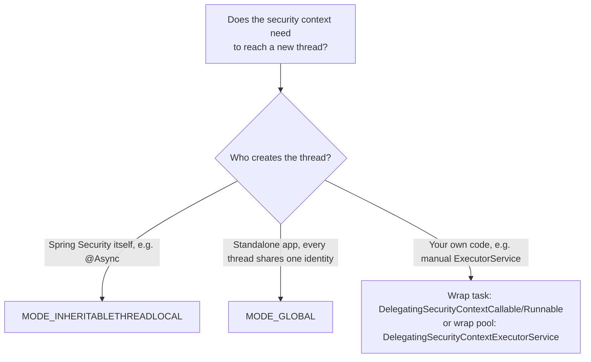

## Objective

Assim que o `AuthenticationManager` termina de autenticar uma requisição,
esse resultado precisa morar em algum lugar que o resto da requisição —
controllers, services, qualquer coisa downstream — consiga ler de volta. O
Spring Security chama esse lugar de *security context*, e o
`SecurityContextHolder` é o objeto responsável por armazená-lo e devolvê-lo.
A parte interessante não é o armazenamento em si, é *qual thread* consegue
enxergá-lo: o comportamento padrão isola o contexto de cada requisição na
sua própria thread, o que é exatamente certo para um ciclo normal de
requisição/resposta e exatamente errado no momento em que uma tarefa é
repassada para outra thread (`@Async`, um `ExecutorService` manual, um job
agendado).

## Use Cases

- Ler o nome/authorities do usuário atualmente autenticado a partir de
  qualquer componente alcançado durante uma requisição, sem precisar
  encadear o objeto `Authentication` por toda chamada de método como
  parâmetro.
- Fazer um método `@Async` enxergar a mesma `Authentication` da requisição
  que o disparou, em vez de bater numa `NullPointerException` por uma
  `Authentication` `null`.
- Rodar threads em background/self-managed (um `ExecutorService` criado
  manualmente, um thread pool que seu próprio código possui) que ainda
  precisam saber quem foi o autor original da chamada.
- Decidir, para uma aplicação standalone (não web), se toda thread deve
  compartilhar um único security context global em vez de isolamento por
  thread.

## Deep Dive



### O contrato `SecurityContext` e sua morada padrão: `MODE_THREADLOCAL`

```java
public interface SecurityContext extends Serializable {

    Authentication getAuthentication();
    void setAuthentication(Authentication authentication);
}
```

O `SecurityContextHolder` gerencia instâncias desse contrato via uma de três
estratégias. A padrão, `MODE_THREADLOCAL`, o apoia no próprio `ThreadLocal`
do JDK: cada thread enxerga só o seu próprio security context, então numa
aplicação servlet padrão de thread-por-requisição, a identidade autenticada
de cada requisição fica isolada de toda outra requisição concorrente
automaticamente, sem nenhuma configuração:

```java
@GetMapping("/hello")
public String hello() {
    SecurityContext context = SecurityContextHolder.getContext();
    Authentication a = context.getAuthentication();
    return "Hello, " + a.getName() + "!";
}
```

O Spring também consegue injetar a `Authentication` diretamente como
parâmetro de método, pulando por completo a chamada explícita a
`SecurityContextHolder.getContext()`:

```java
@GetMapping("/hello")
public String hello(Authentication a) {
    return "Hello, " + a.getName() + "!";
}
```

### Onde `MODE_THREADLOCAL` quebra: uma thread nova tem contexto vazio

O isolamento via `ThreadLocal` é uma vantagem para requisições concorrentes e
um problema no momento em que uma requisição gera uma segunda thread. Um
método `@Async` roda numa thread que o web container não criou para essa
requisição, então ele começa com seu próprio security context vazio:

```java
@GetMapping("/bye")
@Async
public void goodbye() {
    SecurityContext context = SecurityContextHolder.getContext();
    String username = context.getAuthentication().getName();
    // throws NullPointerException — the async thread's context is empty
}
```

### Corrigindo o `@Async`: `MODE_INHERITABLETHREADLOCAL`

Trocar de estratégia diz ao Spring Security para copiar o contexto da thread
pai para qualquer thread nova que *o próprio framework criar* (um método
`@Async`, concretamente):

```java
@Configuration
@EnableAsync
public class ProjectConfig {

    @Bean
    public InitializingBean initializingBean() {
        return () -> SecurityContextHolder.setStrategyName(
            SecurityContextHolder.MODE_INHERITABLETHREADLOCAL);
    }
}
```

Com essa estratégia ativa, o mesmo método `@Async` acima enxerga uma
`Authentication` preenchida em vez de `null`. A estratégia só ajuda quando o
próprio Spring Security é quem cria a thread nova — não faz nada para
threads que seu próprio código cria, o que é um problema separado abordado
mais abaixo.

### `MODE_GLOBAL`: um contexto para toda thread (só para apps standalone)

Uma terceira estratégia faz toda thread da aplicação compartilhar a mesmíssima
instância de security context:

```java
@Bean
public InitializingBean initializingBean() {
    return () -> SecurityContextHolder.setStrategyName(
        SecurityContextHolder.MODE_GLOBAL);
}
```

Isso se encaixa numa aplicação standalone (não web), onde não existe, de
saída, uma noção significativa de "uma requisição, uma identidade" para
isolar. É um mau encaixe para um servidor web backend: toda requisição
concorrente enxergaria e poderia alterar o mesmo `SecurityContext`
compartilhado e não thread-safe, o que é uma condição de corrida esperando
para acontecer, não uma conveniência.

### Threads self-managed: `DelegatingSecurityContextCallable`/`Runnable`

Nem `MODE_INHERITABLETHREADLOCAL` nem `MODE_GLOBAL` ajudam quando é o
*próprio código da aplicação* que cria uma thread que o framework não
conhece — um `ExecutorService` construído manualmente, por exemplo:

```java
@GetMapping("/ciao")
public String ciao() throws Exception {
    Callable<String> task = () -> {
        SecurityContext context = SecurityContextHolder.getContext();
        return context.getAuthentication().getName();
    };

    ExecutorService e = Executors.newCachedThreadPool();
    try {
        return "Ciao, " + e.submit(task).get() + "!";
    } finally {
        e.shutdown();
    }
}
```

Como está escrito, isso lança uma `NullPointerException` — a thread do pool
nunca foi informada sobre o contexto da requisição. Envolver a tarefa num
`DelegatingSecurityContextCallable` (ou `DelegatingSecurityContextRunnable`
para uma tarefa sem retorno) copia o security context da thread chamadora
para a própria tarefa, que passa a viajar com ela independentemente de qual
thread finalmente a executa:

```java
ExecutorService e = Executors.newCachedThreadPool();
try {
    var contextTask = new DelegatingSecurityContextCallable<>(task);
    return "Ciao, " + e.submit(contextTask).get() + "!";
} finally {
    e.shutdown();
}
```

### Propagando a partir do pool em vez da tarefa: `DelegatingSecurityContextExecutorService`

A alternativa a decorar cada tarefa individualmente é decorar o próprio
executor uma única vez — a tarefa continua sendo um `Callable` comum, e o
executor decorado cuida da propagação do contexto para toda tarefa que ele
executa:

```java
ExecutorService e = Executors.newCachedThreadPool();
e = new DelegatingSecurityContextExecutorService(e);
try {
    return "Hola, " + e.submit(task).get() + "!";
} finally {
    e.shutdown();
}
```

O Spring Security oferece a mesma ideia em diferentes níveis da hierarquia
de `Executor`: `DelegatingSecurityContextExecutor` (envolve a interface
`Executor` simples), `DelegatingSecurityContextExecutorService` (envolve
`ExecutorService`), e `DelegatingSecurityContextScheduledExecutorService`
(envolve `ScheduledExecutorService`, para tarefas agendadas) — escolha o que
combina com o tipo de executor já em uso em vez de decorar cada tarefa
submetida na mão.

## Trade-offs

- **O isolamento por thread do `MODE_THREADLOCAL` é exatamente o que um
  servidor web quer, e exatamente o que quebra no momento em que uma segunda
  thread entra em cena.** Não precisa de nenhuma configuração para o caso
  comum, mas qualquer repasse para outra thread — `@Async`, um pool manual,
  um job agendado — começa com um contexto vazio a menos que um dos outros
  mecanismos deste conceito seja usado.
- **`MODE_INHERITABLETHREADLOCAL` só cobre threads que o próprio Spring
  Security cria.** Resolve o `@Async` de forma limpa, mas não faz nada,
  silenciosamente, para uma thread que seu próprio código inicia — esse caso
  precisa dos decoradores `DelegatingSecurityContext*` em vez disso, e usar
  a ferramenta errada produz a mesma `NullPointerException` de qualquer
  jeito.
- **`MODE_GLOBAL` troca isolamento por requisição por estado compartilhado e
  mutável.** Toda thread lendo e escrevendo na mesma instância de
  `SecurityContext` é apropriado para uma aplicação standalone sem
  requisições concorrentes e independentes para manter separadas — num
  servidor web, a mesma propriedade vira uma condição de corrida, já que o
  próprio `SecurityContext` é documentado como não thread-safe.
- **Decorar a tarefa vs. decorar o executor é uma escolha de "onde você quer
  que a responsabilidade more", não uma diferença de correção.**
  `DelegatingSecurityContextCallable` acopla a propagação a cada ponto de
  chamada; `DelegatingSecurityContextExecutorService` centraliza isso uma
  única vez, no pool — o segundo escala melhor quando muitos pontos de
  chamada submetem para o mesmo pool, já que nenhum deles precisa se lembrar
  de envolver sua tarefa.
- **Book vs. today: definir a estratégia via
  `SecurityContextHolder.setStrategyName()` ainda é válido mas não é mais o
  caminho de customização primeiro recomendado.** Desde o Spring Security
  5.8, a documentação de referência recomenda publicar um bean
  `SecurityContextHolderStrategy` no contexto da aplicação em vez de
  depender da estratégia estática e por classloader do
  `SecurityContextHolder` — a documentação observa que o acesso estático
  "pode criar condições de corrida quando há vários contextos de aplicação
  que querem especificar o `SecurityContextHolderStrategy`", já que o
  `SecurityContextHolder` mantém uma estratégia por classloader em vez de
  uma por contexto de aplicação. Componentes agora podem fazer autowire de
  um `SecurityContextHolderStrategy` e chamar métodos de instância
  (`createEmptyContext()`, `setContext()`) nele em vez das chamadas estáticas
  `SecurityContextHolder.getContext()`/`setContext()` que o livro usa por
  toda essa seção — confirmado pela referência atual do Spring Security.
  Isso é um "caminho novo recomendado adicionado depois", não uma remoção:
  toda constante `MODE_*` e a API estática que o livro demonstra continuam
  funcionando exatamente como descrito.

## Documentation Links

- Laurențiu Spilcă, "Spring Security in Action" (Manning, 2020) — Chapter 5, "Implementing authentication", section 5.2, p. 113-124 — doc
- [Spring Security Reference — Servlet Authentication Architecture (SecurityContextHolder)](https://docs.spring.io/spring-security/reference/servlet/authentication/architecture.html) — doc
- [Spring Security Reference — Authentication Persistence and Session Management (SecurityContextHolderStrategy)](https://docs.spring.io/spring-security/reference/servlet/authentication/session-management.html) — doc
- [Spring Security API — SecurityContextHolderStrategy](https://docs.spring.io/spring-security/site/docs/current/api/org/springframework/security/core/context/SecurityContextHolderStrategy.html) — doc
