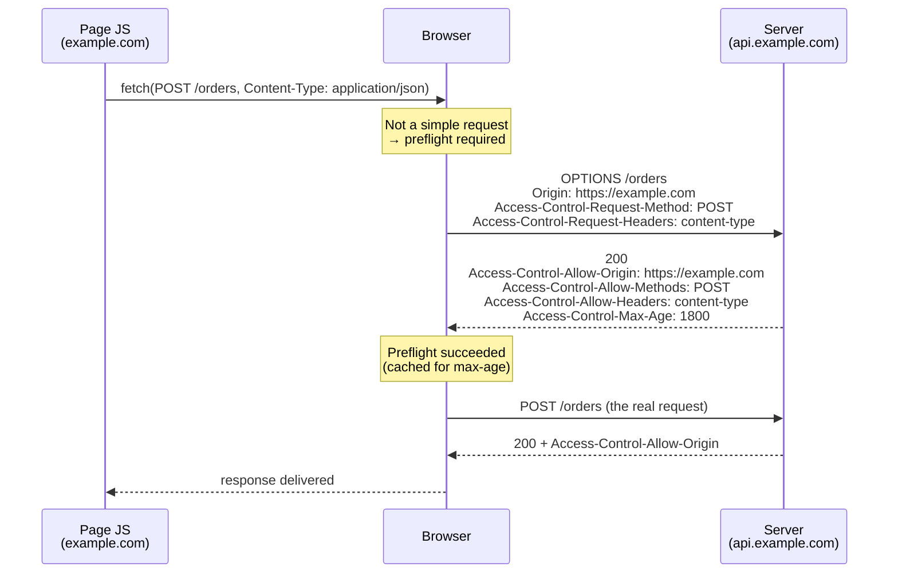

## Objective

Understand what cross-origin resource sharing (CORS) actually is — a browser-side mechanism that *relaxes* the same-origin policy, not a server-side restriction that protects endpoints — and how to configure it in a Spring application two ways: per endpoint with the Spring MVC `@CrossOrigin` annotation, or centrally on the `SecurityFilterChain` with `http.cors(...)` plus a `CorsConfigurationSource`. The book's biggest lesson here is counterintuitive and still true today: a cross-origin call that the browser refuses to *show* to JavaScript may already have *executed* on the server.

## Use Cases

- A separate frontend (Angular, React, Vue) served from `example.com` calling a backend REST API at `api.example.com` — the canonical modern split that makes CORS unavoidable.
- Local development where the dev server runs on `http://localhost:5173` and the API on `http://localhost:8080` — different ports mean different origins, so the browser blocks the calls until CORS is configured.
- Opening exactly one endpoint to one external partner domain while keeping every other endpoint same-origin only, using `@CrossOrigin` on that single handler method.
- Debugging a `No 'Access-Control-Allow-Origin' header is present on the requested resource` console error, or a preflight `OPTIONS` request returning `401` because Spring Security rejected it before any CORS logic ran.
- Auditing a config that "fixed CORS" with `allowedOrigins("*")` and deciding whether it needs `allowedOriginPatterns` instead (mandatory once credentials are involved).

## Deep Dive

### The same-origin policy, and what CORS relaxes

By default a browser does not let a page loaded from one origin make requests to a different origin. An *origin* is the triple scheme + host + port, and the comparison is a string comparison — the book's demo exploits exactly this by loading the page from `http://localhost:8080` and having its JavaScript call `http://127.0.0.1:8080/test`. Those resolve to the same machine, but the browser sees two different origin strings and treats the call as cross-origin.

The mechanism runs entirely on HTTP response headers. The three the book highlights:

- `Access-Control-Allow-Origin` — which foreign origins may read responses from your domain.
- `Access-Control-Allow-Methods` — which HTTP verbs those origins may use.
- `Access-Control-Allow-Headers` — which request headers they may set.

With Spring Security on the classpath and nothing configured, **none of these headers are added**, so every cross-origin call fails in the browser.

### Without CORS configuration, the endpoint still runs

This is the part the book is emphatic about. Given a plain controller:

```java
@RestController
public class MainController {

  private static final Logger logger = Logger.getLogger(MainController.class.getName());

  @PostMapping("/test")
  public String test() {
    logger.info("Test method called");
    return "HELLO";
  }
}
```

and a page on a different origin doing `fetch("http://127.0.0.1:8080/test", { method: "POST" })`, the browser console shows:

```
Access to fetch at 'http://127.0.0.1:8080/test' from origin 'http://localhost:8080'
has been blocked by CORS policy: No 'Access-Control-Allow-Origin' header is present
on the requested resource.
```

but the *application* log shows:

```
INFO 25020 --- [nio-8080-exec-2] c.l.s.controllers.MainController : Test method called
```

The request reached the server and the method executed. The browser simply refused to hand the response back to the calling script. Spilcă's framing is the one to remember: developers routinely file CORS next to authorization and CSRF protection as a "restriction", when it is the opposite — it relaxes a rigid browser constraint. It guarantees only that origins you have not allowed cannot *read* responses from pages running in a browser. It is not endpoint security; authentication and authorization still are (see the companion concept on the authentication architecture and `SecurityFilterChain`).

### Simple requests vs. preflight `OPTIONS`

Sometimes the browser does not send the original request at all. First it sends a *preflight* request with the `OPTIONS` method to ask whether the real request would be allowed; if the preflight fails, the real request is never attempted. Deciding whether to preflight is entirely the browser's job — you never implement it.

A request skips preflight only if it is a *simple* request: method `GET`, `HEAD`, or `POST`; only CORS-safelisted headers set by the script (`Accept`, `Accept-Language`, `Content-Language`, `Content-Type`, `Range`); and if `Content-Type` is present, one of `application/x-www-form-urlencoded`, `multipart/form-data`, `text/plain`. Anything else — a `PUT`, a `DELETE`, an `Authorization` header, or the ubiquitous `Content-Type: application/json` — triggers a preflight. That last one is why virtually every real JSON API sees `OPTIONS` traffic.



If the preflight response lacks the matching headers, the browser stops there and the real request never fires — which is the one case where CORS *does* prevent the endpoint from running.

### `@CrossOrigin`: per-endpoint policies

`@CrossOrigin` is a Spring MVC annotation (`org.springframework.web.bind.annotation`, since 4.2), not a Spring Security one. It goes on a handler method or on the controller type:

```java
@PostMapping("/test")
@CrossOrigin("http://localhost:8080")
public String test() {
  logger.info("Test method called");
  return "HELLO";
}
```

`value` is an alias for `origins` and takes an array, so multiple origins are fine, and `allowedHeaders` / `methods` narrow the policy further:

```java
@CrossOrigin(
    origins = { "https://example.com", "https://example.org" },
    methods = { RequestMethod.GET, RequestMethod.POST },
    allowedHeaders = "Content-Type",
    maxAge = 3600)
@GetMapping("/{id}")
public Account retrieve(@PathVariable Long id) { /* ... */ }
```

At class level it applies to every handler in the controller, and a method-level annotation combines with it — additively for list-valued attributes (origins, headers, methods), while single-valued attributes like `allowCredentials` and `maxAge` declared locally *override* the global value:

```java
@CrossOrigin(maxAge = 3600)
@RestController
@RequestMapping("/account")
public class AccountController {

  @CrossOrigin("https://domain2.com")   // narrows origins for this method only
  @GetMapping("/{id}")
  public Account retrieve(@PathVariable Long id) { /* ... */ }

  @DeleteMapping("/{id}")               // inherits class-level policy
  public void remove(@PathVariable Long id) { /* ... */ }
}
```

Bare `@CrossOrigin` with no attributes is permissive by design: all origins, all requested headers, all HTTP methods the handler is mapped to, `maxAge` 1800 seconds, and `allowCredentials` **not** enabled.

### Centralized CORS on the `SecurityFilterChain`

The alternative is to declare the policy once. `HttpSecurity#cors` takes a `Customizer<CorsConfigurer>`, and the configurer wants a `CorsConfigurationSource` — a functional interface returning a `CorsConfiguration` per request:

```java
@Configuration
@EnableWebSecurity
public class WebSecurityConfig {

  @Bean
  public SecurityFilterChain filterChain(HttpSecurity http) throws Exception {
    http
        .cors(cors -> cors.configurationSource(corsConfigurationSource()))
        .csrf(csrf -> csrf.disable())
        .authorizeHttpRequests(authorize -> authorize
            .anyRequest().permitAll());
    return http.build();
  }

  private CorsConfigurationSource corsConfigurationSource() {
    CorsConfiguration config = new CorsConfiguration();
    config.setAllowedOrigins(List.of("https://example.com", "https://example.org"));
    config.setAllowedMethods(List.of("GET", "POST", "PUT", "DELETE"));

    UrlBasedCorsConfigurationSource source = new UrlBasedCorsConfigurationSource();
    source.registerCorsConfiguration("/**", config);
    return source;
  }
}
```

A fresh `CorsConfiguration` permits nothing — the javadoc is explicit that it "does not permit any cross-origin requests and must be configured explicitly". Setting only the origins is the classic incomplete config: with `allowedMethods` unset, *only* `GET` and `HEAD` are allowed, so the book's `POST /test` example stays broken. (The book states a `CorsConfiguration` "doesn't define any methods by default", which is right in spirit; the precise current behaviour is the GET/HEAD fallback.) `config.applyPermitDefaultValues()` flips to permissive defaults in one call, useful for a quick local spike and nothing else.

Registering the bean as a `UrlBasedCorsConfigurationSource` named `corsConfigurationSource` lets you drop the explicit `configurationSource(...)` call entirely — `CorsConfigurer` looks up a `corsFilter` bean first, then a `corsConfigurationSource` bean:

```java
@Bean
UrlBasedCorsConfigurationSource corsConfigurationSource() {
  CorsConfiguration configuration = new CorsConfiguration();
  configuration.setAllowedOrigins(List.of("https://example.com"));
  configuration.setAllowedMethods(List.of("GET", "POST"));
  UrlBasedCorsConfigurationSource source = new UrlBasedCorsConfigurationSource();
  source.registerCorsConfiguration("/**", configuration);
  return source;
}
```

With more than one `CorsConfigurationSource` bean, the auto-wiring backs off (it cannot pick) and each chain must name its own source — one per `securityMatcher()`-scoped chain:

```java
@Bean
@Order(0)
SecurityFilterChain apiFilterChain(HttpSecurity http) throws Exception {
  http.securityMatcher("/api/**")
      .cors(cors -> cors.configurationSource(apiConfigurationSource()))
      .authorizeHttpRequests(authorize -> authorize.anyRequest().authenticated());
  return http.build();
}
```

### `@CrossOrigin` and `http.cors()` are not independent

If a `@CrossOrigin`-annotated endpoint sits behind Spring Security, the annotation alone is often not enough — the preflight `OPTIONS` request carries no cookies (no `JSESSIONID`), so Spring Security's authorization can reject it with `401` before Spring MVC's handler mapping ever gets to read the annotation. CORS has to be processed *before* Spring Security's authentication and authorization, which is exactly where `CorsFilter` sits in the chain: after `HeaderWriterFilter`, immediately **before** `CsrfFilter`, and well before `BasicAuthenticationFilter`, `UsernamePasswordAuthenticationFilter`, and `AuthorizationFilter`.

The clean combination is `http.cors(Customizer.withDefaults())` with no `CorsConfigurationSource` bean at all. In that case `CorsConfigurer` falls back to the `mvcHandlerMappingIntrospector` bean as its configuration source, so Spring Security's `CorsFilter` answers preflights using whatever Spring MVC knows — including your `@CrossOrigin` annotations and any `WebMvcConfigurer#addCorsMappings` registry:

```java
@Bean
public SecurityFilterChain filterChain(HttpSecurity http) throws Exception {
  http
      .cors(Customizer.withDefaults())      // delegates to Spring MVC's CORS config
      .authorizeHttpRequests(authorize -> authorize
          .anyRequest().authenticated());
  return http.build();
}
```

Note also that `.cors(CorsConfigurer::disable)` does not "turn off CORS" in any useful sense — it removes Spring Security's CORS support, which makes browser errors *more* likely, not fewer.

### CORS is not CSRF

The two get conflated constantly because both involve requests crossing origins, but they point in opposite directions:

- **CORS** relaxes a browser restriction so a *legitimate* foreign origin can read your responses. Its failure mode is a working feature that the browser refuses to display.
- **CSRF protection** defends against a *malicious* foreign page making requests that the server would otherwise accept as genuine, riding on the victim's existing session. Its failure mode is a state-changing request executing without the user's intent.

Neither substitutes for the other, and neither is authorization. See the companion concept on CSRF protection for the token mechanics; the practical intersection is that a CORS policy with `allowCredentials(true)` widens CSRF exposure, because you have just invited another origin to send the session cookie.

### Book vs. today: `configure(HttpSecurity)` → `SecurityFilterChain` bean

The book (2020, Spring Security 5.x) puts the CORS config inside `configure(HttpSecurity)` on a `WebSecurityConfigurerAdapter` subclass, with the `CorsConfigurationSource` written as an inline lambda:

```java
@Configuration
public class ProjectConfig extends WebSecurityConfigurerAdapter {

  @Override
  protected void configure(HttpSecurity http) throws Exception {
    http.cors(c -> {
      CorsConfigurationSource source = request -> {
        CorsConfiguration config = new CorsConfiguration();
        config.setAllowedOrigins(List.of("example.com", "example.org"));
        config.setAllowedMethods(List.of("GET", "POST", "PUT", "DELETE"));
        return config;
      };
      c.configurationSource(source);
    });

    http.csrf().disable();
    http.authorizeRequests().anyRequest().permitAll();
  }
}
```

What changed and what did not:

- **`WebSecurityConfigurerAdapter` is gone** (deprecated in 5.7, removed in 6.0). The container is now a `SecurityFilterChain` `@Bean`, exactly as in the authentication-architecture concept — that is the only structural difference. `http.cors(...)` itself, `CorsConfigurer`, and `configurationSource(...)` are unchanged and current.
- **`CorsConfigurationSource`, `UrlBasedCorsConfigurationSource`, and `CorsConfiguration` are unchanged**, still in `org.springframework.web.cors`. The current Spring Security reference has switched its own examples from a raw lambda source to a `UrlBasedCorsConfigurationSource` bean with `registerCorsConfiguration("/**", config)`, which is the shape to prefer: a bare lambda returns the same config for literally every request, including paths you never meant to open, and it also loses the auto-detection that a properly typed and named bean gives you.
- **`@CrossOrigin` works the same way today**, with the same `value`/`origins`, `allowedHeaders`, `exposedHeaders`, `methods`, `allowCredentials`, and `maxAge` attributes and no deprecations. Two additions since the book: `originPatterns` (5.3) and `allowPrivateNetwork` (5.3.32).
- **`allowedOrigins("*")` is now actively rejected in combination with credentials.** `CorsConfiguration.validateAllowCredentials()` throws `IllegalArgumentException` when `allowCredentials` is `true` and the origin list contains `"*"`; the replacement is `setAllowedOriginPatterns(...)`, which echoes the *matched* origin back in `Access-Control-Allow-Origin` rather than the wildcard, and is therefore legal with credentials. The book's "avoid `*`" advice was a recommendation in 2020 and is a hard constraint now, at least once cookies are in play.
- **The book cites `https://www.w3.org/TR/cors/` for the simple-request rules; that W3C Recommendation is superseded** by the WHATWG Fetch Standard, which defines CORS today. The book's own list ("GET, POST, or OPTIONS") is also off: the methods that can skip preflight are `GET`, `HEAD`, and `POST`, and `OPTIONS` is the preflight method itself, never a simple request. The `Content-Type` restriction — the reason JSON APIs always preflight — is not mentioned in the book at all.
- **New in the current reference: `preFlightRequestHandler(...)`.** `cors(cors -> cors.preFlightRequestHandler(handler))` installs a `PreFlightRequestFilter` instead of `CorsFilter`. It cannot be combined with `configurationSource(...)` — setting both fails at startup.

## Trade-offs

- **CORS is not a security control, and treating it as one is the mistake the book is built around.** Blocking happens in the browser, after your endpoint has usually already executed. Anything that must not run for an untrusted caller needs authorization, not a CORS policy — a `curl` or server-side client ignores CORS entirely.
  ```
  # no Origin header, no browser, no CORS enforcement — the policy is irrelevant here
  curl -X POST http://localhost:8080/test
  ```
- **`@CrossOrigin` gives you transparency at the cost of repetition.** The rule sits next to the endpoint it governs, which reads well; but it gets verbose across many endpoints and — the risk the book calls out explicitly — a developer adding a new endpoint can simply forget it, silently shipping an endpoint the frontend cannot call.
- **Centralized `CorsConfigurationSource` gives you one place to audit at the cost of locality.** Nothing at the endpoint hints that a CORS policy applies, so a `/**` registration quietly covers endpoints added years later. Registering per path pattern rather than one blanket `/**` mitigates this.
- **Wildcards are a bigger liability than they look.** `allowedOrigins("*")` lets any page on the internet script calls against your API from a victim's browser; the book links this to XSS and DDoS exposure and Spilcă says he avoids it even in test environments, on the reasoning that test and production infrastructure are not always as separated as assumed. Today it is additionally illegal alongside `allowCredentials(true)`.
  ```java
  config.setAllowedOriginPatterns(List.of("https://*.example.com"));
  config.setAllowCredentials(true);   // legal: the matched origin is echoed, not "*"
  ```
- **A partial `CorsConfiguration` fails in a confusing way.** Set the origins and forget the methods and only `GET`/`HEAD` are permitted, so a `POST` still fails with the same `Access-Control-Allow-Origin` console error that a total absence of configuration produces — the symptom does not distinguish "no config" from "incomplete config".
- **`allowCredentials(true)` is a trust decision, not a convenience flag.** It sends cookies and authorization headers to the configured origins, exposing session identifiers and CSRF tokens; the Spring documentation words it as establishing "a high level of trust with the configured domains". Enable it only for origins you actually control.
- **Order matters more than configuration style.** Whichever style you pick, CORS must be handled ahead of Spring Security's authentication and authorization, because preflight `OPTIONS` requests carry no credentials. Configuring `@CrossOrigin` while leaving `http.cors(...)` off is the standard way to get preflights answered with `401`.

## Documentation Links

- [Spring Security in Action (Manning, 2020) — Chapter 10, "Applying CSRF protection and CORS", section 10.2, "Using cross-origin resource sharing", p. 235-243](https://www.manning.com/books/spring-security-in-action) — doc
- [Spring Security Reference — CORS](https://docs.spring.io/spring-security/reference/servlet/integrations/cors.html) — doc
- [Spring Framework Reference — CORS (Spring MVC)](https://docs.spring.io/spring-framework/reference/web/webmvc-cors.html) — doc
- [Spring Framework Javadoc — @CrossOrigin](https://docs.spring.io/spring-framework/docs/current/javadoc-api/org/springframework/web/bind/annotation/CrossOrigin.html) — doc
- [Spring Framework Javadoc — CorsConfiguration](https://docs.spring.io/spring-framework/docs/current/javadoc-api/org/springframework/web/cors/CorsConfiguration.html) — doc
- [Spring Security source — CorsConfigurer (filter lookup, preFlightRequestHandler, MVC fallback)](https://github.com/spring-projects/spring-security/blob/main/config/src/main/java/org/springframework/security/config/annotation/web/configurers/CorsConfigurer.java) — doc
- [Spring Security source — FilterOrderRegistration (CorsFilter before CsrfFilter)](https://github.com/spring-projects/spring-security/blob/main/config/src/main/java/org/springframework/security/config/annotation/web/builders/FilterOrderRegistration.java) — doc
- [MDN — Cross-Origin Resource Sharing (CORS)](https://developer.mozilla.org/en-US/docs/Web/HTTP/Guides/CORS) — doc
- [WHATWG Fetch Standard — the current specification defining CORS](https://fetch.spec.whatwg.org/) — doc
