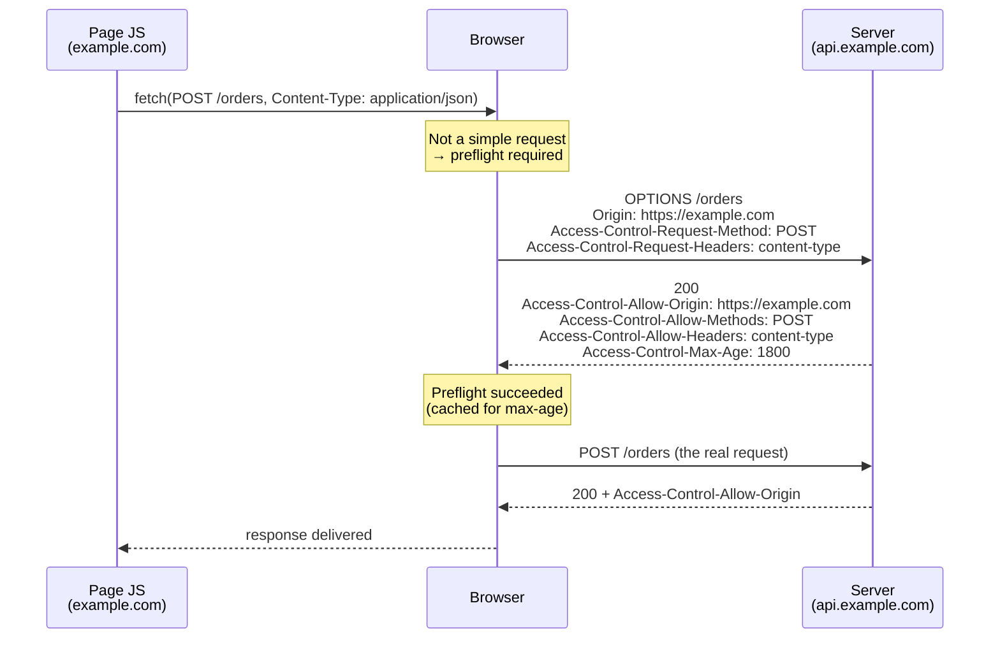

## Objective

Entenda o que cross-origin resource sharing (CORS) realmente é — um
mecanismo do lado do browser que *relaxa* a same-origin policy, não uma
restrição do lado do servidor que protege endpoints — e como configurá-lo
numa aplicação Spring de duas formas: por endpoint com a annotation
`@CrossOrigin` do Spring MVC, ou centralizadamente no `SecurityFilterChain`
com `http.cors(...)` mais um `CorsConfigurationSource`. A maior lição do
livro aqui é contraintuitiva e continua verdadeira hoje: uma chamada
cross-origin que o browser se recusa a *mostrar* ao JavaScript pode já ter
*executado* no servidor.

## Use Cases

- Um frontend separado (Angular, React, Vue) servido a partir de
  `example.com` chamando uma API backend em `api.example.com` — a divisão
  moderna canônica que torna CORS inevitável.
- Desenvolvimento local onde o servidor de dev roda em
  `http://localhost:5173` e a API em `http://localhost:8080` — portas
  diferentes significam origens diferentes, então o browser bloqueia as
  chamadas até que CORS seja configurado.
- Abrir exatamente um endpoint para um domínio parceiro externo mantendo
  todo outro endpoint restrito a same-origin apenas, usando `@CrossOrigin`
  naquele único método handler.
- Debugar um erro no console `No 'Access-Control-Allow-Origin' header is
  present on the requested resource`, ou um preflight `OPTIONS` retornando
  `401` porque o Spring Security o rejeitou antes de qualquer lógica de CORS
  rodar.
- Auditar uma config que "corrigiu o CORS" com `allowedOrigins("*")` e
  decidir se precisa de `allowedOriginPatterns` em vez disso (obrigatório
  assim que credenciais entram em jogo).

## Deep Dive

### A same-origin policy, e o que o CORS relaxa

Por padrão um browser não deixa uma página carregada de uma origem fazer
requests para uma origem diferente. Uma *origem* é a tripla
esquema + host + porta, e a comparação é uma comparação de strings — a demo
do livro explora exatamente isso carregando a página de
`http://localhost:8080` e tendo seu JavaScript chamando
`http://127.0.0.1:8080/test`. Esses resolvem para a mesma máquina, mas o
browser vê duas strings de origem diferentes e trata a chamada como
cross-origin.

O mecanismo roda inteiramente sobre headers de resposta HTTP. Os três que o
livro destaca:

- `Access-Control-Allow-Origin` — quais origens estrangeiras podem ler
  respostas do seu domínio.
- `Access-Control-Allow-Methods` — quais verbos HTTP essas origens podem
  usar.
- `Access-Control-Allow-Headers` — quais headers de request elas podem
  definir.

Com Spring Security no classpath e nada configurado, **nenhum desses
headers é adicionado**, então toda chamada cross-origin falha no browser.

### Sem configuração de CORS, o endpoint ainda roda

Essa é a parte que o livro enfatiza. Dado um controller simples:

```java
@RestController
public class MainController {

  private static final Logger logger = Logger.getLogger(MainController.class.getName());

  @PostMapping("/test")
  public String test() {
    logger.info("Test method called");
    return "HELLO";
  }
}
```

e uma página numa origem diferente fazendo
`fetch("http://127.0.0.1:8080/test", { method: "POST" })`, o console do
browser mostra:

```
Access to fetch at 'http://127.0.0.1:8080/test' from origin 'http://localhost:8080'
has been blocked by CORS policy: No 'Access-Control-Allow-Origin' header is present
on the requested resource.
```

mas o log da *aplicação* mostra:

```
INFO 25020 --- [nio-8080-exec-2] c.l.s.controllers.MainController : Test method called
```

O request chegou ao servidor e o método executou. O browser simplesmente se
recusou a entregar a resposta de volta ao script chamador. O enquadramento
de Spilcă é o que vale a pena lembrar: desenvolvedores rotineiramente
arquivam CORS junto de autorização e proteção CSRF como uma "restrição",
quando é o oposto — ele relaxa uma restrição rígida do browser. Ele só
garante que origens que você não permitiu não conseguem *ler* respostas de
páginas rodando num browser. Não é segurança de endpoint; autenticação e
autorização continuam sendo (veja o conceito complementar sobre a
arquitetura de autenticação e o `SecurityFilterChain`).

### Requests simples vs. preflight `OPTIONS`

Às vezes o browser nem envia o request original. Primeiro ele envia um
request de *preflight* com o método `OPTIONS` para perguntar se o request
real seria permitido; se o preflight falha, o request real nunca é
tentado. Decidir se faz preflight é inteiramente trabalho do browser — você
nunca implementa isso.

Um request pula preflight só se for um request *simples*: método `GET`,
`HEAD`, ou `POST`; apenas headers safelisted por CORS definidos pelo script
(`Accept`, `Accept-Language`, `Content-Language`, `Content-Type`, `Range`);
e se `Content-Type` estiver presente, um de `application/x-www-form-urlencoded`,
`multipart/form-data`, `text/plain`. Qualquer outra coisa — um `PUT`, um
`DELETE`, um header `Authorization`, ou o onipresente
`Content-Type: application/json` — dispara um preflight. Esse último é por
que virtualmente toda API JSON real vê tráfego `OPTIONS`.



Se a resposta do preflight não tem os headers correspondentes, o browser
para ali e o request real nunca dispara — que é o único caso em que CORS
*de fato* impede o endpoint de rodar.

### `@CrossOrigin`: políticas por endpoint

`@CrossOrigin` é uma annotation do Spring MVC
(`org.springframework.web.bind.annotation`, desde a 4.2), não do Spring
Security. Vai num método handler ou no tipo do controller:

```java
@PostMapping("/test")
@CrossOrigin("http://localhost:8080")
public String test() {
  logger.info("Test method called");
  return "HELLO";
}
```

`value` é um alias para `origins` e recebe um array, então múltiplas
origens funcionam bem, e `allowedHeaders` / `methods` restringem a política
ainda mais:

```java
@CrossOrigin(
    origins = { "https://example.com", "https://example.org" },
    methods = { RequestMethod.GET, RequestMethod.POST },
    allowedHeaders = "Content-Type",
    maxAge = 3600)
@GetMapping("/{id}")
public Account retrieve(@PathVariable Long id) { /* ... */ }
```

No nível de classe se aplica a todo handler no controller, e uma annotation
em nível de método se combina com ela — aditivamente para atributos de
lista (origins, headers, methods), enquanto atributos de valor único como
`allowCredentials` e `maxAge` declarados localmente *sobrescrevem* o valor
global:

```java
@CrossOrigin(maxAge = 3600)
@RestController
@RequestMapping("/account")
public class AccountController {

  @CrossOrigin("https://domain2.com")   // narrows origins for this method only
  @GetMapping("/{id}")
  public Account retrieve(@PathVariable Long id) { /* ... */ }

  @DeleteMapping("/{id}")               // inherits class-level policy
  public void remove(@PathVariable Long id) { /* ... */ }
}
```

`@CrossOrigin` sem atributos é permissivo por design: todas as origens,
todos os headers requisitados, todos os métodos HTTP para os quais o
handler está mapeado, `maxAge` de 1800 segundos, e `allowCredentials`
**não** habilitado.

### CORS centralizado no `SecurityFilterChain`

A alternativa é declarar a política uma única vez. `HttpSecurity#cors`
recebe um `Customizer<CorsConfigurer>`, e o configurer quer um
`CorsConfigurationSource` — uma interface funcional que retorna uma
`CorsConfiguration` por request:

```java
@Configuration
@EnableWebSecurity
public class WebSecurityConfig {

  @Bean
  public SecurityFilterChain filterChain(HttpSecurity http) throws Exception {
    http
        .cors(cors -> cors.configurationSource(corsConfigurationSource()))
        .csrf(csrf -> csrf.disable())
        .authorizeHttpRequests(authorize -> authorize
            .anyRequest().permitAll());
    return http.build();
  }

  private CorsConfigurationSource corsConfigurationSource() {
    CorsConfiguration config = new CorsConfiguration();
    config.setAllowedOrigins(List.of("https://example.com", "https://example.org"));
    config.setAllowedMethods(List.of("GET", "POST", "PUT", "DELETE"));

    UrlBasedCorsConfigurationSource source = new UrlBasedCorsConfigurationSource();
    source.registerCorsConfiguration("/**", config);
    return source;
  }
}
```

Uma `CorsConfiguration` recém-criada não permite nada — o javadoc é
explícito que ela "não permite nenhum request cross-origin e precisa ser
configurada explicitamente". Definir só as origens é a config incompleta
clássica: com `allowedMethods` indefinido, *só* `GET` e `HEAD` são
permitidos, então o exemplo `POST /test` do livro continua quebrado. (O
livro afirma que `CorsConfiguration` "não define nenhum método por padrão",
o que está certo em espírito; o comportamento atual preciso é o fallback
GET/HEAD.) `config.applyPermitDefaultValues()` vira para defaults
permissivos numa chamada só, útil para um spike local rápido e nada mais.

Registrar o bean como um `UrlBasedCorsConfigurationSource` nomeado
`corsConfigurationSource` permite dispensar a chamada explícita
`configurationSource(...)` inteiramente — `CorsConfigurer` procura primeiro
por um bean `corsFilter`, depois por um bean `corsConfigurationSource`:

```java
@Bean
UrlBasedCorsConfigurationSource corsConfigurationSource() {
  CorsConfiguration configuration = new CorsConfiguration();
  configuration.setAllowedOrigins(List.of("https://example.com"));
  configuration.setAllowedMethods(List.of("GET", "POST"));
  UrlBasedCorsConfigurationSource source = new UrlBasedCorsConfigurationSource();
  source.registerCorsConfiguration("/**", configuration);
  return source;
}
```

Com mais de um bean `CorsConfigurationSource`, o auto-wiring recua (não
consegue escolher) e cada chain precisa nomear sua própria fonte — uma por
chain com escopo `securityMatcher()`:

```java
@Bean
@Order(0)
SecurityFilterChain apiFilterChain(HttpSecurity http) throws Exception {
  http.securityMatcher("/api/**")
      .cors(cors -> cors.configurationSource(apiConfigurationSource()))
      .authorizeHttpRequests(authorize -> authorize.anyRequest().authenticated());
  return http.build();
}
```

### `@CrossOrigin` e `http.cors()` não são independentes

Se um endpoint anotado com `@CrossOrigin` está atrás do Spring Security, a
annotation sozinha frequentemente não basta — o request de preflight
`OPTIONS` não carrega nenhum cookie (nenhum `JSESSIONID`), então a
autorização do Spring Security pode rejeitá-lo com `401` antes mesmo do
handler mapping do Spring MVC chegar a ler a annotation. CORS precisa ser
processado *antes* da autenticação e autorização do Spring Security, que é
exatamente onde `CorsFilter` fica na chain: depois de `HeaderWriterFilter`,
imediatamente **antes** de `CsrfFilter`, e bem antes de
`BasicAuthenticationFilter`, `UsernamePasswordAuthenticationFilter`, e
`AuthorizationFilter`.

A combinação limpa é `http.cors(Customizer.withDefaults())` sem nenhum bean
`CorsConfigurationSource`. Nesse caso `CorsConfigurer` recua para o bean
`mvcHandlerMappingIntrospector` como sua fonte de configuração, então o
`CorsFilter` do Spring Security responde preflights usando o que quer que o
Spring MVC saiba — incluindo suas annotations `@CrossOrigin` e qualquer
registro `WebMvcConfigurer#addCorsMappings`:

```java
@Bean
public SecurityFilterChain filterChain(HttpSecurity http) throws Exception {
  http
      .cors(Customizer.withDefaults())      // delegates to Spring MVC's CORS config
      .authorizeHttpRequests(authorize -> authorize
          .anyRequest().authenticated());
  return http.build();
}
```

Note também que `.cors(CorsConfigurer::disable)` não "desliga o CORS" de
nenhuma forma útil — remove o suporte a CORS do Spring Security, o que
torna erros no browser *mais* prováveis, não menos.

### CORS não é CSRF

Os dois são confundidos constantemente porque ambos envolvem requests
cruzando origens, mas apontam em direções opostas:

- **CORS** relaxa uma restrição do browser para que uma origem estrangeira
  *legítima* consiga ler suas respostas. Seu modo de falha é uma feature
  funcionando que o browser se recusa a exibir.
- **A proteção CSRF** defende contra uma página estrangeira *maliciosa*
  fazendo requests que o servidor de outra forma aceitaria como genuínos,
  carona na sessão existente da vítima. Seu modo de falha é um request que
  muda estado executando sem a intenção do usuário.

Nenhum substitui o outro, e nenhum é autorização. Veja o conceito
complementar sobre proteção CSRF para a mecânica dos tokens; a interseção
prática é que uma política de CORS com `allowCredentials(true)` amplia a
exposição a CSRF, porque você acabou de convidar outra origem a enviar o
cookie de sessão.

### Livro vs. hoje: `configure(HttpSecurity)` → bean `SecurityFilterChain`

O livro (2020, Spring Security 5.x) coloca a config de CORS dentro de
`configure(HttpSecurity)` numa subclasse de `WebSecurityConfigurerAdapter`,
com o `CorsConfigurationSource` escrito como uma lambda inline:

```java
@Configuration
public class ProjectConfig extends WebSecurityConfigurerAdapter {

  @Override
  protected void configure(HttpSecurity http) throws Exception {
    http.cors(c -> {
      CorsConfigurationSource source = request -> {
        CorsConfiguration config = new CorsConfiguration();
        config.setAllowedOrigins(List.of("example.com", "example.org"));
        config.setAllowedMethods(List.of("GET", "POST", "PUT", "DELETE"));
        return config;
      };
      c.configurationSource(source);
    });

    http.csrf().disable();
    http.authorizeRequests().anyRequest().permitAll();
  }
}
```

O que mudou e o que não mudou:

- **`WebSecurityConfigurerAdapter` sumiu** (deprecated na 5.7, removido na
  6.0). O container agora é um `@Bean` `SecurityFilterChain`, exatamente
  como no conceito de arquitetura de autenticação — essa é a única
  diferença estrutural. `http.cors(...)` em si, `CorsConfigurer`, e
  `configurationSource(...)` estão inalterados e atuais.
- **`CorsConfigurationSource`, `UrlBasedCorsConfigurationSource`, e
  `CorsConfiguration` estão inalterados**, ainda em
  `org.springframework.web.cors`. A referência atual do Spring Security
  trocou seus próprios exemplos de uma fonte lambda crua para um bean
  `UrlBasedCorsConfigurationSource` com `registerCorsConfiguration("/**",
  config)`, que é a forma a preferir: uma lambda pura retorna a mesma
  config para literalmente todo request, incluindo caminhos que você nunca
  pretendeu abrir, e também perde a auto-detecção que um bean devidamente
  tipado e nomeado dá.
- **`@CrossOrigin` funciona da mesma forma hoje**, com os mesmos atributos
  `value`/`origins`, `allowedHeaders`, `exposedHeaders`, `methods`,
  `allowCredentials`, e `maxAge` e nenhuma deprecação. Duas adições desde o
  livro: `originPatterns` (5.3) e `allowPrivateNetwork` (5.3.32).
- **`allowedOrigins("*")` agora é ativamente rejeitado em combinação com
  credenciais.** `CorsConfiguration.validateAllowCredentials()` lança
  `IllegalArgumentException` quando `allowCredentials` é `true` e a lista
  de origens contém `"*"`; o substituto é `setAllowedOriginPatterns(...)`,
  que ecoa a origem *combinada* de volta em `Access-Control-Allow-Origin`
  em vez do wildcard, e portanto é legal com credenciais. O conselho do
  livro de "evite `*`" era uma recomendação em 2020 e é uma restrição
  obrigatória agora, ao menos uma vez que cookies entram em jogo.
- **O livro cita `https://www.w3.org/TR/cors/` para as regras de request
  simples; essa Recommendation do W3C foi substituída** pelo WHATWG Fetch
  Standard, que define CORS hoje. A própria lista do livro ("GET, POST, ou
  OPTIONS") também está errada: os métodos que podem pular preflight são
  `GET`, `HEAD`, e `POST`, e `OPTIONS` é o próprio método de preflight,
  nunca um request simples. A restrição de `Content-Type` — a razão pela
  qual APIs JSON sempre fazem preflight — nem é mencionada no livro.
- **Novo na referência atual: `preFlightRequestHandler(...)`.**
  `cors(cors -> cors.preFlightRequestHandler(handler))` instala um
  `PreFlightRequestFilter` em vez de `CorsFilter`. Não pode ser combinado
  com `configurationSource(...)` — definir os dois falha na inicialização.

## Trade-offs

- **CORS não é um controle de segurança, e tratá-lo como um é o erro em
  torno do qual o livro é construído.** O bloqueio acontece no browser,
  depois que seu endpoint geralmente já executou. Qualquer coisa que não
  deve rodar para um chamador não confiável precisa de autorização, não de
  uma política de CORS — um `curl` ou client do lado do servidor ignora
  CORS completamente.
  ```
  # no Origin header, no browser, no CORS enforcement — the policy is irrelevant here
  curl -X POST http://localhost:8080/test
  ```
- **`@CrossOrigin` dá transparência ao custo de repetição.** A regra fica
  ao lado do endpoint que governa, o que lê bem; mas fica verboso em muitos
  endpoints e — o risco que o livro aponta explicitamente — um
  desenvolvedor adicionando um novo endpoint pode simplesmente esquecê-la,
  entregando silenciosamente um endpoint que o frontend não consegue
  chamar.
- **`CorsConfigurationSource` centralizado dá um lugar único para auditar
  ao custo de localidade.** Nada no endpoint sugere que uma política de
  CORS se aplica, então um registro `/**` cobre silenciosamente endpoints
  adicionados anos depois. Registrar por padrão de caminho em vez de um
  `/**` genérico mitiga isso.
- **Wildcards são uma responsabilidade maior do que parecem.**
  `allowedOrigins("*")` permite que qualquer página na internet faça script
  de chamadas contra sua API a partir do browser de uma vítima; o livro
  liga isso a exposição a XSS e DDoS e Spilcă diz que evita isso mesmo em
  ambientes de teste, com o raciocínio de que infraestrutura de teste e
  produção nem sempre estão tão separadas quanto se assume. Hoje é
  adicionalmente ilegal junto com `allowCredentials(true)`.
  ```java
  config.setAllowedOriginPatterns(List.of("https://*.example.com"));
  config.setAllowCredentials(true);   // legal: the matched origin is echoed, not "*"
  ```
- **Uma `CorsConfiguration` parcial falha de forma confusa.** Defina as
  origens e esqueça os métodos e só `GET`/`HEAD` são permitidos, então um
  `POST` ainda falha com o mesmo erro de console
  `Access-Control-Allow-Origin` que uma ausência total de configuração
  produz — o sintoma não distingue "sem config" de "config incompleta".
- **`allowCredentials(true)` é uma decisão de confiança, não uma
  conveniência.** Ele envia cookies e headers de autorização para as
  origens configuradas, expondo identificadores de sessão e tokens CSRF; a
  documentação do Spring diz isso como estabelecendo "um alto nível de
  confiança com os domínios configurados". Habilite apenas para origens que
  você realmente controla.
- **Ordem importa mais do que estilo de configuração.** Qualquer estilo
  que você escolher, CORS precisa ser tratado antes da autenticação e
  autorização do Spring Security, porque requests de preflight `OPTIONS`
  não carregam credenciais. Configurar `@CrossOrigin` deixando
  `http.cors(...)` desligado é a forma padrão de ter preflights respondidos
  com `401`.

## Documentation Links

- [Spring Security in Action (Manning, 2020) — Chapter 10, "Applying CSRF protection and CORS", section 10.2, "Using cross-origin resource sharing", p. 235-243](https://www.manning.com/books/spring-security-in-action) — doc
- [Spring Security Reference — CORS](https://docs.spring.io/spring-security/reference/servlet/integrations/cors.html) — doc
- [Spring Framework Reference — CORS (Spring MVC)](https://docs.spring.io/spring-framework/reference/web/webmvc-cors.html) — doc
- [Spring Framework Javadoc — @CrossOrigin](https://docs.spring.io/spring-framework/docs/current/javadoc-api/org/springframework/web/bind/annotation/CrossOrigin.html) — doc
- [Spring Framework Javadoc — CorsConfiguration](https://docs.spring.io/spring-framework/docs/current/javadoc-api/org/springframework/web/cors/CorsConfiguration.html) — doc
- [Spring Security source — CorsConfigurer (filter lookup, preFlightRequestHandler, MVC fallback)](https://github.com/spring-projects/spring-security/blob/main/config/src/main/java/org/springframework/security/config/annotation/web/configurers/CorsConfigurer.java) — doc
- [Spring Security source — FilterOrderRegistration (CorsFilter before CsrfFilter)](https://github.com/spring-projects/spring-security/blob/main/config/src/main/java/org/springframework/security/config/annotation/web/builders/FilterOrderRegistration.java) — doc
- [MDN — Cross-Origin Resource Sharing (CORS)](https://developer.mozilla.org/en-US/docs/Web/HTTP/Guides/CORS) — doc
- [WHATWG Fetch Standard — the current specification defining CORS](https://fetch.spec.whatwg.org/) — doc
