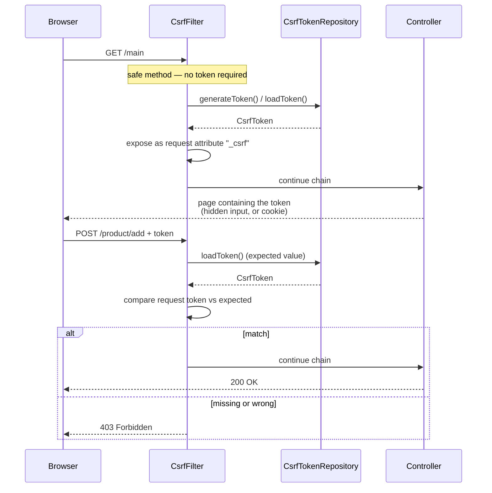

## Objective

Understand why an `@PostMapping` endpoint returns `403 Forbidden` in a fresh Spring Security project even when the caller is authenticated, and what to do about it other than reflexively disabling CSRF. The mechanism is small and worth knowing exactly: `CsrfFilter` sits in the filter chain, lets `GET`/`HEAD`/`TRACE`/`OPTIONS` through untouched, and for every other method demands a token it previously handed the client through a `CsrfTokenRepository`. Everything else — hidden form inputs, cookie-based tokens for single-page apps, excluding a path, storing tokens in a database — is a variation on where that token lives and how the client gets it back.

## Use Cases

- Making a server-rendered form (Thymeleaf, JSP, plain HTML from a controller) submit a `POST` successfully without turning CSRF protection off for the whole application.
- Wiring a JavaScript frontend (Angular, React, Vue) that talks to the same Spring backend: the token has to reach JavaScript, which means a cookie rather than an `HttpSession` attribute.
- Deciding whether an application needs CSRF protection at all — a bearer-token API consumed only by mobile clients and other services is a different situation from a browser app authenticated by a session cookie.
- Excluding one webhook or callback endpoint (`POST /payments/notify`) from CSRF protection while every other mutating path stays protected.
- Replacing session-backed token storage with something horizontally scalable, by implementing `CsrfTokenRepository` yourself.
- Debugging the specific failure mode of "login works but my own `POST` doesn't" — Spring Security's default login form already sends the token; your form does not until you add it.

## Deep Dive

### The attack: an authenticated browser doing someone else's bidding

The book's scenario (p. 214-215): Carlos logs into the accounting application at work, then opens a page on some free-music site in another tab. That page contains forgery code — a script or an auto-submitting form — that issues requests to the accounting application. The browser attaches Carlos's session cookie automatically, because that is what browsers do for requests to that origin, and the server sees a perfectly well-formed authenticated request. Accounts get changed or deleted.

The key property being exploited is *ambient authority*: authentication lives in a cookie the browser sends on its own, so the server cannot tell "the user asked for this from my page" apart from "some other page made the user's browser ask for this". CSRF protection closes that gap by requiring a second credential that a foreign page cannot obtain — because it can't read your application's responses (same-origin policy) and it isn't stored anywhere the browser will attach automatically.

This is also the cleanest way to see why CSRF and CORS are different problems (see the companion `spring-security-cors-configuration` concept). CORS governs whether the browser lets *foreign JavaScript read your response*. CSRF governs whether your server accepts a *mutating request it didn't hand out a token for*. A CSRF attack does not need to read the response at all — deleting the files is the payoff — so relaxing or tightening CORS neither causes nor cures a CSRF vulnerability.

### `CsrfFilter`, `CsrfToken`, `CsrfTokenRepository`

Three pieces, and that is nearly the whole mechanism:

- **`CsrfFilter`** — a filter in the chain. It allows `GET`, `HEAD`, `TRACE`, and `OPTIONS` through unconditionally. For anything else it loads the expected token, compares it with the one in the request, and on mismatch or absence raises an `AccessDeniedException` that surfaces as `403 Forbidden`.
- **`CsrfToken`** — the token contract. Three accessors, unchanged since Spring Security 3.2:
  ```java
  public interface CsrfToken extends Serializable {
      String getHeaderName();     // default: X-CSRF-TOKEN
      String getParameterName();  // default: _csrf
      String getToken();          // the value itself
  }
  ```
  `DefaultCsrfToken` is the built-in immutable implementation.
- **`CsrfTokenRepository`** — creates, stores, and loads tokens. The default is `HttpSessionCsrfTokenRepository`: random UUID values kept in the `HttpSession`.
  ```java
  public interface CsrfTokenRepository {
      CsrfToken generateToken(HttpServletRequest request);
      void saveToken(CsrfToken token, HttpServletRequest request, HttpServletResponse response);
      CsrfToken loadToken(HttpServletRequest request);
      // plus default DeferredCsrfToken loadDeferredToken(request, response) since 5.8
  }
  ```

Because the default repository is session-backed, a `POST` needs *both* the token and the session cookie — the book demonstrates this with curl (p. 220):

```
curl -X POST http://localhost:8080/hello \
  -H 'Cookie: JSESSIONID=21ADA55E10D70BA81C338FFBB06B0206' \
  -H 'X-CSRF-TOKEN: 1127bfda-57b1-43f0-bce5-bacd7d94694e'
# Post Hello!
```

Drop either header and the response is `403`. That pairing is the point: the token proves the request originated from a page the server rendered for *this* session.



### Reading the token: the `_csrf` request attribute

`CsrfFilter` puts the `CsrfToken` on the request as an attribute named `_csrf` (also under `CsrfToken.class.getName()`). Anything positioned *after* `CsrfFilter` in the chain can read it — the book uses that fact to build a debugging filter that logs the token (listing 10.2, p. 218):

```java
public class CsrfTokenLogger implements Filter {

  private final Logger logger = Logger.getLogger(CsrfTokenLogger.class.getName());

  @Override
  public void doFilter(ServletRequest request, ServletResponse response, FilterChain chain)
      throws IOException, ServletException {
    CsrfToken token = (CsrfToken) request.getAttribute("_csrf");
    logger.info("CSRF token " + token.getToken());
    chain.doFilter(request, response);
  }
}
```

```java
@Bean
public SecurityFilterChain filterChain(HttpSecurity http) throws Exception {
  http
      .addFilterAfter(new CsrfTokenLogger(), CsrfFilter.class)
      .authorizeHttpRequests(authorize -> authorize.anyRequest().permitAll());
  return http.build();
}
```

Useful for understanding the flow, not a delivery mechanism — the book is explicit about this (note, p. 219): real clients can't read your server logs. Getting the token to the client is the backend's job, and the next two sections are the two ways to do it.

### Scenario 1: server-rendered form — hidden input

Spring Security's own default login page already sends the token in a hidden input, which is exactly why form login works over `POST` with CSRF enabled and no configuration from you (p. 222). Your own forms get no such courtesy. This form fails with `403`:

```html
<form action="/product/add" method="post">
   <input type="text" name="name" />
   <button type="submit">Add</button>
</form>
```

Adding the token from the `_csrf` request attribute fixes it (listing 10.8, p. 224):

```html
<form action="/product/add" method="post">
   <input type="text" name="name" />
   <button type="submit">Add</button>
   <input type="hidden"
          th:name="${_csrf.parameterName}"
          th:value="${_csrf.token}" />
</form>
```

Thymeleaf is incidental — any template engine that can print a request attribute works, and Thymeleaf's Spring Security integration inserts the hidden input automatically for `th:action` forms. For multi-page apps whose JavaScript issues the mutating calls, the same values are usually rendered into meta tags instead:

```html
<meta name="_csrf" content="${_csrf.token}"/>
<meta name="_csrf_header" content="${_csrf.headerName}"/>
```

### Scenario 2: JavaScript single-page app — token in a cookie

The book stops short here: it observes (p. 225) that token-based CSRF protection "doesn't work well when the client is independent of the backend" and defers the topic to later chapters on OAuth 2. That is the right instinct for a *separately deployed* frontend, but it leaves out the very common middle case — a JavaScript app served by the same Spring backend, authenticated by a session cookie. That case still needs CSRF protection, and Spring Security's answer is `CookieCsrfTokenRepository`: put the expected token in a cookie that JavaScript can read, so the frontend can copy it into a request header.

```java
@Bean
public SecurityFilterChain filterChain(HttpSecurity http) throws Exception {
  http
      .csrf(csrf -> csrf
          .csrfTokenRepository(CookieCsrfTokenRepository.withHttpOnlyFalse()));
  return http.build();
}
```

`withHttpOnlyFalse()` is what makes the cookie readable from JavaScript — necessary here, and a deliberate weakening you should not apply anywhere else. The defaults match Angular's conventions: cookie `XSRF-TOKEN`, header `X-XSRF-TOKEN`, parameter `_csrf`.

Two wrinkles that did not exist when the book was written, both covered in the Book-vs-today section below: the default token handler masks the token value per request, so a cookie-reading client needs a request handler that accepts the unmasked value; and the token cookie is cleared on authentication and logout success, so the client must fetch a fresh one afterwards. As of Spring Security 7.0 both are handled by one call:

```java
http.csrf(csrf -> csrf.spa());
```

For clients that would rather ask for the token explicitly than read a cookie, the reference documentation suggests simply exposing it:

```java
@RestController
public class CsrfController {

  @GetMapping("/csrf")
  public CsrfToken csrf(CsrfToken csrfToken) {
    return csrfToken;
  }
}
```

### Customizing: excluding paths from CSRF protection

By default CSRF protection covers every path reached with a method other than `GET`/`HEAD`/`TRACE`/`OPTIONS`. To exempt specific paths rather than switching protection off globally:

```java
@Bean
public SecurityFilterChain filterChain(HttpSecurity http) throws Exception {
  http
      .csrf(csrf -> csrf
          .ignoringRequestMatchers("/ciao"))
      .authorizeHttpRequests(authorize -> authorize.anyRequest().permitAll());
  return http.build();
}
```

`ignoringRequestMatchers` also takes `RequestMatcher` instances, which is how you exempt by method as well as path:

```java
csrf.ignoringRequestMatchers(
    PathPatternRequestMatcher.pathPattern(HttpMethod.POST, "/webhooks/**"));
```

The other knob on the same configurer is `requireCsrfProtectionMatcher(RequestMatcher)`, which replaces the "everything except the safe methods" rule outright instead of subtracting from it.

### Customizing: your own `CsrfTokenRepository`

Session-backed tokens are stateful, and the book flags this as a scalability problem for applications that need horizontal scaling (p. 228). Implementing `CsrfTokenRepository` lets you put tokens anywhere — the book's example uses a JPA-backed table keyed by a client identifier the client sends in an `X-IDENTIFIER` header, effectively substituting that identifier for the session ID:

```java
public class CustomCsrfTokenRepository implements CsrfTokenRepository {

  private final JpaTokenRepository jpaTokenRepository;

  public CustomCsrfTokenRepository(JpaTokenRepository jpaTokenRepository) {
    this.jpaTokenRepository = jpaTokenRepository;
  }

  @Override
  public CsrfToken generateToken(HttpServletRequest request) {
    return new DefaultCsrfToken("X-CSRF-TOKEN", "_csrf", UUID.randomUUID().toString());
  }

  @Override
  public void saveToken(CsrfToken csrfToken, HttpServletRequest request, HttpServletResponse response) {
    String identifier = request.getHeader("X-IDENTIFIER");
    Optional<Token> existing = jpaTokenRepository.findTokenByIdentifier(identifier);
    if (existing.isPresent()) {
      existing.get().setToken(csrfToken.getToken());
    } else {
      Token token = new Token();
      token.setIdentifier(identifier);
      token.setToken(csrfToken.getToken());
      jpaTokenRepository.save(token);
    }
  }

  @Override
  public CsrfToken loadToken(HttpServletRequest request) {
    String identifier = request.getHeader("X-IDENTIFIER");
    return jpaTokenRepository.findTokenByIdentifier(identifier)
        .map(token -> (CsrfToken) new DefaultCsrfToken("X-CSRF-TOKEN", "_csrf", token.getToken()))
        .orElse(null);
  }
}
```

`loadToken` returning `null` means "no token on record", which `CsrfFilter` treats as a failed check for mutating requests. Plugging it in:

```java
@Bean
public SecurityFilterChain filterChain(HttpSecurity http, CsrfTokenRepository csrfTokenRepository)
    throws Exception {
  http
      .csrf(csrf -> csrf
          .csrfTokenRepository(csrfTokenRepository)
          .ignoringRequestMatchers("/ciao"))
      .authorizeHttpRequests(authorize -> authorize.anyRequest().permitAll());
  return http.build();
}
```

Note what the identifier has to be for this to be secure: the book says it "should be different each time the user logs in", because it plays exactly the role the session ID played. A guessable or long-lived identifier hands an attacker the ability to look up a valid token, which defeats the whole mechanism.

### Book vs. today: same three components, two new defaults, one new shortcut

**The configuration surface moved, the components didn't.** The book configures CSRF inside `configure(HttpSecurity)` on a `WebSecurityConfigurerAdapter` subclass:

```java
@Configuration
public class ProjectConfig extends WebSecurityConfigurerAdapter {

  @Override
  protected void configure(HttpSecurity http) throws Exception {
    http.csrf(c -> {
      c.csrfTokenRepository(customTokenRepository());
      c.ignoringAntMatchers("/ciao");
    });
    http.authorizeRequests().anyRequest().permitAll();
  }
}
```

`WebSecurityConfigurerAdapter` is gone as of Spring Security 6.0; today the same thing is a `SecurityFilterChain` bean (see `spring-security-authentication-architecture` for that migration in general). Notably the book already uses the `csrf(Customizer)` lambda form, so `http.csrf(csrf -> ...)` reads identically — only its container changed. `CsrfFilter`, `CsrfToken`, `CsrfTokenRepository`, `HttpSessionCsrfTokenRepository`, `CookieCsrfTokenRepository`, and `DefaultCsrfToken` all still exist with the same names and the same shapes. The one method that did not survive is `ignoringAntMatchers(String...)`, deprecated in 5.8 alongside the rest of the Ant-matcher family and removed in 6.0; `ignoringRequestMatchers(String...)` (added in 5.8) is the direct replacement and takes the same kind of pattern.

**Default #1 since 6.0: the token is masked per request (BREACH protection).** `CsrfFilter` now delegates exposing and resolving the token to a `CsrfTokenRequestHandler`, and the default implementation is `XorCsrfTokenRequestAttributeHandler`. It XORs fresh randomness into the token value on every request, so the string a page renders differs each time even though the underlying token is stable. The reason is the BREACH attack, which can recover a secret from compressed HTTPS responses when that secret appears verbatim in the body; per-request masking removes the invariant BREACH needs. This is transparent for hidden-input forms — the handler unmasks the `_csrf` parameter on the way in — but it is precisely what breaks a naive cookie setup, because the cookie holds the raw value while the handler expects a masked one. Opting out is a one-liner and a real security downgrade:

```java
http.csrf(csrf -> csrf
    .csrfTokenRequestHandler(new CsrfTokenRequestAttributeHandler())); // no BREACH protection
```

**Default #2 since 6.0: token loading is deferred.** The `CsrfToken` is only materialized when actually needed — a mutating request, or a template reading the `_csrf` attribute — so a plain `GET` no longer forces the `HttpSession` to load. Good for throughput, but it means the token cookie isn't necessarily written on every response. Setting the request-attribute name to `null` restores eager loading:

```java
XorCsrfTokenRequestAttributeHandler handler = new XorCsrfTokenRequestAttributeHandler();
handler.setCsrfRequestAttributeName(null); // load the token on every request
http.csrf(csrf -> csrf.csrfTokenRequestHandler(handler));
```

**The combined effect on SPAs, and the 7.0 shortcut.** Through Spring Security 6.x, a cookie-based SPA setup needed a hand-written handler that masks the token when rendering it but accepts the raw value when it arrives in a header — the reference documentation shipped it as a copy-paste `SpaCsrfTokenRequestHandler`:

```java
final class SpaCsrfTokenRequestHandler implements CsrfTokenRequestHandler {
  private final CsrfTokenRequestHandler plain = new CsrfTokenRequestAttributeHandler();
  private final CsrfTokenRequestHandler xor = new XorCsrfTokenRequestAttributeHandler();

  @Override
  public void handle(HttpServletRequest request, HttpServletResponse response,
                     Supplier<CsrfToken> csrfToken) {
    this.xor.handle(request, response, csrfToken);
    csrfToken.get(); // force the deferred token so the cookie is written
  }

  @Override
  public String resolveCsrfTokenValue(HttpServletRequest request, CsrfToken csrfToken) {
    String headerValue = request.getHeader(csrfToken.getHeaderName());
    // header (raw value from the cookie) → plain; parameter (rendered form) → xor
    return (StringUtils.hasText(headerValue) ? this.plain : this.xor)
        .resolveCsrfTokenValue(request, csrfToken);
  }
}
```

Spring Security 7.0 folds all of that into `csrf.spa()`, which sets up the cookie repository, the header-vs-parameter resolution, and a fresh token after authentication and logout success. Worth knowing the long form anyway: it is what `spa()` does, and it is still what you will find in 6.x codebases.

## Trade-offs

- **Disabling CSRF is the right call for genuinely non-browser APIs and the wrong call everywhere else.** The reference documentation's rule is "use CSRF protection for any request that could be processed by a browser by normal users"; a service consumed only by non-browser clients "likely want[s] to disable CSRF protection". The trap is that "stateless REST API" is not by itself a reason — what matters is whether authentication rides on something the browser attaches automatically. Session cookies and HTTP Basic both qualify; an `Authorization: Bearer` header the client sets explicitly does not.
  ```java
  http.csrf(csrf -> csrf.disable()); // only when nothing browser-driven reaches this chain
  ```
- **`ignoringRequestMatchers` is narrower than `disable()`, but it is still a hole you own.** An exempted path accepts mutating requests from any origin with the user's cookies attached. It's the correct tool for a machine-to-machine webhook authenticated some other way (signature, mTLS), and the wrong one for "the token was annoying to add to this form".
- **`CookieCsrfTokenRepository.withHttpOnlyFalse()` trades a defense-in-depth layer for SPA usability.** The token cookie becomes readable by any JavaScript on the page, including injected script — which is fine, since XSS already defeats CSRF protection entirely, but it does mean CSRF protection is not a mitigation for XSS and shouldn't be counted as one.
- **Session-backed tokens are simple and don't scale for free.** `HttpSessionCsrfTokenRepository` needs no configuration and stores nothing you have to expire, but it makes CSRF protection dependent on server-side session state; horizontal scaling then means sticky sessions or a shared session store. A custom `CsrfTokenRepository` moves the state somewhere shared, at the cost of owning generation, lookup, and expiry yourself.
- **Never put a mutating operation behind `GET`.** The book flags this as a mistake it sees "too many times" (p. 226), and CSRF protection is the reason it matters here specifically: `CsrfFilter` waves `GET`, `HEAD`, `TRACE`, and `OPTIONS` through without checking anything, so a state-changing `GET` endpoint is unprotected by construction, no matter how CSRF is configured.
- **Opting out of BREACH masking makes cookie-based setups "just work" — that's why it's tempting.** `CsrfTokenRequestAttributeHandler` removes the masking mismatch that breaks a naive SPA configuration, and it is the wrong fix: the correct one is a request handler that resolves headers plainly while still masking rendered output (`SpaCsrfTokenRequestHandler`, or `csrf.spa()` on 7.0+).
- **CSRF and CORS solve different problems and neither substitutes for the other.** A permissive CORS policy does not create a CSRF vulnerability (form-based CSRF never reads the response), and a strict one does not remove the need for CSRF tokens. `SameSite` cookies genuinely do reduce CSRF exposure, but Spring Security doesn't control session-cookie creation and the reference documentation recommends treating `SameSite` "as a defense in depth rather than the sole protection against CSRF attacks".

## Documentation Links

- [Spring Security in Action (Manning, 2020) — Chapter 10, "Applying CSRF protection and CORS", section 10.1 "Applying cross-site request forgery (CSRF) protection in applications" (10.1.1-10.1.3), p. 213-234](https://www.manning.com/books/spring-security-in-action) — doc
- [Spring Security Reference — Cross Site Request Forgery (CSRF) for Servlet Environments](https://docs.spring.io/spring-security/reference/servlet/exploits/csrf.html) — doc
- [Spring Security Reference — Cross Site Request Forgery (CSRF), concepts and when to use it](https://docs.spring.io/spring-security/reference/features/exploits/csrf.html) — doc
- [Spring Security API — CsrfConfigurer (csrfTokenRepository, csrfTokenRequestHandler, ignoringRequestMatchers, requireCsrfProtectionMatcher, spa)](https://docs.spring.io/spring-security/site/docs/current/api/org/springframework/security/config/annotation/web/configurers/CsrfConfigurer.html) — doc
- [Spring Security API — CsrfTokenRepository](https://docs.spring.io/spring-security/site/docs/current/api/org/springframework/security/web/csrf/CsrfTokenRepository.html) — doc
- [Spring Security API — CsrfToken](https://docs.spring.io/spring-security/site/docs/current/api/org/springframework/security/web/csrf/CsrfToken.html) — doc
- [Spring Security 6.0 Migration Guide — Exploit Protection (XorCsrfTokenRequestAttributeHandler default, deferred CsrfToken)](https://github.com/spring-projects/spring-security/blob/6.0.2/docs/modules/ROOT/pages/migration/servlet/exploits.adoc) — doc
