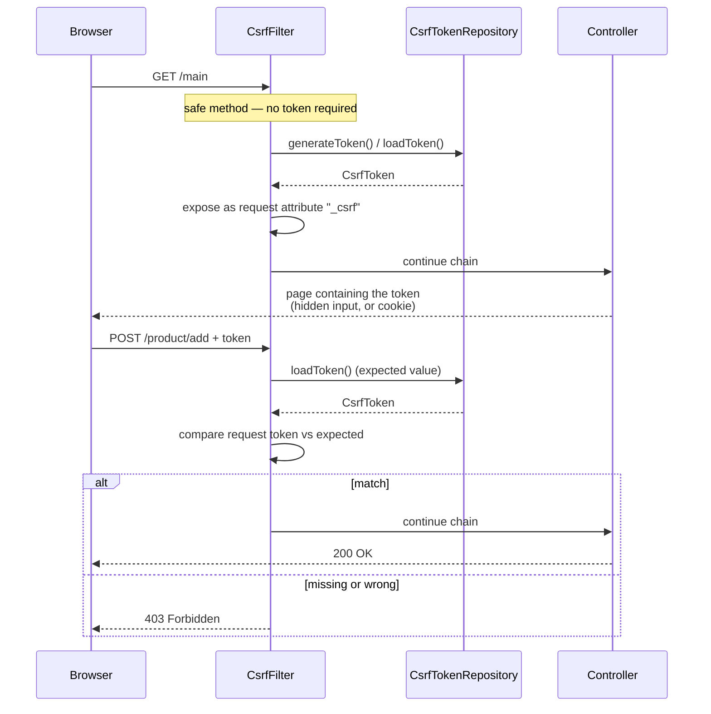

## Objective

Entenda por que um endpoint `@PostMapping` retorna `403 Forbidden` num
projeto Spring Security recém-criado mesmo quando o chamador está
autenticado, e o que fazer a respeito além de simplesmente desligar o CSRF
por reflexo. O mecanismo é pequeno e vale a pena conhecer exatamente:
`CsrfFilter` fica na filter chain, deixa `GET`/`HEAD`/`TRACE`/`OPTIONS`
passarem sem tocar, e para qualquer outro método exige um token que
previamente entregou ao client através de um `CsrfTokenRepository`. Tudo o
mais — inputs de formulário ocultos, tokens baseados em cookie para
single-page apps, excluir um caminho, armazenar tokens num banco de dados —
é uma variação sobre onde esse token mora e como o client o recupera.

## Use Cases

- Fazer um formulário renderizado no servidor (Thymeleaf, JSP, HTML simples
  de um controller) submeter um `POST` com sucesso sem desligar a proteção
  CSRF para a aplicação inteira.
- Conectar um frontend JavaScript (Angular, React, Vue) que fala com o
  mesmo backend Spring: o token precisa chegar ao JavaScript, o que
  significa um cookie em vez de um atributo de `HttpSession`.
- Decidir se uma aplicação precisa de proteção CSRF: uma API de bearer
  token consumida só por clients mobile e outros serviços é uma situação
  diferente de uma aplicação de browser autenticada por cookie de sessão.
- Excluir um webhook ou endpoint de callback (`POST /payments/notify`) da
  proteção CSRF enquanto todo outro caminho que muda estado permanece
  protegido.
- Substituir armazenamento de token baseado em sessão por algo
  horizontalmente escalável, implementando `CsrfTokenRepository` você
  mesmo.
- Debugar o modo de falha específico de "login funciona mas meu `POST`
  não" — o formulário de login default do Spring Security já envia o
  token; o seu formulário não, até você adicioná-lo.

## Deep Dive

### O ataque: um browser autenticado fazendo mando de outra pessoa

O cenário do livro (p. 214-215): Carlos faz login na aplicação de
contabilidade do trabalho, depois abre uma página de algum site de música
grátis noutra aba. Essa página contém código de forjaria — um script ou um
formulário que se auto-submete — que dispara requests para a aplicação de
contabilidade. O browser anexa o cookie de sessão de Carlos automaticamente,
porque é isso que browsers fazem para requests àquela origem, e o servidor
vê um request autenticado perfeitamente bem-formado. Contas são alteradas
ou apagadas.

A propriedade central sendo explorada é *ambient authority*: autenticação
mora num cookie que o browser envia por conta própria, então o servidor não
consegue distinguir "o usuário pediu isso a partir da minha página" de
"outra página fez o browser do usuário pedir isso". A proteção CSRF fecha
essa brecha exigindo um segundo credencial que uma página estrangeira não
consegue obter — porque não consegue ler as respostas da sua aplicação
(same-origin policy) e não está armazenado em nenhum lugar que o browser
anexe automaticamente.

Essa também é a forma mais limpa de ver por que CSRF e CORS são problemas
diferentes (veja o conceito complementar `spring-security-cors-configuration`).
CORS governa se o browser deixa *JavaScript estrangeiro ler sua resposta*.
CSRF governa se seu servidor aceita um *request que muda estado sem ter
entregado um token para ele*. Um ataque CSRF não precisa ler a resposta —
apagar os arquivos já é o resultado — então relaxar ou apertar CORS não
causa nem cura uma vulnerabilidade CSRF.

### `CsrfFilter`, `CsrfToken`, `CsrfTokenRepository`

Três peças, e isso é quase todo o mecanismo:

- **`CsrfFilter`** — um filter na chain. Deixa `GET`, `HEAD`, `TRACE`, e
  `OPTIONS` passarem incondicionalmente. Para qualquer outra coisa carrega
  o token esperado, compara com o do request, e em caso de discrepância ou
  ausência levanta uma `AccessDeniedException` que aparece como `403
  Forbidden`.
- **`CsrfToken`** — o contrato do token. Três acessores, inalterados desde
  o Spring Security 3.2:
  ```java
  public interface CsrfToken extends Serializable {
      String getHeaderName();     // default: X-CSRF-TOKEN
      String getParameterName();  // default: _csrf
      String getToken();          // the value itself
  }
  ```
  `DefaultCsrfToken` é a implementação imutável embutida.
- **`CsrfTokenRepository`** — cria, armazena, e carrega tokens. O default
  é `HttpSessionCsrfTokenRepository`: valores UUID aleatórios mantidos na
  `HttpSession`.
  ```java
  public interface CsrfTokenRepository {
      CsrfToken generateToken(HttpServletRequest request);
      void saveToken(CsrfToken token, HttpServletRequest request, HttpServletResponse response);
      CsrfToken loadToken(HttpServletRequest request);
      // plus default DeferredCsrfToken loadDeferredToken(request, response) since 5.8
  }
  ```

Como o repositório default é baseado em sessão, um `POST` precisa *tanto*
do token quanto do cookie de sessão — o livro demonstra isso com curl
(p. 220):

```
curl -X POST http://localhost:8080/hello \
  -H 'Cookie: JSESSIONID=21ADA55E10D70BA81C338FFBB06B0206' \
  -H 'X-CSRF-TOKEN: 1127bfda-57b1-43f0-bce5-bacd7d94694e'
# Post Hello!
```

Retire qualquer um dos headers e a resposta é `403`. Esse pareamento é o
ponto: o token prova que o request se originou de uma página que o
servidor renderizou para *esta* sessão.



### Lendo o token: o atributo de request `_csrf`

`CsrfFilter` coloca o `CsrfToken` no request como um atributo chamado
`_csrf` (também sob `CsrfToken.class.getName()`). Qualquer coisa
posicionada *depois* de `CsrfFilter` na chain consegue lê-lo — o livro usa
esse fato para construir um filter de debug que loga o token (listagem
10.2, p. 218):

```java
public class CsrfTokenLogger implements Filter {

  private final Logger logger = Logger.getLogger(CsrfTokenLogger.class.getName());

  @Override
  public void doFilter(ServletRequest request, ServletResponse response, FilterChain chain)
      throws IOException, ServletException {
    CsrfToken token = (CsrfToken) request.getAttribute("_csrf");
    logger.info("CSRF token " + token.getToken());
    chain.doFilter(request, response);
  }
}
```

```java
@Bean
public SecurityFilterChain filterChain(HttpSecurity http) throws Exception {
  http
      .addFilterAfter(new CsrfTokenLogger(), CsrfFilter.class)
      .authorizeHttpRequests(authorize -> authorize.anyRequest().permitAll());
  return http.build();
}
```

Útil para entender o fluxo, não um mecanismo de entrega — o livro é
explícito sobre isso (nota, p. 219): clients reais não conseguem ler seus
logs de servidor. Levar o token até o client é trabalho do backend, e as
próximas duas seções são as duas formas de fazer isso.

### Cenário 1: formulário renderizado no servidor — input oculto

A própria página de login default do Spring Security já envia o token num
input oculto, o que é exatamente por que o login por formulário funciona
sobre `POST` com CSRF habilitado e nenhuma configuração de sua parte
(p. 222). Seus próprios formulários não têm essa cortesia. Este formulário
falha com `403`:

```html
<form action="/product/add" method="post">
   <input type="text" name="name" />
   <button type="submit">Add</button>
</form>
```

Adicionar o token do atributo de request `_csrf` corrige isso (listagem
10.8, p. 224):

```html
<form action="/product/add" method="post">
   <input type="text" name="name" />
   <button type="submit">Add</button>
   <input type="hidden"
          th:name="${_csrf.parameterName}"
          th:value="${_csrf.token}" />
</form>
```

Thymeleaf é incidental — qualquer template engine que consiga imprimir um
atributo de request funciona, e a integração do Thymeleaf com Spring
Security insere o input oculto automaticamente para formulários com
`th:action`. Para multi-page apps cujo JavaScript dispara as chamadas que
mudam estado, os mesmos valores geralmente são renderizados em meta tags:

```html
<meta name="_csrf" content="${_csrf.token}"/>
<meta name="_csrf_header" content="${_csrf.headerName}"/>
```

### Cenário 2: single-page app JavaScript — token num cookie

O livro para por aqui: observa (p. 225) que a proteção CSRF baseada em
token "não funciona bem quando o client é independente do backend" e adia
o assunto para capítulos posteriores sobre OAuth 2. Esse é o instinto
certo para um frontend implantado *separadamente*, mas deixa de fora o caso
intermediário muito comum — um app JavaScript servido pelo mesmo backend
Spring, autenticado por um cookie de sessão. Esse caso ainda precisa de
proteção CSRF, e a resposta do Spring Security é `CookieCsrfTokenRepository`:
colocar o token esperado num cookie que o JavaScript consegue ler, para que
o frontend possa copiá-lo num header de request.

```java
@Bean
public SecurityFilterChain filterChain(HttpSecurity http) throws Exception {
  http
      .csrf(csrf -> csrf
          .csrfTokenRepository(CookieCsrfTokenRepository.withHttpOnlyFalse()));
  return http.build();
}
```

`withHttpOnlyFalse()` é o que torna o cookie legível a partir de
JavaScript — necessário aqui, e um enfraquecimento deliberado que você não
deveria aplicar em nenhum outro lugar. Os defaults combinam com as
convenções do Angular: cookie `XSRF-TOKEN`, header `X-XSRF-TOKEN`,
parâmetro `_csrf`.

Duas rugas que não existiam quando o livro foi escrito, ambas cobertas na
seção livro-vs-hoje abaixo: o handler de token default mascara o valor do
token a cada request, então um client que lê o cookie precisa de um request
handler que aceite o valor não mascarado; e o cookie do token é limpo em
caso de sucesso de autenticação e logout, então o client precisa buscar um
novo depois. A partir do Spring Security 7.0 os dois são tratados numa
única chamada:

```java
http.csrf(csrf -> csrf.spa());
```

Para clients que preferem pedir o token explicitamente a ler um cookie, a
documentação de referência sugere simplesmente expô-lo:

```java
@RestController
public class CsrfController {

  @GetMapping("/csrf")
  public CsrfToken csrf(CsrfToken csrfToken) {
    return csrfToken;
  }
}
```

### Customizando: excluindo caminhos da proteção CSRF

Por padrão a proteção CSRF cobre todo caminho alcançado com um método
diferente de `GET`/`HEAD`/`TRACE`/`OPTIONS`. Para isentar caminhos
específicos em vez de desligar a proteção globalmente:

```java
@Bean
public SecurityFilterChain filterChain(HttpSecurity http) throws Exception {
  http
      .csrf(csrf -> csrf
          .ignoringRequestMatchers("/ciao"))
      .authorizeHttpRequests(authorize -> authorize.anyRequest().permitAll());
  return http.build();
}
```

`ignoringRequestMatchers` também recebe instâncias de `RequestMatcher`, que
é como você isenta por método além de caminho:

```java
csrf.ignoringRequestMatchers(
    PathPatternRequestMatcher.pathPattern(HttpMethod.POST, "/webhooks/**"));
```

O outro botão no mesmo configurer é
`requireCsrfProtectionMatcher(RequestMatcher)`, que substitui totalmente a
regra "tudo exceto os métodos seguros" em vez de subtrair dela.

### Customizando: seu próprio `CsrfTokenRepository`

Tokens baseados em sessão são stateful, e o livro sinaliza isso como um
problema de escalabilidade para aplicações que precisam de escala
horizontal (p. 228). Implementar `CsrfTokenRepository` permite colocar
tokens em qualquer lugar — o exemplo do livro usa uma tabela com backend
JPA chaveada por um identificador de client que o client envia num header
`X-IDENTIFIER`, efetivamente substituindo esse identificador pelo ID de
sessão:

```java
public class CustomCsrfTokenRepository implements CsrfTokenRepository {

  private final JpaTokenRepository jpaTokenRepository;

  public CustomCsrfTokenRepository(JpaTokenRepository jpaTokenRepository) {
    this.jpaTokenRepository = jpaTokenRepository;
  }

  @Override
  public CsrfToken generateToken(HttpServletRequest request) {
    return new DefaultCsrfToken("X-CSRF-TOKEN", "_csrf", UUID.randomUUID().toString());
  }

  @Override
  public void saveToken(CsrfToken csrfToken, HttpServletRequest request, HttpServletResponse response) {
    String identifier = request.getHeader("X-IDENTIFIER");
    Optional<Token> existing = jpaTokenRepository.findTokenByIdentifier(identifier);
    if (existing.isPresent()) {
      existing.get().setToken(csrfToken.getToken());
    } else {
      Token token = new Token();
      token.setIdentifier(identifier);
      token.setToken(csrfToken.getToken());
      jpaTokenRepository.save(token);
    }
  }

  @Override
  public CsrfToken loadToken(HttpServletRequest request) {
    String identifier = request.getHeader("X-IDENTIFIER");
    return jpaTokenRepository.findTokenByIdentifier(identifier)
        .map(token -> (CsrfToken) new DefaultCsrfToken("X-CSRF-TOKEN", "_csrf", token.getToken()))
        .orElse(null);
  }
}
```

`loadToken` retornando `null` significa "sem token registrado", que
`CsrfFilter` trata como uma checagem falha para requests que mudam estado.
Conectando:

```java
@Bean
public SecurityFilterChain filterChain(HttpSecurity http, CsrfTokenRepository csrfTokenRepository)
    throws Exception {
  http
      .csrf(csrf -> csrf
          .csrfTokenRepository(csrfTokenRepository)
          .ignoringRequestMatchers("/ciao"))
      .authorizeHttpRequests(authorize -> authorize.anyRequest().permitAll());
  return http.build();
}
```

Note o que o identificador precisa ser para que isso seja seguro: o livro
diz que "deveria ser diferente cada vez que o usuário faz login", porque
desempenha exatamente o papel que o ID de sessão desempenhava. Um
identificador adivinhável ou de vida longa dá a um atacante a capacidade
de procurar um token válido, o que derrota o mecanismo inteiro.

### Livro vs. hoje: os mesmos três componentes, dois defaults novos, um atalho novo

**A superfície de configuração se moveu, os componentes não.** O livro
configura CSRF dentro de `configure(HttpSecurity)` numa subclasse de
`WebSecurityConfigurerAdapter`:

```java
@Configuration
public class ProjectConfig extends WebSecurityConfigurerAdapter {

  @Override
  protected void configure(HttpSecurity http) throws Exception {
    http.csrf(c -> {
      c.csrfTokenRepository(customTokenRepository());
      c.ignoringAntMatchers("/ciao");
    });
    http.authorizeRequests().anyRequest().permitAll();
  }
}
```

`WebSecurityConfigurerAdapter` sumiu a partir do Spring Security 6.0; hoje
a mesma coisa é um bean `SecurityFilterChain` (veja
`spring-security-authentication-architecture` para essa migração em
geral). Notavelmente o livro já usa a forma de lambda `csrf(Customizer)`,
então `http.csrf(csrf -> ...)` lê identicamente — só o container mudou.
`CsrfFilter`, `CsrfToken`, `CsrfTokenRepository`,
`HttpSessionCsrfTokenRepository`, `CookieCsrfTokenRepository`, e
`DefaultCsrfToken` todos ainda existem com os mesmos nomes e as mesmas
formas. O único método que não sobreviveu é
`ignoringAntMatchers(String...)`, deprecated na 5.8 junto com o resto da
família de Ant-matchers e removido na 6.0;
`ignoringRequestMatchers(String...)` (adicionado na 5.8) é a substituição
direta e recebe o mesmo tipo de padrão.

**Default #1 desde a 6.0: o token é mascarado por request (proteção
BREACH).** `CsrfFilter` agora delega expor e resolver o token a um
`CsrfTokenRequestHandler`, e a implementação default é
`XorCsrfTokenRequestAttributeHandler`. Ele faz XOR de aleatoriedade fresca
no valor do token a cada request, então a string que uma página renderiza
difere a cada vez mesmo que o token subjacente seja estável. A razão é o
ataque BREACH, que pode recuperar um segredo de respostas HTTPS
comprimidas quando esse segredo aparece verbatim no corpo; mascarar por
request remove o invariante que o BREACH precisa. Isso é transparente para
formulários com input oculto — o handler desmascara o parâmetro `_csrf` no
caminho de entrada — mas é precisamente o que quebra uma configuração
ingênua de cookie, porque o cookie guarda o valor cru enquanto o handler
espera um valor mascarado. Optar por sair é uma linha só e um verdadeiro
downgrade de segurança:

```java
http.csrf(csrf -> csrf
    .csrfTokenRequestHandler(new CsrfTokenRequestAttributeHandler())); // no BREACH protection
```

**Default #2 desde a 6.0: o carregamento do token é adiado.** O
`CsrfToken` só é materializado quando realmente necessário — um request
que muda estado, ou um template lendo o atributo `_csrf` — então um `GET`
simples não força mais o carregamento da `HttpSession`. Bom para
throughput, mas significa que o cookie do token não é necessariamente
escrito em toda resposta. Definir o nome do atributo de request como
`null` restaura o carregamento antecipado:

```java
XorCsrfTokenRequestAttributeHandler handler = new XorCsrfTokenRequestAttributeHandler();
handler.setCsrfRequestAttributeName(null); // load the token on every request
http.csrf(csrf -> csrf.csrfTokenRequestHandler(handler));
```

**O efeito combinado em SPAs, e o atalho da 7.0.** Até o Spring Security
6.x, uma configuração de SPA baseada em cookie precisava de um handler
escrito à mão que mascara o token ao renderizá-lo mas aceita o valor cru
quando ele chega num header — a documentação de referência entregava isso
como um `SpaCsrfTokenRequestHandler` para copiar e colar:

```java
final class SpaCsrfTokenRequestHandler implements CsrfTokenRequestHandler {
  private final CsrfTokenRequestHandler plain = new CsrfTokenRequestAttributeHandler();
  private final CsrfTokenRequestHandler xor = new XorCsrfTokenRequestAttributeHandler();

  @Override
  public void handle(HttpServletRequest request, HttpServletResponse response,
                     Supplier<CsrfToken> csrfToken) {
    this.xor.handle(request, response, csrfToken);
    csrfToken.get(); // force the deferred token so the cookie is written
  }

  @Override
  public String resolveCsrfTokenValue(HttpServletRequest request, CsrfToken csrfToken) {
    String headerValue = request.getHeader(csrfToken.getHeaderName());
    // header (raw value from the cookie) → plain; parameter (rendered form) → xor
    return (StringUtils.hasText(headerValue) ? this.plain : this.xor)
        .resolveCsrfTokenValue(request, csrfToken);
  }
}
```

O Spring Security 7.0 dobra tudo isso num `csrf.spa()`, que arma o
repositório de cookie, a resolução header-vs-parâmetro, e um token novo
depois do sucesso de autenticação e logout. Vale a pena conhecer a forma
longa de qualquer forma: é o que `spa()` faz, e ainda é o que você vai
encontrar em codebases 6.x.

## Trade-offs

- **Desligar CSRF é a decisão certa para APIs genuinamente não-browser e a
  errada em qualquer outro lugar.** A regra da documentação de referência é
  "use proteção CSRF para qualquer request que poderia ser processado por
  um browser por usuários normais"; um serviço consumido só por clients
  não-browser "provavelmente quer[m] desligar a proteção CSRF". A armadilha
  é que "API REST stateless" não é por si só uma razão — o que importa é se
  a autenticação depende de algo que o browser anexa automaticamente.
  Cookies de sessão e HTTP Basic ambos se qualificam; um header
  `Authorization: Bearer` que o client define explicitamente não.
  ```java
  http.csrf(csrf -> csrf.disable()); // only when nothing browser-driven reaches this chain
  ```
- **`ignoringRequestMatchers` é mais estreito que `disable()`, mas ainda é
  um buraco que você possui.** Um caminho isento aceita requests que mudam
  estado de qualquer origem com os cookies do usuário anexados. É a
  ferramenta certa para um webhook machine-to-machine autenticado de outra
  forma (assinatura, mTLS), e a errada para "o token era chato de
  adicionar a este formulário".
- **`CookieCsrfTokenRepository.withHttpOnlyFalse()` troca uma camada de
  defesa em profundidade por usabilidade de SPA.** O cookie do token vira
  legível por qualquer JavaScript na página, incluindo script injetado —
  o que é aceitável, já que XSS já derrota a proteção CSRF completamente,
  mas significa que a proteção CSRF não é uma mitigação para XSS e não
  deveria ser contada como uma.
- **Tokens baseados em sessão são simples e não escalam de graça.**
  `HttpSessionCsrfTokenRepository` não precisa de configuração e não
  armazena nada que você precise expirar, mas torna a proteção CSRF
  dependente de estado de sessão do lado do servidor; escala horizontal
  então significa sessões sticky ou um session store compartilhado. Um
  `CsrfTokenRepository` customizado move o estado para algum lugar
  compartilhado, ao custo de você mesmo possuir geração, lookup, e
  expiração.
- **Nunca coloque uma operação que muda estado atrás de `GET`.** O livro
  sinaliza isso como um erro que vê "muitas vezes" (p. 226), e a proteção
  CSRF é a razão pela qual isso importa aqui especificamente: `CsrfFilter`
  deixa `GET`, `HEAD`, `TRACE`, e `OPTIONS` passarem sem checar nada, então
  um endpoint `GET` que muda estado está desprotegido por construção,
  não importa como CSRF esteja configurado.
- **Optar por sair do mascaramento BREACH faz configurações baseadas em
  cookie "simplesmente funcionarem" — é por isso que é tentador.**
  `CsrfTokenRequestAttributeHandler` remove a incompatibilidade de
  mascaramento que quebra uma configuração ingênua de SPA, e é o conserto
  errado: o correto é um request handler que resolve headers de forma
  simples enquanto ainda mascara a saída renderizada
  (`SpaCsrfTokenRequestHandler`, ou `csrf.spa()` na 7.0+).
- **CSRF e CORS resolvem problemas diferentes e nenhum substitui o outro.**
  Uma política CORS permissiva não cria uma vulnerabilidade CSRF (CSRF
  baseado em formulário nunca lê a resposta), e uma restritiva não remove
  a necessidade de tokens CSRF. Cookies `SameSite` genuinamente reduzem a
  exposição a CSRF, mas o Spring Security não controla a criação de
  cookies de sessão e a documentação de referência recomenda tratar
  `SameSite` "como uma defesa em profundidade em vez da única proteção
  contra ataques CSRF".

## Documentation Links

- [Spring Security in Action (Manning, 2020) — Chapter 10, "Applying CSRF protection and CORS", section 10.1 "Applying cross-site request forgery (CSRF) protection in applications" (10.1.1-10.1.3), p. 213-234](https://www.manning.com/books/spring-security-in-action) — doc
- [Spring Security Reference — Cross Site Request Forgery (CSRF) for Servlet Environments](https://docs.spring.io/spring-security/reference/servlet/exploits/csrf.html) — doc
- [Spring Security Reference — Cross Site Request Forgery (CSRF), concepts and when to use it](https://docs.spring.io/spring-security/reference/features/exploits/csrf.html) — doc
- [Spring Security API — CsrfConfigurer (csrfTokenRepository, csrfTokenRequestHandler, ignoringRequestMatchers, requireCsrfProtectionMatcher, spa)](https://docs.spring.io/spring-security/site/docs/current/api/org/springframework/security/config/annotation/web/configurers/CsrfConfigurer.html) — doc
- [Spring Security API — CsrfTokenRepository](https://docs.spring.io/spring-security/site/docs/current/api/org/springframework/security/web/csrf/CsrfTokenRepository.html) — doc
- [Spring Security API — CsrfToken](https://docs.spring.io/spring-security/site/docs/current/api/org/springframework/security/web/csrf/CsrfToken.html) — doc
- [Spring Security 6.0 Migration Guide — Exploit Protection (XorCsrfTokenRequestAttributeHandler default, deferred CsrfToken)](https://github.com/spring-projects/spring-security/blob/6.0.2/docs/modules/ROOT/pages/migration/servlet/exploits.adoc) — doc
