## Objective

The companion concept on authentication architecture describes the filter chain as the
outermost layer of Spring Security — an authentication filter intercepts the request and
delegates to an `AuthenticationManager`. This concept is about *editing* that chain: writing
your own `Filter`, then deciding where in the ordered sequence it goes. Spring Security gives
you exactly three placements, all on `HttpSecurity` — `addFilterBefore(...)`,
`addFilterAfter(...)` and `addFilterAt(...)` — each relative to a filter class the framework
already knows. Picking the right one is the whole skill: *before* to reject bad requests
before expensive authentication runs, *after* to observe what already got through, *at* to
substitute your own implementation of a responsibility a built-in filter normally owns. The
one thing developers reliably get wrong is `addFilterAt`, which does **not** remove the filter
it sits next to.

## Use Cases

- Validating request shape (a mandatory `Request-Id` tracing header, a content type, a
  size limit) *before* authentication runs, so a malformed request never triggers a
  database lookup or a password hash comparison.
- Logging, tracing, or notifying another system about requests that successfully passed
  authentication, without touching the authentication filter itself.
- Replacing username/password authentication entirely with a different credential shape —
  a static API key header, a symmetric-key request signature, a one-time password — by
  installing a custom filter at the position `BasicAuthenticationFilter` would have held.
- Multi-tenancy or per-request context enrichment: reading a `X-Tenant-Id` header after
  authentication and checking the authenticated user is allowed that tenant.
- Reading someone else's `SecurityFilterChain` bean and working out what actually runs, in
  what order, from the DEBUG log line Spring Security prints at startup.

## Deep Dive

### The `Filter` contract

Spring Security's filters are ordinary Servlet filters — nothing framework-specific about
the interface. You implement `Filter` and override `doFilter()`, which receives three
things:

- `ServletRequest` — the HTTP request; you read details off it (headers, path, parameters).
- `ServletResponse` — the HTTP response; you alter it before it goes back to the client or
  onward down the chain.
- `FilterChain` — the chain itself; calling `filterChain.doFilter(request, response)`
  forwards to the next filter. **Not** calling it stops the request dead.

```java
public class RequestValidationFilter implements Filter {

    @Override
    public void doFilter(ServletRequest request,
                         ServletResponse response,
                         FilterChain filterChain)
            throws IOException, ServletException {

        var httpRequest = (HttpServletRequest) request;
        var httpResponse = (HttpServletResponse) response;

        String requestId = httpRequest.getHeader("Request-Id");

        if (requestId == null || requestId.isBlank()) {
            httpResponse.setStatus(HttpServletResponse.SC_BAD_REQUEST);
            return; // chain not continued — request never reaches authentication
        }

        filterChain.doFilter(request, response);
    }
}
```

That early `return` is the entire mechanism for short-circuiting a request: set a status,
don't forward. `curl http://localhost:8080/hello` gets `400`;
`curl -H "Request-Id:12345" http://localhost:8080/hello` gets `200 Hello!`.

### `addFilterBefore`: cheap checks ahead of expensive authentication

Register the filter relative to a class the framework knows. Both arguments matter: the
filter *instance*, and the filter *class* you're positioning against.

```java
@Configuration
@EnableWebSecurity
public class SecurityConfig {

    @Bean
    public SecurityFilterChain filterChain(HttpSecurity http) throws Exception {
        http
            .addFilterBefore(new RequestValidationFilter(), BasicAuthenticationFilter.class)
            .authorizeHttpRequests(authorize -> authorize
                .anyRequest().permitAll());

        return http.build();
    }
}
```

The reasoning is economic: authentication may query a database, hit a secrets vault, or
compare a bcrypt hash. If the request is structurally invalid, none of that should happen.
Positioning against `BasicAuthenticationFilter.class` targets the default authentication
filter for an HTTP Basic setup — with `formLogin()` the authentication filter is
`UsernamePasswordAuthenticationFilter` instead, so the class you name depends on what your
configuration actually installed.

### `addFilterAfter`: observing what already got through

Symmetric API, opposite intent. Anything reaching a filter placed after the authentication
filter has, by definition, passed authentication — which makes it the natural place for
logging and notification:

```java
public class AuthenticationLoggingFilter implements Filter {

    private final Logger logger =
        Logger.getLogger(AuthenticationLoggingFilter.class.getName());

    @Override
    public void doFilter(ServletRequest request,
                         ServletResponse response,
                         FilterChain filterChain)
            throws IOException, ServletException {

        var httpRequest = (HttpServletRequest) request;
        var requestId = httpRequest.getHeader("Request-Id");

        logger.info("Successfully authenticated request with id " + requestId);

        filterChain.doFilter(request, response);
    }
}
```

Both placements compose in one chain — the request-validation filter upstream of
authentication, the logging filter downstream of it:

```java
@Bean
public SecurityFilterChain filterChain(HttpSecurity http) throws Exception {
    http
        .addFilterBefore(new RequestValidationFilter(), BasicAuthenticationFilter.class)
        .addFilterAfter(new AuthenticationLoggingFilter(), BasicAuthenticationFilter.class)
        .authorizeHttpRequests(authorize -> authorize
            .anyRequest().permitAll());

    return http.build();
}
```

### `addFilterAt`: substituting a responsibility, and the trap

Use `addFilterAt` when you're providing a *different implementation of a job a built-in
filter already owns* — overwhelmingly, that job is authentication. Credential shapes that
don't fit username/password:

- a static header value the client always sends, matched against a stored key (weak, but
  common between backend services for its simplicity and speed);
- a symmetric key both sides know, used to sign part of the request, with the server
  verifying the signature (or an asymmetric key pair);
- a one-time password the user gets from an authenticator app or SMS.

The static-key version, reading the expected value from configuration:

```java
public class StaticKeyAuthenticationFilter implements Filter {

    private final String authorizationKey;

    public StaticKeyAuthenticationFilter(String authorizationKey) {
        this.authorizationKey = authorizationKey;
    }

    @Override
    public void doFilter(ServletRequest request,
                         ServletResponse response,
                         FilterChain filterChain)
            throws IOException, ServletException {

        var httpRequest = (HttpServletRequest) request;
        var httpResponse = (HttpServletResponse) response;

        String authentication = httpRequest.getHeader("Authorization");

        if (this.authorizationKey.equals(authentication)) {
            filterChain.doFilter(request, response);
        } else {
            httpResponse.setStatus(HttpServletResponse.SC_UNAUTHORIZED);
        }
    }
}
```

```java
@Bean
public SecurityFilterChain filterChain(
        HttpSecurity http,
        @Value("${authorization.key}") String key) throws Exception {

    http
        // note: httpBasic(...) is deliberately NOT called — we don't want
        // BasicAuthenticationFilter in the chain at all
        .addFilterAt(new StaticKeyAuthenticationFilter(key), BasicAuthenticationFilter.class)
        .authorizeHttpRequests(authorize -> authorize
            .anyRequest().permitAll());

    return http.build();
}
```

**The trap:** "at the position of `BasicAuthenticationFilter`" does not mean "instead of
`BasicAuthenticationFilter`". Nothing is removed. The `addFilterAt` Javadoc is explicit
about it: *"Registration of multiple Filters in the same location means their ordering is
not deterministic. More concretely, registering multiple Filters in the same location does
not override existing Filters. Instead, do not register Filters you do not want to use."*
That's why the configuration above omits `httpBasic(...)` — omitting the DSL call is what
keeps `BasicAuthenticationFilter` out, not `addFilterAt`. If you need a built-in filter gone
while its DSL method is being called elsewhere, the current reference documentation points at
the configurer's own `disable()`:

```java
http.httpBasic(basic -> basic.disable());
```

Two filters sharing a position is legal and occasionally deliberate, but the order between
them is undefined, so it's worth avoiding on maintainability grounds alone.

### Ordering is numeric, and the numbers are real

Positions are integers, sometimes called "the order". `FilterOrderRegistration` seeds the
registry at `INITIAL_ORDER = 100` and advances in `ORDER_STEP = 100` increments, and the
three placement methods are all one private helper with an offset: `addFilterBefore` is
offset `-1`, `addFilterAt` is `0`, `addFilterAfter` is `+1`. So a custom filter added before
a built-in filter at order `300` really does land at `299` — the book's diagrams aren't a
simplification of the mechanism, just of the catalog. Two consequences:

- Positioning against a filter class the registry doesn't know throws
  `IllegalArgumentException: The Filter class ... does not have a registered order`. Order
  lookup walks superclasses, so a subclass of a known filter resolves to its parent's order.
- `addFilter(Filter)` (no second argument) exists, but only works for filters whose class
  already has a registered order — the exception message itself tells you to use
  `addFilterBefore`/`addFilterAfter` instead.

### The filters Spring Security ships

An application never contains all of them. The chain is longer or shorter depending on what
you configured: calling `httpBasic()` is precisely what puts a `BasicAuthenticationFilter`
into the chain, `formLogin()` puts in a `UsernamePasswordAuthenticationFilter`, `csrf()` a
`CsrfFilter`, `authorizeHttpRequests()` an `AuthorizationFilter`. A default web-security
configuration produces this chain, which Spring Security logs at DEBUG on startup:

```
Will secure any request with [DisableEncodeUrlFilter, WebAsyncManagerIntegrationFilter,
 SecurityContextHolderFilter, HeaderWriterFilter, CsrfFilter, LogoutFilter,
 UsernamePasswordAuthenticationFilter, DefaultLoginPageGeneratingFilter,
 DefaultLogoutPageGeneratingFilter, BasicAuthenticationFilter, RequestCacheAwareFilter,
 SecurityContextHolderAwareRequestFilter, AnonymousAuthenticationFilter,
 ExceptionTranslationFilter, AuthorizationFilter]
```

That log line is the fastest way to confirm your filter landed where you meant it to.

```mermaid
flowchart LR
    REQ([Request]) --> SCH[SecurityContextHolderFilter]
    SCH --> HW[HeaderWriterFilter]
    HW --> CORS[CorsFilter]
    CORS --> CSRF[CsrfFilter]
    CSRF --> LO[LogoutFilter]
    LO --> UPA[UsernamePasswordAuthenticationFilter]
    UPA --> BAF[BasicAuthenticationFilter]
    BAF --> ANON[AnonymousAuthenticationFilter]
    ANON --> ETF[ExceptionTranslationFilter]
    ETF --> AF[AuthorizationFilter]
    AF --> APP([Application])

    CSRF -.->|exploit-protection filters<br/>go after SecurityContextHolderFilter| SCH
    UPA -.->|authentication filters<br/>go after LogoutFilter| LO
    AF -.->|authorization filters<br/>go after AnonymousAuthenticationFilter| ANON
```



Spring Security also offers abstract base classes that implement `Filter` for you.
`GenericFilterBean` adds support for `web.xml`-style initialization parameters;
`OncePerRequestFilter` extends it and guarantees the logic runs exactly once per request —
which the plain `Filter` interface does not, since the framework makes no promise a filter
is invoked only once. The logging filter above is a textbook candidate, since duplicate log
lines per request would be actively misleading:

```java
public class AuthenticationLoggingFilter extends OncePerRequestFilter {

    private final Logger logger =
        Logger.getLogger(AuthenticationLoggingFilter.class.getName());

    @Override
    protected void doFilterInternal(HttpServletRequest request,
                                    HttpServletResponse response,
                                    FilterChain filterChain)
            throws ServletException, IOException {

        String requestId = request.getHeader("Request-Id");
        logger.info("Successfully authenticated request with id " + requestId);

        filterChain.doFilter(request, response);
    }
}
```

Note what changed: the overridden method is `doFilterInternal()`, not `doFilter()`, and the
parameters arrive already typed as `HttpServletRequest`/`HttpServletResponse` — the casting
the raw `Filter` interface forces on you is gone, because `OncePerRequestFilter` only
supports HTTP. It also gives you three opt-out hooks: `shouldNotFilter(HttpServletRequest)`
(default `false`, i.e. filter everything), plus `shouldNotFilterAsyncDispatch()` and
`shouldNotFilterErrorDispatch()`, which default to skipping async and error dispatches
respectively. Use it when you want those behaviors — but implementing `Filter` directly is
the simpler choice when you don't, and Spilcă's own complaint is that developers extend
`GenericFilterBean` in filters needing none of what it adds, having copied it off the web
without knowing why.

### Book vs. today: where to place a filter, and two things that broke

Three separate changes since the 2020 book, none of them to the three placement methods
themselves — `addFilterBefore`, `addFilterAfter` and `addFilterAt` are all still present on
`HttpSecurity` in the current API, undeprecated, with the same two-argument shape.

**1. The call site moved from an override to a bean.** The book overrides
`configure(HttpSecurity)` inside a `WebSecurityConfigurerAdapter` subclass; that base class
is removed as of Spring Security 6.0. All the snippets above already show the current form —
a `SecurityFilterChain` `@Bean` taking `HttpSecurity` as a parameter and returning
`http.build()`, with the lambda DSL for everything else. The filter registration line is
character-for-character the same either way.

**2. `javax.servlet` became `jakarta.servlet`.** The book imports `javax.servlet.Filter`,
`javax.servlet.FilterChain`, `javax.servlet.ServletRequest`/`ServletResponse` and
`javax.servlet.http.HttpServletRequest`/`HttpServletResponse`. Since the Jakarta EE 9+
namespace migration — which reaches Spring applications with Spring Boot 3.0, built on
Jakarta EE 10 (Jakarta Servlet 6.0) with a Java 17 baseline — every one of those is
`jakarta.*`:

```java
import jakarta.servlet.Filter;
import jakarta.servlet.FilterChain;
import jakarta.servlet.ServletException;
import jakarta.servlet.ServletRequest;
import jakarta.servlet.ServletResponse;
import jakarta.servlet.http.HttpServletRequest;
import jakarta.servlet.http.HttpServletResponse;
```

`HttpSecurity`'s signatures follow: `addFilterBefore(jakarta.servlet.Filter, Class<? extends
jakarta.servlet.Filter>)`. `OncePerRequestFilter` and `GenericFilterBean` are unchanged, both
still in `org.springframework.web.filter`.

**3. The book's `@Component` filter is now a double-registration bug.** Listing 9.7
annotates `StaticKeyAuthenticationFilter` with `@Component` so `@Value` can inject the key,
then `@Autowired`s it into the configuration. Under Spring Boot, a `Filter` bean is
automatically registered with the embedded servlet container as well — so the filter runs
twice, once from the container and once from Spring Security, in a different order. The
current reference documentation says plainly that "filters are often not Spring beans" for
this reason. If you need the filter to be a bean (for dependency injection), suppress the
container registration explicitly:

```java
@Bean
public FilterRegistrationBean<StaticKeyAuthenticationFilter> staticKeyFilterRegistration(
        StaticKeyAuthenticationFilter filter) {
    FilterRegistrationBean<StaticKeyAuthenticationFilter> registration =
        new FilterRegistrationBean<>(filter);
    registration.setEnabled(false); // HttpSecurity is the only one adding it
    return registration;
}
```

The constructor-injection variant used in the snippets earlier sidesteps the problem
entirely, by never making the filter a bean.

**Bonus: there's now official guidance on *which* filter to position against.** The book
positions everything against `BasicAuthenticationFilter`, which works but only because HTTP
Basic happens to be its example's authentication method. The current reference documentation
publishes a rule of thumb keyed to four chain events (security context loaded → exploits
protected → request authenticated → request authorized):

| If your filter is a(n) | Place it after | Because these have happened |
| --- | --- | --- |
| exploit-protection filter | `SecurityContextHolderFilter` | context loaded |
| authentication filter | `LogoutFilter` | context loaded, exploits handled |
| authorization filter | `AnonymousAuthenticationFilter` | context loaded, exploits handled, authenticated |

By that rule the book's request-validation filter is an exploit-protection filter (place it
after `SecurityContextHolderFilter`), and its static-key filter is an authentication filter
(after `LogoutFilter`) — both more robust than naming `BasicAuthenticationFilter`, since
they don't depend on which authentication mechanism the chain happens to use.

## Trade-offs

- **`addFilterAt` adds, it never replaces — and the docs themselves are inconsistent about
  it.** The `HttpSecurity#addFilterAt` Javadoc is unambiguous that registering at an
  occupied position "does not override existing Filters," while the reference manual's
  one-line summary reads "replaces another filter with your filter." Trust the Javadoc: the
  implementation just computes `registeredFilterOrder + 0` and appends. Removing a built-in
  filter is a separate act — don't call the DSL method that adds it, or `disable()` its
  configurer.
  ```java
  http.httpBasic(Customizer.withDefaults())          // adds BasicAuthenticationFilter
      .addFilterAt(myFilter, BasicAuthenticationFilter.class); // adds a SECOND filter there
  ```
- **Two filters at the same position run in an undefined order.** Legal, but the book
  advises against it outright and the Javadoc agrees, for the plain reason that a chain with
  a knowable order is a chain you can reason about during an incident. If both filters must
  run, `addFilterBefore`/`addFilterAfter` gives you a deterministic sequence for free.
- **Short-circuiting by writing the status yourself always works; throwing an exception
  depends on position.** The book's filters call `response.setStatus(...)` and return, which
  is position-independent. The current documentation's example instead throws
  `AccessDeniedException` and lets `ExceptionTranslationFilter` turn it into an HTTP
  response — but that only happens for filters positioned *downstream* of
  `ExceptionTranslationFilter`; thrown from an upstream filter, the exception escapes to the
  container and surfaces as a `500` instead.
- **A filter that authenticates without a user concept can drop `UserDetailsService`, at a
  cost.** The static-key example has no users at all, so Spring Boot's autoconfigured
  `UserDetailsService` is dead weight; it can be excluded outright. But that also means no
  `Authentication` in the `SecurityContextHolder`, so `authorizeHttpRequests()` rules,
  `@PreAuthorize`, and anything else reading the security context have nothing to work with —
  which is why the book's example has to use `permitAll()`.
  ```java
  @SpringBootApplication(exclude = { UserDetailsServiceAutoConfiguration.class })
  ```
- **`OncePerRequestFilter` versus plain `Filter` is a real choice, not a default.** It buys
  once-per-request execution, pre-cast HTTP types, and `shouldNotFilter*` opt-outs; it costs
  a superclass and a non-obvious method name (`doFilterInternal`). Reach for it when
  duplicate execution would be a bug (logging, counters, side effects), and implement
  `Filter` directly when it wouldn't.
- **Keys and secrets in `application.properties` are an example-only shortcut.** The book
  flags this about its own `authorization.key=SD9cICjl1e` — in production the static key
  belongs in a secrets vault, and a static shared key is itself the weakest of the three
  credential shapes the chapter lists.

## Documentation Links

- Laurențiu Spilcă, "Spring Security in Action" (Manning, 2020) — Chapter 9, "Implementing filters", sections 9.1-9.5, p. 198-212 — doc
- [Spring Security Reference — Architecture: Security Filters, Adding Filters to the Filter Chain, Customizing a Spring Security Filter](https://docs.spring.io/spring-security/reference/servlet/architecture.html) — doc
- [Spring Security API — HttpSecurity (addFilterBefore / addFilterAfter / addFilterAt / addFilter)](https://docs.spring.io/spring-security/site/docs/current/api/org/springframework/security/config/annotation/web/builders/HttpSecurity.html) — doc
- [Spring Security source — FilterOrderRegistration (built-in filter positions, INITIAL_ORDER 100 / ORDER_STEP 100)](https://github.com/spring-projects/spring-security/blob/main/config/src/main/java/org/springframework/security/config/annotation/web/builders/FilterOrderRegistration.java) — doc
- [Spring Framework API — OncePerRequestFilter (doFilterInternal, shouldNotFilter, shouldNotFilterAsyncDispatch, shouldNotFilterErrorDispatch)](https://docs.spring.io/spring-framework/docs/current/javadoc-api/org/springframework/web/filter/OncePerRequestFilter.html) — doc
- [Spring Boot 3.0 Migration Guide — Jakarta EE (javax.servlet becomes jakarta.servlet)](https://github.com/spring-projects/spring-boot/wiki/Spring-Boot-3.0-Migration-Guide) — doc
