## Objective

O conceito irmão sobre arquitetura de autenticação descreve a filter chain como a
camada mais externa do Spring Security — um filtro de autenticação intercepta o
request e delega para um `AuthenticationManager`. Este conceito é sobre *editar*
essa chain: escrever seu próprio `Filter` e depois decidir onde na sequência
ordenada ele entra. O Spring Security dá exatamente três posicionamentos, todos em
`HttpSecurity` — `addFilterBefore(...)`, `addFilterAfter(...)` e `addFilterAt(...)`
— cada um relativo a uma classe de filtro que o framework já conhece. Escolher o
certo é toda a habilidade envolvida: *before* para rejeitar requests malformados
antes de rodar uma autenticação cara, *after* para observar o que já passou, *at*
para substituir sua própria implementação de uma responsabilidade que um filtro
nativo normalmente possui. A coisa que desenvolvedores erram com consistência é o
`addFilterAt`, que **não** remove o filtro ao lado do qual ele se posiciona.

## Use Cases

- Validar a forma do request (um header de tracing `Request-Id` obrigatório, um
  content type, um limite de tamanho) *antes* da autenticação rodar, para que um
  request malformado nunca dispare uma consulta ao banco ou uma comparação de hash
  de senha.
- Logar, tracear ou notificar outro sistema sobre requests que passaram com
  sucesso pela autenticação, sem tocar no próprio filtro de autenticação.
- Substituir totalmente a autenticação por username/senha por um formato de
  credencial diferente — um header de API key estático, uma assinatura de request
  com chave simétrica, uma senha de uso único — instalando um filtro customizado
  na posição que `BasicAuthenticationFilter` ocuparia.
- Multi-tenancy ou enriquecimento de contexto por request: ler um header
  `X-Tenant-Id` depois da autenticação e checar se o usuário autenticado tem
  permissão para aquele tenant.
- Ler o bean `SecurityFilterChain` de outra pessoa e descobrir o que realmente
  roda, em que ordem, a partir da linha de log DEBUG que o Spring Security imprime
  na inicialização.

## Deep Dive

### O contrato `Filter`

Os filtros do Spring Security são filtros Servlet comuns — nada específico do
framework na interface. Você implementa `Filter` e sobrescreve `doFilter()`, que
recebe três coisas:

- `ServletRequest` — o request HTTP; você lê detalhes dele (headers, path,
  parâmetros).
- `ServletResponse` — a response HTTP; você a altera antes que volte para o
  client ou siga adiante na chain.
- `FilterChain` — a própria chain; chamar `filterChain.doFilter(request, response)`
  encaminha para o próximo filtro. **Não** chamar isso interrompe o request de
  vez.

```java
public class RequestValidationFilter implements Filter {

    @Override
    public void doFilter(ServletRequest request,
                         ServletResponse response,
                         FilterChain filterChain)
            throws IOException, ServletException {

        var httpRequest = (HttpServletRequest) request;
        var httpResponse = (HttpServletResponse) response;

        String requestId = httpRequest.getHeader("Request-Id");

        if (requestId == null || requestId.isBlank()) {
            httpResponse.setStatus(HttpServletResponse.SC_BAD_REQUEST);
            return; // chain not continued — request never reaches authentication
        }

        filterChain.doFilter(request, response);
    }
}
```

Esse `return` antecipado é todo o mecanismo para interromper um request pela
metade: define um status e não encaminha. `curl http://localhost:8080/hello`
recebe `400`; `curl -H "Request-Id:12345" http://localhost:8080/hello` recebe
`200 Hello!`.

### `addFilterBefore`: checagens baratas antes de uma autenticação cara

Registre o filtro em relação a uma classe que o framework conhece. Os dois
argumentos importam: a *instância* do filtro e a *classe* do filtro contra a
qual você está se posicionando.

```java
@Configuration
@EnableWebSecurity
public class SecurityConfig {

    @Bean
    public SecurityFilterChain filterChain(HttpSecurity http) throws Exception {
        http
            .addFilterBefore(new RequestValidationFilter(), BasicAuthenticationFilter.class)
            .authorizeHttpRequests(authorize -> authorize
                .anyRequest().permitAll());

        return http.build();
    }
}
```

O raciocínio é econômico: a autenticação pode consultar um banco de dados,
acessar um secrets vault ou comparar um hash bcrypt. Se o request é
estruturalmente inválido, nada disso deveria acontecer. Posicionar-se contra
`BasicAuthenticationFilter.class` mira o filtro de autenticação padrão de uma
configuração HTTP Basic — com `formLogin()` o filtro de autenticação é
`UsernamePasswordAuthenticationFilter` em vez disso, então a classe que você
nomeia depende do que sua configuração realmente instalou.

### `addFilterAfter`: observando o que já passou

API simétrica, intenção oposta. Qualquer coisa que chegue a um filtro posicionado
depois do filtro de autenticação, por definição, já passou pela autenticação — o
que o torna o lugar natural para logging e notificação:

```java
public class AuthenticationLoggingFilter implements Filter {

    private final Logger logger =
        Logger.getLogger(AuthenticationLoggingFilter.class.getName());

    @Override
    public void doFilter(ServletRequest request,
                         ServletResponse response,
                         FilterChain filterChain)
            throws IOException, ServletException {

        var httpRequest = (HttpServletRequest) request;
        var requestId = httpRequest.getHeader("Request-Id");

        logger.info("Successfully authenticated request with id " + requestId);

        filterChain.doFilter(request, response);
    }
}
```

Os dois posicionamentos convivem na mesma chain — o filtro de validação de
request antes da autenticação, o filtro de logging depois dela:

```java
@Bean
public SecurityFilterChain filterChain(HttpSecurity http) throws Exception {
    http
        .addFilterBefore(new RequestValidationFilter(), BasicAuthenticationFilter.class)
        .addFilterAfter(new AuthenticationLoggingFilter(), BasicAuthenticationFilter.class)
        .authorizeHttpRequests(authorize -> authorize
            .anyRequest().permitAll());

    return http.build();
}
```

### `addFilterAt`: substituindo uma responsabilidade, e a armadilha

Use `addFilterAt` quando você está fornecendo uma *implementação diferente de um
trabalho que um filtro nativo já possui* — na esmagadora maioria dos casos, esse
trabalho é autenticação. Formatos de credencial que não se encaixam em
username/senha:

- um valor de header estático que o client sempre envia, comparado contra uma
  chave armazenada (fraco, mas comum entre serviços de backend pela simplicidade
  e velocidade);
- uma chave simétrica que os dois lados conhecem, usada para assinar parte do
  request, com o servidor verificando a assinatura (ou um par de chaves
  assimétricas);
- uma senha de uso único que o usuário recebe de um app autenticador ou por SMS.

A versão de chave estática, lendo o valor esperado da configuração:

```java
public class StaticKeyAuthenticationFilter implements Filter {

    private final String authorizationKey;

    public StaticKeyAuthenticationFilter(String authorizationKey) {
        this.authorizationKey = authorizationKey;
    }

    @Override
    public void doFilter(ServletRequest request,
                         ServletResponse response,
                         FilterChain filterChain)
            throws IOException, ServletException {

        var httpRequest = (HttpServletRequest) request;
        var httpResponse = (HttpServletResponse) response;

        String authentication = httpRequest.getHeader("Authorization");

        if (this.authorizationKey.equals(authentication)) {
            filterChain.doFilter(request, response);
        } else {
            httpResponse.setStatus(HttpServletResponse.SC_UNAUTHORIZED);
        }
    }
}
```

```java
@Bean
public SecurityFilterChain filterChain(
        HttpSecurity http,
        @Value("${authorization.key}") String key) throws Exception {

    http
        // note: httpBasic(...) is deliberately NOT called — we don't want
        // BasicAuthenticationFilter in the chain at all
        .addFilterAt(new StaticKeyAuthenticationFilter(key), BasicAuthenticationFilter.class)
        .authorizeHttpRequests(authorize -> authorize
            .anyRequest().permitAll());

    return http.build();
}
```

**A armadilha:** "na posição de `BasicAuthenticationFilter`" não significa "no
lugar de `BasicAuthenticationFilter`". Nada é removido. O Javadoc de
`addFilterAt` é explícito sobre isso: *"Registration of multiple Filters in the
same location means their ordering is not deterministic. More concretely,
registering multiple Filters in the same location does not override existing
Filters. Instead, do not register Filters you do not want to use."* É por isso
que a configuração acima omite `httpBasic(...)` — omitir a chamada da DSL é o
que mantém `BasicAuthenticationFilter` fora, não o `addFilterAt`. Se você precisa
que um filtro nativo desapareça enquanto seu método de DSL é chamado em outro
lugar, a documentação de referência atual aponta para o próprio `disable()` do
configurer:

```java
http.httpBasic(basic -> basic.disable());
```

Dois filtros compartilhando uma posição é legal e ocasionalmente deliberado, mas
a ordem entre eles não é definida, o que já vale a pena evitar só por
manutenibilidade.

### A ordem é numérica, e os números são reais

As posições são inteiros, às vezes chamados de "a ordem". `FilterOrderRegistration`
inicializa o registry em `INITIAL_ORDER = 100` e avança em incrementos de
`ORDER_STEP = 100`, e os três métodos de posicionamento são todos um único
helper privado com um offset: `addFilterBefore` tem offset `-1`, `addFilterAt`
tem `0`, `addFilterAfter` tem `+1`. Então um filtro customizado adicionado antes
de um filtro nativo na ordem `300` realmente cai em `299` — os diagramas do
livro não são uma simplificação do mecanismo, só do catálogo. Duas
consequências:

- Posicionar-se contra uma classe de filtro que o registry não conhece lança
  `IllegalArgumentException: The Filter class ... does not have a registered
  order`. A busca de ordem percorre superclasses, então uma subclasse de um
  filtro conhecido resolve para a ordem do pai.
- `addFilter(Filter)` (sem segundo argumento) existe, mas só funciona para
  filtros cuja classe já tem uma ordem registrada — a própria mensagem de
  exceção diz para usar `addFilterBefore`/`addFilterAfter` no lugar.

### Os filtros que o Spring Security traz de fábrica

Uma aplicação nunca contém todos eles. A chain é mais longa ou mais curta
dependendo do que você configurou: chamar `httpBasic()` é precisamente o que
coloca um `BasicAuthenticationFilter` na chain, `formLogin()` coloca um
`UsernamePasswordAuthenticationFilter`, `csrf()` um `CsrfFilter`,
`authorizeHttpRequests()` um `AuthorizationFilter`. Uma configuração padrão de
segurança web produz esta chain, que o Spring Security loga em DEBUG na
inicialização:

```
Will secure any request with [DisableEncodeUrlFilter, WebAsyncManagerIntegrationFilter,
 SecurityContextHolderFilter, HeaderWriterFilter, CsrfFilter, LogoutFilter,
 UsernamePasswordAuthenticationFilter, DefaultLoginPageGeneratingFilter,
 DefaultLogoutPageGeneratingFilter, BasicAuthenticationFilter, RequestCacheAwareFilter,
 SecurityContextHolderAwareRequestFilter, AnonymousAuthenticationFilter,
 ExceptionTranslationFilter, AuthorizationFilter]
```

Essa linha de log é a forma mais rápida de confirmar que seu filtro caiu onde
você pretendia.

```mermaid
flowchart LR
    REQ([Request]) --> SCH[SecurityContextHolderFilter]
    SCH --> HW[HeaderWriterFilter]
    HW --> CORS[CorsFilter]
    CORS --> CSRF[CsrfFilter]
    CSRF --> LO[LogoutFilter]
    LO --> UPA[UsernamePasswordAuthenticationFilter]
    UPA --> BAF[BasicAuthenticationFilter]
    BAF --> ANON[AnonymousAuthenticationFilter]
    ANON --> ETF[ExceptionTranslationFilter]
    ETF --> AF[AuthorizationFilter]
    AF --> APP([Application])

    CSRF -.->|exploit-protection filters<br/>go after SecurityContextHolderFilter| SCH
    UPA -.->|authentication filters<br/>go after LogoutFilter| LO
    AF -.->|authorization filters<br/>go after AnonymousAuthenticationFilter| ANON
```



O Spring Security também oferece classes base abstratas que implementam `Filter`
para você. `GenericFilterBean` adiciona suporte a parâmetros de inicialização no
estilo `web.xml`; `OncePerRequestFilter` estende essa classe e garante que a
lógica rode exatamente uma vez por request — o que a interface `Filter` pura não
garante, já que o framework não promete que um filtro seja invocado só uma vez.
O filtro de logging acima é um candidato de manual, já que linhas de log
duplicadas por request seriam ativamente enganosas:

```java
public class AuthenticationLoggingFilter extends OncePerRequestFilter {

    private final Logger logger =
        Logger.getLogger(AuthenticationLoggingFilter.class.getName());

    @Override
    protected void doFilterInternal(HttpServletRequest request,
                                    HttpServletResponse response,
                                    FilterChain filterChain)
            throws ServletException, IOException {

        String requestId = request.getHeader("Request-Id");
        logger.info("Successfully authenticated request with id " + requestId);

        filterChain.doFilter(request, response);
    }
}
```

Note o que mudou: o método sobrescrito é `doFilterInternal()`, não `doFilter()`,
e os parâmetros chegam já tipados como `HttpServletRequest`/`HttpServletResponse`
— o cast que a interface `Filter` crua força foi embora, porque
`OncePerRequestFilter` só suporta HTTP. Ela também dá três hooks de opt-out:
`shouldNotFilter(HttpServletRequest)` (default `false`, ou seja, filtra tudo),
mais `shouldNotFilterAsyncDispatch()` e `shouldNotFilterErrorDispatch()`, que por
padrão pulam dispatches assíncronos e de erro, respectivamente. Use-a quando
quiser esses comportamentos — mas implementar `Filter` diretamente é a escolha
mais simples quando não quiser, e a própria reclamação de Spilcă é que
desenvolvedores estendem `GenericFilterBean` em filtros que não precisam de nada
do que ela adiciona, tendo copiado da internet sem saber por quê.

### Livro vs. hoje: onde posicionar um filtro, e duas coisas que quebraram

Três mudanças separadas desde o livro de 2020, nenhuma delas nos três métodos de
posicionamento em si — `addFilterBefore`, `addFilterAfter` e `addFilterAt`
continuam todos presentes em `HttpSecurity` na API atual, não deprecados, com a
mesma assinatura de dois argumentos.

**1. O ponto de chamada mudou de um override para um bean.** O livro sobrescreve
`configure(HttpSecurity)` dentro de uma subclasse de `WebSecurityConfigurerAdapter`;
essa classe base foi removida a partir do Spring Security 6.0. Todos os
snippets acima já mostram a forma atual — um `@Bean` `SecurityFilterChain`
recebendo `HttpSecurity` como parâmetro e retornando `http.build()`, com a
Lambda DSL para todo o resto. A linha de registro do filtro é
caractere-por-caractere a mesma nos dois casos.

**2. `javax.servlet` virou `jakarta.servlet`.** O livro importa
`javax.servlet.Filter`, `javax.servlet.FilterChain`,
`javax.servlet.ServletRequest`/`ServletResponse` e
`javax.servlet.http.HttpServletRequest`/`HttpServletResponse`. Desde a migração
de namespace do Jakarta EE 9+ — que chega às aplicações Spring com o Spring Boot
3.0, construído sobre o Jakarta EE 10 (Jakarta Servlet 6.0) com baseline de Java
17 — cada um deles é `jakarta.*`:

```java
import jakarta.servlet.Filter;
import jakarta.servlet.FilterChain;
import jakarta.servlet.ServletException;
import jakarta.servlet.ServletRequest;
import jakarta.servlet.ServletResponse;
import jakarta.servlet.http.HttpServletRequest;
import jakarta.servlet.http.HttpServletResponse;
```

As assinaturas de `HttpSecurity` seguem o mesmo caminho:
`addFilterBefore(jakarta.servlet.Filter, Class<? extends jakarta.servlet.Filter>)`.
`OncePerRequestFilter` e `GenericFilterBean` continuam inalterados, ambos ainda
em `org.springframework.web.filter`.

**3. O filtro `@Component` do livro agora é um bug de dupla-registração.** O
Listing 9.7 anota `StaticKeyAuthenticationFilter` com `@Component` para que
`@Value` possa injetar a chave, e depois faz `@Autowired` dele na configuração.
No Spring Boot, um bean `Filter` é automaticamente registrado também no
container de servlet embarcado — então o filtro roda duas vezes, uma vez a
partir do container e outra a partir do Spring Security, numa ordem diferente.
A documentação de referência atual diz claramente que "filtros costumam não ser
beans do Spring" por esse motivo. Se você precisa que o filtro seja um bean
(para injeção de dependência), suprima explicitamente o registro no container:

```java
@Bean
public FilterRegistrationBean<StaticKeyAuthenticationFilter> staticKeyFilterRegistration(
        StaticKeyAuthenticationFilter filter) {
    FilterRegistrationBean<StaticKeyAuthenticationFilter> registration =
        new FilterRegistrationBean<>(filter);
    registration.setEnabled(false); // HttpSecurity is the only one adding it
    return registration;
}
```

A variante de injeção via construtor usada nos snippets anteriores evita o
problema por completo, nunca transformando o filtro num bean.

**Bônus: agora existe orientação oficial sobre *contra qual* filtro se
posicionar.** O livro posiciona tudo contra `BasicAuthenticationFilter`, o que
funciona, mas só porque HTTP Basic acontece de ser o método de autenticação do
exemplo. A documentação de referência atual publica uma regra prática amarrada a
quatro eventos da chain (contexto de segurança carregado → exploits protegidos →
request autenticado → request autorizado):

| Se o seu filtro é um(a) | Posicione depois de | Porque isto já aconteceu |
| --- | --- | --- |
| filtro de proteção contra exploits | `SecurityContextHolderFilter` | contexto carregado |
| filtro de autenticação | `LogoutFilter` | contexto carregado, exploits tratados |
| filtro de autorização | `AnonymousAuthenticationFilter` | contexto carregado, exploits tratados, autenticado |

Por essa regra, o filtro de validação de request do livro é um filtro de
proteção contra exploits (posicione-o depois de `SecurityContextHolderFilter`),
e seu filtro de chave estática é um filtro de autenticação (depois de
`LogoutFilter`) — ambos mais robustos do que nomear `BasicAuthenticationFilter`,
já que não dependem de qual mecanismo de autenticação a chain usa.

## Trade-offs

- **`addFilterAt` adiciona, nunca substitui — e a própria documentação é
  inconsistente sobre isso.** O Javadoc de `HttpSecurity#addFilterAt` é
  inequívoco de que registrar numa posição já ocupada "does not override
  existing Filters", enquanto o resumo de uma linha do manual de referência diz
  "replaces another filter with your filter." Confie no Javadoc: a implementação
  simplesmente calcula `registeredFilterOrder + 0` e adiciona ao final. Remover
  um filtro nativo é um ato separado — não chame o método da DSL que o adiciona,
  ou dê `disable()` no seu configurer.
  ```java
  http.httpBasic(Customizer.withDefaults())          // adds BasicAuthenticationFilter
      .addFilterAt(myFilter, BasicAuthenticationFilter.class); // adds a SECOND filter there
  ```
- **Dois filtros na mesma posição rodam numa ordem indefinida.** Legal, mas o
  livro desaconselha diretamente e o Javadoc concorda, pela razão simples de que
  uma chain com ordem conhecível é uma chain que você consegue raciocinar
  durante um incidente. Se os dois filtros precisam rodar,
  `addFilterBefore`/`addFilterAfter` dá uma sequência determinística de graça.
- **Interromper o request escrevendo o status você mesmo sempre funciona;
  lançar uma exception depende da posição.** Os filtros do livro chamam
  `response.setStatus(...)` e retornam, o que independe de posição. O exemplo da
  documentação atual, em vez disso, lança `AccessDeniedException` e deixa o
  `ExceptionTranslationFilter` transformá-la numa resposta HTTP — mas isso só
  acontece para filtros posicionados *depois* de `ExceptionTranslationFilter`;
  lançada de um filtro anterior, a exception escapa para o container e aparece
  como um `500` em vez disso.
- **Um filtro que autentica sem noção de usuário pode dispensar
  `UserDetailsService`, a um custo.** O exemplo de chave estática não tem
  usuários nenhum, então o `UserDetailsService` autoconfigurado do Spring Boot é
  peso morto; pode ser excluído de vez. Mas isso também significa nenhum
  `Authentication` no `SecurityContextHolder`, então regras de
  `authorizeHttpRequests()`, `@PreAuthorize`, e qualquer coisa que leia o
  contexto de segurança não têm nada com que trabalhar — motivo pelo qual o
  exemplo do livro precisa usar `permitAll()`.
  ```java
  @SpringBootApplication(exclude = { UserDetailsServiceAutoConfiguration.class })
  ```
- **`OncePerRequestFilter` versus `Filter` puro é uma escolha real, não um
  default.** Ela compra execução única por request, tipos HTTP já castados, e
  os opt-outs `shouldNotFilter*`; custa uma superclasse e um nome de método
  pouco óbvio (`doFilterInternal`). Use-a quando execução duplicada seria um bug
  (logging, contadores, efeitos colaterais), e implemente `Filter` diretamente
  quando não seria.
- **Chaves e segredos em `application.properties` são um atalho só para o
  exemplo.** O próprio livro sinaliza isso sobre seu `authorization.key=SD9cICjl1e`
  — em produção a chave estática pertence a um secrets vault, e uma chave
  compartilhada estática já é, por si só, a mais fraca das três formas de
  credencial listadas no capítulo.

## Documentation Links

- Laurențiu Spilcă, "Spring Security in Action" (Manning, 2020) — Chapter 9, "Implementing filters", sections 9.1-9.5, p. 198-212 — doc
- [Spring Security Reference — Architecture: Security Filters, Adding Filters to the Filter Chain, Customizing a Spring Security Filter](https://docs.spring.io/spring-security/reference/servlet/architecture.html) — doc
- [Spring Security API — HttpSecurity (addFilterBefore / addFilterAfter / addFilterAt / addFilter)](https://docs.spring.io/spring-security/site/docs/current/api/org/springframework/security/config/annotation/web/builders/HttpSecurity.html) — doc
- [Spring Security source — FilterOrderRegistration (built-in filter positions, INITIAL_ORDER 100 / ORDER_STEP 100)](https://github.com/spring-projects/spring-security/blob/main/config/src/main/java/org/springframework/security/config/annotation/web/builders/FilterOrderRegistration.java) — doc
- [Spring Framework API — OncePerRequestFilter (doFilterInternal, shouldNotFilter, shouldNotFilterAsyncDispatch, shouldNotFilterErrorDispatch)](https://docs.spring.io/spring-framework/docs/current/javadoc-api/org/springframework/web/filter/OncePerRequestFilter.html) — doc
- [Spring Boot 3.0 Migration Guide — Jakarta EE (javax.servlet becomes jakarta.servlet)](https://github.com/spring-projects/spring-boot/wiki/Spring-Boot-3.0-Migration-Guide) — doc
