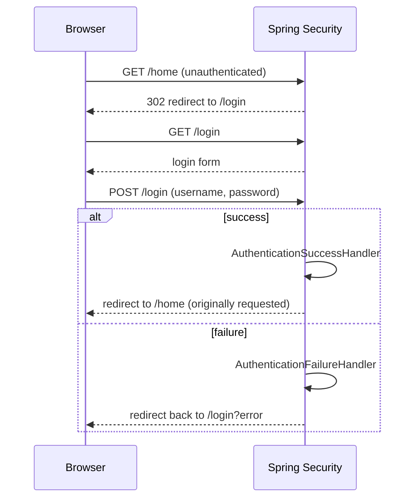

## Objective

HTTP Basic e login por formulário são as duas formas nativas do Spring Security
de coletar um username e uma senha de um client. HTTP Basic é o mecanismo mais
simples possível — as credenciais viajam em todo request, num header — o que o
torna excelente para demos, provas de conceito e chamadas machine-to-machine,
mas uma péssima escolha para qualquer coisa com UI voltada a um browser. O
login por formulário troca essa simplicidade pelo que uma aplicação web pequena
realmente precisa: uma página de login de verdade, uma sessão que lembra o
usuário autenticado entre requests, e um fluxo de logout — tudo autoconfigurado
com uma única chamada de método, e depois customizável em camadas conforme
requisitos reais aparecem.

## Use Cases

- Proteger uma aplicação web pequena de ponta a ponta: um visitante não
  autenticado é redirecionado para um formulário de login e, após um login bem
  sucedido, é enviado de volta para a página que originalmente tentou acessar.
- Retornar uma resposta de erro customizada (um header específico, um status
  HTTP diferente, um request ID para tracing) em vez do comportamento padrão do
  Spring Security quando a autenticação falha, tanto para HTTP Basic quanto
  para login por formulário.
- Redirecionar usuários diferentes para páginas diferentes após um login bem
  sucedido, com base nas suas authorities concedidas.
- Suportar os dois métodos de autenticação na mesma aplicação ao mesmo tempo —
  HTTP Basic para clients de API/tooling usando `curl`, login por formulário
  para usuários de browser — com uma única configuração de segurança.

## Deep Dive

### HTTP Basic: configuração mínima, depois um realm e entry point customizados

A forma mínima de exigir autenticação HTTP Basic é uma única chamada:

```java
@Configuration
public class ProjectConfig extends WebSecurityConfigurerAdapter {

    @Override
    protected void configure(HttpSecurity http) throws Exception {
        http.httpBasic();
    }
}
```

`httpBasic()` também aceita um `Customizer<HttpBasicConfigurer<HttpSecurity>>`,
que é como detalhes mais finos — como o nome do realm devolvido no header
`WWW-Authenticate` numa requisição que falha — são configurados:

```java
@Override
protected void configure(HttpSecurity http) throws Exception {
    http.httpBasic(c -> {
        c.realmName("OTHER");
    });

    http.authorizeRequests().anyRequest().authenticated();
}
```

Um `curl -v` contra um endpoint protegido sem credenciais agora mostra
`WWW-Authenticate: Basic realm="OTHER"` — mas somente numa resposta
`401 Unauthorized`; um `200 OK` bem sucedido nunca carrega esse header.

### Customizando uma falha de autenticação: AuthenticationEntryPoint

Além do nome do realm, um corpo de resposta ou conjunto de headers totalmente
customizado numa falha de autenticação precisa de um `AuthenticationEntryPoint`.
Seu método `commence()` recebe o request, a response, e a `AuthenticationException`
que disparou a falha:

```java
public class CustomEntryPoint implements AuthenticationEntryPoint {

    @Override
    public void commence(
        HttpServletRequest httpServletRequest,
        HttpServletResponse httpServletResponse,
        AuthenticationException e)
            throws IOException, ServletException {

        httpServletResponse.addHeader("message", "Luke, I am your father!");
        httpServletResponse.sendError(HttpStatus.UNAUTHORIZED.value());
    }
}
```

Registrado junto com o nome do realm:

```java
@Override
protected void configure(HttpSecurity http) throws Exception {
    http.httpBasic(c -> {
        c.realmName("OTHER");
        c.authenticationEntryPoint(new CustomEntryPoint());
    });

    http.authorizeRequests().anyRequest().authenticated();
}
```

`AuthenticationEntryPoint` é invocado pelo `ExceptionTranslationManager`, o
componente que traduz exceptions Java lançadas dentro da filter chain
(`AuthenticationException`, `AccessDeniedException`) de volta em respostas HTTP
— o nome não sugere obviamente "roda numa falha de autenticação", o que vale a
pena saber antes de sair procurando uma interface com outro nome.

### Login por formulário: uma página de login autoconfigurada, sem escrever HTML

Trocar `httpBasic()` por `formLogin()` já é suficiente para ter uma página de
login funcional, gerenciamento de sessão e um endpoint de logout, sem nenhum
HTML escrito pela aplicação:

```java
@Configuration
public class ProjectConfig extends WebSecurityConfigurerAdapter {

    @Override
    protected void configure(HttpSecurity http) throws Exception {
        http.formLogin();
        http.authorizeRequests().anyRequest().authenticated();
    }
}
```

Sem um `UserDetailsService` registrado, as credenciais padrão
`user`/UUID-gerado (as mesmas introduzidas em capítulos anteriores) fazem login
nesse formulário exatamente como fariam no HTTP Basic. Uma página protegida
ainda precisa de um `@Controller` normal (não um `@RestController`) retornando
um nome de view, para que a resposta seja HTML renderizável em vez de um corpo
JSON:

```java
@Controller
public class HelloController {

    @GetMapping("/home")
    public String home() {
        return "home.html";
    }
}
```

Uma visita não autenticada a `/home` é redirecionada primeiro para o
formulário de login; após um login bem sucedido, o Spring Security manda o
browser de volta para `/home` — a página originalmente pedida — em vez de uma
página de destino fixa.

### Redirecionando após o login: defaultSuccessUrl e as duas interfaces de handler

`formLogin()` retorna um `FormLoginConfigurer<HttpSecurity>`, cujo
`defaultSuccessUrl()` fixa o destino pós-login independentemente de qual
página disparou o redirect de login:

```java
@Override
protected void configure(HttpSecurity http) throws Exception {
    http.formLogin()
        .defaultSuccessUrl("/home", true);

    http.authorizeRequests().anyRequest().authenticated();
}
```

Para lógica que depende de *quem* fez login — redirects diferentes por
authority concedida, por exemplo — `AuthenticationSuccessHandler` dá controle
total sobre a resposta:

```java
@Component
public class CustomAuthenticationSuccessHandler
    implements AuthenticationSuccessHandler {

    @Override
    public void onAuthenticationSuccess(
        HttpServletRequest httpServletRequest,
        HttpServletResponse httpServletResponse,
        Authentication authentication)
            throws IOException {

        var authorities = authentication.getAuthorities();

        var auth = authorities.stream()
            .filter(a -> a.getAuthority().equals("read"))
            .findFirst();

        if (auth.isPresent()) {
            httpServletResponse.sendRedirect("/home");
        } else {
            httpServletResponse.sendRedirect("/error");
        }
    }
}
```

Sua imagem espelhada, `AuthenticationFailureHandler`, faz o equivalente para um
login que falhou — aqui, carimbando um header de timestamp em cada tentativa
falhada:

```java
@Component
public class CustomAuthenticationFailureHandler
    implements AuthenticationFailureHandler {

    @Override
    public void onAuthenticationFailure(
        HttpServletRequest httpServletRequest,
        HttpServletResponse httpServletResponse,
        AuthenticationException e) {

        httpServletResponse.setHeader("failed", LocalDateTime.now().toString());
    }
}
```

Ambos são registrados da mesma forma, no `FormLoginConfigurer`:

```java
@Override
protected void configure(HttpSecurity http) throws Exception {
    http.formLogin()
        .successHandler(authenticationSuccessHandler)
        .failureHandler(authenticationFailureHandler);

    http.authorizeRequests().anyRequest().authenticated();
}
```



### Rodando os dois métodos juntos

Uma vez que `formLogin()` está configurado, credenciais de HTTP Basic sozinhas
param de funcionar — todo request não autenticado é redirecionado para o
formulário de login (`302 Found`), mesmo com um header `Authorization` válido
anexado. Encadear `.httpBasic()` depois de `formLogin()` reabilita os dois ao
mesmo tempo:

```java
@Override
protected void configure(HttpSecurity http) throws Exception {
    http.formLogin()
        .successHandler(authenticationSuccessHandler)
        .failureHandler(authenticationFailureHandler)
    .and()
        .httpBasic();

    http.authorizeRequests().anyRequest().authenticated();
}
```

Com os dois ativos, um browser recebe o formulário de login como antes, e uma
chamada `curl -u user:password` autentica via HTTP Basic no mesmo endpoint.

## Trade-offs

- **HTTP Basic envia credenciais em todo request, num header decodificado com
  nada além de Base64** — ótimo sobre TLS para clients scriptados/de API que já
  gerenciam credenciais com segurança, uma péssima escolha para qualquer coisa
  que um humano digite num browser, já que não há sessão, não há logout e não
  há página de login para construir confiança ou adicionar fatores extras.
- **Login por formulário troca a ausência de estado do HTTP Basic por uma
  sessão no servidor** — o livro é explícito que isso serve para uma aplicação
  pequena, não uma que precise de escalabilidade horizontal, já que uma sessão
  no servidor amarra um usuário a qualquer node que a segure (ou exige um
  session store compartilhado para resolver isso). O livro aponta para OAuth 2
  (seus capítulos 12-15) como a resposta para esse caso.
- **O nome de `AuthenticationEntryPoint` não descreve o que ele faz** — ele é
  invocado especificamente numa *falha* de autenticação, via
  `ExceptionTranslationManager`, não em todo request; procurar uma interface
  com outro nome ao caçar "customizar a resposta de auth que falhou" é um
  primeiro palpite fácil de errar.
- **Combinar `formLogin()` e `httpBasic()` não é automático — a presença de um
  silencia o outro a menos que ambos sejam explicitamente encadeados.** Um
  time que assume "HTTP Basic ainda funciona porque nunca removi" depois de
  adicionar `formLogin()` vai receber um redirect `302` em vez do `401`/sucesso
  que espera, até que `.httpBasic()` seja adicionado de volta junto.
- **Livro vs. hoje: o estilo fluente encadeado com `.and()` em que esta seção
  se apoia o tempo todo (`formLogin()...and().httpBasic()`) está programado
  para remoção no Spring Security 7**, em favor exclusivamente da Lambda DSL —
  confirmado pela documentação atual de migração do Spring Security. A
  configuração equivalente hoje fica:
  ```java
  http
      .formLogin(form -> form
          .successHandler(authenticationSuccessHandler)
          .failureHandler(authenticationFailureHandler)
      )
      .httpBasic(Customizer.withDefaults());
  ```
  O Spring Security 7 também remove as chamadas `httpBasic()`/`formLogin()`
  sem argumento que esta seção usa nos exemplos de configuração mínima — um
  argumento `Customizer` passa a ser obrigatório, com `Customizer.withDefaults()`
  como o substituto explícito para "usar os defaults". A mecânica subjacente
  (nome do realm, `AuthenticationEntryPoint`, `defaultSuccessUrl`, handlers de
  success/failure) permanece inalterada — só a sintaxe de configuração ao
  redor delas é afetada, a mesma migração de `WebSecurityConfigurerAdapter`
  para bean `SecurityFilterChain` já observada em outros pontos deste
  workflow.

## Documentation Links

- Laurențiu Spilcă, "Spring Security in Action" (Manning, 2020) — Chapter 5, "Implementing authentication", section 5.3, p. 125-133 — doc
- [Spring Security Reference — Basic Authentication](https://docs.spring.io/spring-security/reference/servlet/authentication/passwords/basic.html) — doc
- [Spring Security Reference — Form Login](https://docs.spring.io/spring-security/reference/servlet/authentication/passwords/form.html) — doc
- [Spring Security Reference — Configuration Migrations (Spring Security 7, .and() removal, mandatory Customizer)](https://docs.spring.io/spring-security/reference/6.5/migration-7/configuration.html) — doc
