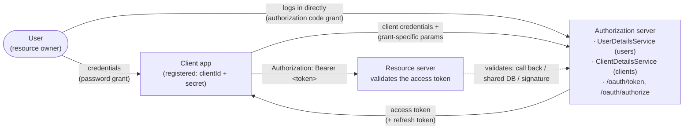

## Objective

Understand how to *build* the component that issues access tokens — the OAuth 2
authorization server — and how the same server serves several grant types purely
through client registration. The book does this with one annotation
(`@EnableAuthorizationServer`) plus a `ClientDetailsService`, which is the clearest
possible illustration of the design; it is also the single most out-of-date piece of
code in the entire book, because the project that annotation belongs to,
**Spring Security OAuth**, was end-of-lifed and archived, and building an
authorization server today means `RegisteredClient`/`RegisteredClientRepository`
beans from **Spring Authorization Server** — which, as of Spring Security 7.0, has
itself been folded back into Spring Security. This concept covers both: the book's
model as a conceptual map, and the current API as the thing you'd actually write.

## Use Cases

- Standing up an in-house authorization server because the system needs to issue its
  own tokens rather than delegate to GitHub/Okta/Keycloak — the mirror image of the
  client side in `spring-security-oauth2-client-and-sso`.
- Deciding, per client application, which grant types that client may use — the
  authorization server needs no per-grant code, only per-client registration.
- Migrating a real `@EnableAuthorizationServer` codebase (there are still many) onto
  Spring Authorization Server, and discovering mid-migration that the password grant
  it depended on is deliberately not implemented.
- Understanding what a resource server is actually trusting: the tokens validated in
  `spring-security-oauth2-resource-server-approaches` and
  `spring-security-jwt-signing-symmetric-and-asymmetric` are the tokens this server
  mints.

## Deep Dive

### Where the authorization server sits

Three components, three trust relationships. The authorization server is the only one
that holds credentials — for *both* users and clients — and the only one that issues
tokens:



The book's chapter 11 hand-rolled something shaped like this with custom filters and
a home-made token (see
`spring-security-custom-token-based-authentication`); chapter 13 replaces that
hand-rolled machinery with the standard OAuth 2 endpoints and formats.

### The book's authorization server: one dependency, one annotation

The book adds `spring-cloud-starter-oauth2` (with the `spring-cloud-dependencies`
BOM pinned to `Hoxton.SR1`) alongside the usual web and security starters, then
declares a configuration class:

```java
@Configuration
@EnableAuthorizationServer
public class AuthServerConfig
    extends AuthorizationServerConfigurerAdapter {
}
```

That is a complete, running authorization server. It exposes `/oauth/token` and
`/oauth/authorize` automatically. What's still missing is the three things that make
it *usable*: users, at least one registered client, and a decision about which grant
types to support.

### User management: unchanged contracts, plus an exposed `AuthenticationManager`

The authorization server is the component that authenticates *users*, so it needs
user management — and nothing about it is OAuth-specific. The same `UserDetails`,
`UserDetailsService`, `UserDetailsManager` and `PasswordEncoder` contracts from
`spring-security-user-management` apply verbatim:

```java
@Configuration
public class WebSecurityConfig
    extends WebSecurityConfigurerAdapter {

    @Bean
    public UserDetailsService uds() {
        var uds = new InMemoryUserDetailsManager();
        var u = User.withUsername("john")
                    .password("12345")
                    .authorities("read")
                    .build();
        uds.createUser(u);
        return uds;
    }

    @Bean
    public PasswordEncoder passwordEncoder() {
        return NoOpPasswordEncoder.getInstance();
    }

    @Bean
    public AuthenticationManager authenticationManagerBean()
        throws Exception {
        return super.authenticationManagerBean();
    }
}
```

The one genuinely new step is the last bean: the authorization server needs the
`AuthenticationManager` handed to it explicitly, which is why the class extends
`WebSecurityConfigurerAdapter` at all (that's the only way to reach
`super.authenticationManagerBean()`):

```java
@Configuration
@EnableAuthorizationServer
public class AuthServerConfig
    extends AuthorizationServerConfigurerAdapter {

    @Autowired
    private AuthenticationManager authenticationManager;

    @Override
    public void configure(
        AuthorizationServerEndpointsConfigurer endpoints) {
        endpoints.authenticationManager(authenticationManager);
    }
}
```

One structural difference from every previous chapter: there is no `SecurityContext`
in this flow. The result of authentication isn't stored per-session — it's
represented by a token held in a `TokenStore`.

### `ClientDetails`/`ClientDetailsService`: `UserDetails`' twin, for clients

A client is an independent principal with its own credentials, and the authorization
server only serves clients it knows. Spring Security OAuth models this with a set of
contracts deliberately parallel to the user-side ones:

| Users | Clients |
| --- | --- |
| `UserDetails` | `ClientDetails` |
| `UserDetailsService` | `ClientDetailsService` |
| `InMemoryUserDetailsManager` | `InMemoryClientDetailsService` |
| `JdbcUserDetailsManager` | `JdbcClientDetailsService` |
| `User` (builder) | `BaseClientDetails` |

The explicit, contract-level form:

```java
@Override
public void configure(
    ClientDetailsServiceConfigurer clients)
    throws Exception {

    var service = new InMemoryClientDetailsService();

    var cd = new BaseClientDetails();
    cd.setClientId("client");
    cd.setClientSecret("secret");
    cd.setScope(List.of("read"));
    cd.setAuthorizedGrantTypes(List.of("password"));

    service.setClientDetailsStore(Map.of("client", cd));
    clients.withClientDetails(service);
}
```

And the fluent shorthand that does the same thing:

```java
@Override
public void configure(
    ClientDetailsServiceConfigurer clients)
    throws Exception {

    clients.inMemory()
           .withClient("client")
           .secret("secret")
           .authorizedGrantTypes("password")
           .scopes("read");
}
```

The shorthand is nicer to read; the contract form is what you want once client
details live in a database, which is the realistic case.

### Password grant: already done

With users and a client registered for `password`, the password grant works with no
further code. The client authenticates itself with HTTP Basic and passes the user's
credentials as query parameters:

```bash
curl -v -XPOST -u client:secret "http://localhost:8080/oauth/token?grant_type=password&username=john&password=12345&scope=read"
```

```json
{
    "access_token":"693e11d3-bd65-431b-95ff-a1c5f73aca8c",
    "token_type":"bearer",
    "expires_in":42637,
    "scope":"read"
}
```

Note the token: with the default Spring Security OAuth configuration it is a plain
UUID — an *opaque* token, meaningless to anyone but the authorization server. That's
why chapter 14 has to discuss three different ways for a resource server to validate
it.

### Authorization code grant: a redirect URI and a login page

Switching grant types is a client-registration change, not a server change — plus one
extra requirement specific to this grant, a `redirectUris(...)`:

```java
@Override
public void configure(
    ClientDetailsServiceConfigurer clients)
    throws Exception {

    clients.inMemory()
           .withClient("client")
           .secret("secret")
           .authorizedGrantTypes("authorization_code")
           .scopes("read")
           .redirectUris("http://localhost:9090/home");
}
```

Because in this flow the *user* authenticates directly at the authorization server,
the server must also offer a login page — ordinary form login, nothing OAuth-specific:

```java
@Configuration
public class WebSecurityConfig
    extends WebSecurityConfigurerAdapter {

    @Override
    protected void configure(HttpSecurity http)
        throws Exception {
        http.formLogin();
    }
}
```

The flow then runs in the browser. The client sends the user to:

```
http://localhost:8080/oauth/authorize?response_type=code&client_id=client&scope=read
```

The server shows the login page, then a consent screen asking the user to grant the
requested scopes, then redirects to the registered URI with the code appended:

```
http://localhost:9090/home?code=qeSLSt
```

The client exchanges that code — **once** — for a token:

```bash
curl -v -XPOST -u client:secret "http://localhost:8080/oauth/token?grant_type=authorization_code&scope=read&code=qeSLSt"
```

Replaying the same code fails, which is the whole point of a single-use code:

```json
{
    "error":"invalid_grant",
    "error_description":"Invalid authorization code: qeSLSt"
}
```

### Client credentials and refresh token: two more strings

Client credentials — no user involved, for backend-to-backend calls or endpoints that
aren't tied to any user's data (a server-status endpoint, say):

```java
clients.inMemory()
       .withClient("client")
       .secret("secret")
       .authorizedGrantTypes("client_credentials")
       .scopes("info");
```

```bash
curl -v -XPOST -u client:secret "http://localhost:8080/oauth/token?grant_type=client_credentials&scope=info"
```

Refresh tokens aren't a standalone flow; adding `refresh_token` to a client that also
has `password` or `authorization_code` makes the server return a refresh token
alongside the access token:

```java
clients.inMemory()
       .withClient("client")
       .secret("secret")
       .authorizedGrantTypes("password", "refresh_token")
       .scopes("read");
```

```json
{
    "access_token":"da2a4837-20a4-447d-917b-a22b4c0e9517",
    "token_type":"bearer",
    "refresh_token":"221f5635-086e-4b11-808c-d88099a76213",
    "expires_in":43199,
    "scope":"read"
}
```

Since `authorizedGrantTypes(...)` takes free-form strings rather than enum values,
`authorizedGrantTypes("password", "hocus_pocus")` compiles, starts, and works — as
long as nobody ever requests `hocus_pocus`. Typos in grant names are silent.

### Multiple grants on one registration is usually a smell

The API happily allows it, and multiple clients each with their own grants is normal:

```java
clients.inMemory()
       .withClient("client1")
       .secret("secret1")
       .authorizedGrantTypes("authorization_code")
       .scopes("read")
       .redirectUris("http://localhost:9090/home")
       .and()
       .withClient("client2")
       .secret("secret2")
       .authorizedGrantTypes(
           "authorization_code", "password", "refresh_token")
       .scopes("read")
       .redirectUris("http://localhost:9090/home");
```

What the book flags as a real-world antipattern is *credential sharing* — several
distinct applications registered as one client, which destroys per-app auditing and
means one leaked secret compromises all of them. Worse is mixing a user-consent grant
with `client_credentials` on the same scope:

```java
clients.inMemory()
       .withClient("client")
       .secret("secret")
       .authorizedGrantTypes(
           "authorization_code",
           "client_credentials")
       .scopes("read")
```

Now the client can obtain a `read` token *without any user in the loop* — so an
endpoint like `/transactions`, protected by scope `read` because it's a user
resource, becomes reachable by the client alone. That's not a configuration quirk;
it's a privilege-escalation hole created by treating grant types as interchangeable
ways of getting the same token.

### Book vs. today: this entire chapter's API is end-of-life

This is the largest book-vs-today gap in the book, and it is not a deprecation — the
project is gone.

**The timeline (verified against the Spring team's own blog posts):**

1. **14 Nov 2019** — the *Spring Security OAuth 2.0 Roadmap Update* announces that
   the Spring Security team will **not** provide authorization server support, citing
   the abundance of commercial and open-source authorization servers. Legacy branches
   2.0.x–2.2.x were already unsupported.
2. **2020** — after community pushback, the team reverses course on *authorization
   server* specifically and starts **Spring Authorization Server** as a new,
   separate, community-driven project.
3. **7 May 2020** — *End-of-Life for Spring Security OAuth* sets the schedule:
   2.3.x EOL March 2020; patch and security fixes for 2.4.x/2.5.x until May 2021;
   security fixes only for 2.5.x until **May 2022**. (The book published in 2020,
   the same year as this announcement.)
4. **1 Jun 2022** — *Spring Security OAuth reaches End-of-Life*. Both
   `spring-security-oauth` and `spring-security-oauth2-boot` are EOL; the repository
   was archived 31 May 2022. Its README now reads: "spring-security-oauth is no
   longer actively maintained… replaced by the OAuth2 support provided by Spring
   Security (client and resource server) and Spring Authorization Server."
5. **22 Nov 2022** — **Spring Authorization Server 1.0 GA**, coordinates
   `org.springframework.security:spring-security-oauth2-authorization-server:1.0.0`,
   built on Spring Security 6.0, JDK 17 minimum.
6. **11 Sep 2025** — *Spring Authorization Server moving to Spring Security 7.0*:
   the `1.5.x` branch is the **last generation of the standalone project**. From
   Spring Security 7.0, authorization server support ships *inside* Spring Security
   (same groupId/artifactId, version `7.0.0`; class names and packages preserved
   apart from a couple of minor relocations), and the reference docs now live under
   the Spring Security reference as an "OAuth2 Authorization Server" section. The
   final standalone GA line is 1.5.x (1.5.8 at time of writing).

So the book's `spring-cloud-starter-oauth2` + `@EnableAuthorizationServer` +
`AuthorizationServerConfigurerAdapter` + `ClientDetails`/`ClientDetailsService`
+ `ClientDetailsServiceConfigurer` have **no successor with the same shape**. There
is no modern `@EnableAuthorizationServer`. The replacement is bean composition.

**The mapping:**

| Book (Spring Security OAuth, EOL) | Today (Spring Authorization Server / Spring Security 7) |
| --- | --- |
| `spring-cloud-starter-oauth2` | `spring-boot-starter-oauth2-authorization-server` |
| `@EnableAuthorizationServer` | a `SecurityFilterChain` bean with `OAuth2AuthorizationServerConfigurer` (or `@Import(OAuth2AuthorizationServerConfiguration.class)`) |
| `AuthorizationServerConfigurerAdapter` overrides | individual `@Bean`s |
| `ClientDetails` | `RegisteredClient` |
| `ClientDetailsService` | `RegisteredClientRepository` |
| `InMemoryClientDetailsService` | `InMemoryRegisteredClientRepository` |
| `JdbcClientDetailsService` | `JdbcRegisteredClientRepository` |
| `ClientDetailsServiceConfigurer` (fluent DSL) | `RegisteredClient.withId(...)` builder |
| endpoint config via `AuthorizationServerEndpointsConfigurer` | `AuthorizationServerSettings` bean |
| `/oauth/authorize`, `/oauth/token` | `/oauth2/authorize`, `/oauth2/token`, `/oauth2/jwks`, `/oauth2/introspect`, `/oauth2/revoke` |
| opaque UUID token by default | self-contained **JWT** by default (opaque still available) |
| grant type as a free-form `String` | `AuthorizationGrantType` constant |

**The password grant is deliberately not supported.** Spring Authorization Server
implements `authorization_code`, `client_credentials`, `refresh_token`,
`device_code` and `token_exchange` — and nothing else. The Spring Security team's
own OAuth 2.0 Features Matrix lists both *Resource Owner Password Credentials* and
*Implicit* as "Not implemented [deprecated from OAuth 2.1]". Correspondingly,
`AuthorizationGrantType.PASSWORD` was deprecated in Spring Security 6.x with the
note "The latest OAuth 2.0 Security Best Current Practice disallows the use of the
Resource Owner Password Credentials grant", and it is absent from the Spring
Security 7.0 API docs entirely. Section 13.4 of the book — the section that shows
the password grant as the *easiest* thing the server does — therefore has no
supported modern equivalent. Migrating an app that depends on it means either
changing the flow (authorization code with PKCE for user-facing apps, client
credentials for machine-to-machine) or writing a custom
`AuthenticationProvider`/`AuthenticationConverter` pair against the token endpoint,
which the project supports as a customization but does not endorse.

**Authorization code, today.** The two required custom beans are the client
repository and a signing key source; the rest is a filter chain:

```java
@Configuration
@EnableWebSecurity
public class AuthorizationServerConfig {

    @Bean
    @Order(1)
    public SecurityFilterChain authorizationServerSecurityFilterChain(
        HttpSecurity http) throws Exception {

        OAuth2AuthorizationServerConfigurer authorizationServerConfigurer =
            OAuth2AuthorizationServerConfigurer.authorizationServer();

        http
            .securityMatcher(authorizationServerConfigurer.getEndpointsMatcher())
            .with(authorizationServerConfigurer, (authorizationServer) ->
                authorizationServer
                    .oidc(Customizer.withDefaults()))   // OpenID Connect 1.0
            .authorizeHttpRequests((authorize) ->
                authorize.anyRequest().authenticated())
            .exceptionHandling((exceptions) -> exceptions
                .defaultAuthenticationEntryPointFor(
                    new LoginUrlAuthenticationEntryPoint("/login"),
                    new MediaTypeRequestMatcher(MediaType.TEXT_HTML)));

        return http.build();
    }

    @Bean
    @Order(2)
    public SecurityFilterChain defaultSecurityFilterChain(HttpSecurity http)
            throws Exception {
        http
            .authorizeHttpRequests((authorize) ->
                authorize.anyRequest().authenticated())
            .formLogin(Customizer.withDefaults());   // the user login page
        return http.build();
    }

    @Bean
    public RegisteredClientRepository registeredClientRepository() {
        RegisteredClient oidcClient =
            RegisteredClient.withId(UUID.randomUUID().toString())
                .clientId("oidc-client")
                .clientSecret("{noop}secret")
                .clientAuthenticationMethod(
                    ClientAuthenticationMethod.CLIENT_SECRET_BASIC)
                .authorizationGrantType(AuthorizationGrantType.AUTHORIZATION_CODE)
                .authorizationGrantType(AuthorizationGrantType.REFRESH_TOKEN)
                .redirectUri("http://127.0.0.1:8080/login/oauth2/code/oidc-client")
                .postLogoutRedirectUri("http://127.0.0.1:8080/")
                .scope(OidcScopes.OPENID)
                .scope(OidcScopes.PROFILE)
                .clientSettings(ClientSettings.builder()
                    .requireAuthorizationConsent(true)
                    .build())
                .build();

        return new InMemoryRegisteredClientRepository(oidcClient);
    }

    @Bean
    public JWKSource<SecurityContext> jwkSource() {
        KeyPair keyPair = generateRsaKey();
        RSAKey rsaKey = new RSAKey.Builder((RSAPublicKey) keyPair.getPublic())
            .privateKey((RSAPrivateKey) keyPair.getPrivate())
            .keyID(UUID.randomUUID().toString())
            .build();
        return new ImmutableJWKSet<>(new JWKSet(rsaKey));
    }

    @Bean
    public JwtDecoder jwtDecoder(JWKSource<SecurityContext> jwkSource) {
        return OAuth2AuthorizationServerConfiguration.jwtDecoder(jwkSource);
    }

    @Bean
    public AuthorizationServerSettings authorizationServerSettings() {
        return AuthorizationServerSettings.builder().build();
    }
}
```

Point-for-point against the book: `@EnableAuthorizationServer` became the ordered
`SecurityFilterChain`; `configure(ClientDetailsServiceConfigurer)` became the
`RegisteredClientRepository` bean; `.redirectUris(...)` became `.redirectUri(...)`
on the builder; `http.formLogin()` is still `http.formLogin()`, just in its own
lower-priority chain; and `UserDetailsService` is unchanged — the whole of section
13.2's user management still applies, minus the `AuthenticationManager` bean, which
the authorization server no longer needs to be handed (there is no password grant to
hand it to). `requireAuthorizationConsent(true)` is the explicit switch for the
consent screen the book's server showed by default. Two things the book had no
equivalent for at all: `.oidc(...)` for OpenID Connect, and `JWKSource` — because
tokens are now signed JWTs, not UUIDs.

**Client credentials, today** — same repository bean, a different `RegisteredClient`.
No `redirectUri`, no user, so the whole login filter chain is irrelevant to it:

```java
@Bean
public RegisteredClientRepository registeredClientRepository() {
    RegisteredClient serviceClient =
        RegisteredClient.withId(UUID.randomUUID().toString())
            .clientId("service-client")
            .clientSecret("{noop}secret")
            .clientAuthenticationMethod(
                ClientAuthenticationMethod.CLIENT_SECRET_BASIC)
            .authorizationGrantType(AuthorizationGrantType.CLIENT_CREDENTIALS)
            .scope("info")
            .tokenSettings(TokenSettings.builder()
                .accessTokenTimeToLive(Duration.ofMinutes(30))
                .build())
            .build();

    return new InMemoryRegisteredClientRepository(serviceClient);
}
```

```bash
curl -v -XPOST -u service-client:secret "http://localhost:8080/oauth2/token?grant_type=client_credentials&scope=info"
```

The endpoint moved (`/oauth2/token`, not `/oauth/token`) and the response's
`access_token` is now a JWT rather than a UUID — but the shape of the exchange, and
the fact that enabling the grant was purely a registration decision, is exactly what
the book teaches.

**Other book-era API in these listings that is independently gone.**
`WebSecurityConfigurerAdapter` (used in listings 13.3 and 13.9) was deprecated in
Spring Security 5.7 and removed in 6.0 — see
`spring-security-authentication-provider-contract` for the bean-based replacement.
`NoOpPasswordEncoder` is deprecated. And `spring-cloud-starter-oauth2` itself no
longer carries authorization server support, so the book's dependency block is
unusable on any current Spring Boot.

## Trade-offs

- **"Grant type is just client registration" is the book's best insight and it
  survives the rewrite.** In both APIs the server contains zero per-grant code — you
  enable a grant by listing it on a client. That's why the chapter can cover four
  grant types in twenty pages, and why the modern `RegisteredClient` builder reads so
  similarly despite sharing no types with the old one.
- **Free-form grant-type strings vs. `AuthorizationGrantType` constants.** The book's
  `authorizedGrantTypes("password", "hocus_pocus")` is accepted silently; the modern
  builder takes an `AuthorizationGrantType`, so a nonexistent grant is a compile
  error. The flip side is that a *removed* grant is also a compile error, which is
  precisely what makes password-grant migrations hard rather than merely tedious.
- **In-memory client storage is a study aid in both eras.** `InMemoryClientDetailsService`
  and `InMemoryRegisteredClientRepository` are both documented as
  development/testing-only; the JDBC variants (`JdbcClientDetailsService`,
  `JdbcRegisteredClientRepository`) are the real-world answer, and the modern one
  needs its schema installed and client secrets `PasswordEncoder`-encoded (the
  `{noop}` prefix in the examples above is a deliberate demo shortcut, not a pattern).
- **Opaque UUID tokens vs. JWT by default is a real architectural change, not a
  detail.** The book's UUID token forces the resource server to consult the
  authorization server (or a shared database) on every request — hence chapter 14's
  three validation strategies. A self-contained signed JWT lets the resource server
  validate offline against the JWK set, which is faster and decoupled but makes
  revocation genuinely hard. Neither default is universally right; today's default
  just picked the other side.
- **Sharing a client registration across applications, or across user-consent and
  machine-only grants, is a security defect.** Per-app registration buys individual
  auditing, blast-radius isolation on a leaked secret, and scope separation. Adding
  `client_credentials` next to `authorization_code` on the same scope hands the
  client user-level access with no user present.
- **Building your own authorization server is a bigger commitment than the chapter's
  page count suggests** — and the Spring team said so out loud in 2019 when they first
  declined to support it. A hosted or off-the-shelf identity provider (Keycloak,
  Auth0, Okta, Entra ID) is the default choice; Spring Authorization Server earns its
  place when you need full control of the token, the consent UX, or the deployment,
  or when licensing/hosting costs dominate.
- **The successor project has now moved twice.** Code written against
  `spring-security-oauth2-authorization-server:1.x` needs a version (and minor
  package) bump for Spring Security 7.0, where the project lives on as part of Spring
  Security rather than standalone. That churn is mild compared to the 2022 EOL, but
  it's worth knowing that 1.5.x is the end of the standalone line, so pinning to it
  indefinitely is a dead end.

## Documentation Links

- [Spring Security in Action (Manning, 2020) — Chapter 13, "OAuth 2: Implementing the authorization server", sections 13.1-13.7, p. 318-337](https://www.manning.com/books/spring-security-in-action) — doc
- [Spring Security Reference — OAuth2 Authorization Server (Spring Security 7)](https://docs.spring.io/spring-security/reference/servlet/oauth2/authorization-server/index.html) — doc
- [Spring Authorization Server Reference — Getting Started](https://docs.spring.io/spring-authorization-server/reference/getting-started.html) — doc
- [Spring Authorization Server Reference — Core Model / Components (RegisteredClient, RegisteredClientRepository)](https://docs.spring.io/spring-authorization-server/reference/core-model-components.html) — doc
- [Spring Authorization Server Reference — Configuration Model (AuthorizationServerSettings, default endpoints)](https://docs.spring.io/spring-authorization-server/reference/configuration-model.html) — doc
- [Spring Authorization Server Reference — Overview (supported grant types)](https://docs.spring.io/spring-authorization-server/reference/overview.html) — doc
- [Spring Blog — Spring Security OAuth 2.0 Roadmap Update (14 Nov 2019)](https://spring.io/blog/2019/11/14/spring-security-oauth-2-0-roadmap-update/) — doc
- [Spring Blog — End-of-Life for Spring Security OAuth (7 May 2020)](https://spring.io/blog/2020/05/07/end-of-life-for-spring-security-oauth/) — doc
- [Spring Blog — Spring Security OAuth reaches End-of-Life (1 Jun 2022)](https://spring.io/blog/2022/06/01/spring-security-oauth-reaches-end-of-life/) — doc
- [Spring Blog — Spring Authorization Server 1.0 is now GA (22 Nov 2022)](https://spring.io/blog/2022/11/22/spring-authorization-server-1-0-is-now-ga/) — doc
- [Spring Blog — Spring Authorization Server moving to Spring Security 7.0 (11 Sep 2025)](https://spring.io/blog/2025/09/11/spring-authorization-server-moving-to-spring-security-7-0/) — doc
- [GitHub — spring-attic/spring-security-oauth (archived, EOL README)](https://github.com/spring-attic/spring-security-oauth) — doc
- [GitHub Wiki — Spring Security OAuth 2.0 Features Matrix (password/implicit "Not implemented [deprecated from OAuth 2.1]")](https://github.com/spring-projects/spring-security/wiki/OAuth-2.0-Features-Matrix) — doc
- [Spring Security API — AuthorizationGrantType](https://docs.spring.io/spring-security/site/docs/current/api/org/springframework/security/oauth2/core/AuthorizationGrantType.html) — doc
