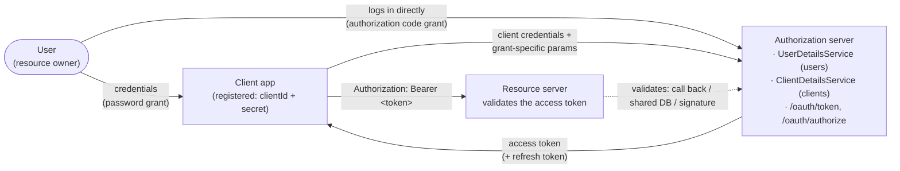

## Objective

Entender como *construir* o componente que emite access tokens — o
authorization server OAuth 2 — e como o mesmo servidor atende vários grant
types puramente através de client registration. O livro faz isso com uma
única annotation (`@EnableAuthorizationServer`) mais um
`ClientDetailsService`, que é a ilustração mais clara possível do design; é
também a peça de código mais desatualizada de todo o livro, porque o
projeto ao qual essa annotation pertence, **Spring Security OAuth**, chegou
ao fim de vida e foi arquivado, e construir um authorization server hoje
significa beans `RegisteredClient`/`RegisteredClientRepository` do
**Spring Authorization Server** — que, a partir do Spring Security 7.0, foi
por sua vez reincorporado ao próprio Spring Security. Este conceito cobre
os dois: o modelo do livro como mapa conceitual, e a API atual como aquilo
que você de fato escreveria.

## Use Cases

- Levantar um authorization server interno porque o sistema precisa emitir
  seus próprios tokens em vez de delegar a GitHub/Okta/Keycloak — a imagem
  espelhada do lado client em `spring-security-oauth2-client-and-sso`.
- Decidir, por aplicação client, quais grant types aquele client pode usar —
  o authorization server não precisa de código por grant, só de registro por
  client.
- Migrar uma base de código `@EnableAuthorizationServer` real (ainda existem
  muitas) para o Spring Authorization Server, e descobrir no meio da
  migração que o password grant do qual ela dependia deliberadamente não
  está implementado.
- Entender no que um resource server está de fato confiando: os tokens
  validados em `spring-security-oauth2-resource-server-approaches` e
  `spring-security-jwt-signing-symmetric-and-asymmetric` são os tokens que
  este servidor emite.

## Deep Dive

### Onde o authorization server se encaixa

Três componentes, três relações de confiança. O authorization server é o
único que guarda credenciais — tanto de usuários quanto de clients — e o
único que emite tokens:



O capítulo 11 do livro montou algo com esse formato na mão, com filters
customizados e um token caseiro (veja
`spring-security-custom-token-based-authentication`); o capítulo 13
substitui essa maquinaria artesanal pelos endpoints e formatos padrão do
OAuth 2.

### O authorization server do livro: uma dependência, uma annotation

O livro adiciona `spring-cloud-starter-oauth2` (com a BOM
`spring-cloud-dependencies` fixada em `Hoxton.SR1`) ao lado dos starters
usuais de web e security, depois declara uma classe de configuração:

```java
@Configuration
@EnableAuthorizationServer
public class AuthServerConfig
    extends AuthorizationServerConfigurerAdapter {
}
```

Isso já é um authorization server completo e funcionando. Ele expõe
`/oauth/token` e `/oauth/authorize` automaticamente. O que ainda falta são
as três coisas que o tornam *usável*: usuários, pelo menos um client
registrado, e uma decisão sobre quais grant types suportar.

### Gerenciamento de usuários: contratos inalterados, mais um `AuthenticationManager` exposto

O authorization server é o componente que autentica *usuários*, então
precisa de gerenciamento de usuários — e nada nisso é específico de OAuth.
Os mesmos contratos `UserDetails`, `UserDetailsService`,
`UserDetailsManager` e `PasswordEncoder` de
`spring-security-user-management` se aplicam ao pé da letra:

```java
@Configuration
public class WebSecurityConfig
    extends WebSecurityConfigurerAdapter {

    @Bean
    public UserDetailsService uds() {
        var uds = new InMemoryUserDetailsManager();
        var u = User.withUsername("john")
                    .password("12345")
                    .authorities("read")
                    .build();
        uds.createUser(u);
        return uds;
    }

    @Bean
    public PasswordEncoder passwordEncoder() {
        return NoOpPasswordEncoder.getInstance();
    }

    @Bean
    public AuthenticationManager authenticationManagerBean()
        throws Exception {
        return super.authenticationManagerBean();
    }
}
```

O único passo genuinamente novo é o último bean: o authorization server
precisa que o `AuthenticationManager` seja passado a ele explicitamente, o
que é o motivo de essa classe estender `WebSecurityConfigurerAdapter`
(essa é a única forma de alcançar `super.authenticationManagerBean()`):

```java
@Configuration
@EnableAuthorizationServer
public class AuthServerConfig
    extends AuthorizationServerConfigurerAdapter {

    @Autowired
    private AuthenticationManager authenticationManager;

    @Override
    public void configure(
        AuthorizationServerEndpointsConfigurer endpoints) {
        endpoints.authenticationManager(authenticationManager);
    }
}
```

Uma diferença estrutural em relação a todo capítulo anterior: não há
`SecurityContext` nesse fluxo. O resultado da autenticação não é armazenado
por sessão — é representado por um token guardado num `TokenStore`.

### `ClientDetails`/`ClientDetailsService`: o gêmeo de `UserDetails`, para clients

Um client é um principal independente com suas próprias credenciais, e o
authorization server só serve clients que conhece. O Spring Security OAuth
modela isso com um conjunto de contratos deliberadamente paralelos aos do
lado de usuário:

| Users | Clients |
| --- | --- |
| `UserDetails` | `ClientDetails` |
| `UserDetailsService` | `ClientDetailsService` |
| `InMemoryUserDetailsManager` | `InMemoryClientDetailsService` |
| `JdbcUserDetailsManager` | `JdbcClientDetailsService` |
| `User` (builder) | `BaseClientDetails` |

A forma explícita, em nível de contrato:

```java
@Override
public void configure(
    ClientDetailsServiceConfigurer clients)
    throws Exception {

    var service = new InMemoryClientDetailsService();

    var cd = new BaseClientDetails();
    cd.setClientId("client");
    cd.setClientSecret("secret");
    cd.setScope(List.of("read"));
    cd.setAuthorizedGrantTypes(List.of("password"));

    service.setClientDetailsStore(Map.of("client", cd));
    clients.withClientDetails(service);
}
```

E o atalho fluente que faz a mesma coisa:

```java
@Override
public void configure(
    ClientDetailsServiceConfigurer clients)
    throws Exception {

    clients.inMemory()
           .withClient("client")
           .secret("secret")
           .authorizedGrantTypes("password")
           .scopes("read");
}
```

O atalho é mais agradável de ler; a forma de contrato é o que você quer
assim que os detalhes de client passam a viver num banco de dados, que é o
caso realista.

### Password grant: já pronto

Com usuários e um client registrado para `password`, o password grant
funciona sem código adicional. O client se autentica com HTTP Basic e passa
as credenciais do usuário como query parameters:

```bash
curl -v -XPOST -u client:secret "http://localhost:8080/oauth/token?grant_type=password&username=john&password=12345&scope=read"
```

```json
{
    "access_token":"693e11d3-bd65-431b-95ff-a1c5f73aca8c",
    "token_type":"bearer",
    "expires_in":42637,
    "scope":"read"
}
```

Repare no token: com a configuração default do Spring Security OAuth ele é
um UUID puro — um token *opaco*, sem significado para ninguém além do
authorization server. É por isso que o capítulo 14 precisa discutir três
formas diferentes de um resource server validá-lo.

### Authorization code grant: uma redirect URI e uma página de login

Trocar de grant type é uma mudança de client registration, não uma mudança
no servidor — mais um requisito extra específico desse grant, um
`redirectUris(...)`:

```java
@Override
public void configure(
    ClientDetailsServiceConfigurer clients)
    throws Exception {

    clients.inMemory()
           .withClient("client")
           .secret("secret")
           .authorizedGrantTypes("authorization_code")
           .scopes("read")
           .redirectUris("http://localhost:9090/home");
}
```

Como nesse fluxo o *usuário* se autentica diretamente no authorization
server, o servidor também precisa oferecer uma página de login — login por
formulário comum, nada específico de OAuth:

```java
@Configuration
public class WebSecurityConfig
    extends WebSecurityConfigurerAdapter {

    @Override
    protected void configure(HttpSecurity http)
        throws Exception {
        http.formLogin();
    }
}
```

O fluxo então roda no browser. O client manda o usuário para:

```
http://localhost:8080/oauth/authorize?response_type=code&client_id=client&scope=read
```

O servidor mostra a página de login, depois uma tela de consentimento
pedindo ao usuário que conceda os scopes solicitados, depois redireciona
para a URI registrada com o code anexado:

```
http://localhost:9090/home?code=qeSLSt
```

O client troca esse code — **uma única vez** — por um token:

```bash
curl -v -XPOST -u client:secret "http://localhost:8080/oauth/token?grant_type=authorization_code&scope=read&code=qeSLSt"
```

Reutilizar o mesmo code falha, que é o ponto todo de um code de uso único:

```json
{
    "error":"invalid_grant",
    "error_description":"Invalid authorization code: qeSLSt"
}
```

### Client credentials e refresh token: mais duas strings

Client credentials — sem usuário envolvido, para chamadas
backend-a-backend ou endpoints que não estão amarrados aos dados de nenhum
usuário (um endpoint de status do servidor, digamos):

```java
clients.inMemory()
       .withClient("client")
       .secret("secret")
       .authorizedGrantTypes("client_credentials")
       .scopes("info");
```

```bash
curl -v -XPOST -u client:secret "http://localhost:8080/oauth/token?grant_type=client_credentials&scope=info"
```

Refresh tokens não são um fluxo independente; adicionar `refresh_token` a
um client que também tem `password` ou `authorization_code` faz o servidor
retornar um refresh token junto com o access token:

```java
clients.inMemory()
       .withClient("client")
       .secret("secret")
       .authorizedGrantTypes("password", "refresh_token")
       .scopes("read");
```

```json
{
    "access_token":"da2a4837-20a4-447d-917b-a22b4c0e9517",
    "token_type":"bearer",
    "refresh_token":"221f5635-086e-4b11-808c-d88099a76213",
    "expires_in":43199,
    "scope":"read"
}
```

Como `authorizedGrantTypes(...)` recebe strings livres em vez de valores de
enum, `authorizedGrantTypes("password", "hocus_pocus")` compila, inicia e
funciona — desde que ninguém nunca peça `hocus_pocus`. Erros de digitação em
nomes de grant são silenciosos.

### Múltiplos grants num único registro geralmente é um cheiro ruim

A API permite tranquilamente, e múltiplos clients cada um com seus
próprios grants é normal:

```java
clients.inMemory()
       .withClient("client1")
       .secret("secret1")
       .authorizedGrantTypes("authorization_code")
       .scopes("read")
       .redirectUris("http://localhost:9090/home")
       .and()
       .withClient("client2")
       .secret("secret2")
       .authorizedGrantTypes(
           "authorization_code", "password", "refresh_token")
       .scopes("read")
       .redirectUris("http://localhost:9090/home");
```

O que o livro sinaliza como um antipattern do mundo real é o
*compartilhamento de credenciais* — várias aplicações distintas registradas
como um único client, o que destrói a auditoria por aplicação e significa
que um secret vazado compromete todas elas. Pior ainda é misturar um grant
de consentimento de usuário com `client_credentials` no mesmo scope:

```java
clients.inMemory()
       .withClient("client")
       .secret("secret")
       .authorizedGrantTypes(
           "authorization_code",
           "client_credentials")
       .scopes("read")
```

Agora o client consegue obter um token `read` *sem nenhum usuário no
loop* — então um endpoint como `/transactions`, protegido pelo scope `read`
por ser um recurso de usuário, se torna alcançável só pelo client. Isso não
é uma peculiaridade de configuração; é um buraco de escalada de privilégio
criado por tratar grant types como formas intercambiáveis de obter o mesmo
token.

### Livro vs. hoje: a API deste capítulo inteiro chegou ao fim de vida

Esse é o maior gap livro-vs-hoje do livro, e não é uma depreciação — o
projeto acabou.

**A linha do tempo (verificada contra os próprios posts de blog do time
Spring):**

1. **14 Nov 2019** — o *Spring Security OAuth 2.0 Roadmap Update* anuncia
   que o time do Spring Security **não** vai fornecer suporte a
   authorization server, citando a abundância de authorization servers
   comerciais e open-source. As branches legadas 2.0.x–2.2.x já não tinham
   suporte.
2. **2020** — depois de pressão da comunidade, o time reverte a decisão
   especificamente sobre *authorization server* e começa o **Spring
   Authorization Server** como um projeto novo, separado e conduzido pela
   comunidade.
3. **7 Mai 2020** — *End-of-Life for Spring Security OAuth* define o
   cronograma: EOL da 2.3.x em março de 2020; correções de patch e
   segurança para 2.4.x/2.5.x até maio de 2021; apenas correções de
   segurança para 2.5.x até **maio de 2022**. (O livro foi publicado em
   2020, o mesmo ano desse anúncio.)
4. **1 Jun 2022** — *Spring Security OAuth reaches End-of-Life*. Tanto
   `spring-security-oauth` quanto `spring-security-oauth2-boot` estão EOL;
   o repositório foi arquivado em 31 de maio de 2022. Seu README agora diz:
   "spring-security-oauth is no longer actively maintained… replaced by the
   OAuth2 support provided by Spring Security (client and resource server)
   and Spring Authorization Server."
5. **22 Nov 2022** — **Spring Authorization Server 1.0 GA**, coordenadas
   `org.springframework.security:spring-security-oauth2-authorization-server:1.0.0`,
   construído sobre Spring Security 6.0, JDK 17 mínimo.
6. **11 Set 2025** — *Spring Authorization Server moving to Spring Security
   7.0*: a branch `1.5.x` é a **última geração do projeto standalone**. A
   partir do Spring Security 7.0, o suporte a authorization server passa a
   viver *dentro* do Spring Security (mesmo groupId/artifactId, versão
   `7.0.0`; nomes de classe e pacotes preservados exceto por algumas poucas
   realocações menores), e a documentação de referência agora vive sob a
   referência do Spring Security como uma seção "OAuth2 Authorization
   Server". A linha final GA standalone é a 1.5.x (1.5.8 no momento em que
   isso foi escrito).

Então `spring-cloud-starter-oauth2` + `@EnableAuthorizationServer` +
`AuthorizationServerConfigurerAdapter` +
`ClientDetails`/`ClientDetailsService` + `ClientDetailsServiceConfigurer`
do livro **não têm sucessor com o mesmo formato**. Não existe um
`@EnableAuthorizationServer` moderno. O substituto é composição de beans.

**O mapeamento:**

| Livro (Spring Security OAuth, EOL) | Hoje (Spring Authorization Server / Spring Security 7) |
| --- | --- |
| `spring-cloud-starter-oauth2` | `spring-boot-starter-oauth2-authorization-server` |
| `@EnableAuthorizationServer` | um bean `SecurityFilterChain` com `OAuth2AuthorizationServerConfigurer` (ou `@Import(OAuth2AuthorizationServerConfiguration.class)`) |
| overrides de `AuthorizationServerConfigurerAdapter` | `@Bean`s individuais |
| `ClientDetails` | `RegisteredClient` |
| `ClientDetailsService` | `RegisteredClientRepository` |
| `InMemoryClientDetailsService` | `InMemoryRegisteredClientRepository` |
| `JdbcClientDetailsService` | `JdbcRegisteredClientRepository` |
| `ClientDetailsServiceConfigurer` (DSL fluente) | builder `RegisteredClient.withId(...)` |
| config de endpoint via `AuthorizationServerEndpointsConfigurer` | bean `AuthorizationServerSettings` |
| `/oauth/authorize`, `/oauth/token` | `/oauth2/authorize`, `/oauth2/token`, `/oauth2/jwks`, `/oauth2/introspect`, `/oauth2/revoke` |
| token UUID opaco por default | **JWT** autocontido por default (opaco ainda disponível) |
| grant type como `String` livre | constante `AuthorizationGrantType` |

**O password grant deliberadamente não é suportado.** O Spring
Authorization Server implementa `authorization_code`,
`client_credentials`, `refresh_token`, `device_code` e `token_exchange` — e
nada mais. A própria OAuth 2.0 Features Matrix do time do Spring Security
lista tanto *Resource Owner Password Credentials* quanto *Implicit* como
"Not implemented [deprecated from OAuth 2.1]". Correspondentemente,
`AuthorizationGrantType.PASSWORD` foi deprecated no Spring Security 6.x com
a nota "The latest OAuth 2.0 Security Best Current Practice disallows the
use of the Resource Owner Password Credentials grant", e está totalmente
ausente da API do Spring Security 7.0. A seção 13.4 do livro — a seção que
mostra o password grant como a coisa *mais fácil* que o servidor faz —
portanto não tem equivalente moderno suportado. Migrar uma aplicação que
depende dele significa mudar o fluxo (authorization code com PKCE para
aplicações voltadas ao usuário, client credentials para
machine-to-machine) ou escrever um par
`AuthenticationProvider`/`AuthenticationConverter` custom contra o token
endpoint, o que o projeto suporta como customização mas não endossa.

**Authorization code, hoje.** Os dois beans custom obrigatórios são o
client repository e uma fonte de signing key; o resto é uma filter chain:

```java
@Configuration
@EnableWebSecurity
public class AuthorizationServerConfig {

    @Bean
    @Order(1)
    public SecurityFilterChain authorizationServerSecurityFilterChain(
        HttpSecurity http) throws Exception {

        OAuth2AuthorizationServerConfigurer authorizationServerConfigurer =
            OAuth2AuthorizationServerConfigurer.authorizationServer();

        http
            .securityMatcher(authorizationServerConfigurer.getEndpointsMatcher())
            .with(authorizationServerConfigurer, (authorizationServer) ->
                authorizationServer
                    .oidc(Customizer.withDefaults()))   // OpenID Connect 1.0
            .authorizeHttpRequests((authorize) ->
                authorize.anyRequest().authenticated())
            .exceptionHandling((exceptions) -> exceptions
                .defaultAuthenticationEntryPointFor(
                    new LoginUrlAuthenticationEntryPoint("/login"),
                    new MediaTypeRequestMatcher(MediaType.TEXT_HTML)));

        return http.build();
    }

    @Bean
    @Order(2)
    public SecurityFilterChain defaultSecurityFilterChain(HttpSecurity http)
            throws Exception {
        http
            .authorizeHttpRequests((authorize) ->
                authorize.anyRequest().authenticated())
            .formLogin(Customizer.withDefaults());   // the user login page
        return http.build();
    }

    @Bean
    public RegisteredClientRepository registeredClientRepository() {
        RegisteredClient oidcClient =
            RegisteredClient.withId(UUID.randomUUID().toString())
                .clientId("oidc-client")
                .clientSecret("{noop}secret")
                .clientAuthenticationMethod(
                    ClientAuthenticationMethod.CLIENT_SECRET_BASIC)
                .authorizationGrantType(AuthorizationGrantType.AUTHORIZATION_CODE)
                .authorizationGrantType(AuthorizationGrantType.REFRESH_TOKEN)
                .redirectUri("http://127.0.0.1:8080/login/oauth2/code/oidc-client")
                .postLogoutRedirectUri("http://127.0.0.1:8080/")
                .scope(OidcScopes.OPENID)
                .scope(OidcScopes.PROFILE)
                .clientSettings(ClientSettings.builder()
                    .requireAuthorizationConsent(true)
                    .build())
                .build();

        return new InMemoryRegisteredClientRepository(oidcClient);
    }

    @Bean
    public JWKSource<SecurityContext> jwkSource() {
        KeyPair keyPair = generateRsaKey();
        RSAKey rsaKey = new RSAKey.Builder((RSAPublicKey) keyPair.getPublic())
            .privateKey((RSAPrivateKey) keyPair.getPrivate())
            .keyID(UUID.randomUUID().toString())
            .build();
        return new ImmutableJWKSet<>(new JWKSet(rsaKey));
    }

    @Bean
    public JwtDecoder jwtDecoder(JWKSource<SecurityContext> jwkSource) {
        return OAuth2AuthorizationServerConfiguration.jwtDecoder(jwkSource);
    }

    @Bean
    public AuthorizationServerSettings authorizationServerSettings() {
        return AuthorizationServerSettings.builder().build();
    }
}
```

Ponto a ponto contra o livro: `@EnableAuthorizationServer` virou o
`SecurityFilterChain` ordenado; `configure(ClientDetailsServiceConfigurer)`
virou o bean `RegisteredClientRepository`; `.redirectUris(...)` virou
`.redirectUri(...)` no builder; `http.formLogin()` continua sendo
`http.formLogin()`, só que na sua própria filter chain de prioridade
menor; e `UserDetailsService` não mudou — toda a seção 13.2 de
gerenciamento de usuários ainda se aplica, menos o bean
`AuthenticationManager`, que o authorization server não precisa mais
receber (não há password grant para entregá-lo). `requireAuthorizationConsent(true)`
é o switch explícito para a tela de consentimento que o servidor do livro
mostrava por default. Duas coisas para as quais o livro não tinha
equivalente algum: `.oidc(...)` para OpenID Connect, e `JWKSource` —
porque os tokens agora são JWTs assinados, não UUIDs.

**Client credentials, hoje** — mesmo bean de repository, um
`RegisteredClient` diferente. Sem `redirectUri`, sem usuário, então toda a
filter chain de login é irrelevante para ele:

```java
@Bean
public RegisteredClientRepository registeredClientRepository() {
    RegisteredClient serviceClient =
        RegisteredClient.withId(UUID.randomUUID().toString())
            .clientId("service-client")
            .clientSecret("{noop}secret")
            .clientAuthenticationMethod(
                ClientAuthenticationMethod.CLIENT_SECRET_BASIC)
            .authorizationGrantType(AuthorizationGrantType.CLIENT_CREDENTIALS)
            .scope("info")
            .tokenSettings(TokenSettings.builder()
                .accessTokenTimeToLive(Duration.ofMinutes(30))
                .build())
            .build();

    return new InMemoryRegisteredClientRepository(serviceClient);
}
```

```bash
curl -v -XPOST -u service-client:secret "http://localhost:8080/oauth2/token?grant_type=client_credentials&scope=info"
```

O endpoint mudou de lugar (`/oauth2/token`, não `/oauth/token`) e o
`access_token` da resposta agora é um JWT em vez de um UUID — mas o formato
da troca, e o fato de que habilitar o grant era puramente uma decisão de
registro, é exatamente o que o livro ensina.

**Outra API da época do livro nessas listagens que também sumiu, de forma
independente.** `WebSecurityConfigurerAdapter` (usado nas listagens 13.3 e
13.9) foi deprecated no Spring Security 5.7 e removido na 6.0 — veja
`spring-security-authentication-provider-contract` para o substituto
baseado em beans. `NoOpPasswordEncoder` está deprecated. E o próprio
`spring-cloud-starter-oauth2` não carrega mais suporte a authorization
server, então o bloco de dependências do livro é inutilizável em qualquer
Spring Boot atual.

## Trade-offs

- **"Grant type é só client registration" é o melhor insight do livro e
  sobrevive à reescrita.** Nas duas APIs o servidor não contém código por
  grant — você habilita um grant listando-o num client. É por isso que o
  capítulo consegue cobrir quatro grant types em vinte páginas, e por que o
  builder moderno `RegisteredClient` se lê tão similarmente apesar de não
  compartilhar nenhum tipo com o antigo.
- **Strings livres de grant type vs. constantes `AuthorizationGrantType`.**
  O `authorizedGrantTypes("password", "hocus_pocus")` do livro é aceito
  silenciosamente; o builder moderno recebe um `AuthorizationGrantType`,
  então um grant inexistente é um erro de compilação. O lado inverso é que
  um grant *removido* também é um erro de compilação, o que é precisamente
  o que torna migrações de password grant difíceis em vez de meramente
  tediosas.
- **Armazenamento de client em memória é um auxílio de estudo nas duas
  eras.** `InMemoryClientDetailsService` e `InMemoryRegisteredClientRepository`
  são ambos documentados como apenas-para-desenvolvimento/testes; as
  variantes JDBC (`JdbcClientDetailsService`, `JdbcRegisteredClientRepository`)
  são a resposta do mundo real, e a moderna precisa ter seu schema
  instalado e os secrets de client codificados com `PasswordEncoder` (o
  prefixo `{noop}` nos exemplos acima é um atalho de demo deliberado, não
  um padrão).
- **Tokens UUID opacos vs. JWT por default é uma mudança arquitetural real,
  não um detalhe.** O token UUID do livro força o resource server a
  consultar o authorization server (ou um banco de dados compartilhado) a
  cada request — daí as três estratégias de validação do capítulo 14. Um
  JWT assinado e autocontido permite que o resource server valide offline
  contra o JWK set, o que é mais rápido e desacoplado mas torna a revogação
  genuinamente difícil. Nenhum dos defaults é universalmente certo — o
  default de hoje só escolheu o outro lado.
- **Compartilhar um registro de client entre aplicações, ou entre grants de
  consentimento de usuário e grants só-de-máquina, é um defeito de
  segurança.** Registro por aplicação compra auditoria individual,
  isolamento de raio de explosão num secret vazado, e separação de scope.
  Adicionar `client_credentials` ao lado de `authorization_code` no mesmo
  scope dá ao client acesso em nível de usuário sem nenhum usuário
  presente.
- **Construir seu próprio authorization server é um compromisso maior do
  que a contagem de páginas do capítulo sugere** — e o time do Spring disse
  isso em voz alta em 2019 quando primeiro recusou apoiá-lo. Um identity
  provider hospedado ou pronto (Keycloak, Auth0, Okta, Entra ID) é a
  escolha default; o Spring Authorization Server merece seu lugar quando
  você precisa de controle total do token, da UX de consentimento, ou do
  deployment, ou quando custos de licenciamento/hospedagem dominam.
- **O projeto sucessor já se mudou duas vezes.** Código escrito contra
  `spring-security-oauth2-authorization-server:1.x` precisa de um bump de
  versão (e de pacote menor) para o Spring Security 7.0, onde o projeto
  continua vivendo como parte do Spring Security em vez de standalone.
  Essa turbulência é branda comparada ao EOL de 2022, mas vale saber que a
  1.5.x é o fim da linha standalone, então fixar nela indefinidamente é um
  beco sem saída.

## Documentation Links

- [Spring Security in Action (Manning, 2020) — Chapter 13, "OAuth 2: Implementing the authorization server", sections 13.1-13.7, p. 318-337](https://www.manning.com/books/spring-security-in-action) — doc
- [Spring Security Reference — OAuth2 Authorization Server (Spring Security 7)](https://docs.spring.io/spring-security/reference/servlet/oauth2/authorization-server/index.html) — doc
- [Spring Authorization Server Reference — Getting Started](https://docs.spring.io/spring-authorization-server/reference/getting-started.html) — doc
- [Spring Authorization Server Reference — Core Model / Components (RegisteredClient, RegisteredClientRepository)](https://docs.spring.io/spring-authorization-server/reference/core-model-components.html) — doc
- [Spring Authorization Server Reference — Configuration Model (AuthorizationServerSettings, default endpoints)](https://docs.spring.io/spring-authorization-server/reference/configuration-model.html) — doc
- [Spring Authorization Server Reference — Overview (supported grant types)](https://docs.spring.io/spring-authorization-server/reference/overview.html) — doc
- [Spring Blog — Spring Security OAuth 2.0 Roadmap Update (14 Nov 2019)](https://spring.io/blog/2019/11/14/spring-security-oauth-2-0-roadmap-update/) — doc
- [Spring Blog — End-of-Life for Spring Security OAuth (7 May 2020)](https://spring.io/blog/2020/05/07/end-of-life-for-spring-security-oauth/) — doc
- [Spring Blog — Spring Security OAuth reaches End-of-Life (1 Jun 2022)](https://spring.io/blog/2022/06/01/spring-security-oauth-reaches-end-of-life/) — doc
- [Spring Blog — Spring Authorization Server 1.0 is now GA (22 Nov 2022)](https://spring.io/blog/2022/11/22/spring-authorization-server-1-0-is-now-ga/) — doc
- [Spring Blog — Spring Authorization Server moving to Spring Security 7.0 (11 Sep 2025)](https://spring.io/blog/2025/09/11/spring-authorization-server-moving-to-spring-security-7-0/) — doc
- [GitHub — spring-attic/spring-security-oauth (archived, EOL README)](https://github.com/spring-attic/spring-security-oauth) — doc
- [GitHub Wiki — Spring Security OAuth 2.0 Features Matrix (password/implicit "Not implemented [deprecated from OAuth 2.1]")](https://github.com/spring-projects/spring-security/wiki/OAuth-2.0-Features-Matrix) — doc
- [Spring Security API — AuthorizationGrantType](https://docs.spring.io/spring-security/site/docs/current/api/org/springframework/security/oauth2/core/AuthorizationGrantType.html) — doc
