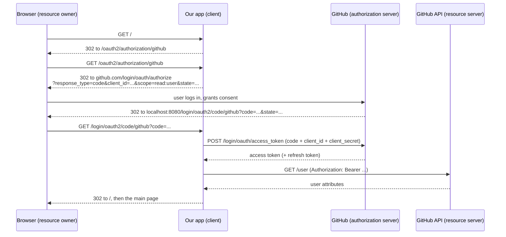

## Objective

`spring-security-oauth2-fundamentals-and-grant-types` covers the OAuth 2 actor
model — resource owner, client, authorization server, resource server — and the
grant types that move tokens between them. This concept is the first place the
book actually *builds* one of those actors, and it builds the smallest one: the
**client**. A single sign-on app that says "log in with GitHub" owns no users,
issues no tokens, and exposes no protected resources. It only knows how to
redirect a browser to somebody else's authorization server, exchange the
authorization code it gets back for an access token, and read the user's details
from the resource server.

Spring Security models that in three pieces: `ClientRegistration` (one
client's registration at one authorization server), `ClientRegistrationRepository`
(how the framework finds registrations, the `UserDetailsService` of the OAuth 2
world), and `oauth2Login()` (the `HttpSecurity` method that installs
`OAuth2LoginAuthenticationFilter` into the filter chain). The punchline of the
book's section 12.5.5 is that with `spring-boot-starter-oauth2-client` on the
classpath you can delete the first two and replace them with two lines of
`application.yml` — what Spilcă calls "the pure magic of Spring Boot
configuration."

## Use Cases

- Adding "Sign in with Google/GitHub/Okta" to an app that should not manage
  passwords, account lockout, or password resets at all.
- Delegating authentication to a corporate identity provider (Keycloak, Okta,
  Entra ID) so the app trusts an OIDC issuer instead of its own user table.
- Reading the authenticated user's profile — email, avatar, provider user id —
  from the provider's UserInfo endpoint instead of a local `users` table.
- Registering more than one provider so the login page offers a choice, each
  provider getting its own `ClientRegistration` under its own `registrationId`.
- Storing client registrations somewhere other than memory (a database, a config
  service) by implementing `ClientRegistrationRepository` yourself — the book's
  closing exercise for the section.

## Deep Dive

### The three dependencies, and what the client actually is

```xml
<dependency>
  <groupId>org.springframework.boot</groupId>
  <artifactId>spring-boot-starter-oauth2-client</artifactId>
</dependency>
<dependency>
  <groupId>org.springframework.boot</groupId>
  <artifactId>spring-boot-starter-security</artifactId>
</dependency>
<dependency>
  <groupId>org.springframework.boot</groupId>
  <artifactId>spring-boot-starter-web</artifactId>
</dependency>
```

Before any code, the client has to exist as far as the authorization server is
concerned. The book registers an OAuth application at
`https://github.com/settings/applications/new`, filling in a name, a homepage
URL, and — the important field — the **authorization callback URL**. GitHub then
hands back a **client ID** and a **client secret** (book p. 300-302). The
callback URL matters because the whole flow is the authorization code grant: the
client redirects the browser away, and the authorization server has to know
where it is allowed to send the browser back.

In this example GitHub plays two roles at once. It is the authorization server
(it authenticates the user and issues the token) and it is also the resource
server (the "resource" being the user's own profile at
`https://api.github.com/user`). Our app is only ever the client.



Only the arrows touching the browser are visible in devtools; the token exchange
and the UserInfo call are back-channel, server-to-server. The book verifies the
flow by watching exactly that (p. 312-314): the redirect to
`github.com/login/oauth/authorize?response_type=code&client_id=...&scope=read:user&state=...`,
then the callback to `http://localhost:8080/login/oauth2/code/github?code=...&state=...`,
and finally the user attributes appearing in the application log — proof the
back-channel calls succeeded.

### `oauth2Login()` adds a filter, exactly like `httpBasic()` does

```java
@Configuration
public class ProjectConfig extends WebSecurityConfigurerAdapter {

    @Override
    protected void configure(HttpSecurity http) throws Exception {
        http.oauth2Login();                 // the authentication method

        http.authorizeRequests()
              .anyRequest()
                .authenticated();           // everything needs a logged-in user
    }
}
```

That is the book's listing 12.2 (p. 304). Conceptually nothing new is happening:
`httpBasic()` adds `BasicAuthenticationFilter`, `formLogin()` adds
`UsernamePasswordAuthenticationFilter`, and `oauth2Login()` adds
`OAuth2LoginAuthenticationFilter` to the chain. The filter intercepts the
callback request and runs the OAuth 2 authentication logic.

Run it as-is and you cannot reach the page. You declared that every request needs
an authenticated user but gave the framework no way to authenticate one — it does
not know *which* authorization server to redirect to. That missing piece is
`ClientRegistration`.

### `ClientRegistration`: one client, at one authorization server

`ClientRegistration` is an immutable value object built through a builder, the
same shape as the `User` builder used for `UserDetails`. Spelled out in full it
carries the client credentials, the grant type, the redirect URI, the scopes, and
the authorization server's endpoints:

```java
ClientRegistration cr = ClientRegistration.withRegistrationId("github")
        .clientId("a7553955a0c534ec5e6b")
        .clientSecret("1795b30b425ebb79e424afa51913f1c724da0dbb")
        .scope("read:user")
        .authorizationUri("https://github.com/login/oauth/authorize")
        .tokenUri("https://github.com/login/oauth/access_token")
        .userInfoUri("https://api.github.com/user")
        .userNameAttributeName("id")
        .clientName("GitHub")
        .authorizationGrantType(AuthorizationGrantType.AUTHORIZATION_CODE)
        .redirectUri("{baseUrl}/login/oauth2/code/{registrationId}")
        .build();
```

The three URIs are the ones section 12.3 predicted you would need (p. 305):

- **Authorization URI** — where the client sends the browser so the user can log
  in and consent.
- **Token URI** — where the client posts the authorization code, from the server
  side, to get an access token and a refresh token.
- **User info URI** — where the client calls with the access token to learn who
  the user is.

`userNameAttributeName` picks which attribute in the UserInfo response acts as
the principal name. For GitHub the book uses `"id"`; for an OIDC provider it is
normally the `sub` claim (`IdTokenClaimNames.SUB`). `registrationId` is your own
label — `"github"` here — and it shows up in the URLs (`/login/oauth2/code/github`).

### `CommonOAuth2Provider`: the URIs you should not have to type

Since the endpoints of a well-known provider are public knowledge, Spring
Security ships them as an enum:

```java
ClientRegistration cr = CommonOAuth2Provider.GITHUB
        .getBuilder("github")               // registrationId, URIs and scopes pre-filled
          .clientId("a7553955a0c534ec5e6b")
          .clientSecret("1795b30b42...")
          .build();
```

`getBuilder(registrationId)` returns a `ClientRegistration.Builder` with the
authorization URI, token URI, user info URI, default scopes, and client name
already set — you supply only the credentials. The book lists Google, GitHub,
Facebook, and Okta (p. 306) and warns about the coupling this creates: you are
trusting that the provider will not change those values under you. If that risk
matters, spell the registration out as above and keep the URIs in a config file.

### `ClientRegistrationRepository`: the `UserDetailsService` of OAuth 2

`OAuth2LoginAuthenticationFilter` does not receive a `ClientRegistration`
directly; it looks one up. The contract it looks it up from is
`ClientRegistrationRepository`, and the book's analogy is exact (p. 308): where
a `UserDetailsService` finds `UserDetails` by username, a
`ClientRegistrationRepository` finds `ClientRegistration` by registration id.
Both are single-method lookup interfaces, and both have a built-in in-memory
implementation — `InMemoryClientRegistrationRepository` here, mirroring
`InMemoryUserDetailsManager`.

Publishing it as a bean is enough for the framework to pick it up:

```java
@Configuration
public class ProjectConfig extends WebSecurityConfigurerAdapter {

    @Bean
    public ClientRegistrationRepository clientRepository() {
        var c = clientRegistration();
        return new InMemoryClientRegistrationRepository(c);
    }

    private ClientRegistration clientRegistration() {
        return CommonOAuth2Provider.GITHUB.getBuilder("github")
                .clientId("a7553955a0c534ec5e6b")
                .clientSecret("1795b30b425ebb79e424afa51913f1c724da0dbb")
                .build();
    }

    @Override
    protected void configure(HttpSecurity http) throws Exception {
        http.oauth2Login();
        http.authorizeRequests().anyRequest().authenticated();
    }
}
```

Or inline, via the `Customizer` overload of `oauth2Login()` — the same
bean-versus-inline choice `httpBasic()`, `formLogin()`, `cors()`, and `csrf()`
all offer:

```java
http.oauth2Login(c -> c.clientRegistrationRepository(clientRepository()));
```

The book's advice (p. 309) is to pick one style per project and not mix them.
The credentials being hardcoded in every listing is a teaching shortcut Spilcă
flags explicitly: in a real app they come from a secrets vault, never from source
control (p. 307).

### The pure magic: two properties replace both beans

`spring-boot-starter-oauth2-client` autoconfigures a `ClientRegistrationRepository`
from properties, so both beans above can disappear. In `application.yml`:

```yaml
spring:
  security:
    oauth2:
      client:
        registration:
          github:
            client-id: a7553955a0c534ec5e6b
            client-secret: 1795b30b425ebb79e424afa51913f1c724da0dbb
```

Boot binds everything under
`spring.security.oauth2.client.registration.[registrationId]` into one
`ClientRegistration` and composes all of them into a repository. Because the
registration id here is `github`, and `github` matches a `CommonOAuth2Provider`
constant case-insensitively, the authorization URI, token URI, user info URI, and
default scopes come for free. The configuration class shrinks to the four lines of
listing 12.8 — `oauth2Login()` plus `anyRequest().authenticated()` (p. 310).

For a provider Spring Security does not know, add a sibling `provider` block and
point the registration at it:

```yaml
spring:
  security:
    oauth2:
      client:
        registration:
          myclient:
            provider: myprovider
            client-id: my-client-id
            client-secret: my-client-secret
            authorization-grant-type: authorization_code
            redirect-uri: "{baseUrl}/login/oauth2/code/{registrationId}"
            scope: openid, profile, email
        provider:
          myprovider:
            authorization-uri: https://idp.example.com/oauth2/v1/authorize
            token-uri: https://idp.example.com/oauth2/v1/token
            user-info-uri: https://idp.example.com/oauth2/v1/userinfo
            user-name-attribute: sub
```

Properties are the right default when the registrations are static and few. They
stop being the answer when registrations live in a database or come from a web
service — that is when you write your own `ClientRegistrationRepository`, which
is exactly the exercise the book leaves at the end of 12.5.5 (p. 311).

### Reading the authenticated user: `OAuth2AuthenticationToken`, `OAuth2User`, `OidcUser`

Nothing about the `SecurityContext` changes for OAuth 2. The authentication
filter still stores an `Authentication` there; it just happens to be an
`OAuth2AuthenticationToken`, whose principal is an `OAuth2User` rather than a
`UserDetails`:

```java
@Controller
public class MainController {

    private Logger logger = Logger.getLogger(MainController.class.getName());

    @GetMapping("/")
    public String main(OAuth2AuthenticationToken token) {
        logger.info(String.valueOf(token.getPrincipal()));
        return "main.html";
    }
}
```

Spring injects the token into the handler parameter, the same mechanism that
injects `Authentication`. Printing the principal produces roughly what the book
shows on p. 314:

```
Name: [43921235],
Granted Authorities: [[ROLE_USER, SCOPE_read:user]],
User Attributes: [{login=lspil, id=43921235, avatar_url=..., url=https://api.github.com/users/lspil, ...}]
```

Three details are worth naming. `getAuthorizedClientRegistrationId()` on the
token tells you *which* provider logged this user in — essential once more than
one registration exists. The authorities are derived, not stored: `ROLE_USER`
plus one `SCOPE_x` per granted scope. And the user attributes are a raw
`Map<String, Object>` straight off the UserInfo response — so
`OAuth2User.getAttributes()` gives you `login`, `avatar_url`, and everything else
the provider chose to return.

The contrast with `spring-security-user-management` is the point. `UserDetails`
is a fixed contract with `getPassword()` and four account-status flags, because
your app owns the account. `OAuth2User` has only `getName()`,
`getAuthorities()`, and `getAttributes()` — no password, no `isAccountNonLocked()`,
because none of that is yours to know. When the provider speaks OpenID Connect,
the principal is an `OidcUser` (which extends `OAuth2User`) and adds
`getIdToken()`, `getUserInfo()`, and `getClaims()`; the ID token is what makes
OIDC an authentication protocol rather than only an authorization one:

```java
@GetMapping("/profile")
public String profile(@AuthenticationPrincipal OidcUser user) {
    String email   = user.getEmail();          // standard OIDC claim
    String subject = user.getIdToken().getSubject();
    return "profile.html";
}
```

GitHub is not an OIDC provider, so the book's example yields a plain
`OAuth2User`; ask for `OidcUser` there and injection fails.

### Book vs. today: the DSL moved, the OAuth 2 client model barely did

The OAuth 2 client model in the book is almost entirely intact in the current
reference (7.1.0 at the time of writing). `ClientRegistration`,
`ClientRegistrationRepository`, `InMemoryClientRegistrationRepository`,
`CommonOAuth2Provider`, `OAuth2AuthenticationToken`, `OAuth2User`, and `OidcUser`
are all still the current API with the same responsibilities, and the property
namespaces (`spring.security.oauth2.client.registration.*` /
`spring.security.oauth2.client.provider.*`) are unchanged. What has moved is the
configuration *style* around them, plus a handful of specifics:

**1. `WebSecurityConfigurerAdapter` is gone; configure a `SecurityFilterChain` bean.**
Deprecated in Spring Security 5.7, removed in 6.0. And `authorizeRequests()` —
deprecated in 5.8 — was removed in 7.0 in favor of `authorizeHttpRequests()`,
which is backed by `AuthorizationManager` instead of the old
`FilterSecurityInterceptor`. Today's equivalent of listing 12.8:

```java
@Configuration
@EnableWebSecurity
public class OAuth2LoginSecurityConfig {

    @Bean
    public SecurityFilterChain filterChain(HttpSecurity http) throws Exception {
        http
            .authorizeHttpRequests(authorize -> authorize
                .anyRequest().authenticated()
            )
            .oauth2Login(Customizer.withDefaults());
        return http.build();
    }
}
```

The book's `Customizer` variant survives unchanged in spirit —
`.oauth2Login(oauth2 -> oauth2.clientRegistrationRepository(...))` is still how
you override the repository inline.

**2. `redirectUriTemplate()` no longer exists — it is `redirectUri()`.**
Listing 12.3 calls `.redirectUriTemplate("{baseUrl}/{action}/oauth2/code/{registrationId}")`.
That method was deprecated (spring-security#8906) and is absent from the current
`ClientRegistration.Builder`; use `redirectUri("{baseUrl}/login/oauth2/code/{registrationId}")`,
which supports the same template variables — `{baseUrl}`, `{baseScheme}`,
`{baseHost}`, `{basePort}`, `{basePath}`, `{registrationId}`. Templating still
matters for the same reason: behind a proxy it lets `X-Forwarded-*` headers
expand into the right redirect URI.

**3. PKCE is now applied automatically in cases the book never mentions.**
For the authorization code grant, Spring Security adds PKCE when the client is
public (`client-secret` omitted and `client-authentication-method: none`) or when
`ClientRegistration.ClientSettings.requireProofKey` is `true`. `ClientSettings`
is a newer addition to `ClientRegistration` that has no counterpart in the book's
listings.

**4. `CommonOAuth2Provider`'s roster shifted.** The current constants are
`GOOGLE`, `GITHUB`, `FACEBOOK`, `X`, and `OKTA` — Twitter became `X`. The book's
figure 12.14 sketches LinkedIn and Twitter registrations, but neither was ever a
constant in this enum.

**5. `issuer-uri` and discovery are the modern shortcut for non-common providers.**
Rather than listing `authorization-uri`/`token-uri`/`user-info-uri`/`jwk-set-uri`
by hand, point at the issuer and let the client fetch the provider's metadata
document:

```yaml
spring:
  security:
    oauth2:
      client:
        provider:
          keycloak:
            issuer-uri: https://idp.example.com/realms/myrealm
```

The programmatic equivalent is `ClientRegistrations.fromIssuerLocation("https://idp.example.com/issuer").build()`.
This makes the manual-URI version of listing 12.3 a fallback for providers
without discovery — which includes GitHub, so the book's example is still the
right shape for GitHub specifically.

**6. Chapter 13's premise is obsolete.** The book notes that the Spring Security
OAuth 2 project was deprecated and that a replacement authorization server was
"being developed" (p. 317). Spring Authorization Server shipped and is now a
first-class section of the Spring Security reference — see
`spring-security-oauth2-authorization-server`. The client side you build here,
though, is exactly what you point at it.

## Trade-offs

- **Delegating authentication removes a whole class of work and adds a hard
  dependency.** No password storage, no reset flow, no lockout policy — but if
  the provider is down or revokes your OAuth app, nobody logs in, and you have
  no local fallback. It also means every user must *have* an account with that
  provider.
- **`CommonOAuth2Provider` trades explicitness for coupling.** Two lines of
  properties instead of five URIs, at the cost of trusting the enum's baked-in
  values to stay correct. Spelling the registration out keeps the URIs
  under your control:
  ```java
  // provider values live in your config file, not in the framework's enum
  ClientRegistration.withRegistrationId("github")
      .authorizationUri(env.getProperty("github.authorization-uri"))
      // ...
  ```
- **Property-based configuration is the cleanest option only while registrations
  are static.** Boot builds `ClientRegistration` and
  `ClientRegistrationRepository` for you from `application.yml`, which is ideal
  for a fixed handful of providers. Registrations that live in a database or
  change at runtime require a custom `ClientRegistrationRepository` — and once
  you write one, the properties stop being consulted:
  ```java
  public class JdbcClientRegistrationRepository implements ClientRegistrationRepository {
      @Override
      public ClientRegistration findByRegistrationId(String registrationId) { /* ... */ }
  }
  ```
- **`InMemoryClientRegistrationRepository` is fine in a way that
  `InMemoryUserDetailsManager` is not.** The analogy between them is structural,
  not operational: client registrations are a small, static, deployment-time
  list, whereas users are dynamic data. In-memory is the *normal* production
  choice for registrations.
- **`OAuth2User` gives you a `Map`, not a typed contract.** `getAttributes()`
  returns whatever the provider's UserInfo response contained, so reading a
  field means knowing that provider's response shape and casting:
  ```java
  String login = (String) oauth2User.getAttributes().get("login"); // GitHub-specific key
  ```
  `OidcUser` is better off — standard claims have typed accessors like
  `getEmail()` — but only if the provider actually speaks OIDC.
- **Authorities come from scopes, and scopes are not roles.** A GitHub login
  yields `ROLE_USER` plus `SCOPE_read:user`. Those describe what the *client* may
  do at the provider, not what the *user* may do in your app. Application-level
  roles still have to come from somewhere you own, mapped in via
  `userInfoEndpoint().userAuthoritiesMapper(...)`.
- **Hardcoded client secrets are a book-only convenience.** Every listing in
  12.5 embeds real credentials and Spilcă flags it himself (p. 307): the client
  secret authenticates your application at the authorization server, so it
  belongs in a vault or environment, never in a repository — public or not.

## Documentation Links

- Laurențiu Spilcă, "Spring Security in Action" (Manning, 2020) — Chapter 12, "How does OAuth 2 work?", section 12.5, "Implementing a simple single sign-on application", p. 299-315 — doc
- [Spring Security Reference — OAuth2 Client: Core Interfaces and Classes (ClientRegistration, ClientRegistrationRepository)](https://docs.spring.io/spring-security/reference/servlet/oauth2/client/core.html) — doc
- [Spring Security Reference — OAuth2 Log In: Core Configuration](https://docs.spring.io/spring-security/reference/servlet/oauth2/login/core.html) — doc
- [Spring Security Reference — OAuth2 Log In: Advanced Configuration](https://docs.spring.io/spring-security/reference/servlet/oauth2/login/advanced.html) — doc
- [Spring Security Reference — OAuth2 Client: Authorization Grants (Authorization Code, PKCE, redirect-uri templates)](https://docs.spring.io/spring-security/reference/servlet/oauth2/client/authorization-grants.html) — doc
- [Spring Security API — ClientRegistration.Builder](https://docs.spring.io/spring-security/site/docs/current/api/org/springframework/security/oauth2/client/registration/ClientRegistration.Builder.html) — doc
- [Spring Security API — CommonOAuth2Provider](https://docs.spring.io/spring-security/site/docs/current/api/org/springframework/security/config/oauth2/client/CommonOAuth2Provider.html) — doc
- [Spring Security API — OAuth2AuthenticationToken](https://docs.spring.io/spring-security/site/docs/current/api/org/springframework/security/oauth2/client/authentication/OAuth2AuthenticationToken.html) — doc
- [Spring Security API — OidcUser](https://docs.spring.io/spring-security/site/docs/current/api/org/springframework/security/oauth2/core/oidc/user/OidcUser.html) — doc
- [Spring Security 5.8 Migration Guide — Authorization Migrations (authorizeRequests to authorizeHttpRequests)](https://docs.spring.io/spring-security/reference/5.8/migration/servlet/authorization.html) — doc
- [spring-security Issue #8906 — Deprecate ClientRegistration.redirectUriTemplate](https://github.com/spring-projects/spring-security/issues/8906) — doc
