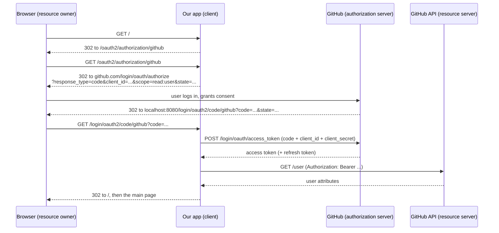

## Objective

`spring-security-oauth2-fundamentals-and-grant-types` cobre o modelo de atores
do OAuth 2 — resource owner, client, authorization server, resource server — e
os grant types que movem tokens entre eles. Este conceito é o primeiro lugar em
que o livro de fato *constrói* um desses atores, e constrói o menor deles: o
**client**. Um app de single sign-on que diz "faça login com o GitHub" não é
dono de nenhum usuário, não emite nenhum token e não expõe nenhum recurso
protegido. Ele só sabe redirecionar um browser para o authorization server de
outra pessoa, trocar o authorization code que recebe de volta por um access
token, e ler os dados do usuário a partir do resource server.

O Spring Security modela isso em três peças: `ClientRegistration` (o registro
de um client em um authorization server), `ClientRegistrationRepository` (como
o framework encontra registros, o `UserDetailsService` do mundo OAuth 2), e
`oauth2Login()` (o método de `HttpSecurity` que instala o
`OAuth2LoginAuthenticationFilter` na filter chain). A grande sacada da seção
12.5.5 do livro é que, com `spring-boot-starter-oauth2-client` no classpath,
você pode apagar os dois primeiros e substituí-los por duas linhas de
`application.yml` — o que Spilcă chama de "a pura mágica da configuração do
Spring Boot."

## Use Cases

- Adicionar "Entrar com Google/GitHub/Okta" a um app que não deveria gerenciar
  senhas, bloqueio de conta, ou reset de senha de forma alguma.
- Delegar a autenticação a um provedor de identidade corporativo (Keycloak,
  Okta, Entra ID), de modo que o app confie em um issuer OIDC em vez de na
  própria tabela de usuários.
- Ler o perfil do usuário autenticado — e-mail, avatar, id do usuário no
  provedor — a partir do endpoint UserInfo do provedor, em vez de uma tabela
  `users` local.
- Registrar mais de um provedor para que a tela de login ofereça uma escolha,
  cada provedor com seu próprio `ClientRegistration` sob seu próprio
  `registrationId`.
- Armazenar registros de client em outro lugar além da memória (um banco de
  dados, um serviço de configuração) implementando você mesmo
  `ClientRegistrationRepository` — o exercício final da seção no livro.

## Deep Dive

### As três dependências, e o que o client realmente é

```xml
<dependency>
  <groupId>org.springframework.boot</groupId>
  <artifactId>spring-boot-starter-oauth2-client</artifactId>
</dependency>
<dependency>
  <groupId>org.springframework.boot</groupId>
  <artifactId>spring-boot-starter-security</artifactId>
</dependency>
<dependency>
  <groupId>org.springframework.boot</groupId>
  <artifactId>spring-boot-starter-web</artifactId>
</dependency>
```

Antes de qualquer código, o client precisa existir aos olhos do authorization
server. O livro registra uma aplicação OAuth em
`https://github.com/settings/applications/new`, preenchendo um nome, uma URL
de homepage e — o campo importante — a **authorization callback URL**. O
GitHub então devolve um **client ID** e um **client secret** (livro, p.
300-302). A callback URL importa porque o fluxo inteiro é o authorization code
grant: o client redireciona o browser para fora, e o authorization server
precisa saber para onde tem permissão de mandar o browser de volta.

Neste exemplo, o GitHub desempenha dois papéis ao mesmo tempo. Ele é o
authorization server (autentica o usuário e emite o token) e também é o
resource server (o "recurso" sendo o próprio perfil do usuário em
`https://api.github.com/user`). Nosso app é sempre apenas o client.



Só as setas que tocam o browser aparecem no devtools; a troca do token e a
chamada UserInfo são de back-channel, servidor-a-servidor. O livro verifica o
fluxo observando exatamente isso (p. 312-314): o redirecionamento para
`github.com/login/oauth/authorize?response_type=code&client_id=...&scope=read:user&state=...`,
depois o callback para
`http://localhost:8080/login/oauth2/code/github?code=...&state=...`,
e por fim os atributos do usuário aparecendo no log da aplicação — prova de
que as chamadas de back-channel funcionaram.

### `oauth2Login()` adiciona um filtro, exatamente como `httpBasic()` faz

```java
@Configuration
public class ProjectConfig extends WebSecurityConfigurerAdapter {

    @Override
    protected void configure(HttpSecurity http) throws Exception {
        http.oauth2Login();                 // the authentication method

        http.authorizeRequests()
              .anyRequest()
                .authenticated();           // everything needs a logged-in user
    }
}
```

Essa é a listagem 12.2 do livro (p. 304). Conceitualmente nada de novo está
acontecendo: `httpBasic()` adiciona `BasicAuthenticationFilter`, `formLogin()`
adiciona `UsernamePasswordAuthenticationFilter`, e `oauth2Login()` adiciona
`OAuth2LoginAuthenticationFilter` à chain. O filtro intercepta a requisição de
callback e executa a lógica de autenticação OAuth 2.

Rode como está e você não conseguirá acessar a página. Você declarou que toda
requisição precisa de um usuário autenticado, mas não deu ao framework nenhuma
forma de autenticar um — ele não sabe *para qual* authorization server
redirecionar. A peça que falta é o `ClientRegistration`.

### `ClientRegistration`: um client, em um authorization server

`ClientRegistration` é um value object imutável construído por um builder, no
mesmo formato do builder `User` usado para `UserDetails`. Detalhado por
completo, ele carrega as credenciais do client, o grant type, a redirect URI,
os scopes e os endpoints do authorization server:

```java
ClientRegistration cr = ClientRegistration.withRegistrationId("github")
        .clientId("a7553955a0c534ec5e6b")
        .clientSecret("1795b30b425ebb79e424afa51913f1c724da0dbb")
        .scope("read:user")
        .authorizationUri("https://github.com/login/oauth/authorize")
        .tokenUri("https://github.com/login/oauth/access_token")
        .userInfoUri("https://api.github.com/user")
        .userNameAttributeName("id")
        .clientName("GitHub")
        .authorizationGrantType(AuthorizationGrantType.AUTHORIZATION_CODE)
        .redirectUri("{baseUrl}/login/oauth2/code/{registrationId}")
        .build();
```

As três URIs são as que a seção 12.3 já previa que você precisaria (p. 305):

- **Authorization URI** — para onde o client manda o browser para o usuário
  fazer login e consentir.
- **Token URI** — para onde o client envia o authorization code, do lado do
  servidor, para obter um access token e um refresh token.
- **User info URI** — para onde o client chama com o access token para saber
  quem é o usuário.

`userNameAttributeName` escolhe qual atributo na resposta do UserInfo atua
como o nome do principal. Para o GitHub o livro usa `"id"`; para um provedor
OIDC normalmente é o claim `sub` (`IdTokenClaimNames.SUB`). `registrationId` é
seu próprio rótulo — `"github"` neste caso — e ele aparece nas URLs
(`/login/oauth2/code/github`).

### `CommonOAuth2Provider`: as URIs que você não deveria precisar digitar

Como os endpoints de um provedor bem conhecido são conhecimento público, o
Spring Security os distribui como um enum:

```java
ClientRegistration cr = CommonOAuth2Provider.GITHUB
        .getBuilder("github")               // registrationId, URIs and scopes pre-filled
          .clientId("a7553955a0c534ec5e6b")
          .clientSecret("1795b30b42...")
          .build();
```

`getBuilder(registrationId)` retorna um `ClientRegistration.Builder` com a
authorization URI, token URI, user info URI, scopes padrão e nome do client já
preenchidos — você fornece apenas as credenciais. O livro lista Google,
GitHub, Facebook e Okta (p. 306) e avisa sobre o acoplamento que isso cria:
você está confiando que o provedor não vai mudar esses valores sob você. Se
esse risco importa, escreva o registro por extenso como acima e mantenha as
URIs em um arquivo de configuração.

### `ClientRegistrationRepository`: o `UserDetailsService` do OAuth 2

`OAuth2LoginAuthenticationFilter` não recebe um `ClientRegistration`
diretamente; ele o busca. O contrato de onde ele busca é
`ClientRegistrationRepository`, e a analogia do livro é exata (p. 308): assim
como um `UserDetailsService` encontra `UserDetails` por username, um
`ClientRegistrationRepository` encontra `ClientRegistration` por registration
id. Ambos são interfaces de busca de um único método, e ambos têm uma
implementação em memória embutida — `InMemoryClientRegistrationRepository`
aqui, espelhando `InMemoryUserDetailsManager`.

Publicá-lo como bean já basta para o framework reconhecê-lo:

```java
@Configuration
public class ProjectConfig extends WebSecurityConfigurerAdapter {

    @Bean
    public ClientRegistrationRepository clientRepository() {
        var c = clientRegistration();
        return new InMemoryClientRegistrationRepository(c);
    }

    private ClientRegistration clientRegistration() {
        return CommonOAuth2Provider.GITHUB.getBuilder("github")
                .clientId("a7553955a0c534ec5e6b")
                .clientSecret("1795b30b425ebb79e424afa51913f1c724da0dbb")
                .build();
    }

    @Override
    protected void configure(HttpSecurity http) throws Exception {
        http.oauth2Login();
        http.authorizeRequests().anyRequest().authenticated();
    }
}
```

Ou de forma inline, via o overload `Customizer` de `oauth2Login()` — a mesma
escolha entre bean e inline que `httpBasic()`, `formLogin()`, `cors()` e
`csrf()` oferecem:

```java
http.oauth2Login(c -> c.clientRegistrationRepository(clientRepository()));
```

A recomendação do livro (p. 309) é escolher um estilo por projeto e não
misturá-los. As credenciais fixas em cada listagem são um atalho didático que
Spilcă sinaliza explicitamente: em um app real elas vêm de um cofre de
segredos, nunca do controle de versão (p. 307).

### A pura mágica: duas propriedades substituem os dois beans

`spring-boot-starter-oauth2-client` autoconfigura um
`ClientRegistrationRepository` a partir de propriedades, então ambos os beans
acima podem desaparecer. No `application.yml`:

```yaml
spring:
  security:
    oauth2:
      client:
        registration:
          github:
            client-id: a7553955a0c534ec5e6b
            client-secret: 1795b30b425ebb79e424afa51913f1c724da0dbb
```

O Boot vincula tudo sob
`spring.security.oauth2.client.registration.[registrationId]` em um único
`ClientRegistration` e compõe todos eles em um repository. Como o registration
id aqui é `github`, e `github` combina com uma constante `CommonOAuth2Provider`
sem diferenciar maiúsculas de minúsculas, a authorization URI, token URI, user
info URI e os scopes padrão vêm de graça. A classe de configuração encolhe
para as quatro linhas da listagem 12.8 — `oauth2Login()` mais
`anyRequest().authenticated()` (p. 310).

Para um provedor que o Spring Security não conhece, adicione um bloco
`provider` irmão e aponte o registro para ele:

```yaml
spring:
  security:
    oauth2:
      client:
        registration:
          myclient:
            provider: myprovider
            client-id: my-client-id
            client-secret: my-client-secret
            authorization-grant-type: authorization_code
            redirect-uri: "{baseUrl}/login/oauth2/code/{registrationId}"
            scope: openid, profile, email
        provider:
          myprovider:
            authorization-uri: https://idp.example.com/oauth2/v1/authorize
            token-uri: https://idp.example.com/oauth2/v1/token
            user-info-uri: https://idp.example.com/oauth2/v1/userinfo
            user-name-attribute: sub
```

Propriedades são o padrão certo quando os registros são estáticos e poucos.
Elas deixam de ser a resposta quando os registros vivem em um banco de dados
ou vêm de um serviço web — é aí que você escreve seu próprio
`ClientRegistrationRepository`, exatamente o exercício que o livro deixa no
final de 12.5.5 (p. 311).

### Lendo o usuário autenticado: `OAuth2AuthenticationToken`, `OAuth2User`, `OidcUser`

Nada muda no `SecurityContext` para o OAuth 2. O filtro de autenticação ainda
armazena um `Authentication` ali; só que agora ele é um
`OAuth2AuthenticationToken`, cujo principal é um `OAuth2User` em vez de um
`UserDetails`:

```java
@Controller
public class MainController {

    private Logger logger = Logger.getLogger(MainController.class.getName());

    @GetMapping("/")
    public String main(OAuth2AuthenticationToken token) {
        logger.info(String.valueOf(token.getPrincipal()));
        return "main.html";
    }
}
```

O Spring injeta o token no parâmetro do handler, o mesmo mecanismo que injeta
`Authentication`. Imprimir o principal produz algo próximo do que o livro
mostra na p. 314:

```
Name: [43921235],
Granted Authorities: [[ROLE_USER, SCOPE_read:user]],
User Attributes: [{login=lspil, id=43921235, avatar_url=..., url=https://api.github.com/users/lspil, ...}]
```

Três detalhes valem ser destacados. `getAuthorizedClientRegistrationId()` no
token diz *qual* provedor autenticou esse usuário — essencial assim que mais
de um registro existe. As authorities são derivadas, não armazenadas:
`ROLE_USER` mais um `SCOPE_x` por scope concedido. E os atributos do usuário
são um `Map<String, Object>` bruto, direto da resposta do UserInfo — então
`OAuth2User.getAttributes()` te dá `login`, `avatar_url` e tudo mais que o
provedor decidiu retornar.

O contraste com `spring-security-user-management` é o ponto central.
`UserDetails` é um contrato fixo com `getPassword()` e quatro flags de status
da conta, porque sua aplicação é dona da conta. `OAuth2User` só tem
`getName()`, `getAuthorities()` e `getAttributes()` — sem senha, sem
`isAccountNonLocked()`, porque nada disso é seu para saber. Quando o provedor
fala OpenID Connect, o principal é um `OidcUser` (que estende `OAuth2User`) e
adiciona `getIdToken()`, `getUserInfo()` e `getClaims()`; o ID token é o que
torna o OIDC um protocolo de autenticação, e não apenas de autorização:

```java
@GetMapping("/profile")
public String profile(@AuthenticationPrincipal OidcUser user) {
    String email   = user.getEmail();          // standard OIDC claim
    String subject = user.getIdToken().getSubject();
    return "profile.html";
}
```

O GitHub não é um provedor OIDC, então o exemplo do livro produz um
`OAuth2User` simples; pedir por `OidcUser` ali falha na injeção.

### Livro vs. hoje: a DSL mudou de lugar, o modelo do client OAuth 2 quase não

O modelo do client OAuth 2 no livro está quase inteiramente intacto na
referência atual (7.1.0 no momento em que este texto foi escrito).
`ClientRegistration`, `ClientRegistrationRepository`,
`InMemoryClientRegistrationRepository`, `CommonOAuth2Provider`,
`OAuth2AuthenticationToken`, `OAuth2User` e `OidcUser` continuam sendo a API
atual com as mesmas responsabilidades, e os namespaces de propriedades
(`spring.security.oauth2.client.registration.*` /
`spring.security.oauth2.client.provider.*`) estão inalterados. O que mudou foi
o *estilo* de configuração ao redor deles, mais um punhado de detalhes:

**1. `WebSecurityConfigurerAdapter` sumiu; configure um bean `SecurityFilterChain`.**
Depreciado no Spring Security 5.7, removido no 6.0. E `authorizeRequests()` —
depreciado no 5.8 — foi removido no 7.0 em favor de `authorizeHttpRequests()`,
que é suportado por `AuthorizationManager` em vez do antigo
`FilterSecurityInterceptor`. O equivalente atual da listagem 12.8:

```java
@Configuration
@EnableWebSecurity
public class OAuth2LoginSecurityConfig {

    @Bean
    public SecurityFilterChain filterChain(HttpSecurity http) throws Exception {
        http
            .authorizeHttpRequests(authorize -> authorize
                .anyRequest().authenticated()
            )
            .oauth2Login(Customizer.withDefaults());
        return http.build();
    }
}
```

A variante `Customizer` do livro sobrevive inalterada em espírito —
`.oauth2Login(oauth2 -> oauth2.clientRegistrationRepository(...))` continua
sendo como você sobrescreve o repository de forma inline.

**2. `redirectUriTemplate()` não existe mais — agora é `redirectUri()`.**
A listagem 12.3 chama `.redirectUriTemplate("{baseUrl}/{action}/oauth2/code/{registrationId}")`.
Esse método foi depreciado (spring-security#8906) e está ausente do
`ClientRegistration.Builder` atual; use
`redirectUri("{baseUrl}/login/oauth2/code/{registrationId}")`, que suporta as
mesmas variáveis de template — `{baseUrl}`, `{baseScheme}`, `{baseHost}`,
`{basePort}`, `{basePath}`, `{registrationId}`. O templating ainda importa
pelo mesmo motivo: atrás de um proxy, ele permite que headers
`X-Forwarded-*` expandam para a redirect URI correta.

**3. O PKCE agora é aplicado automaticamente em casos que o livro nunca menciona.**
Para o authorization code grant, o Spring Security adiciona PKCE quando o
client é público (`client-secret` omitido e `client-authentication-method:
none`) ou quando `ClientRegistration.ClientSettings.requireProofKey` é
`true`. `ClientSettings` é uma adição mais recente ao `ClientRegistration` sem
contrapartida nas listagens do livro.

**4. O elenco do `CommonOAuth2Provider` mudou.** As constantes atuais são
`GOOGLE`, `GITHUB`, `FACEBOOK`, `X` e `OKTA` — o Twitter virou `X`. A figura
12.14 do livro esboça registros do LinkedIn e do Twitter, mas nenhum dos dois
jamais foi uma constante neste enum.

**5. `issuer-uri` e discovery são o atalho moderno para provedores fora do comum.**
Em vez de listar `authorization-uri`/`token-uri`/`user-info-uri`/`jwk-set-uri`
manualmente, aponte para o issuer e deixe o client buscar o documento de
metadados do provedor:

```yaml
spring:
  security:
    oauth2:
      client:
        provider:
          keycloak:
            issuer-uri: https://idp.example.com/realms/myrealm
```

O equivalente programático é
`ClientRegistrations.fromIssuerLocation("https://idp.example.com/issuer").build()`.
Isso faz da versão manual de URIs da listagem 12.3 um fallback para provedores
sem discovery — o que inclui o GitHub, então o exemplo do livro continua
correto especificamente para o GitHub.

**6. A premissa do capítulo 13 está obsoleta.** O livro observa que o projeto
Spring Security OAuth 2 foi depreciado e que um authorization server
substituto estava "em desenvolvimento" (p. 317). O Spring Authorization
Server foi lançado e hoje é uma seção de primeira classe da referência do
Spring Security — veja `spring-security-oauth2-authorization-server`. O lado
client que você constrói aqui, porém, é exatamente o que você aponta para ele.

## Trade-offs

- **Delegar a autenticação remove uma classe inteira de trabalho e adiciona
  uma dependência forte.** Sem armazenamento de senha, sem fluxo de reset, sem
  política de bloqueio — mas se o provedor cair ou revogar seu app OAuth,
  ninguém consegue fazer login, e você não tem nenhum fallback local. Também
  significa que todo usuário precisa *ter* uma conta naquele provedor.
- **`CommonOAuth2Provider` troca explicitude por acoplamento.** Duas linhas de
  propriedades em vez de cinco URIs, ao custo de confiar que os valores
  embutidos no enum permaneçam corretos. Escrever o registro por extenso
  mantém as URIs sob seu controle:
  ```java
  // provider values live in your config file, not in the framework's enum
  ClientRegistration.withRegistrationId("github")
      .authorizationUri(env.getProperty("github.authorization-uri"))
      // ...
  ```
- **A configuração baseada em propriedades é a opção mais limpa só enquanto os
  registros são estáticos.** O Boot constrói `ClientRegistration` e
  `ClientRegistrationRepository` para você a partir do `application.yml`, o
  que é ideal para um punhado fixo de provedores. Registros que vivem em um
  banco de dados ou mudam em tempo de execução exigem um
  `ClientRegistrationRepository` customizado — e uma vez que você escreve um,
  as propriedades param de ser consultadas:
  ```java
  public class JdbcClientRegistrationRepository implements ClientRegistrationRepository {
      @Override
      public ClientRegistration findByRegistrationId(String registrationId) { /* ... */ }
  }
  ```
- **`InMemoryClientRegistrationRepository` é aceitável de um jeito que
  `InMemoryUserDetailsManager` não é.** A analogia entre eles é estrutural,
  não operacional: registros de client formam uma lista pequena, estática e
  definida em tempo de deployment, enquanto usuários são dados dinâmicos.
  Em memória é a escolha *normal* de produção para registros.
- **`OAuth2User` te dá um `Map`, não um contrato tipado.** `getAttributes()`
  retorna o que quer que a resposta UserInfo do provedor tenha trazido, então
  ler um campo significa conhecer o formato de resposta daquele provedor e
  fazer o cast:
  ```java
  String login = (String) oauth2User.getAttributes().get("login"); // GitHub-specific key
  ```
  `OidcUser` sai em vantagem — claims padrão têm acessores tipados como
  `getEmail()` — mas só se o provedor de fato falar OIDC.
- **As authorities vêm de scopes, e scopes não são roles.** Um login pelo
  GitHub produz `ROLE_USER` mais `SCOPE_read:user`. Isso descreve o que o
  *client* pode fazer no provedor, não o que o *usuário* pode fazer no seu
  app. Roles em nível de aplicação ainda precisam vir de algum lugar que você
  controla, mapeadas via `userInfoEndpoint().userAuthoritiesMapper(...)`.
- **Client secrets fixos no código são uma conveniência só do livro.** Cada
  listagem da seção 12.5 embute credenciais reais, e o próprio Spilcă
  sinaliza isso (p. 307): o client secret autentica sua aplicação no
  authorization server, então ele pertence a um cofre ou a variáveis de
  ambiente, nunca a um repositório — público ou não.

## Documentation Links

- Laurențiu Spilcă, "Spring Security in Action" (Manning, 2020) — Chapter 12, "How does OAuth 2 work?", section 12.5, "Implementing a simple single sign-on application", p. 299-315 — doc
- [Spring Security Reference — OAuth2 Client: Core Interfaces and Classes (ClientRegistration, ClientRegistrationRepository)](https://docs.spring.io/spring-security/reference/servlet/oauth2/client/core.html) — doc
- [Spring Security Reference — OAuth2 Log In: Core Configuration](https://docs.spring.io/spring-security/reference/servlet/oauth2/login/core.html) — doc
- [Spring Security Reference — OAuth2 Log In: Advanced Configuration](https://docs.spring.io/spring-security/reference/servlet/oauth2/login/advanced.html) — doc
- [Spring Security Reference — OAuth2 Client: Authorization Grants (Authorization Code, PKCE, redirect-uri templates)](https://docs.spring.io/spring-security/reference/servlet/oauth2/client/authorization-grants.html) — doc
- [Spring Security API — ClientRegistration.Builder](https://docs.spring.io/spring-security/site/docs/current/api/org/springframework/security/oauth2/client/registration/ClientRegistration.Builder.html) — doc
- [Spring Security API — CommonOAuth2Provider](https://docs.spring.io/spring-security/site/docs/current/api/org/springframework/security/config/oauth2/client/CommonOAuth2Provider.html) — doc
- [Spring Security API — OAuth2AuthenticationToken](https://docs.spring.io/spring-security/site/docs/current/api/org/springframework/security/oauth2/client/authentication/OAuth2AuthenticationToken.html) — doc
- [Spring Security API — OidcUser](https://docs.spring.io/spring-security/site/docs/current/api/org/springframework/security/oauth2/core/oidc/user/OidcUser.html) — doc
- [Spring Security 5.8 Migration Guide — Authorization Migrations (authorizeRequests to authorizeHttpRequests)](https://docs.spring.io/spring-security/reference/5.8/migration/servlet/authorization.html) — doc
- [spring-security Issue #8906 — Deprecate ClientRegistration.redirectUriTemplate](https://github.com/spring-projects/spring-security/issues/8906) — doc
