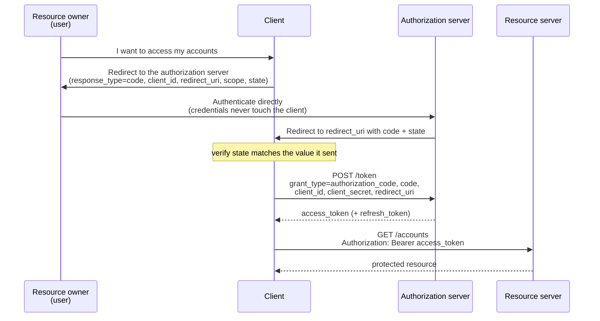
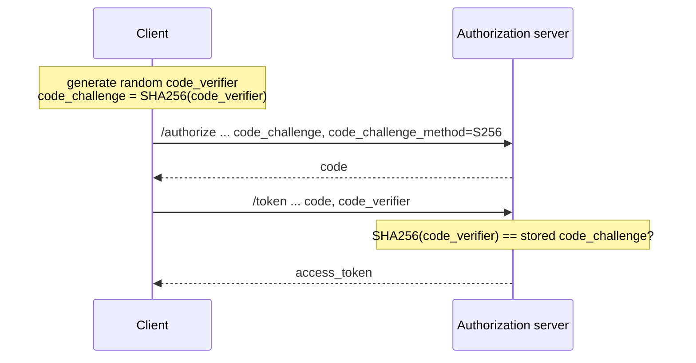

## Objective

Build the mental model behind every OAuth 2 implementation: four actors (resource owner, client, authorization server, resource server), an access token that replaces resending credentials, a scope that says what the token is good for, and a *grant type* — the specific choreography by which a client obtains that token. The hand-rolled token flow in `spring-security-custom-token-based-authentication` solves the same problem (stop sending the password on every request, move credential management out of the app) but leaves every decision to you; OAuth 2 is the framework that standardizes those decisions, and picking the right grant type is the first and most consequential of them.

## Use Cases

- Deciding, before writing any code, which flow a new system needs: a third-party app touching user data, a first-party SPA plus a backend you also own, or one backend service calling another with no user in the picture.
- Reading an OAuth 2 error or a provider's setup page (`client_id`, `redirect_uri`, `response_type=code`, `scope`, `state`) and knowing which step of which flow you are in.
- Reviewing an existing integration and recognizing that it uses a grant type current IETF guidance disallows — the single most common finding in an OAuth 2 audit of pre-2020 code.
- Understanding why an access token expires after minutes and what a refresh token is actually for, before implementing token lifetimes.
- Explaining to a team why "just let the client collect the username and password and forward it" is not the simple win it looks like.

## Deep Dive

### The problem: credentials on every request, managed everywhere

HTTP Basic authentication has two structural weaknesses the book uses as the motivation for OAuth 2:

- **Credentials travel with every single request.** The client must store them somewhere to be able to replay them, and they cross the network constantly.
- **Every application manages its own credential store.** In an organization with a dozen apps, that is a dozen password databases and a dozen passwords per person.

The fix for the second point is to extract credential management into one component — an **authorization server** that every application trusts. The fix for the first is to have that server hand out a **token**: a short-lived, revocable, scope-limited stand-in for the credentials. OAuth 2 is the specification framework describing how those two pieces interact. It is not a library and not an implementation — the same flows are implemented by Keycloak, Okta, Auth0, GitHub, and Spring Authorization Server alike.

### The four actors

| Actor | Holds | Responsibility |
| --- | --- | --- |
| **Resource owner** (the user) | username / password | Owns the resources; approves a client's access to them |
| **Client** (web or mobile app) | `client_id` + `client_secret` | Accesses resources *on behalf of* the user; identifies **itself** with its own credentials, which are not the user's |
| **Authorization server** | the credential store | Authenticates the user, decides whether the client may act for them, issues tokens |
| **Resource server** | the data / actions | Exposes protected resources; grants access to any request carrying a valid token |

The point most often missed: **the client has its own identity.** `client_id`/`client_secret` prove *which application* is asking; the user's credentials (or a token derived from them) prove *on whose behalf*. Two independent authentications, and the flows differ mainly in how the second one is performed.

A **scope** is OAuth 2's name for what the book elsewhere calls a granted authority — the subset of permissions a token carries. A token is never "the user"; it is "this client, acting for this user, limited to these scopes, until this expiry".

### Authorization code: the user never gives the client their password

The flow the framework is built around. The client redirects the user *to the authorization server*, so the credentials are typed into the authorization server's own login page and never pass through the client:



Step 1 — the redirect to the **authorization endpoint** — carries:

```
GET /oauth2/authorize
    ?response_type=code          # I want a code, not a token
    &client_id=my-client         # which application is asking
    &redirect_uri=...            # where to send the user back (may be preregistered)
    &scope=read                  # what the token should be good for
    &state=<csrf-token>          # CSRF protection; the client verifies this on return
```

Step 2 — the exchange at the **token endpoint** — is a back-channel call from the client, authenticated with its own secret:

```
POST /oauth2/token
    grant_type=authorization_code
    code=<the code from step 1>
    client_id=my-client
    client_secret=<secret>
    redirect_uri=...             # must match step 1
```

**Why two round trips and two different artifacts?** The code proves *the user interacted with the authorization server*. The secret in step 2 proves *the caller really is the registered client and not whoever intercepted the redirect*. OAuth 2 also defined an **implicit** grant that skipped step 2 and returned the access token straight to the redirect URI — the book already declines to list it among the four, noting its use "is not recommended, and most authorization servers today don't allow it," because the server hands out a token without ever confirming who received it.

Step 3 — the client calls the resource server with the token in the `Authorization` header. That step is identical in *every* grant type; only how the token was obtained differs.

The book's analogy: you order books, a friend picks them up, and the shop owner phones *you* to confirm before handing them over. You are the resource owner, the friend is the client, the shop owner is the authorization server. Crucially, your friend never needs your ID.

### Password: the client collects the credentials itself

Also called the *resource owner credentials* grant. The client shows its own login form, takes the username and password, and posts them to the token endpoint:

```
POST /oauth2/token
    grant_type=password
    client_id=my-client
    client_secret=<secret>
    username=katushka
    password=<plain text>
    scope=read
```

One round trip, no redirect, no code. Continue the analogy: instead of the shop phoning you, **you hand your friend your ID**. The user must trust the client completely, because the client sees the raw password.

The book presents this as legitimate when "the client and authorization server are built and maintained by the same organization" — the typical Angular/React/Vue or mobile frontend talking to an auth microservice you also own, where bouncing the user out to a login page in *your own* system and back feels strange. But it also warns twice that this grant is "less secure than the authorization code grant type," says to "try to avoid this grant type in real-world scenarios," and even for same-organization systems: "you should first think about using the authorization code grant type. Take the password grant type as your second option." See the Book vs. today subsection — current guidance goes considerably further.

### Client credentials: no user at all

The simplest grant. Used for machine-to-machine calls, where the client acts for *itself* rather than on behalf of anyone:

```
POST /oauth2/token
    grant_type=client_credentials
    client_id=my-service
    client_secret=<secret>
    scope=read
```

Same two steps as the password grant minus the user credentials. The book describes it as "a combination of the password grant type and an API key authentication flow" — and makes the right architectural point: if the system already speaks OAuth 2, using this grant is cleaner than bolting a custom API-key filter alongside the framework. There is **no refresh token** here, because there is nothing to avoid re-asking: the client can simply repeat the call with its own credentials.

### Refresh tokens: short-lived access tokens without repeated logins

A token that never expires "becomes almost as powerful as user credentials" — it rides along as a header on every request, so an intercepted one grants indefinite access. So access tokens should be short-lived; but re-running the whole grant every twenty minutes means either redirecting the user back to a login page repeatedly, or — far worse — the client storing the user's password to replay it. The book is blunt: "Storing the user credentials when using the password grant type is one of the biggest mistakes you can make!"

A refresh token is the alternative. It is issued alongside the access token by user-based grants (authorization code, password), it is stored by the client, and it is exchanged for a fresh access token when the old one expires:

```
POST /oauth2/token
    grant_type=refresh_token
    refresh_token=<value>
    client_id=my-client
    client_secret=<secret>
    scope=read                   # the same authorities or fewer; more requires re-authentication
```

The response carries a new access token **and a new refresh token**. Storing a refresh token is safer than storing credentials on two counts: it is revocable, and it is scoped to one application, whereas people reuse passwords across many.

### The sins of OAuth 2

The book's own critique — these are implementation failures over a sound framework, not flaws in the flows themselves:

- **CSRF on the client.** Once the user has a session with the client, missing CSRF protection is exploitable in the usual way; the `state` parameter is the flow's own defense on the redirect leg.
- **Stolen client credentials.** A `client_secret` stored or transmitted unprotected is a full compromise of the client's identity — which is precisely why a browser-based app cannot keep one at all.
- **Token replay.** Tokens travel on every request and can be intercepted and reused; "imagine you lose the key from your home's front door."
- **Token hijacking.** Interference in the flow itself to capture tokens — including refresh tokens, which yield fresh access tokens on demand.

Even the authorization code grant has a documented weakness the book flags: if an attacker intercepts the authorization code *and* the client's credentials leak, the exchange succeeds. The book points at RFC 7636 — Proof Key for Code Exchange (PKCE) — as the mitigation, which is exactly where today's guidance has landed.

### Book vs. today: the password grant is disallowed, and PKCE is not optional

The book (2020) teaches four grant types as legitimate choices. Two things have changed since, and both matter:

**1. The password grant is out.** The IETF's *OAuth 2.0 Security Best Current Practice* — published January 2025 as **RFC 9700 / BCP 240** — states that the resource owner password credentials grant "MUST NOT be used," because it "insecurely exposes the credentials of the resource owner to the client". The **OAuth 2.1 draft** (`draft-ietf-oauth-v2-1`, Standards Track, latest revision March 2026) does not define the grant at all: its change list reads "The Resource Owner Password Credentials grant is omitted from this specification." oauth.net summarizes it as: the Security BCP "disallows the password grant entirely… it is not recommended that this grant be used at all anymore," noting it also "provides no mechanism for things like multifactor authentication or delegated accounts." Note this is stronger than the book's "second option" framing, and it applies to first-party clients too — the SPA-plus-own-auth-service scenario the book uses to justify the grant is exactly what *OAuth 2.0 for Browser-Based Applications* addresses, and that draft lists the password grant under discouraged patterns while stating "the current best practice for browser-based applications is to use the OAuth 2.0 Authorization Code grant type with PKCE."

Spring has followed. `AuthorizationGrantType.PASSWORD` carries the deprecation note *"The latest OAuth 2.0 Security Best Current Practice disallows the use of the Resource Owner Password Credentials grant"* through Spring Security 6.x, and the constant is **absent from the Spring Security 7.0 API** entirely. Spring Authorization Server has never supported it: its feature list covers authorization code, client credentials, refresh token, device code, and token exchange. So the book's chapters 13-15, which implement the password grant on a Spring authorization server, describe an architecture you cannot build with today's supported Spring components without writing a custom grant — read them for the *token mechanics*, not as a blueprint.

**2. PKCE applies to every client, not just mobile apps.** The book mentions PKCE only in a note as extra hardening for the interception scenario. OAuth 2.1 makes it baseline: "PKCE is required for all OAuth clients using the authorization code flow", and oauth.net states plainly that "PKCE is recommended even if a client is using a client secret or other form of client authentication". PKCE adds two parameters to the flow already shown — the client generates a random `code_verifier`, sends its hash up front, and reveals the original at the exchange:



A stolen authorization code is now worthless without the verifier, which never left the client. In Spring Security's OAuth2 client, PKCE is applied automatically for public clients — a `ClientRegistration` with `client-authentication-method: none` and `authorization-grant-type: authorization_code`, or one whose `clientSettings.requireProofKey` is `true`:

```yaml
spring:
  security:
    oauth2:
      client:
        registration:
          my-spa:
            client-id: my-spa
            client-authentication-method: none      # public client -> PKCE applied
            authorization-grant-type: authorization_code
            redirect-uri: "{baseUrl}/login/oauth2/code/{registrationId}"
            scope: openid, profile
```

**3. Terminology drift.** Two other OAuth 2.1 changes affect code written against the book: redirect URIs "must be compared using exact string matching" (no prefix or wildcard matching), and bearer tokens may no longer be passed in the query string of a URI. The grant-type names themselves are unchanged — Spring's own documentation for the OAuth2 client lists precisely *Authorization Code*, *Refresh Token*, *Client Credentials*, *JWT Bearer*, and *Token Exchange*, with **Device Code** added for input-constrained devices. The four actors and the meaning of scope, access token, and refresh token are exactly as the book describes them.

## Trade-offs

- **Authorization code costs a redirect and buys credential isolation.** The user leaves your UI to authenticate, and the client needs a back-channel exchange and a registered redirect URI — in return, the client never sees a password, access is revocable per client, and the flow is the only one current guidance endorses for user-facing apps. When the redirect feels wrong because the authorization server is also yours, the answer today is to keep the flow and use a hosted login page, not to switch to the password grant.
- **Client credentials trades delegation for simplicity.** No user, no consent, no refresh token — and therefore no per-user authorization: whatever the token can reach, it can reach for everyone. Fine for service-to-service; never a substitute for user context.
- **Short access-token lifetimes shift risk rather than removing it.** They shrink the replay window, but the refresh token you introduce to make them tolerable is itself a long-lived, interceptable credential; OAuth 2.1 responds by requiring refresh tokens for public clients to be "either sender-constrained or one-time use". Rotating on every refresh (a new refresh token in each response, as the book describes) is the baseline.
- **A confidential client is a deployment property, not a preference.** Anything running in a browser or on a user's device cannot keep a `client_secret`; that is what makes it a public client, and what makes PKCE mandatory rather than a nice-to-have. Shipping a secret in a SPA bundle is not a confidential client with extra steps.
- **The framework's flexibility is where the vulnerabilities live.** Every one of the book's "sins" is a misuse, not a spec defect — which is the argument for leaning on Spring Security's implementations of the flows over hand-rolling them: see `spring-security-oauth2-client-and-sso` for consuming a provider as a client, `spring-security-oauth2-authorization-server` for issuing tokens, `spring-security-oauth2-resource-server-approaches` for validating them, and `spring-security-jwt-signing-symmetric-and-asymmetric` for what is actually inside a JWT access token.
- **The grant type is the one decision that is expensive to reverse.** Token format, storage, and validation strategy can be swapped behind an interface later; the grant type is visible to every client, every redirect registration, and often the end user, so getting it right up front is worth the reading.

## Documentation Links

- [Spring Security in Action (Manning, 2020) — Chapter 12: "How does OAuth 2 work?", sections 12.1-12.4, p. 285-299](https://www.manning.com/books/spring-security-in-action) — doc
- [RFC 9700 / BCP 240 — Best Current Practice for OAuth 2.0 Security (January 2025)](https://www.rfc-editor.org/rfc/rfc9700.html) — doc
- [draft-ietf-oauth-v2-1 — The OAuth 2.1 Authorization Framework](https://datatracker.ietf.org/doc/draft-ietf-oauth-v2-1/) — doc
- [oauth.net — OAuth 2.1 (summary of changes from OAuth 2.0)](https://oauth.net/2.1/) — doc
- [oauth.net — OAuth 2.0 Password Grant (legacy, disallowed)](https://oauth.net/2/grant-types/password/) — doc
- [oauth.net — PKCE](https://oauth.net/2/pkce/) — doc
- [RFC 7636 — Proof Key for Code Exchange by OAuth Public Clients](https://www.rfc-editor.org/rfc/rfc7636.html) — doc
- [RFC 6749 — The OAuth 2.0 Authorization Framework](https://www.rfc-editor.org/rfc/rfc6749.html) — doc
- [draft-ietf-oauth-browser-based-apps — OAuth 2.0 for Browser-Based Applications](https://datatracker.ietf.org/doc/html/draft-ietf-oauth-browser-based-apps) — doc
- [Spring Security Reference — OAuth2 Client Authorization Grant Support](https://docs.spring.io/spring-security/reference/servlet/oauth2/client/authorization-grants.html) — doc
- [Spring Security API — AuthorizationGrantType](https://docs.spring.io/spring-security/site/docs/current/api/org/springframework/security/oauth2/core/AuthorizationGrantType.html) — doc
- [Spring Authorization Server Reference — Overview and supported grant types](https://docs.spring.io/spring-authorization-server/reference/overview.html) — doc
