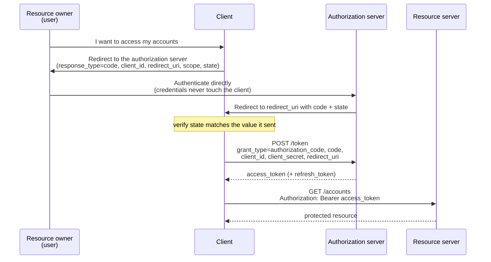
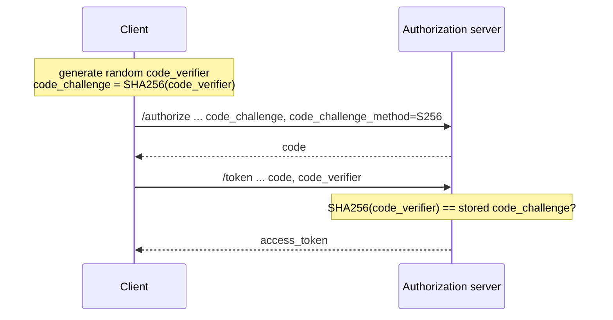

## Objective

Construir o modelo mental por trás de toda implementação de OAuth 2: quatro atores (resource owner, client, authorization server, resource server), um access token que substitui o reenvio de credenciais, um scope que define para que o token serve, e um *grant type* — a coreografia específica pela qual um client obtém esse token. O fluxo de token artesanal em `spring-security-custom-token-based-authentication` resolve o mesmo problema (parar de enviar a senha em toda requisição, tirar o gerenciamento de credenciais de dentro da aplicação), mas deixa cada decisão por sua conta; o OAuth 2 é o framework que padroniza essas decisões, e escolher o grant type certo é a primeira e mais consequente delas.

## Use Cases

- Decidir, antes de escrever qualquer código, de qual fluxo um novo sistema precisa: um app de terceiros acessando dados do usuário, uma SPA first-party mais um backend que você também possui, ou um backend service chamando outro sem nenhum usuário envolvido.
- Ler um erro de OAuth 2 ou a página de configuração de um provedor (`client_id`, `redirect_uri`, `response_type=code`, `scope`, `state`) e saber em qual etapa de qual fluxo você está.
- Revisar uma integração existente e reconhecer que ela usa um grant type que as diretrizes atuais da IETF não permitem mais — o achado mais comum em uma auditoria de OAuth 2 em código anterior a 2020.
- Entender por que um access token expira em minutos e para que serve de fato um refresh token, antes de implementar os tempos de vida dos tokens.
- Explicar para um time por que "simplesmente deixar o client coletar usuário e senha e repassar" não é a solução simples que parece ser.

## Deep Dive

### O problema: credenciais em toda requisição, gerenciadas em todo lugar

A autenticação HTTP Basic tem duas fraquezas estruturais que o livro usa como motivação para o OAuth 2:

- **As credenciais viajam em toda requisição.** O client precisa armazená-las em algum lugar para conseguir reenviá-las, e elas cruzam a rede o tempo todo.
- **Cada aplicação gerencia seu próprio repositório de credenciais.** Em uma organização com uma dúzia de apps, isso significa uma dúzia de bancos de senhas e uma dúzia de senhas por pessoa.

A solução para o segundo ponto é extrair o gerenciamento de credenciais para um único componente — um **authorization server** em que toda aplicação confia. A solução para o primeiro é fazer esse servidor distribuir um **token**: um substituto das credenciais de vida curta, revogável e limitado por scope. O OAuth 2 é o framework de especificação que descreve como essas duas peças interagem. Não é uma biblioteca nem uma implementação — os mesmos fluxos são implementados por Keycloak, Okta, Auth0, GitHub e Spring Authorization Server igualmente.

### Os quatro atores

| Ator | Possui | Responsabilidade |
| --- | --- | --- |
| **Resource owner** (o usuário) | usuário / senha | É dono dos recursos; aprova o acesso de um client a eles |
| **Client** (app web ou mobile) | `client_id` + `client_secret` | Acessa recursos *em nome* do usuário; identifica **a si mesmo** com credenciais próprias, que não são as do usuário |
| **Authorization server** | o repositório de credenciais | Autentica o usuário, decide se o client pode agir em seu nome, emite tokens |
| **Resource server** | os dados / ações | Expõe recursos protegidos; concede acesso a qualquer requisição que traga um token válido |

O ponto mais frequentemente esquecido: **o client tem identidade própria.** `client_id`/`client_secret` provam *qual aplicação* está pedindo; as credenciais do usuário (ou um token derivado delas) provam *em nome de quem*. São duas autenticações independentes, e os fluxos diferem principalmente em como a segunda é realizada.

Um **scope** é o nome que o OAuth 2 dá ao que o livro chama em outros lugares de granted authority — o subconjunto de permissões que um token carrega. Um token nunca é "o usuário"; ele é "este client, agindo em nome deste usuário, limitado a estes scopes, até este vencimento".

### Authorization code: o usuário nunca dá a senha ao client

O fluxo em torno do qual o framework é construído. O client redireciona o usuário *para o authorization server*, de modo que as credenciais são digitadas na própria tela de login do authorization server e nunca passam pelo client:



O passo 1 — o redirecionamento para o **authorization endpoint** — carrega:

```
GET /oauth2/authorize
    ?response_type=code          # I want a code, not a token
    &client_id=my-client         # which application is asking
    &redirect_uri=...            # where to send the user back (may be preregistered)
    &scope=read                  # what the token should be good for
    &state=<csrf-token>          # CSRF protection; the client verifies this on return
```

O passo 2 — a troca no **token endpoint** — é uma chamada de back-channel feita pelo client, autenticada com seu próprio secret:

```
POST /oauth2/token
    grant_type=authorization_code
    code=<the code from step 1>
    client_id=my-client
    client_secret=<secret>
    redirect_uri=...             # must match step 1
```

**Por que duas idas e vindas e dois artefatos diferentes?** O code prova *que o usuário interagiu com o authorization server*. O secret no passo 2 prova *que quem está chamando é de fato o client registrado, e não quem interceptou o redirecionamento*. O OAuth 2 também definiu um grant **implicit** que pulava o passo 2 e retornava o access token diretamente na redirect URI — o livro já não o lista entre os quatro principais, observando que seu uso "não é recomendado, e a maioria dos authorization servers hoje não permite mais", porque o servidor entrega um token sem nunca confirmar quem o recebeu.

O passo 3 — o client chama o resource server com o token no header `Authorization`. Essa etapa é idêntica em *todos* os grant types; só muda como o token foi obtido.

A analogia do livro: você encomenda livros, um amigo vai buscá-los, e o dono da loja liga *para você* para confirmar antes de entregar. Você é o resource owner, o amigo é o client, o dono da loja é o authorization server. O detalhe crucial: seu amigo nunca precisa do seu documento.

### Password: o próprio client coleta as credenciais

Também chamado de grant *resource owner credentials*. O client mostra seu próprio formulário de login, coleta usuário e senha e os envia via POST ao token endpoint:

```
POST /oauth2/token
    grant_type=password
    client_id=my-client
    client_secret=<secret>
    username=katushka
    password=<plain text>
    scope=read
```

Uma única ida e volta, sem redirecionamento, sem code. Continuando a analogia: em vez da loja ligar para você, **você entrega seu documento ao amigo**. O usuário precisa confiar totalmente no client, porque o client vê a senha em texto puro.

O livro apresenta isso como legítimo quando "o client e o authorization server são construídos e mantidos pela mesma organização" — o típico frontend Angular/React/Vue ou mobile conversando com um microsserviço de autenticação que você também possui, em que mandar o usuário para uma tela de login do *seu próprio* sistema e trazê-lo de volta parece estranho. Mas o livro também avisa duas vezes que esse grant é "menos seguro que o authorization code grant type", diz para "tentar evitar esse grant type em cenários reais" e, mesmo para sistemas da mesma organização: "você deveria primeiro pensar em usar o authorization code grant type. Considere o password grant type como sua segunda opção." Veja a subseção Livro vs. hoje — a orientação atual vai bem além disso.

### Client credentials: sem usuário nenhum

O grant mais simples. Usado em chamadas máquina-a-máquina, em que o client age por *si próprio*, e não em nome de ninguém:

```
POST /oauth2/token
    grant_type=client_credentials
    client_id=my-service
    client_secret=<secret>
    scope=read
```

As mesmas duas etapas do password grant, menos as credenciais do usuário. O livro descreve isso como "uma combinação do password grant type com um fluxo de autenticação por API key" — e faz a observação arquitetural certa: se o sistema já fala OAuth 2, usar esse grant é mais limpo do que grudar um filtro de API key personalizado ao lado do framework. Não há **refresh token** aqui, porque não há nada a evitar repetir: o client pode simplesmente repetir a chamada com suas próprias credenciais.

### Refresh tokens: access tokens de vida curta sem logins repetidos

Um token que nunca expira "se torna quase tão poderoso quanto as credenciais do usuário" — ele viaja como header em toda requisição, então um token interceptado concede acesso indefinido. Por isso access tokens devem ter vida curta; mas rodar o grant inteiro de novo a cada vinte minutos significa ou redirecionar o usuário repetidamente para uma tela de login, ou — muito pior — o client armazenar a senha do usuário para reenviá-la. O livro é direto: "Armazenar as credenciais do usuário ao usar o password grant type é um dos maiores erros que você pode cometer!"

O refresh token é a alternativa. Ele é emitido junto com o access token pelos grants baseados em usuário (authorization code, password), é armazenado pelo client e é trocado por um access token novo quando o antigo expira:

```
POST /oauth2/token
    grant_type=refresh_token
    refresh_token=<value>
    client_id=my-client
    client_secret=<secret>
    scope=read                   # the same authorities or fewer; more requires re-authentication
```

A resposta traz um novo access token **e um novo refresh token**. Armazenar um refresh token é mais seguro que armazenar credenciais por dois motivos: ele é revogável, e é restrito a uma única aplicação, enquanto as pessoas reutilizam senhas em várias.

### Os pecados do OAuth 2

A própria crítica do livro — são falhas de implementação sobre um framework sólido, não falhas dos fluxos em si:

- **CSRF no client.** Uma vez que o usuário tem uma sessão com o client, a ausência de proteção CSRF é explorável do jeito de sempre; o parâmetro `state` é a própria defesa do fluxo na etapa de redirecionamento.
- **Roubo das credenciais do client.** Um `client_secret` armazenado ou transmitido sem proteção é um comprometimento total da identidade do client — motivo pelo qual um app rodando no browser simplesmente não pode ter um.
- **Replay de token.** Tokens viajam em toda requisição e podem ser interceptados e reutilizados; "imagine perder a chave da porta da frente de sua casa."
- **Sequestro de token.** Interferência no próprio fluxo para capturar tokens — incluindo refresh tokens, que geram access tokens novos sob demanda.

Até o authorization code grant tem uma fraqueza documentada que o livro sinaliza: se um atacante intercepta o authorization code *e* as credenciais do client vazam, a troca é bem-sucedida. O livro aponta a RFC 7636 — Proof Key for Code Exchange (PKCE) — como mitigação, que é exatamente onde a orientação atual chegou.

### Livro vs. hoje: o password grant está proibido, e o PKCE não é opcional

O livro (2020) ensina quatro grant types como escolhas legítimas. Duas coisas mudaram desde então, e ambas importam:

**1. O password grant está fora.** A *OAuth 2.0 Security Best Current Practice* da IETF — publicada em janeiro de 2025 como **RFC 9700 / BCP 240** — declara que o resource owner password credentials grant "NÃO DEVE ser usado", porque ele "expõe de forma insegura as credenciais do resource owner ao client". O **rascunho da OAuth 2.1** (`draft-ietf-oauth-v2-1`, Standards Track, revisão mais recente de março de 2026) simplesmente não define esse grant: sua lista de mudanças diz "O Resource Owner Password Credentials grant foi omitido desta especificação." O oauth.net resume assim: a Security BCP "desabilita completamente o password grant… não é mais recomendado usar esse grant de forma alguma", observando ainda que ele "não oferece nenhum mecanismo para coisas como autenticação multifator ou contas delegadas." Note que isso é mais forte do que o enquadramento de "segunda opção" do livro, e vale também para clients first-party — o cenário de SPA-mais-serviço-de-auth-próprio que o livro usa para justificar o grant é exatamente o que a *OAuth 2.0 for Browser-Based Applications* aborda, e esse rascunho lista o password grant entre os padrões desencorajados, afirmando que "a prática recomendada atual para aplicações baseadas em browser é usar o OAuth 2.0 Authorization Code grant type com PKCE."

O Spring seguiu essa linha. `AuthorizationGrantType.PASSWORD` carrega a nota de depreciação *"A OAuth 2.0 Security Best Current Practice mais recente desabilita o uso do Resource Owner Password Credentials grant"* ao longo do Spring Security 6.x, e a constante está **ausente da API do Spring Security 7.0** por completo. O Spring Authorization Server nunca deu suporte a ele: sua lista de recursos cobre authorization code, client credentials, refresh token, device code e token exchange. Assim, os capítulos 13-15 do livro, que implementam o password grant em um authorization server Spring, descrevem uma arquitetura que você não consegue construir com os componentes Spring atualmente suportados sem escrever um grant customizado — leia-os pela *mecânica dos tokens*, não como um roteiro pronto.

**2. O PKCE se aplica a todo client, não só a apps mobile.** O livro menciona PKCE apenas em uma nota como reforço extra para o cenário de interceptação. A OAuth 2.1 torna isso obrigatório: "PKCE é exigido para todos os clients OAuth que usam o authorization code flow", e o oauth.net afirma claramente que "PKCE é recomendado mesmo que um client esteja usando um client secret ou outra forma de autenticação de client". O PKCE adiciona dois parâmetros ao fluxo já mostrado — o client gera um `code_verifier` aleatório, envia seu hash antecipadamente e revela o original na troca:



Um authorization code roubado agora não tem valor sem o verifier, que nunca saiu do client. No client OAuth2 do Spring Security, o PKCE é aplicado automaticamente para clients públicos — um `ClientRegistration` com `client-authentication-method: none` e `authorization-grant-type: authorization_code`, ou um cujo `clientSettings.requireProofKey` seja `true`:

```yaml
spring:
  security:
    oauth2:
      client:
        registration:
          my-spa:
            client-id: my-spa
            client-authentication-method: none      # public client -> PKCE applied
            authorization-grant-type: authorization_code
            redirect-uri: "{baseUrl}/login/oauth2/code/{registrationId}"
            scope: openid, profile
```

**3. Deriva de terminologia.** Duas outras mudanças da OAuth 2.1 afetam código escrito conforme o livro: redirect URIs "devem ser comparadas usando correspondência exata de string" (sem correspondência por prefixo ou wildcard), e bearer tokens não podem mais ser passados na query string de uma URI. Os nomes dos grant types em si permanecem inalterados — a própria documentação do Spring para o client OAuth2 lista exatamente *Authorization Code*, *Refresh Token*, *Client Credentials*, *JWT Bearer* e *Token Exchange*, com **Device Code** adicionado para dispositivos com entrada limitada. Os quatro atores e o significado de scope, access token e refresh token são exatamente como o livro os descreve.

## Trade-offs

- **Authorization code custa um redirecionamento e compra isolamento de credenciais.** O usuário sai da sua UI para se autenticar, e o client precisa de uma troca em back-channel e de uma redirect URI registrada — em troca, o client nunca vê uma senha, o acesso é revogável por client, e o fluxo é o único que a orientação atual endossa para apps voltados ao usuário. Quando o redirecionamento parece estranho porque o authorization server também é seu, a resposta hoje é manter o fluxo e usar uma tela de login hospedada, não trocar pelo password grant.
- **Client credentials troca delegação por simplicidade.** Sem usuário, sem consentimento, sem refresh token — e portanto sem autorização por usuário: o que o token alcança, ele alcança para todo mundo. Ótimo para service-to-service; nunca um substituto para contexto de usuário.
- **Tempos de vida curtos para access tokens deslocam o risco em vez de eliminá-lo.** Eles reduzem a janela de replay, mas o refresh token que você introduz para tolerar isso é, ele mesmo, uma credencial de vida longa e interceptável; a OAuth 2.1 responde exigindo que refresh tokens de clients públicos sejam "restritos ao remetente ou de uso único". Rotacionar a cada refresh (um novo refresh token em cada resposta, como o livro descreve) é o mínimo padrão.
- **Um client confidencial é uma propriedade de deployment, não uma preferência.** Qualquer coisa rodando em um browser ou no dispositivo de um usuário não pode guardar um `client_secret`; é isso que o torna um client público, e é isso que torna o PKCE obrigatório em vez de apenas desejável. Colocar um secret dentro do bundle de uma SPA não transforma nada em client confidencial com passos extras.
- **A flexibilidade do framework é onde moram as vulnerabilidades.** Cada um dos "pecados" do livro é um mau uso, não um defeito da especificação — o que reforça o argumento de se apoiar nas implementações do Spring Security para esses fluxos em vez de construí-los na mão: veja `spring-security-oauth2-client-and-sso` para consumir um provedor como client, `spring-security-oauth2-authorization-server` para emitir tokens, `spring-security-oauth2-resource-server-approaches` para validá-los, e `spring-security-jwt-signing-symmetric-and-asymmetric` para entender o que realmente há dentro de um JWT access token.
- **O grant type é a decisão que é cara de reverter.** Formato do token, armazenamento e estratégia de validação podem ser trocados depois por trás de uma interface; o grant type é visível para todo client, todo registro de redirect e, muitas vezes, para o usuário final, então acertá-lo desde o início vale a leitura.

## Documentation Links

- [Spring Security in Action (Manning, 2020) — Chapter 12: "How does OAuth 2 work?", sections 12.1-12.4, p. 285-299](https://www.manning.com/books/spring-security-in-action) — doc
- [RFC 9700 / BCP 240 — Best Current Practice for OAuth 2.0 Security (January 2025)](https://www.rfc-editor.org/rfc/rfc9700.html) — doc
- [draft-ietf-oauth-v2-1 — The OAuth 2.1 Authorization Framework](https://datatracker.ietf.org/doc/draft-ietf-oauth-v2-1/) — doc
- [oauth.net — OAuth 2.1 (summary of changes from OAuth 2.0)](https://oauth.net/2.1/) — doc
- [oauth.net — OAuth 2.0 Password Grant (legacy, disallowed)](https://oauth.net/2/grant-types/password/) — doc
- [oauth.net — PKCE](https://oauth.net/2/pkce/) — doc
- [RFC 7636 — Proof Key for Code Exchange by OAuth Public Clients](https://www.rfc-editor.org/rfc/rfc7636.html) — doc
- [RFC 6749 — The OAuth 2.0 Authorization Framework](https://www.rfc-editor.org/rfc/rfc6749.html) — doc
- [draft-ietf-oauth-browser-based-apps — OAuth 2.0 for Browser-Based Applications](https://datatracker.ietf.org/doc/html/draft-ietf-oauth-browser-based-apps) — doc
- [Spring Security Reference — OAuth2 Client Authorization Grant Support](https://docs.spring.io/spring-security/reference/servlet/oauth2/client/authorization-grants.html) — doc
- [Spring Security API — AuthorizationGrantType](https://docs.spring.io/spring-security/site/docs/current/api/org/springframework/security/oauth2/core/AuthorizationGrantType.html) — doc
- [Spring Authorization Server Reference — Overview and supported grant types](https://docs.spring.io/spring-authorization-server/reference/overview.html) — doc
