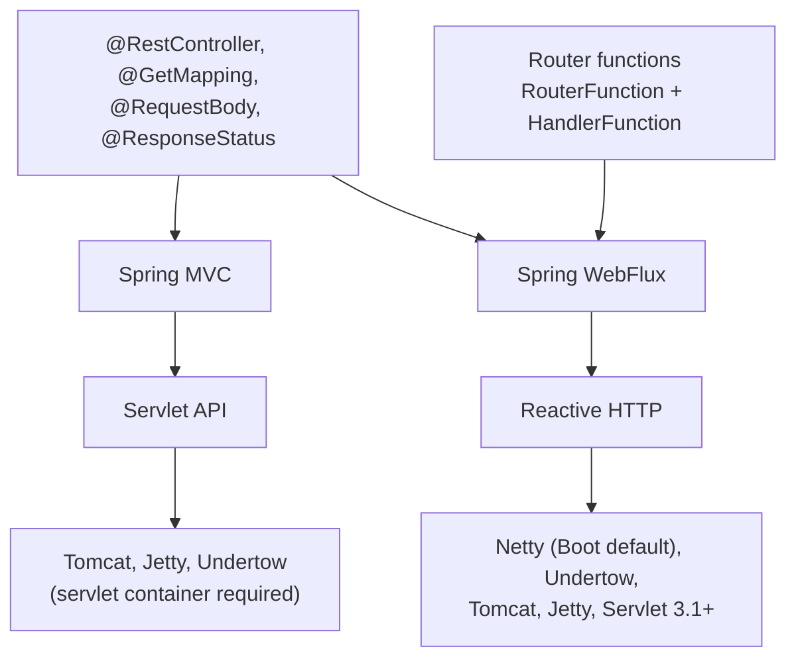

## Objective

Spring WebFlux is the reactive counterpart to Spring MVC: the same annotation-driven
programming model — `@RestController`, `@RequestMapping`, `@GetMapping`,
`@RequestBody` — but with handler methods that accept and return `Mono` and `Flux`
(see [Reactor Fundamentals](spring-reactor-fundamentals) for what those types are and
what the Reactive Streams contract guarantees) instead of blocking domain types and
collections. It is a *separate* framework rather than a reactive mode bolted onto
Spring MVC, because Spring MVC is built on the Servlet API, whose core contracts are
synchronous or outright blocking; WebFlux sits on a reactive HTTP abstraction instead
and therefore needs no servlet container at all — Spring Boot runs it on Netty by
default. On top of that, WebFlux ships a second, entirely annotation-free programming
model: functional endpoints, where a `RouterFunction` bean maps request predicates to
`HandlerFunction`s in plain code. This concept covers the server side — controllers,
routers, and how to test both. The client half of the reactive web story lives in
[Reactive Consumption with WebClient](spring-webclient-reactive-consumption).

## Use Cases

- A high-concurrency HTTP API — tens of thousands of mostly-idle connections, IoT
  devices, long polling, SSE — where the thread-per-request model would exhaust the
  servlet container's pool long before the CPU is busy.
- An aggregating endpoint that fans out to several downstream services and combines
  the results, where the composition itself (merge, zip, timeout, retry, take-first)
  is the hard part and no thread should be parked waiting on any one call.
- Streaming a response that is large or unbounded — a live feed, a tail of events, a
  multi-million-row export — where the client's demand, not the server's memory,
  should govern how fast data flows.
- A lightweight, functional-style API (a small microservice, a gateway, a set of
  webhook receivers) where the annotation machinery buys little and explicit routing
  code buys transparency and breakpoints.
- Any application already committed to a reactive stack end to end — R2DBC or reactive
  Mongo repositories, `WebClient` calls, RSocket — where the web layer must speak
  `Mono`/`Flux` natively or the whole model collapses.

## Deep Dive

### Two stacks, one set of annotations

Spring MVC sits on the Servlet API and assumes a request may block: the container
keeps a large thread pool so that a parked thread is merely wasteful, not fatal.
WebFlux assumes the opposite — that application code never blocks — and so runs on a
small, fixed-size pool of event-loop workers, typically one per CPU core. What makes
WebFlux approachable is that the top of the two stacks is shared: the annotations
that define a controller come from `spring-web` and are identical on both sides.



The most consequential decision is made in the build file, not in the code — which
starter you pull in selects which stack you get:

```xml
<!-- Spring MVC: servlet stack, Tomcat by default -->
<dependency>
  <groupId>org.springframework.boot</groupId>
  <artifactId>spring-boot-starter-web</artifactId>
</dependency>

<!-- Spring WebFlux: reactive stack, Netty by default -->
<dependency>
  <groupId>org.springframework.boot</groupId>
  <artifactId>spring-boot-starter-webflux</artifactId>
</dependency>
```

Add both and Spring Boot picks Spring MVC — a common surprise when a WebFlux service
transitively drags in `spring-boot-starter-web` and quietly starts on Tomcat with a
servlet dispatcher.

### Annotated reactive controllers

A Spring MVC controller that returns a collection is doing two blocking things: the
repository call blocks until the rows are in memory, and the handler cannot return
until it has them.

```java
@RestController
@RequestMapping(path = "/design", produces = "application/json")
public class DesignTacoController {

    private final TacoRepository tacoRepo;

    public DesignTacoController(TacoRepository tacoRepo) {
        this.tacoRepo = tacoRepo;
    }

    @GetMapping("/recent")
    public Iterable<Taco> recentTacos() {
        PageRequest page = PageRequest.of(0, 12, Sort.by("createdAt").descending());
        return tacoRepo.findAll(page).getContent();
    }
}
```

`Iterable` is not a reactive type: no operators apply to it, and the framework cannot
treat it as a stream. The minimal step is to adapt at the controller boundary —
useful when the repository underneath is still blocking:

```java
@GetMapping("/recent")
public Flux<Taco> recentTacos() {
    return Flux.fromIterable(tacoRepo.findAll()).take(12);
}
```

This is honest about the shape of the response but dishonest about the execution:
`tacoRepo.findAll()` still blocks whatever thread calls it, and on WebFlux that is an
event-loop thread. The real target is a repository that hands back a `Flux` in the
first place, so the controller is the tip of an end-to-end reactive stack:

```java
public interface TacoRepository extends ReactiveCrudRepository<Taco, Long> {
}

@GetMapping("/recent")
public Flux<Taco> recentTacos() {
    return tacoRepo.findAll().take(12);
}
```

Note what is *not* there: no `subscribe()`. The framework subscribes to the returned
publisher when it writes the response. The handler method returns before a single row
has been fetched — it has returned a description of the work, not the work's result.

Single-valued responses collapse in the same way. The imperative version has to
unwrap an `Optional` by hand:

```java
@GetMapping("/{id}")
public Taco tacoById(@PathVariable("id") Long id) {
    Optional<Taco> optTaco = tacoRepo.findById(id);
    if (optTaco.isPresent()) {
        return optTaco.get();
    }
    return null;
}
```

A reactive repository returns `Mono<Taco>`, which already encodes "zero or one", so
the branching disappears:

```java
@GetMapping("/{id}")
public Mono<Taco> tacoById(@PathVariable("id") Long id) {
    return tacoRepo.findById(id);
}
```

An empty `Mono` becomes a 404 without an `if` in sight. Reactor types are the natural
choice, but WebFlux is not tied to them: RxJava's `Observable`, `Flowable`, `Single`,
and `Completable` (equivalent to `Mono<Void>`) all work as return types, and Kotlin
coroutines' `suspend` functions and `Flow` are first-class as well.

### Accepting reactive input

Return types are only half of it. A handler that binds `@RequestBody` to a domain
object cannot be invoked until the entire request payload has been read and
deserialized — so the request blocks on the way in as well as on the way out:

```java
@PostMapping(consumes = "application/json")
@ResponseStatus(HttpStatus.CREATED)
public Taco postTaco(@RequestBody Taco taco) {
    return tacoRepo.save(taco);
}
```

Declaring the body as a `Mono<Taco>` makes the method callable immediately, before
the body has arrived. It is handed a publisher of the eventual payload and returns a
publisher of the eventual response:

```java
@PostMapping(consumes = "application/json")
@ResponseStatus(HttpStatus.CREATED)
public Mono<Taco> postTaco(@RequestBody Mono<Taco> tacoMono) {
    return tacoRepo.saveAll(tacoMono).next();
}
```

`saveAll()` on a reactive repository accepts any Reactive Streams `Publisher`, so it
takes the `Mono` directly and returns a `Flux<Taco>`. Because the source was a `Mono`,
that `Flux` emits at most one element, and `next()` narrows it back to `Mono<Taco>`.
Nothing in this method waits for anything: the whole request/save/respond chain is
assembled and returned before the first byte of the body is parsed. Reactive
`@RequestBody` arguments are the one place where WebFlux's annotated model genuinely
diverges from Spring MVC's — Spring MVC controllers may *return* `Mono`/`Flux`, but
they cannot accept a reactive request body.

### Functional endpoints: `RouterFunction` and `HandlerFunction`

Annotations split *what* from *how*: the annotation declares intent, the framework
decides behaviour somewhere else, and you cannot set a breakpoint on an annotation.
WebFlux's functional model removes the indirection — the application routes and
handles requests itself, in ordinary code, using four types:

- `RequestPredicate` — declares which requests match.
- `RouterFunction` — maps a matching request to a handler. The reference defines it as
  "a function that takes `ServerRequest` and returns a delayed `HandlerFunction`".
- `ServerRequest` / `ServerResponse` — immutable views of the HTTP exchange, with
  reactive body extraction (`bodyToMono`, `bodyToFlux`) and reactive body writing.

A `HandlerFunction` is simply "a function that takes a `ServerRequest` and returns a
delayed `ServerResponse` (i.e. `Mono<ServerResponse>`)". The whole thing is a `@Bean`:

```java
import static org.springframework.web.reactive.function.server.RequestPredicates.GET;
import static org.springframework.web.reactive.function.server.RouterFunctions.route;
import static org.springframework.web.reactive.function.server.ServerResponse.ok;
import static reactor.core.publisher.Mono.just;

@Configuration
public class RouterFunctionConfig {

    @Bean
    public RouterFunction<ServerResponse> helloRouterFunction() {
        return route(GET("/hello"),
                request -> ok().body(just("Hello World!"), String.class))
            .andRoute(GET("/bye"),
                request -> ok().body(just("See ya!"), String.class));
    }
}
```

Lambdas are fine while the handler is one expression. Anything real belongs in a
method (or a dedicated handler class), referenced by method reference — which is also
where the breakpoint goes:

```java
@Configuration
public class RouterFunctionConfig {

    @Bean
    public RouterFunction<ServerResponse> routerFunction(TacoRepository tacoRepo) {
        return RouterFunctions.route()
            .GET("/design/taco", request -> recents(request, tacoRepo))
            .POST("/design", request -> postTaco(request, tacoRepo))
            .build();
    }

    private Mono<ServerResponse> recents(ServerRequest request, TacoRepository tacoRepo) {
        return ServerResponse.ok()
            .body(tacoRepo.findAll().take(12), Taco.class);
    }

    private Mono<ServerResponse> postTaco(ServerRequest request, TacoRepository tacoRepo) {
        return request.bodyToMono(Taco.class)
            .flatMap(tacoRepo::save)
            .flatMap(saved -> ServerResponse
                .created(URI.create("/design/taco/" + saved.getId()))
                .bodyValue(saved));
    }
}
```

Two details are worth dwelling on. First, `body(publisher, Class)` writes an
unresolved publisher — the response starts streaming as rows arrive — whereas
`bodyValue(obj)` writes a value already in hand. Second, `postTaco` has to compose:
the saved taco's id is inside a `Mono`, so building a `Location` header from it
requires `flatMap`, not a getter. Reaching into a publisher for a field is the single
most common mistake when translating an imperative handler, and it does not compile.

Routes nest, which is where the builder earns its keep on a real API:

```java
@Bean
public RouterFunction<ServerResponse> tacoRoutes(TacoHandler handler) {
    return RouterFunctions.route()
        .path("/design", builder -> builder
            .GET("/recent", accept(APPLICATION_JSON), handler::recents)
            .GET("/{id}", accept(APPLICATION_JSON), handler::byId)
            .POST("", handler::postTaco))
        .build();
}
```

Nothing stops an application from running both models side by side; annotated
controllers and router function beans coexist in the same context.

### Testing with `WebTestClient` — mock environment

`WebTestClient` is the reactive analogue of `MockMvc`/`TestRestTemplate`: a fluent
HTTP client with assertions built in, which can drive a controller through mock
request and response objects with no server running at all. Binding directly to a
controller instance keeps the test a unit test:

```java
public class DesignTacoControllerTest {

    @Test
    public void shouldReturnRecentTacos() {
        Taco[] tacos = {
            testTaco(1L),  testTaco(2L),  testTaco(3L),  testTaco(4L),
            testTaco(5L),  testTaco(6L),  testTaco(7L),  testTaco(8L),
            testTaco(9L),  testTaco(10L), testTaco(11L), testTaco(12L),
            testTaco(13L), testTaco(14L), testTaco(15L), testTaco(16L) };
        Flux<Taco> tacoFlux = Flux.just(tacos);

        TacoRepository tacoRepo = Mockito.mock(TacoRepository.class);
        when(tacoRepo.findAll()).thenReturn(tacoFlux);

        WebTestClient testClient = WebTestClient
            .bindToController(new DesignTacoController(tacoRepo))
            .build();

        testClient.get().uri("/design/recent")
            .exchange()
            .expectStatus().isOk()
            .expectBody()
                .jsonPath("$").isArray()
                .jsonPath("$").isNotEmpty()
                .jsonPath("$[0].name").isEqualTo("Taco 1")
                .jsonPath("$[11].name").isEqualTo("Taco 12")
                .jsonPath("$[12]").doesNotExist();
    }
}
```

`exchange()` is the point where the request is actually submitted; everything before
it describes the request and everything after it asserts on the response. The mock
repository publishes 16 tacos and the last assertion pins the contract that matters —
`take(12)` really did truncate.

Long chains of `jsonPath()` get unreadable fast. Two alternatives: compare the whole
body against a JSON document on the classpath, or assert on a typed list.

```java
ClassPathResource recentsResource = new ClassPathResource("/tacos/recent-tacos.json");
String recentsJson = StreamUtils.copyToString(
        recentsResource.getInputStream(), Charset.defaultCharset());

testClient.get().uri("/design/recent")
    .accept(MediaType.APPLICATION_JSON)
    .exchange()
    .expectStatus().isOk()
    .expectBody()
        .json(recentsJson);

testClient.get().uri("/design/recent")
    .accept(MediaType.APPLICATION_JSON)
    .exchange()
    .expectStatus().isOk()
    .expectBodyList(Taco.class)
        .contains(Arrays.copyOf(tacos, 12));
```

Every HTTP method has a corresponding builder method — `get()`, `post()`, `put()`,
`patch()`, `delete()`, `head()` — and a request with a body takes a publisher, so the
input side stays reactive too:

```java
@Test
public void shouldSaveATaco() {
    TacoRepository tacoRepo = Mockito.mock(TacoRepository.class);

    Mono<Taco> unsavedTacoMono = Mono.just(testTaco(null));
    Taco savedTaco = testTaco(null);
    savedTaco.setId(1L);
    when(tacoRepo.save(any())).thenReturn(Mono.just(savedTaco));

    WebTestClient testClient = WebTestClient
        .bindToController(new DesignTacoController(tacoRepo))
        .build();

    testClient.post()
        .uri("/design")
        .contentType(MediaType.APPLICATION_JSON)
        .body(unsavedTacoMono, Taco.class)
        .exchange()
        .expectStatus().isCreated()
        .expectBody(Taco.class)
            .isEqualTo(savedTaco);
}
```

Functional endpoints are testable the same way — there is no controller instance to
bind to, so bind to the router instead:

```java
RouterFunction<ServerResponse> route = new RouterFunctionConfig().routerFunction(tacoRepo);
WebTestClient testClient = WebTestClient.bindToRouterFunction(route).build();
```

### Testing against a live server

Mock bindings exercise the framework, not the server. To test a controller inside a
real Netty (or Tomcat) instance, with the real repository and the real serialization
path, ask Spring Boot to start one on a random port and inject a `WebTestClient`
already pointed at it:

```java
@SpringBootTest(webEnvironment = WebEnvironment.RANDOM_PORT)
public class DesignTacoControllerWebTest {

    @Autowired
    private WebTestClient testClient;

    @Test
    public void shouldReturnRecentTacos() {
        testClient.get().uri("/design/recent")
            .accept(MediaType.APPLICATION_JSON)
            .exchange()
            .expectStatus().isOk()
            .expectBody()
                .jsonPath("$[?(@.id == 'TACO1')].name").isEqualTo("Carnivore")
                .jsonPath("$[?(@.id == 'TACO2')].name").isEqualTo("Bovine Bounty")
                .jsonPath("$[?(@.id == 'TACO3')].name").isEqualTo("Veg-Out");
    }
}
```

The injected client knows the randomly chosen port, so URIs stay relative. Prefer
`RANDOM_PORT` over `DEFINED_PORT` — a fixed port invites a clash with a concurrently
running server or another test class. For a client pointed at something Spring did not
start, `WebTestClient.bindToServer().baseUrl("http://localhost:8080").build()` covers
the fully external case.

> **Book vs. today.** The core of this chapter has aged unusually well. WebFlux's
> annotated model, the functional endpoint model, and `WebTestClient` are all
> materially unchanged from 2019 through Spring Framework 6.x/7.x: the reference guide
> still describes annotated controllers as "consistent with Spring MVC and based on the
> same annotations from the `spring-web` module", still defines a `HandlerFunction` as
> "a function that takes a `ServerRequest` and returns a delayed `ServerResponse`", and
> still confirms that "Spring Boot defaults to Netty". `RouterFunctions.route(predicate,
> handler)` and `.andRoute(...)` from the book are not deprecated; Spring 5.1 simply
> added the discoverable `route()` builder (`.GET(...)`, `.POST(...)`, `.path(...)`,
> `.nest(...)`, `.build()`) shown above, which is what current docs lead with. The
> genuinely stale bits are small: JUnit 4's `@RunWith(SpringRunner.class)` is unnecessary
> under JUnit 5 (`@SpringBootTest` bootstraps the context by itself), `syncBody()` was
> renamed `bodyValue()` in Spring 5.2, and Boot 3 moved `javax.*` to `jakarta.*`. Two of
> the book's listings also don't compile as printed — the functional `postTaco()` calls
> `savedTaco.getId()` on a `Mono<Taco>` and passes a `Mono` to `save()`; the versions
> above fix both with `flatMap`.
>
> What has changed is the *decision* the chapter implicitly makes for you. In 2019,
> WebFlux was the only mainstream Java answer to "serve tens of thousands of concurrent
> I/O-bound requests without a thread each". Java 21 virtual threads changed that, and
> Spring now says so explicitly: its "Runtime efficiency with Spring" post states that
> "Virtual Threads make blocking on I/O cheap and are therefore an ideal fit for Spring
> Web MVC applications on a Servlet stack", and expects virtual threads plus Spring MVC
> (`spring.threads.virtual.enabled=true`) to become the common choice on Java 21+ for
> typical web workloads — especially, per the reference guide, when "you have blocking
> persistence APIs (JPA, JDBC) or networking APIs to use". WebFlux's remaining unique
> value, in Spring's own framing, is application-level concurrency and streaming:
> sending multiple remote requests and combining the results, backpressure over
> unbounded streams, SSE/WebSocket/RSocket. The reference guide is also blunt that
> reactive "generally do[es] not make applications run faster" — "the key expected
> benefit ... is the ability to scale with a small, fixed number of threads and less
> memory". Read this chapter as a toolkit for those cases, not as the default answer to
> "my API is slow under load".

## Trade-offs

- **Annotated controllers vs. functional endpoints — familiarity against
  transparency.** Annotations are what every Spring developer already knows, and
  migrating a Spring MVC controller often means changing only the return type.
  Functional endpoints put the application in charge from start to finish: routing is
  ordinary code you can read, compose, unit-test, and set a breakpoint inside, and
  routes can be assembled conditionally. The cost is that everything the annotations
  did for free — content negotiation predicates, `@Valid`, exception handler
  resolution, argument binding — becomes something you write explicitly.
  ```java
  // annotated: the framework calls you
  @GetMapping("/{id}")
  public Mono<Taco> tacoById(@PathVariable Long id) { return tacoRepo.findById(id); }

  // functional: you call the framework
  .GET("/{id}", req -> tacoRepo.findById(Long.valueOf(req.pathVariable("id")))
      .flatMap(t -> ok().bodyValue(t))
      .switchIfEmpty(ServerResponse.notFound().build()))
  ```
- **Netty by default changes the operational picture, not just the code.** A WebFlux
  service has no servlet container, so servlet `Filter`s, `HandlerInterceptor`s,
  `ServletContext` tricks, servlet-based metrics and access-log configuration, and any
  library that reaches for `HttpServletRequest` simply do not apply — the equivalents
  are `WebFilter` and `ServerWebExchange`. Thread pool tuning inverts too: instead of
  sizing a large worker pool you have a handful of event-loop threads, and the usual
  "raise `server.tomcat.threads.max`" lever does not exist.
- **"Reactive all the way down" now includes the whole controller layer.** One blocking
  call inside a handler occupies an event-loop thread, of which there are roughly one
  per core, and stalls every other in-flight request that thread was multiplexing —
  a failure mode with no equivalent on the servlet stack, where blocking one worker
  out of two hundred is merely wasteful:
  ```java
  @GetMapping("/recent")
  public Flux<Taco> recentTacos() {
      // blocking JDBC on a Netty event-loop thread: stalls unrelated requests
      return Flux.fromIterable(jdbcTacoRepo.findAll()).take(12);
  }
  ```
  Adopting WebFlux therefore pulls in R2DBC or a reactive driver, `WebClient` instead
  of `RestTemplate`, and reactive equivalents of every other integration — or explicit
  `subscribeOn(Schedulers.boundedElastic())` offloading, which works but reintroduces
  a thread per blocking call.
- **Virtual threads have narrowed the case for adopting WebFlux at all.** For a
  conventional request/response service that is slow only because it waits on I/O,
  Java 21+ virtual threads with `spring.threads.virtual.enabled=true` on Spring MVC
  deliver comparable thread efficiency while keeping imperative code, real stack
  traces, working thread-locals, and ordinary debuggers and profilers. Spring's own
  guidance now points there first for typical web workloads and reserves WebFlux for
  application-level concurrency, streaming, and backpressure. Choosing WebFlux today
  should be justified by what reactive composes, not by scalability alone.
- **Handler methods return before the work happens, which inverts error handling and
  observability.** Because the framework subscribes, exceptions thrown inside the
  pipeline surface as `onError` signals rather than as something a surrounding
  `try`/`catch` in the handler can see, and stack traces show Reactor internals rather
  than your call path. `@ExceptionHandler` still works, but `onErrorResume`,
  `checkpoint()`, and `Hooks.onOperatorDebug()` become part of the everyday toolkit.
- **`WebTestClient` covers unit and integration testing well, but mock bindings are not
  the server.** `bindToController` / `bindToRouterFunction` run against mock request and
  response objects — fast, and enough for routing, serialization, and status codes, but
  they never exercise Netty, real connection handling, backpressure, or codec
  configuration that only appears at runtime. A `@SpringBootTest(webEnvironment =
  RANDOM_PORT)` layer on top is what catches those, at the cost of a real context per
  test class.

## Documentation Links

- Craig Walls, "Spring in Action", 5th Edition (Manning, 2019) — Chapter 11,
  "Developing reactive APIs", sections 11.1-11.3, p. 269-284 — doc
- [Spring Framework Reference — WebFlux Annotated Controllers](https://docs.spring.io/spring-framework/reference/web/webflux/controller.html) — doc
- [Spring Framework Reference — WebFlux Functional Endpoints (RouterFunction, HandlerFunction)](https://docs.spring.io/spring-framework/reference/web/webflux-functional.html) — doc
- [Spring Framework Reference — Testing with WebTestClient](https://docs.spring.io/spring-framework/reference/testing/webtestclient.html) — doc
- [Spring Framework Reference — Spring WebFlux Overview (why WebFlux, servers, WebFlux vs Spring MVC)](https://docs.spring.io/spring-framework/reference/web/webflux/new-framework.html) — doc
- [Spring Blog — Runtime efficiency with Spring (virtual threads vs. the reactive stack)](https://spring.io/blog/2023/10/16/runtime-efficiency-with-spring/) — doc
