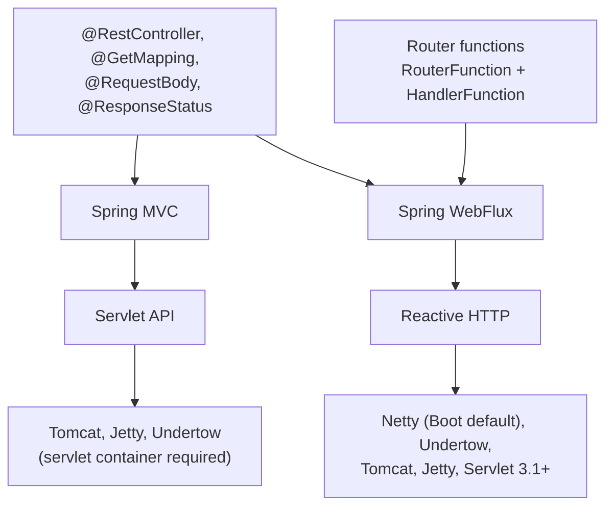

## Objective

Spring WebFlux é a contraparte reativa do Spring MVC: o mesmo modelo de
programação orientado a anotações — `@RestController`, `@RequestMapping`,
`@GetMapping`, `@RequestBody` — mas com métodos handler que aceitam e retornam
`Mono` e `Flux` (veja [Reactor Fundamentals](spring-reactor-fundamentals) para
entender o que esses tipos são e o que o contrato do Reactive Streams garante)
em vez de tipos de domínio bloqueantes e collections. É um framework
*separado*, e não um modo reativo encaixado no Spring MVC, porque o Spring MVC
é construído sobre a Servlet API, cujos contratos centrais são síncronos ou
diretamente bloqueantes; o WebFlux se apoia em uma abstração HTTP reativa e,
por isso, não precisa de nenhum servlet container — o Spring Boot roda ele no
Netty por padrão. Além disso, o WebFlux traz um segundo modelo de programação,
totalmente livre de anotações: endpoints funcionais, em que um bean
`RouterFunction` mapeia predicados de requisição para `HandlerFunction`s em
código puro. Este conceito cobre o lado servidor — controladores, routers, e
como testar ambos. A metade cliente da história reativa web está em
[Reactive Consumption with WebClient](spring-webclient-reactive-consumption).

## Use Cases

- Uma API HTTP de alta concorrência — dezenas de milhares de conexões
  majoritariamente ociosas, dispositivos IoT, long polling, SSE — onde o
  modelo de thread-por-requisição esgotaria o pool do servlet container muito
  antes da CPU ficar ocupada.
- Um endpoint agregador que se ramifica para vários serviços downstream e
  combina os resultados, onde a própria composição (merge, zip, timeout,
  retry, take-first) é a parte difícil e nenhuma thread deveria ficar parada
  esperando uma chamada específica.
- Fazer streaming de uma resposta grande ou ilimitada — um feed ao vivo, uma
  cauda de eventos, uma exportação de milhões de linhas — onde a demanda do
  cliente, e não a memória do servidor, deveria governar a velocidade do fluxo
  de dados.
- Uma API de estilo funcional e leve (um microsserviço pequeno, um gateway, um
  conjunto de receptores de webhook) onde a maquinaria de anotações compra
  pouco e código de roteamento explícito compra transparência e breakpoints.
- Qualquer aplicação já comprometida com uma stack reativa de ponta a ponta —
  R2DBC ou repositórios reativos do Mongo, chamadas `WebClient`, RSocket —
  onde a camada web precisa falar `Mono`/`Flux` nativamente ou o modelo
  inteiro desmorona.

## Deep Dive

### Duas stacks, um conjunto de anotações

O Spring MVC se apoia na Servlet API e assume que uma requisição pode
bloquear: o container mantém um pool grande de threads para que uma thread
parada seja apenas um desperdício, não fatal. O WebFlux assume o oposto — que
o código da aplicação nunca bloqueia — e por isso roda sobre um pool pequeno e
fixo de workers em event-loop, tipicamente um por núcleo de CPU. O que torna o
WebFlux acessível é que o topo das duas stacks é compartilhado: as anotações
que definem um controller vêm do `spring-web` e são idênticas nos dois lados.



A decisão mais consequente é tomada no arquivo de build, não no código — qual
starter você adiciona seleciona qual stack você recebe:

```xml
<!-- Spring MVC: servlet stack, Tomcat by default -->
<dependency>
  <groupId>org.springframework.boot</groupId>
  <artifactId>spring-boot-starter-web</artifactId>
</dependency>

<!-- Spring WebFlux: reactive stack, Netty by default -->
<dependency>
  <groupId>org.springframework.boot</groupId>
  <artifactId>spring-boot-starter-webflux</artifactId>
</dependency>
```

Adicione os dois e o Spring Boot escolhe o Spring MVC — uma surpresa comum
quando um serviço WebFlux traz transitivamente o `spring-boot-starter-web` e
silenciosamente sobe no Tomcat com um dispatcher servlet.

### Controladores reativos anotados

Um controller Spring MVC que retorna uma coleção está fazendo duas coisas
bloqueantes: a chamada ao repositório bloqueia até as linhas estarem em
memória, e o handler não pode retornar até tê-las.

```java
@RestController
@RequestMapping(path = "/design", produces = "application/json")
public class DesignTacoController {

    private final TacoRepository tacoRepo;

    public DesignTacoController(TacoRepository tacoRepo) {
        this.tacoRepo = tacoRepo;
    }

    @GetMapping("/recent")
    public Iterable<Taco> recentTacos() {
        PageRequest page = PageRequest.of(0, 12, Sort.by("createdAt").descending());
        return tacoRepo.findAll(page).getContent();
    }
}
```

`Iterable` não é um tipo reativo: nenhum operador se aplica a ele, e o
framework não pode tratá-lo como um stream. O passo mínimo é adaptar na
fronteira do controller — útil quando o repositório por baixo ainda é
bloqueante:

```java
@GetMapping("/recent")
public Flux<Taco> recentTacos() {
    return Flux.fromIterable(tacoRepo.findAll()).take(12);
}
```

Isso é honesto sobre a forma da resposta, mas desonesto sobre a execução:
`tacoRepo.findAll()` ainda bloqueia qualquer thread que a chame, e no WebFlux
essa é uma thread de event-loop. O alvo de verdade é um repositório que já
devolva um `Flux`, de forma que o controller seja a ponta de uma stack
reativa de ponta a ponta:

```java
public interface TacoRepository extends ReactiveCrudRepository<Taco, Long> {
}

@GetMapping("/recent")
public Flux<Taco> recentTacos() {
    return tacoRepo.findAll().take(12);
}
```

Repare no que *não* está aí: nenhum `subscribe()`. O framework assina o
publisher retornado quando escreve a resposta. O método handler retorna antes
de uma única linha ter sido buscada — ele retornou uma descrição do trabalho,
não o resultado do trabalho.

Respostas de valor único colapsam da mesma forma. A versão imperativa precisa
desembrulhar um `Optional` manualmente:

```java
@GetMapping("/{id}")
public Taco tacoById(@PathVariable("id") Long id) {
    Optional<Taco> optTaco = tacoRepo.findById(id);
    if (optTaco.isPresent()) {
        return optTaco.get();
    }
    return null;
}
```

Um repositório reativo retorna `Mono<Taco>`, que já codifica "zero ou um", de
forma que a ramificação desaparece:

```java
@GetMapping("/{id}")
public Mono<Taco> tacoById(@PathVariable("id") Long id) {
    return tacoRepo.findById(id);
}
```

Um `Mono` vazio vira um 404 sem nenhum `if` à vista. Tipos do Reactor são a
escolha natural, mas o WebFlux não está preso a eles: `Observable`,
`Flowable`, `Single` e `Completable` (equivalente a `Mono<Void>`) do RxJava
funcionam como tipos de retorno, e funções `suspend` e `Flow` do Kotlin
coroutines também são cidadãs de primeira classe.

### Aceitando entrada reativa

Os tipos de retorno são só metade da história. Um handler que faz bind de
`@RequestBody` para um objeto de domínio não pode ser invocado até que todo o
payload da requisição tenha sido lido e desserializado — então a requisição
também bloqueia na entrada, além de na saída:

```java
@PostMapping(consumes = "application/json")
@ResponseStatus(HttpStatus.CREATED)
public Taco postTaco(@RequestBody Taco taco) {
    return tacoRepo.save(taco);
}
```

Declarar o body como `Mono<Taco>` torna o método invocável imediatamente,
antes do body ter chegado. Ele recebe um publisher do payload futuro e
retorna um publisher da resposta futura:

```java
@PostMapping(consumes = "application/json")
@ResponseStatus(HttpStatus.CREATED)
public Mono<Taco> postTaco(@RequestBody Mono<Taco> tacoMono) {
    return tacoRepo.saveAll(tacoMono).next();
}
```

`saveAll()` em um repositório reativo aceita qualquer `Publisher` do Reactive
Streams, então recebe o `Mono` diretamente e retorna um `Flux<Taco>`. Como a
fonte era um `Mono`, esse `Flux` emite no máximo um elemento, e `next()` o
estreita de volta para `Mono<Taco>`. Nada nesse método espera por nada: toda
a cadeia requisição/salvamento/resposta é montada e retornada antes do
primeiro byte do body ser parseado. Argumentos reativos de `@RequestBody` são
o único lugar em que o modelo anotado do WebFlux realmente diverge do Spring
MVC — controllers Spring MVC podem *retornar* `Mono`/`Flux`, mas não conseguem
aceitar um request body reativo.

### Endpoints funcionais: `RouterFunction` e `HandlerFunction`

Anotações separam *o quê* de *como*: a anotação declara a intenção, o
framework decide o comportamento em outro lugar, e você não consegue colocar
um breakpoint em uma anotação. O modelo funcional do WebFlux remove essa
indireção — a própria aplicação roteia e trata as requisições, em código
comum, usando quatro tipos:

- `RequestPredicate` — declara quais requisições fazem match.
- `RouterFunction` — mapeia uma requisição correspondente para um handler. A
  referência define isso como "uma função que recebe `ServerRequest` e
  retorna um `HandlerFunction` atrasado".
- `ServerRequest` / `ServerResponse` — visões imutáveis da troca HTTP, com
  extração reativa de body (`bodyToMono`, `bodyToFlux`) e escrita reativa de
  body.

Um `HandlerFunction` é simplesmente "uma função que recebe um `ServerRequest`
e retorna um `ServerResponse` atrasado (ou seja, `Mono<ServerResponse>`)". O
conjunto todo é um `@Bean`:

```java
import static org.springframework.web.reactive.function.server.RequestPredicates.GET;
import static org.springframework.web.reactive.function.server.RouterFunctions.route;
import static org.springframework.web.reactive.function.server.ServerResponse.ok;
import static reactor.core.publisher.Mono.just;

@Configuration
public class RouterFunctionConfig {

    @Bean
    public RouterFunction<ServerResponse> helloRouterFunction() {
        return route(GET("/hello"),
                request -> ok().body(just("Hello World!"), String.class))
            .andRoute(GET("/bye"),
                request -> ok().body(just("See ya!"), String.class));
    }
}
```

Lambdas são adequadas enquanto o handler for uma expressão só. Qualquer coisa
mais séria pertence a um método (ou a uma classe handler dedicada),
referenciada por method reference — que é também onde entra o breakpoint:

```java
@Configuration
public class RouterFunctionConfig {

    @Bean
    public RouterFunction<ServerResponse> routerFunction(TacoRepository tacoRepo) {
        return RouterFunctions.route()
            .GET("/design/taco", request -> recents(request, tacoRepo))
            .POST("/design", request -> postTaco(request, tacoRepo))
            .build();
    }

    private Mono<ServerResponse> recents(ServerRequest request, TacoRepository tacoRepo) {
        return ServerResponse.ok()
            .body(tacoRepo.findAll().take(12), Taco.class);
    }

    private Mono<ServerResponse> postTaco(ServerRequest request, TacoRepository tacoRepo) {
        return request.bodyToMono(Taco.class)
            .flatMap(tacoRepo::save)
            .flatMap(saved -> ServerResponse
                .created(URI.create("/design/taco/" + saved.getId()))
                .bodyValue(saved));
    }
}
```

Dois detalhes merecem atenção. Primeiro, `body(publisher, Class)` escreve um
publisher ainda não resolvido — a resposta começa a fazer streaming conforme
as linhas chegam — enquanto `bodyValue(obj)` escreve um valor já em mãos.
Segundo, `postTaco` precisa compor: o id do taco salvo está dentro de um
`Mono`, então construir um header `Location` a partir dele exige `flatMap`,
não um getter. Alcançar dentro de um publisher para pegar um campo é o erro
mais comum ao traduzir um handler imperativo, e ele simplesmente não compila.

Rotas se aninham, o que é onde o builder mostra seu valor em uma API real:

```java
@Bean
public RouterFunction<ServerResponse> tacoRoutes(TacoHandler handler) {
    return RouterFunctions.route()
        .path("/design", builder -> builder
            .GET("/recent", accept(APPLICATION_JSON), handler::recents)
            .GET("/{id}", accept(APPLICATION_JSON), handler::byId)
            .POST("", handler::postTaco))
        .build();
}
```

Nada impede uma aplicação de rodar os dois modelos lado a lado; controllers
anotados e beans de router function coexistem no mesmo contexto.

### Testando com `WebTestClient` — ambiente mock

`WebTestClient` é o análogo reativo de `MockMvc`/`TestRestTemplate`: um
cliente HTTP fluente com asserções embutidas, que consegue exercitar um
controller através de objetos de requisição e resposta mockados sem nenhum
servidor rodando. Fazer bind diretamente a uma instância de controller mantém
o teste como um teste unitário:

```java
public class DesignTacoControllerTest {

    @Test
    public void shouldReturnRecentTacos() {
        Taco[] tacos = {
            testTaco(1L),  testTaco(2L),  testTaco(3L),  testTaco(4L),
            testTaco(5L),  testTaco(6L),  testTaco(7L),  testTaco(8L),
            testTaco(9L),  testTaco(10L), testTaco(11L), testTaco(12L),
            testTaco(13L), testTaco(14L), testTaco(15L), testTaco(16L) };
        Flux<Taco> tacoFlux = Flux.just(tacos);

        TacoRepository tacoRepo = Mockito.mock(TacoRepository.class);
        when(tacoRepo.findAll()).thenReturn(tacoFlux);

        WebTestClient testClient = WebTestClient
            .bindToController(new DesignTacoController(tacoRepo))
            .build();

        testClient.get().uri("/design/recent")
            .exchange()
            .expectStatus().isOk()
            .expectBody()
                .jsonPath("$").isArray()
                .jsonPath("$").isNotEmpty()
                .jsonPath("$[0].name").isEqualTo("Taco 1")
                .jsonPath("$[11].name").isEqualTo("Taco 12")
                .jsonPath("$[12]").doesNotExist();
    }
}
```

`exchange()` é o ponto em que a requisição é de fato enviada; tudo antes dele
descreve a requisição e tudo depois faz asserções sobre a resposta. O
repositório mockado publica 16 tacos e a última asserção fixa o contrato que
importa — `take(12)` realmente truncou.

Cadeias longas de `jsonPath()` ficam ilegíveis rápido. Duas alternativas:
comparar o body inteiro com um documento JSON no classpath, ou fazer
asserções sobre uma lista tipada.

```java
ClassPathResource recentsResource = new ClassPathResource("/tacos/recent-tacos.json");
String recentsJson = StreamUtils.copyToString(
        recentsResource.getInputStream(), Charset.defaultCharset());

testClient.get().uri("/design/recent")
    .accept(MediaType.APPLICATION_JSON)
    .exchange()
    .expectStatus().isOk()
    .expectBody()
        .json(recentsJson);

testClient.get().uri("/design/recent")
    .accept(MediaType.APPLICATION_JSON)
    .exchange()
    .expectStatus().isOk()
    .expectBodyList(Taco.class)
        .contains(Arrays.copyOf(tacos, 12));
```

Todo método HTTP tem um método builder correspondente — `get()`, `post()`,
`put()`, `patch()`, `delete()`, `head()` — e uma requisição com body recebe
um publisher, então o lado de entrada também permanece reativo:

```java
@Test
public void shouldSaveATaco() {
    TacoRepository tacoRepo = Mockito.mock(TacoRepository.class);

    Mono<Taco> unsavedTacoMono = Mono.just(testTaco(null));
    Taco savedTaco = testTaco(null);
    savedTaco.setId(1L);
    when(tacoRepo.save(any())).thenReturn(Mono.just(savedTaco));

    WebTestClient testClient = WebTestClient
        .bindToController(new DesignTacoController(tacoRepo))
        .build();

    testClient.post()
        .uri("/design")
        .contentType(MediaType.APPLICATION_JSON)
        .body(unsavedTacoMono, Taco.class)
        .exchange()
        .expectStatus().isCreated()
        .expectBody(Taco.class)
            .isEqualTo(savedTaco);
}
```

Endpoints funcionais são testáveis da mesma forma — não há uma instância de
controller para fazer bind, então você faz bind ao router em vez disso:

```java
RouterFunction<ServerResponse> route = new RouterFunctionConfig().routerFunction(tacoRepo);
WebTestClient testClient = WebTestClient.bindToRouterFunction(route).build();
```

### Testando contra um servidor real

Bindings mock exercitam o framework, não o servidor. Para testar um
controller dentro de uma instância real do Netty (ou Tomcat), com o
repositório real e o caminho de serialização real, peça ao Spring Boot para
subir uma em uma porta aleatória e injete um `WebTestClient` já apontado para
ela:

```java
@SpringBootTest(webEnvironment = WebEnvironment.RANDOM_PORT)
public class DesignTacoControllerWebTest {

    @Autowired
    private WebTestClient testClient;

    @Test
    public void shouldReturnRecentTacos() {
        testClient.get().uri("/design/recent")
            .accept(MediaType.APPLICATION_JSON)
            .exchange()
            .expectStatus().isOk()
            .expectBody()
                .jsonPath("$[?(@.id == 'TACO1')].name").isEqualTo("Carnivore")
                .jsonPath("$[?(@.id == 'TACO2')].name").isEqualTo("Bovine Bounty")
                .jsonPath("$[?(@.id == 'TACO3')].name").isEqualTo("Veg-Out");
    }
}
```

O cliente injetado sabe a porta escolhida aleatoriamente, então as URIs
continuam relativas. Prefira `RANDOM_PORT` a `DEFINED_PORT` — uma porta fixa
convida a um conflito com um servidor rodando concorrentemente ou outra
classe de teste. Para um cliente apontado para algo que o Spring não iniciou,
`WebTestClient.bindToServer().baseUrl("http://localhost:8080").build()`
cobre o caso totalmente externo.

> **Book vs. today.** The core of this chapter has aged unusually well. WebFlux's
> annotated model, the functional endpoint model, and `WebTestClient` are all
> materially unchanged from 2019 through Spring Framework 6.x/7.x: the reference guide
> still describes annotated controllers as "consistent with Spring MVC and based on the
> same annotations from the `spring-web` module", still defines a `HandlerFunction` as
> "a function that takes a `ServerRequest` and returns a delayed `ServerResponse`", and
> still confirms that "Spring Boot defaults to Netty". `RouterFunctions.route(predicate,
> handler)` and `.andRoute(...)` from the book are not deprecated; Spring 5.1 simply
> added the discoverable `route()` builder (`.GET(...)`, `.POST(...)`, `.path(...)`,
> `.nest(...)`, `.build()`) shown above, which is what current docs lead with. The
> genuinely stale bits are small: JUnit 4's `@RunWith(SpringRunner.class)` is unnecessary
> under JUnit 5 (`@SpringBootTest` bootstraps the context by itself), `syncBody()` was
> renamed `bodyValue()` in Spring 5.2, and Boot 3 moved `javax.*` to `jakarta.*`. Two of
> the book's listings also don't compile as printed — the functional `postTaco()` calls
> `savedTaco.getId()` on a `Mono<Taco>` and passes a `Mono` to `save()`; the versions
> above fix both with `flatMap`.
>
> What has changed is the *decision* the chapter implicitly makes for you. In 2019,
> WebFlux was the only mainstream Java answer to "serve tens of thousands of concurrent
> I/O-bound requests without a thread each". Java 21 virtual threads changed that, and
> Spring now says so explicitly: its "Runtime efficiency with Spring" post states that
> "Virtual Threads make blocking on I/O cheap and are therefore an ideal fit for Spring
> Web MVC applications on a Servlet stack", and expects virtual threads plus Spring MVC
> (`spring.threads.virtual.enabled=true`) to become the common choice on Java 21+ for
> typical web workloads — especially, per the reference guide, when "you have blocking
> persistence APIs (JPA, JDBC) or networking APIs to use". WebFlux's remaining unique
> value, in Spring's own framing, is application-level concurrency and streaming:
> sending multiple remote requests and combining the results, backpressure over
> unbounded streams, SSE/WebSocket/RSocket. The reference guide is also blunt that
> reactive "generally do[es] not make applications run faster" — "the key expected
> benefit ... is the ability to scale with a small, fixed number of threads and less
> memory". Read this chapter as a toolkit for those cases, not as the default answer to
> "my API is slow under load".

## Trade-offs

- **Controladores anotados vs. endpoints funcionais — familiaridade contra
  transparência.** Anotações são o que todo desenvolvedor Spring já conhece,
  e migrar um controller Spring MVC geralmente significa mudar apenas o tipo
  de retorno. Endpoints funcionais colocam a aplicação no comando do início
  ao fim: o roteamento é código comum que você pode ler, compor, testar
  unitariamente e colocar um breakpoint dentro, e rotas podem ser montadas
  condicionalmente. O custo é que tudo o que as anotações faziam de graça —
  predicados de content negotiation, `@Valid`, resolução de exception
  handler, binding de argumentos — vira algo que você escreve explicitamente.
  ```java
  // annotated: the framework calls you
  @GetMapping("/{id}")
  public Mono<Taco> tacoById(@PathVariable Long id) { return tacoRepo.findById(id); }

  // functional: you call the framework
  .GET("/{id}", req -> tacoRepo.findById(Long.valueOf(req.pathVariable("id")))
      .flatMap(t -> ok().bodyValue(t))
      .switchIfEmpty(ServerResponse.notFound().build()))
  ```
- **Netty por padrão muda o quadro operacional, não só o código.** Um
  serviço WebFlux não tem servlet container, então `Filter`s de servlet,
  `HandlerInterceptor`s, truques de `ServletContext`, configuração de
  métricas e access-log baseadas em servlet, e qualquer biblioteca que
  recorra a `HttpServletRequest` simplesmente não se aplicam — os
  equivalentes são `WebFilter` e `ServerWebExchange`. O ajuste de thread pool
  também se inverte: em vez de dimensionar um pool de workers grande, você
  tem um punhado de threads de event-loop, e a alavanca usual de
  "aumentar `server.tomcat.threads.max`" não existe.
- **"Reativo até o fim" agora inclui a camada de controller inteira.** Uma
  chamada bloqueante dentro de um handler ocupa uma thread de event-loop, das
  quais existe aproximadamente uma por núcleo, e trava todas as outras
  requisições em andamento que essa thread estava multiplexando — um modo de
  falha sem equivalente na stack de servlet, onde bloquear um worker em duzentos
  é apenas um desperdício:
  ```java
  @GetMapping("/recent")
  public Flux<Taco> recentTacos() {
      // blocking JDBC on a Netty event-loop thread: stalls unrelated requests
      return Flux.fromIterable(jdbcTacoRepo.findAll()).take(12);
  }
  ```
  Adotar o WebFlux, portanto, arrasta consigo o R2DBC ou um driver reativo,
  `WebClient` em vez de `RestTemplate`, e equivalentes reativos de toda outra
  integração — ou offloading explícito com
  `subscribeOn(Schedulers.boundedElastic())`, que funciona mas reintroduz uma
  thread por chamada bloqueante.
- **Threads virtuais reduziram o argumento para adotar o WebFlux de
  qualquer jeito.** Para um serviço request/response convencional que é
  lento apenas porque espera por I/O, threads virtuais do Java 21+ com
  `spring.threads.virtual.enabled=true` no Spring MVC entregam eficiência de
  threads comparável mantendo código imperativo, stack traces reais,
  thread-locals funcionando, e debuggers e profilers comuns. A própria
  orientação do Spring hoje aponta para lá primeiro em cargas de trabalho
  web típicas e reserva o WebFlux para concorrência em nível de aplicação,
  streaming e backpressure. Escolher WebFlux hoje deveria ser justificado
  pelo que a composição reativa oferece, não apenas por escalabilidade.
- **Métodos handler retornam antes do trabalho acontecer, o que inverte o
  tratamento de erros e a observabilidade.** Como o framework é quem assina,
  exceções lançadas dentro do pipeline aparecem como sinais `onError` em vez
  de algo que um `try`/`catch` ao redor do handler consegue enxergar, e stack
  traces mostram internos do Reactor em vez do seu caminho de chamada.
  `@ExceptionHandler` ainda funciona, mas `onErrorResume`, `checkpoint()` e
  `Hooks.onOperatorDebug()` passam a fazer parte da caixa de ferramentas do
  dia a dia.
- **`WebTestClient` cobre bem teste unitário e de integração, mas bindings
  mock não são o servidor.** `bindToController` / `bindToRouterFunction`
  rodam contra objetos de requisição e resposta mockados — rápido, e
  suficiente para roteamento, serialização e status codes, mas nunca
  exercitam o Netty, o gerenciamento real de conexões, backpressure ou
  configuração de codec que só aparece em runtime. Uma camada
  `@SpringBootTest(webEnvironment = RANDOM_PORT)` por cima é o que pega isso,
  ao custo de um contexto real por classe de teste.

## Documentation Links

- Craig Walls, "Spring in Action", 5th Edition (Manning, 2019) — Chapter 11,
  "Developing reactive APIs", sections 11.1-11.3, p. 269-284 — doc
- [Spring Framework Reference — WebFlux Annotated Controllers](https://docs.spring.io/spring-framework/reference/web/webflux/controller.html) — doc
- [Spring Framework Reference — WebFlux Functional Endpoints (RouterFunction, HandlerFunction)](https://docs.spring.io/spring-framework/reference/web/webflux-functional.html) — doc
- [Spring Framework Reference — Testing with WebTestClient](https://docs.spring.io/spring-framework/reference/testing/webtestclient.html) — doc
- [Spring Framework Reference — Spring WebFlux Overview (why WebFlux, servers, WebFlux vs Spring MVC)](https://docs.spring.io/spring-framework/reference/web/webflux/new-framework.html) — doc
- [Spring Blog — Runtime efficiency with Spring (virtual threads vs. the reactive stack)](https://spring.io/blog/2023/10/16/runtime-efficiency-with-spring/) — doc
