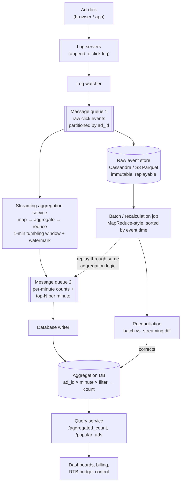

## Overview

Stripped of the ad-tech vocabulary, this is a counting problem: given an unbounded stream of `(ad_id, click_timestamp, user_id, ip, country)` events, answer "how many clicks did ad X get between minute M1 and minute M2" and "which ads got the most clicks in the last M minutes" — at a billion events per day, and *correctly*, because the counts are what advertisers get billed on. The interesting tension is that the two natural ways to compute those counts pull in opposite directions: a batch job over stored raw events is authoritative but hours late, while a streaming aggregator is a few minutes behind real time but can lose or double-count events when a node dies mid-window. Serious designs run both, and define precisely how the fast answer gets superseded by the correct one.

## Requirements

**Functional:**

- Return the click count for a given `ad_id` over the last M minutes (`GET /v1/ads/{ad_id}/aggregated_count?from=&to=&filter=`).
- Return the top N most clicked ads in the last M minutes, recomputed every minute (`GET /v1/ads/popular_ads?count=&window=&filter=`).
- Support filtering both queries by `country`, `ip`, or `user_id`.

**Non-functional:**

- **Correctness above all.** Aggregated counts feed real-time bidding decisions and advertiser billing. A 1% discrepancy at this scale is millions of dollars, so "at-least-once with a few duplicates" — the default answer for most streaming systems — is not acceptable here. Exactly-once semantics are a hard requirement, not a nice-to-have.
- **Delayed and duplicate events are normal, not exceptional.** Mobile clients buffer events offline and flush them hours later; clients retry on timeout; consumers reprocess after a crash.
- **End-to-end latency of a few minutes.** Note how much weaker this is than the sub-second latency real-time bidding itself demands — aggregation is for billing and reporting, so minutes are fine, and that slack is exactly what makes windowed aggregation and watermarking affordable.
- **Resilience to partial failure.** Any single component can die without losing counts.

**Back-of-the-envelope:** 1B clicks/day ≈ 10,000 QPS average, ~50,000 QPS at peak (5x). At 0.1 KB per event that's 100 GB/day of raw events, ~3 TB/month, growing 30% year over year — traffic doubles roughly every three years, so every component has to scale horizontally and independently.

## Data Model: Keep Both Raw and Aggregated

Raw events look exactly like the log lines they came from:

| ad_id | click_timestamp | user_id | ip | country |
|---|---|---|---|---|
| ad001 | 2021-01-01 00:00:01 | user1 | 207.148.22.22 | USA |

Aggregated data collapses them to one row per `(ad_id, click_minute, filter_id)`:

| ad_id | click_minute | filter_id | count |
|---|---|---|---|
| ad001 | 202101010000 | 0012 | 2 |
| ad001 | 202101010000 | 0023 | 3 |

Storing *only* aggregated data is tempting — it's small and fast to query — but aggregation is lossy and irreversible: once ten events become one row, a bug in the aggregator can't be undone. Storing only raw data means every dashboard refresh scans hundreds of gigabytes. So store both, with different roles: **raw data is the backup and the source of truth for recomputation** (write-heavy, rarely read, aged into cold storage), **aggregated data is the active serving layer** (both read- and write-heavy — 2 million ads each refreshed every minute).

The write profile — 50k QPS peak writes, time-range reads — rules out a single relational primary and points at Cassandra or another wide-column/time-series store, or columnar files (Parquet/ORC) on object storage for the raw tier.

Filters are handled by **pre-aggregating along dimensions** rather than filtering at query time — a star schema, where `country`, `ip`, and `user_id` are dimensions and each combination gets its own pre-computed bucket:

| ad_id | click_minute | country | count |
|---|---|---|---|
| ad001 | 202101010001 | USA | 100 |
| ad001 | 202101010001 | GBR | 200 |
| ad001 | 202101010001 | others | 3000 |

Queries become point lookups instead of scans, and no new component is needed — the same aggregation service just emits more keys. The cost is combinatorial: every additional dimension multiplies the number of buckets and rows written per minute.

## High-Level Architecture

Log servers append click events to local files; a log watcher tails them and publishes into a message queue. Everything downstream of that queue is a consumer. The queue is what makes the system asynchronous: producers and consumers scale independently, and a traffic spike backs up in the log rather than OOM-killing the aggregators. Because events must be **replayable** — for crash recovery and for recomputation after a bug — this has to be a log-based broker (Kafka) with retained, offset-addressable partitions, not a queue that deletes on ack (see [Message Brokers: Queues vs. Log-Based Streaming](message-brokers-queues-vs-logs)).

Two details in that diagram earn their keep. First, the aggregation service writes to a **second message queue** rather than straight to the database — that second log is what lets the "consume from queue 1, aggregate, produce to queue 2" step commit atomically, which is the basis of end-to-end exactly-once (more below). Second, the batch path reads the raw store, not the live stream, so a full historical replay never competes with real-time traffic for aggregator capacity.

## The Streaming Path

The streaming aggregator is a DAG of small single-purpose nodes — the same map/reduce shape described in [The MapReduce Programming Model](mapreduce-programming-model), except intermediate state lives in memory and flows over TCP between nodes instead of being materialized to a distributed filesystem between stages:

- **Map nodes** read from queue 1, clean and normalize events, and route them by key — typically `hash(ad_id) % N`. You might ask why this exists when Kafka already partitions: because you often don't control the producer, so events for the same `ad_id` can land in different partitions, and because normalization has to happen somewhere before counting.
- **Aggregate nodes** hold an in-memory counter per `ad_id` (and per filter bucket) for the current one-minute window, and for top-N they hold a bounded heap of the busiest ads seen locally.
- **Reduce nodes** merge the per-node partial results into a global answer — for top-N, merging three nodes' local top-3 heaps into a single global top-3 per minute.

The literal pipeline is map → *reduce* → *reduce*: the aggregate step is already a reduction, and the final reduce is a second one over pre-reduced partials. That two-level shape is what keeps top-N cheap — no node ever has to materialize all 2 million ads' counts to find the top 100.

Because window state is in memory, a dying aggregate node loses its partial counts. Recovery is replay: the node's successor rewinds to the last committed offset in queue 1 and recomputes. Replaying from the beginning of the log is far too slow, so aggregators periodically **snapshot** their state — upstream offset plus the in-flight window counters and top-N heaps — and a restarted node loads the latest snapshot and replays only the events after it.

## The Batch Path

The batch path reads the immutable raw event store and recomputes counts from scratch with a MapReduce-style job: map each raw event to `((ad_id, minute, filter), 1)`, group by key, sum. It's slower by orders of magnitude and it's the number you trust, for three structural reasons:

1. **It sees every event, including the very late ones.** A click buffered on a phone for six hours missed its streaming window entirely; the batch job, sorting by event time over a full day's raw data, places it in the correct minute.
2. **It's deterministic and re-runnable.** Same input files, same code, same output — so a bug found in the aggregation logic is fixed by fixing the code and re-running, not by hand-patching counters.
3. **It has no in-memory state to lose.** Task-level retry on a stateless mapper or reducer is the whole fault-tolerance story.

The same job is the **recalculation service**: when a bug corrupts aggregated data, you replay raw events from the point the bug was introduced through a dedicated aggregation deployment, emit the corrected results to queue 2, and let the database writer overwrite the bad rows.

This dual-path shape is Lambda architecture — a speed layer and a batch layer computing the same metric from the same immutable input, with the batch result winning. Its well-known cost is two codebases implementing the same aggregation semantics, which drift. The Kappa alternative removes the second codebase by routing historical replay through the *same* stream processor, just pointed at archived raw events instead of the live topic; the recalculation service above is exactly that move. Kappa's own cost is that a full historical reprocess is now bounded by your stream processor's throughput and your log's retention.

## Event Time, Windows, and Watermarks

Every aggregation needs a timestamp, and there are two candidates:

- **Event time** — when the click actually happened, stamped by the client. Accurate in principle, but depends on client clocks, which are wrong sometimes and forged by fraudsters other times.
- **Processing time** — when the aggregator saw the event. Reliable and monotonic, but assigns a click that took five hours to arrive to the wrong minute entirely.

For billing, use **event time**, and pair it with fraud/risk controls that reject implausible timestamps. Event time is also what makes results reproducible: replaying the same raw events through the batch job produces the same buckets no matter when you run it, which is not true of processing time.

Windows come in two flavors here. Use case 1 (clicks per minute) is a **tumbling window** — fixed-length, non-overlapping. Use case 2 (top N in the last M minutes) is a **sliding window** — overlapping, advancing every minute.

Committing a window on event time raises the obvious question: when do you know you've seen everything for minute M? You don't, so you use a **watermark** — an assertion that no more events with event time ≤ *t* are expected. Practically it means extending each window by a grace period (say 15 seconds) before emitting its count, catching events that arrive slightly after their window closed. The watermark length is a direct latency/accuracy dial: longer catches more stragglers and delays every result; shorter is snappier and more wrong. Watermarks deliberately do *not* try to catch the six-hour-late event — the ROI on designing the streaming layer around rare stragglers is bad when the batch layer will pick them up anyway.

## Deduplication and Exactly-Once

Duplicates enter from two directions. **Client-side**: a client that times out and retries sends the same click twice — dedupe on a client-generated idempotency key (`event_id`, or a hash of `ad_id + user_id + click_timestamp`), kept in a bounded-TTL set so a repeat within the dedup horizon is dropped. Malicious duplication is a different problem and belongs to fraud detection, not the aggregator.

**Server-side** duplicates come from the consume-process-produce loop, and they're subtler. An aggregator tracks its position with an offset in the upstream log. If it emits counts for offsets 100-110 downstream and then dies *before* committing offset 110, its replacement restarts at 100 and emits those events' counts a second time. Move the offset commit earlier — before emitting — and you flip the failure mode: a crash after committing 110 but before emitting means those events are counted zero times. You cannot make two independent writes (emit downstream, commit offset) fail or succeed together by ordering them; one of at-least-once or at-most-once is all you get.

Exactly-once therefore requires the emit and the offset commit to be **one atomic transaction**. Kafka's transactional producer does this by writing the output records and the consumer offsets into the same transaction, so a consumer reading with `read_committed` isolation never sees output from an aborted attempt. This is why the aggregation results go into a second message queue instead of straight into the database: the database write is a separate system that can't join that transaction, so it's pushed one step further downstream, where the database writer can be made idempotent by keying on `(ad_id, click_minute, filter_id)` and writing counts as an upsert rather than an increment — replaying the same result row twice then produces the same final state.

## Reconciliation

Even with exactly-once processing, streaming numbers and batch numbers won't match perfectly, because the streaming layer closed its windows on a watermark and the batch job saw the stragglers. So the two paths are reconciled on a schedule: at the end of each day (or each hour, if accuracy requirements are tighter), a batch job sorts raw events by event time per partition, recomputes the counts, and diffs them against what the streaming layer wrote. The batch result wins and overwrites the aggregation table; the size of the diff is itself a health metric, and a sudden jump in it means something upstream broke long before anyone notices a wrong invoice.

That is the practical answer to "batch or streaming": the dashboard shows the streaming number because advertisers want to see their campaign moving *now*, and the invoice uses the batch number because that's the one that survives an audit. Alongside the diff, monitor end-to-end latency (stamp events at each stage and expose the deltas), consumer lag on both queues (a growing `records-lag` is the early warning that aggregators need to scale out), and per-node CPU/memory.

## Scaling and Hotspots

The three components — message queue, aggregation service, database — are decoupled and scale separately. The queue scales by adding partitions and consumers (pre-allocate partitions generously: changing the partition count remaps `ad_id`s to different partitions and breaks the per-partition ordering aggregators rely on). Aggregators scale by adding nodes to the consumer group, or by adding threads per node; a cluster resource manager handling multi-process scale-out is the more common production choice. Cassandra scales by adding nodes to the ring, rebalancing virtual nodes automatically.

The failure mode unique to this workload is the **hotspot**. Partitioning by `ad_id` means a single advertiser spending millions of dollars can send one partition — and therefore one aggregate node — far more events than any other. Mitigations are the usual two-level aggregation tricks: detect the hot key and split its events across several nodes with a local pre-aggregation step, then merge those partial counts back (global-local aggregation), or over-provision the nodes handling known-hot ads. Counting is associative and commutative, which is precisely what makes splitting a hot key across nodes and re-summing correct.

## Trade-offs

- **Storing raw *and* aggregated data doubles storage cost and buys the only real recovery path** — aggregation is lossy and irreversible, so without the raw tier a bug in the aggregator silently corrupts billing data with nothing to recompute from. The cost is managed by aging raw events into cold storage, not by dropping them.
- **Event time is more accurate than processing time and pushes the hard problems onto you** — it makes results reproducible and correct for billing, but forces you to handle late events (watermarks), untrustworthy client clocks (fraud filtering), and windows that can never be declared truly complete.
- **Exactly-once costs latency and complexity that at-least-once doesn't** — transactional commits across consume-process-produce, idempotent writers, and snapshotting all add moving parts. It's only worth it because a fraction of a percent of duplicate clicks is a direct financial error; a metrics dashboard with the same architecture would rationally settle for at-least-once.
- **A longer watermark trades latency for accuracy, one second at a time** — 15 seconds catches most stragglers cheaply; 5 minutes catches a few more and delays every single result by 5 minutes. There's no setting that catches the six-hour-late event without destroying the near-real-time property, which is exactly why the batch path exists.
- **Lambda's two codebases drift; Kappa's single codebase must carry the whole historical replay** — routing recalculation through the same stream processor removes the duplicated aggregation semantics, but then a full reprocess is bounded by your stream engine's throughput and your log's retention window rather than by a cheap, embarrassingly parallel batch cluster.
- **Pre-aggregating filter dimensions makes filtered queries a point lookup and multiplies write volume** — the star schema reuses the existing aggregation service with no new components, but every added dimension multiplies the number of buckets written per minute, so dimensions must be chosen deliberately rather than added on request.

## Interview Questions

- Both the streaming and batch paths compute clicks-per-ad-per-minute from the same input. Why keep both instead of picking the faster one and accepting its error, or the correct one and accepting its latency?
- Committing the consumer offset before emitting results gives at-most-once; committing after gives at-least-once. Explain why no ordering of those two operations gives exactly-once, and what mechanism actually does.
- A click event arrives six hours after it happened. Trace what each of the two paths does with it, and what the user sees on the dashboard at each stage.
- One advertiser generates 30% of all click volume. Explain why partitioning by `ad_id` breaks down here, and why splitting that key across nodes is safe for this particular aggregation but wouldn't be for every one.
- Why do the aggregation results go into a second message queue instead of being written directly to the aggregation database, given the database is the final destination either way?

## References

- [Alex Xu and Sahn Lam, "System Design Interview – An Insider's Guide, Volume 2" (ByteByteGo, 2022) — Chapter 6, "Ad Click Event Aggregation"](https://bytebytego.com)
- [Nathan Marz, "How to beat the CAP theorem" (2011) — the batch layer / speed layer split that became the Lambda Architecture](http://nathanmarz.com/blog/how-to-beat-the-cap-theorem.html)
- [Apache Flink Documentation — Timely Stream Processing: event time, processing time, and watermarks](https://nightlies.apache.org/flink/flink-docs-stable/docs/concepts/time/)
- [Uber Engineering — "Real-Time Exactly-Once Ad Event Processing with Apache Flink, Kafka, and Pinot"](https://www.uber.com/blog/real-time-exactly-once-ad-event-processing/)
