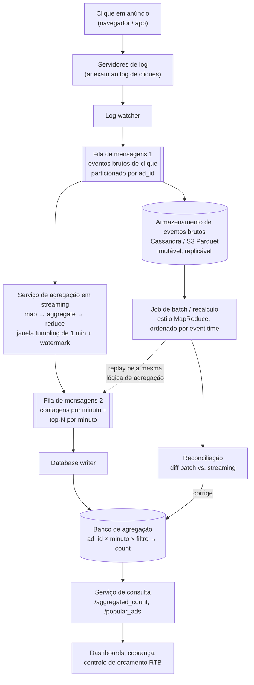

## Visão Geral

Despido do vocabulário de ad-tech, este é um problema de contagem: dado um stream ilimitado de eventos `(ad_id, click_timestamp, user_id, ip, country)`, responder "quantos cliques o anúncio X recebeu entre o minuto M1 e o minuto M2" e "quais anúncios receberam mais cliques nos últimos M minutos" — a um bilhão de eventos por dia, e *corretamente*, porque essas contagens são o que os anunciantes pagam. A tensão interessante é que as duas formas naturais de calcular essas contagens puxam em direções opostas: um job batch sobre eventos brutos armazenados é autoritativo mas atrasado em horas, enquanto um agregador de streaming está poucos minutos atrás do tempo real mas pode perder ou contar duas vezes eventos quando um nó morre no meio de uma janela. Projetos sérios rodam ambos, e definem precisamente como a resposta rápida acaba sendo substituída pela correta.

## Requisitos

**Funcionais:**

- Retornar a contagem de cliques para um `ad_id` dado, nos últimos M minutos (`GET /v1/ads/{ad_id}/aggregated_count?from=&to=&filter=`).
- Retornar os N anúncios mais clicados nos últimos M minutos, recalculado a cada minuto (`GET /v1/ads/popular_ads?count=&window=&filter=`).
- Suportar filtro em ambas as consultas por `country`, `ip`, ou `user_id`.

**Não funcionais:**

- **Correção acima de tudo.** As contagens agregadas alimentam decisões de lances em tempo real e a cobrança de anunciantes. Uma discrepância de 1% nessa escala representa milhões de dólares, então "pelo menos uma vez com algumas duplicatas" — a resposta padrão para a maioria dos sistemas de streaming — não é aceitável aqui. Semântica exatamente-uma-vez é um requisito rígido, não um "seria bom ter".
- **Eventos atrasados e duplicados são normais, não exceções.** Clientes móveis armazenam eventos offline e os enviam horas depois; clientes tentam de novo em caso de timeout; consumidores reprocessam após um crash.
- **Latência ponta a ponta de poucos minutos.** Note o quanto isso é mais fraco que a latência de sub-segundo que o próprio real-time bidding exige — agregação é para cobrança e relatórios, então minutos está tudo bem, e essa folga é exatamente o que torna agregação em janelas e watermarking viáveis.
- **Resiliência a falha parcial.** Qualquer componente individual pode morrer sem perder contagens.

**Estimativa aproximada:** 1B de cliques/dia ≈ 10.000 QPS em média, ~50.000 QPS no pico (5x). A 0,1 KB por evento isso é 100 GB/dia de eventos brutos, ~3 TB/mês, crescendo 30% ao ano — o tráfego dobra aproximadamente a cada três anos, então todo componente precisa escalar horizontalmente e independentemente.

## Modelo de Dados: Manter Dados Brutos e Agregados

Eventos brutos parecem exatamente com as linhas de log de onde vieram:

| ad_id | click_timestamp | user_id | ip | country |
|---|---|---|---|---|
| ad001 | 2021-01-01 00:00:01 | user1 | 207.148.22.22 | USA |

Dados agregados os colapsam em uma linha por `(ad_id, click_minute, filter_id)`:

| ad_id | click_minute | filter_id | count |
|---|---|---|---|
| ad001 | 202101010000 | 0012 | 2 |
| ad001 | 202101010000 | 0023 | 3 |

Armazenar *apenas* dados agregados é tentador — é pequeno e rápido de consultar — mas a agregação é lossy e irreversível: uma vez que dez eventos viram uma linha, um bug no agregador não pode ser desfeito. Armazenar apenas dados brutos significa que toda atualização de dashboard varre centenas de gigabytes. Então armazene ambos, com papéis diferentes: **dados brutos são o backup e a fonte de verdade para recomputação** (escrita intensa, raramente lida, envelhecida para armazenamento frio), **dados agregados são a camada de serving ativa** (intensa em leitura e escrita — 2 milhões de anúncios cada um atualizado a cada minuto).

O perfil de escrita — 50k QPS de pico em escritas, leituras por intervalo de tempo — descarta um único primário relacional e aponta para Cassandra ou outro armazenamento wide-column/time-series, ou arquivos colunares (Parquet/ORC) em armazenamento de objetos para a camada bruta.

Filtros são tratados por **pré-agregação ao longo de dimensões** em vez de filtrar em tempo de consulta — um esquema em estrela, onde `country`, `ip` e `user_id` são dimensões e cada combinação recebe seu próprio bucket pré-computado:

| ad_id | click_minute | country | count |
|---|---|---|---|
| ad001 | 202101010001 | USA | 100 |
| ad001 | 202101010001 | GBR | 200 |
| ad001 | 202101010001 | others | 3000 |

As consultas se tornam buscas pontuais em vez de varreduras, e nenhum componente novo é necessário — o mesmo serviço de agregação apenas emite mais chaves. O custo é combinatório: cada dimensão adicional multiplica o número de buckets e linhas escritas por minuto.

## Arquitetura de Alto Nível

Servidores de log anexam eventos de clique a arquivos locais; um log watcher os monitora e publica em uma fila de mensagens. Tudo a jusante dessa fila é um consumidor. A fila é o que torna o sistema assíncrono: produtores e consumidores escalam independentemente, e um pico de tráfego se acumula no log em vez de matar os agregadores por OOM. Como os eventos precisam ser **replicáveis** — para recuperação de crash e para recomputação após um bug — isso tem que ser um broker baseado em log (Kafka) com partições retidas e endereçáveis por offset, não uma fila que apaga ao confirmar (veja [Message Brokers: Queues vs. Log-Based Streaming](message-brokers-queues-vs-logs)).

Dois detalhes nesse diagrama merecem destaque. Primeiro, o serviço de agregação escreve em uma **segunda fila de mensagens** em vez de direto no banco de dados — esse segundo log é o que permite que o passo "consumir da fila 1, agregar, produzir para a fila 2" faça commit atomicamente, o que é a base do exactly-once ponta a ponta (mais abaixo). Segundo, o caminho batch lê do armazenamento bruto, não do stream ao vivo, então um replay histórico completo nunca compete com o tráfego em tempo real pela capacidade dos agregadores.

## O Caminho de Streaming

O agregador de streaming é um DAG de pequenos nós de propósito único — o mesmo formato map/reduce descrito em [The MapReduce Programming Model](mapreduce-programming-model), exceto que o estado intermediário vive em memória e flui via TCP entre os nós em vez de ser materializado em um sistema de arquivos distribuído entre estágios:

- **Nós map** leem da fila 1, limpam e normalizam eventos, e os roteiam por chave — tipicamente `hash(ad_id) % N`. Você pode perguntar por que isso existe se o Kafka já particiona: porque você muitas vezes não controla o produtor, então eventos para o mesmo `ad_id` podem cair em partições diferentes, e porque a normalização tem que acontecer em algum lugar antes da contagem.
- **Nós aggregate** mantêm um contador em memória por `ad_id` (e por bucket de filtro) para a janela atual de um minuto, e para top-N mantêm um heap limitado dos anúncios mais movimentados vistos localmente.
- **Nós reduce** mesclam os resultados parciais por nó em uma resposta global — para top-N, mesclando os top-3 locais de três nós em um único top-3 global por minuto.

O pipeline literal é map → *reduce* → *reduce*: o passo de agregação já é uma redução, e o reduce final é uma segunda redução sobre parciais já reduzidos. Esse formato de dois níveis é o que mantém o top-N barato — nenhum nó jamais precisa materializar as contagens de todos os 2 milhões de anúncios para encontrar o top 100.

Como o estado da janela está em memória, um nó de agregação que morre perde suas contagens parciais. A recuperação é replay: o sucessor do nó rebobina até o último offset commitado na fila 1 e recomputa. Reproduzir desde o início do log é lento demais, então os agregadores periodicamente fazem **snapshot** de seu estado — offset upstream mais os contadores de janela em andamento e os heaps de top-N — e um nó reiniciado carrega o snapshot mais recente e replica apenas os eventos posteriores a ele.

## O Caminho Batch

O caminho batch lê o armazenamento imutável de eventos brutos e recomputa contagens do zero com um job estilo MapReduce: mapeia cada evento bruto para `((ad_id, minute, filter), 1)`, agrupa por chave, soma. É mais lento por ordens de grandeza e é o número em que você confia, por três razões estruturais:

1. **Vê todos os eventos, incluindo os muito atrasados.** Um clique bufferizado em um celular por seis horas perdeu sua janela de streaming completamente; o job batch, ordenando por event time sobre um dia inteiro de dados brutos, o coloca no minuto correto.
2. **É determinístico e re-executável.** Mesmos arquivos de entrada, mesmo código, mesma saída — então um bug encontrado na lógica de agregação é corrigido corrigindo o código e re-executando, não corrigindo contadores manualmente.
3. **Não tem estado em memória para perder.** Retry no nível de tarefa em um mapper ou reducer sem estado é toda a história de tolerância a falhas.

O mesmo job é o **serviço de recálculo**: quando um bug corrompe dados agregados, você reproduz eventos brutos a partir do ponto em que o bug foi introduzido através de uma implantação de agregação dedicada, emite os resultados corrigidos para a fila 2, e deixa o database writer sobrescrever as linhas ruins.

Esse formato de caminho duplo é a arquitetura Lambda — uma speed layer e uma batch layer computando a mesma métrica a partir da mesma entrada imutável, com o resultado batch vencendo. Seu custo bem conhecido são dois códigos-fonte implementando a mesma semântica de agregação, que divergem com o tempo. A alternativa Kappa remove o segundo código-fonte roteando o replay histórico através do *mesmo* processador de stream, apenas apontado para eventos brutos arquivados em vez do tópico ao vivo; o serviço de recálculo acima é exatamente essa jogada. O próprio custo do Kappa é que um reprocessamento histórico completo agora é limitado pela throughput do seu processador de stream e pela retenção do seu log.

## Event Time, Janelas e Watermarks

Toda agregação precisa de um timestamp, e há dois candidatos:

- **Event time** — quando o clique realmente aconteceu, carimbado pelo cliente. Preciso em princípio, mas depende de relógios de cliente, que às vezes estão errados e são forjados por fraudadores em outras vezes.
- **Processing time** — quando o agregador viu o evento. Confiável e monotônico, mas atribui um clique que levou cinco horas para chegar ao minuto totalmente errado.

Para cobrança, use **event time**, e o combine com controles de fraude/risco que rejeitam timestamps implausíveis. Event time também é o que torna os resultados reproduzíveis: reproduzir os mesmos eventos brutos através do job batch produz os mesmos buckets não importa quando você o execute, o que não é verdade para processing time.

Janelas vêm em dois sabores aqui. O caso de uso 1 (cliques por minuto) é uma **janela tumbling** — comprimento fixo, não sobreposta. O caso de uso 2 (top N nos últimos M minutos) é uma **janela sliding** — sobreposta, avançando a cada minuto.

Commitar uma janela em event time levanta a questão óbvia: quando você sabe que já viu tudo para o minuto M? Você não sabe, então usa um **watermark** — uma afirmação de que nenhum evento com event time ≤ *t* é mais esperado. Na prática significa estender cada janela por um período de graça (digamos 15 segundos) antes de emitir sua contagem, capturando eventos que chegam ligeiramente depois de sua janela fechar. O comprimento do watermark é um dial direto de latência/precisão: mais longo captura mais retardatários e atrasa cada resultado; mais curto é mais rápido e mais errado. Watermarks deliberadamente *não* tentam capturar o evento atrasado em seis horas — o ROI de projetar a camada de streaming em torno de retardatários raros é ruim quando a camada batch os capturará de qualquer forma.

## Deduplicação e Exactly-Once

Duplicatas entram por duas direções. **Lado do cliente**: um cliente que dá timeout e tenta de novo envia o mesmo clique duas vezes — dedupe com uma chave de idempotência gerada pelo cliente (`event_id`, ou um hash de `ad_id + user_id + click_timestamp`), mantida em um conjunto com TTL limitado, para que uma repetição dentro do horizonte de dedup seja descartada. Duplicação maliciosa é um problema diferente e pertence à detecção de fraude, não ao agregador.

Duplicatas **do lado do servidor** vêm do loop consumir-processar-produzir, e são mais sutis. Um agregador rastreia sua posição com um offset no log upstream. Se emite contagens para offsets 100-110 downstream e depois morre *antes* de commitar o offset 110, seu substituto reinicia em 100 e emite as contagens desses eventos uma segunda vez. Mova o commit do offset para mais cedo — antes de emitir — e você inverte o modo de falha: um crash depois de commitar 110 mas antes de emitir significa que esses eventos são contados zero vezes. Você não pode fazer duas escritas independentes (emitir downstream, commitar offset) falharem ou terem sucesso juntas apenas ordenando-as; você só ganha uma de at-least-once ou at-most-once.

Exactly-once, portanto, requer que a emissão e o commit do offset sejam **uma transação atômica**. O produtor transacional do Kafka faz isso escrevendo os registros de saída e os offsets do consumidor na mesma transação, então um consumidor lendo com isolamento `read_committed` nunca vê saída de uma tentativa abortada. É por isso que os resultados de agregação vão para uma segunda fila de mensagens em vez de direto para o banco de dados: a escrita no banco de dados é um sistema separado que não pode participar dessa transação, então é empurrada mais um passo downstream, onde o database writer pode ser tornado idempotente chaveando por `(ad_id, click_minute, filter_id)` e escrevendo contagens como um upsert em vez de um incremento — reproduzir a mesma linha de resultado duas vezes então produz o mesmo estado final.

## Reconciliação

Mesmo com processamento exactly-once, os números de streaming e batch não vão bater perfeitamente, porque a camada de streaming fechou suas janelas em um watermark e o job batch viu os retardatários. Então os dois caminhos são reconciliados em uma programação: no final de cada dia (ou cada hora, se os requisitos de precisão forem mais rígidos), um job batch ordena eventos brutos por event time por partição, recomputa as contagens, e as compara com o que a camada de streaming escreveu. O resultado batch vence e sobrescreve a tabela de agregação; o tamanho do diff é em si uma métrica de saúde, e um salto repentino nele significa que algo upstream quebrou muito antes de alguém notar uma fatura errada.

Essa é a resposta prática para "batch ou streaming": o dashboard mostra o número de streaming porque os anunciantes querem ver sua campanha se movendo *agora*, e a fatura usa o número batch porque é o que sobrevive a uma auditoria. Junto com o diff, monitore a latência ponta a ponta (carimbe eventos em cada estágio e exponha os deltas), o lag do consumidor em ambas as filas (um `records-lag` crescente é o aviso antecipado de que os agregadores precisam escalar), e CPU/memória por nó.

## Escalonamento e Hotspots

Os três componentes — fila de mensagens, serviço de agregação, banco de dados — são desacoplados e escalam separadamente. A fila escala adicionando partições e consumidores (pré-aloque partições generosamente: mudar o número de partições remapeia `ad_id`s para partições diferentes e quebra o ordenamento por partição em que os agregadores confiam). Agregadores escalam adicionando nós ao grupo de consumidores, ou adicionando threads por nó; um gerenciador de recursos de cluster lidando com escalonamento multi-processo é a escolha de produção mais comum. Cassandra escala adicionando nós ao anel, rebalanceando virtual nodes automaticamente.

O modo de falha único dessa carga de trabalho é o **hotspot**. Particionar por `ad_id` significa que um único anunciante gastando milhões de dólares pode enviar para uma partição — e portanto um agregador — muito mais eventos do que qualquer outro. Mitigações são os dois truques usuais de agregação em dois níveis: detectar a chave quente e dividir seus eventos entre vários nós com um passo de pré-agregação local, depois mesclar essas contagens parciais de volta (agregação global-local), ou super-provisionar os nós que lidam com anúncios conhecidamente quentes. Contagem é associativa e comutativa, o que é precisamente o que torna dividir uma chave quente entre nós e re-somar correto.

## Trade-offs

- **Armazenar dados brutos *e* agregados dobra o custo de armazenamento e compra o único caminho real de recuperação** — a agregação é lossy e irreversível, então sem a camada bruta um bug no agregador corrompe silenciosamente dados de cobrança sem nada de onde recomputar. O custo é gerenciado envelhecendo eventos brutos em armazenamento frio, não descartando-os.
- **Event time é mais preciso que processing time e empurra os problemas difíceis para você** — torna os resultados reproduzíveis e corretos para cobrança, mas força você a lidar com eventos atrasados (watermarks), relógios de cliente não confiáveis (filtro de fraude), e janelas que nunca podem ser declaradas verdadeiramente completas.
- **Exactly-once custa latência e complexidade que at-least-once não custa** — commits transacionais através de consumir-processar-produzir, escritores idempotentes, e snapshotting todos adicionam partes móveis. Só vale a pena porque uma fração de porcentagem de cliques duplicados é um erro financeiro direto; um dashboard de métricas com a mesma arquitetura racionalmente se contentaria com at-least-once.
- **Um watermark mais longo troca latência por precisão, um segundo de cada vez** — 15 segundos captura a maioria dos retardatários barato; 5 minutos captura mais alguns e atrasa todo resultado em 5 minutos. Não há configuração que capture o evento atrasado em seis horas sem destruir a propriedade quase-tempo-real, que é exatamente por que o caminho batch existe.
- **Os dois códigos-fonte do Lambda divergem; o único código-fonte do Kappa precisa carregar todo o replay histórico** — rotear o recálculo através do mesmo processador de stream remove a semântica de agregação duplicada, mas então um reprocessamento completo é limitado pela throughput do seu motor de stream e pela janela de retenção do seu log em vez de por um cluster batch barato e embaraçosamente paralelo.
- **Pré-agregar dimensões de filtro torna consultas filtradas uma busca pontual e multiplica o volume de escrita** — o esquema em estrela reutiliza o serviço de agregação existente sem novos componentes, mas cada dimensão adicionada multiplica o número de buckets escritos por minuto, então as dimensões devem ser escolhidas deliberadamente em vez de adicionadas sob demanda.

## Perguntas de Entrevista

- Tanto o caminho de streaming quanto o batch computam cliques-por-anúncio-por-minuto a partir da mesma entrada. Por que manter ambos em vez de escolher o mais rápido e aceitar seu erro, ou o correto e aceitar sua latência?
- Commitar o offset do consumidor antes de emitir resultados dá at-most-once; commitar depois dá at-least-once. Explique por que nenhuma ordenação dessas duas operações dá exactly-once, e qual mecanismo realmente dá.
- Um evento de clique chega seis horas depois de ter acontecido. Trace o que cada um dos dois caminhos faz com ele, e o que o usuário vê no dashboard em cada estágio.
- Um anunciante gera 30% de todo o volume de cliques. Explique por que particionar por `ad_id` quebra aqui, e por que dividir essa chave entre nós é seguro para essa agregação em particular mas não seria para todas.
- Por que os resultados de agregação vão para uma segunda fila de mensagens em vez de serem escritos diretamente no banco de dados de agregação, dado que o banco de dados é o destino final de qualquer forma?

## Referências

- [Alex Xu and Sahn Lam, "System Design Interview – An Insider's Guide, Volume 2" (ByteByteGo, 2022) — Chapter 6, "Ad Click Event Aggregation"](https://bytebytego.com)
- [Nathan Marz, "How to beat the CAP theorem" (2011) — a divisão batch layer / speed layer que se tornou a Lambda Architecture](http://nathanmarz.com/blog/how-to-beat-the-cap-theorem.html)
- [Apache Flink Documentation — Timely Stream Processing: event time, processing time, and watermarks](https://nightlies.apache.org/flink/flink-docs-stable/docs/concepts/time/)
- [Uber Engineering — "Real-Time Exactly-Once Ad Event Processing with Apache Flink, Kafka, and Pinot"](https://www.uber.com/blog/real-time-exactly-once-ad-event-processing/)
