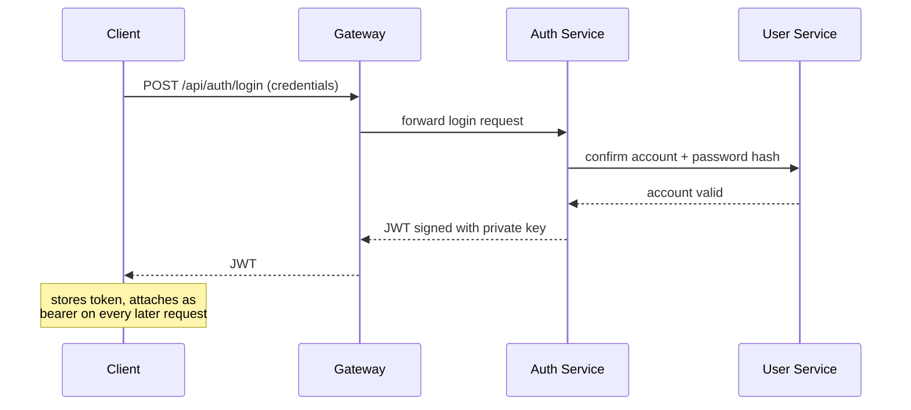

## Overview

A load balancer distributes traffic across identical copies of *one* service. Once a system splits into several services — files, notifications, auth, real-time — a plain load balancer has no way to decide that a login request belongs to the auth service and an upload belongs to the file service; it only knows how to spread load within a single pool. The **API gateway** is the piece that sits in front of all of them: it receives every client request, decides which service should handle it, and does the cross-cutting work (authentication, aggregation, rate limiting) that would otherwise have to be duplicated inside every service.

## Routing to the Right Service

The gateway inspects each request — path, method, headers — and forwards it to the service that owns that piece of the domain:

```
POST /api/auth/login       -> auth-service
POST /api/files/upload     -> file-service
GET  /api/notifications    -> notification-service
```

This is the same content-aware routing an L7 load balancer does, but at the granularity of *services* rather than *server instances* within one pool. In practice a real deployment often has both: an L4/L7 load balancer in front of the gateway for raw throughput and failover, and the gateway doing service-level routing behind it.

## Response Aggregation

A single client request sometimes needs data that lives in more than one service. Rendering a user's profile page might need the base profile from a `user-service` and a plan/billing summary from a `billing-service`. Rather than making the client call both services separately and stitch the results together, the gateway can fan out both calls itself and return one combined response:

```
GET /api/profile/42
  gateway -> user-service:    GET /users/42
  gateway -> billing-service: GET /billing/users/42
  gateway merges both responses -> single JSON payload to client
```

This trades a bit of gateway complexity (and a slightly higher gateway-side latency, bounded by the slowest of the fanned-out calls) for a much simpler client that doesn't need to know the service topology at all.

## Where Authentication Lives

Splitting into services raises a concrete question: does every service re-verify the client's credentials, or does something upstream do it once? The common answer is the gateway (or a security layer immediately in front of it) validates the token — checking the signature and expiry of a JWT, for example — on every request, before it's ever routed anywhere:

```
1. Client sends request with `Authorization: Bearer <jwt>`
2. Gateway verifies the JWT signature and expiry (no network call — the
   signature alone proves it was issued by the auth service)
3. If invalid/expired -> 401, request never reaches a backend service
4. If valid -> forward to the target service, often with the decoded
   user id attached as a trusted header
```

This is a distinct concern from *issuing* tokens in the first place, which is what an auth service does at login time (see the login flow below). Validating a token the gateway didn't issue is possible precisely because JWTs are self-contained and signed — no round trip to the auth service is needed to confirm a token hasn't been tampered with, only to confirm it hasn't expired according to its own embedded claim.

**Authentication** (do you have access to the system at all) is a different question from **authorization** (do you have permission to do *this specific thing* — upload to this folder, delete this message). The gateway is a natural place to enforce authentication uniformly, but authorization is often finer-grained than the gateway can reasonably know, so it's frequently pushed down into the owning service, which understands its own resource ownership rules.

## The Login Flow

Issuing a token is a different path from validating one on every request:



Because the token is signed with a private key that only the auth service holds, any service (or the gateway) that has the corresponding public key can verify the token's authenticity without ever calling the auth service back — that asymmetry is what makes step 2 of the read path (validating on every request) cheap.

## Isolating the Private Network

Once a gateway exists as the single entry point, the services behind it don't need to be reachable from outside the cluster at all. Putting every service inside a private network (a VPC) and exposing only the gateway's port to the internet means a client — or an attacker — has no way to call the notification service or the file service directly, bypassing whatever authentication and rate limiting the gateway enforces:

```
Internet -> [Gateway :443]  (only exposed port)
                |
          private network (VPC)
                |
    +-----------+-----------+-----------+
    v           v           v           v
 auth-svc   file-svc   notif-svc   realtime-svc
 (no public IP, only reachable from inside the VPC)
```

This turns "every service must implement its own auth and its own network hardening" into "the gateway enforces it once, and the network topology makes bypassing it impossible, not just discouraged."

## Trade-offs

- **Centralizing auth and routing simplifies every downstream service, but makes the gateway a single point of failure** — if the gateway is down, nothing behind it is reachable even if every service is healthy, which is why the gateway itself is usually deployed behind its own load balancer and scaled horizontally.
- **Response aggregation reduces client complexity but couples the gateway to the shape of multiple services** — a gateway that knows too much about how to combine `user-service` and `billing-service` responses starts to accumulate business logic that arguably belongs closer to the domain, and can become a bottleneck for change (every new field a client needs might mean a gateway deploy).
- **Validating tokens at the edge is fast (no network call) but only checks signature and expiry, not real-time revocation** — a token stolen and still within its expiry window remains valid at the gateway until it naturally expires, unless the system pays for an extra check (e.g. against a revocation list) on every request.
- **A private network behind the gateway is a strong default, but it's not a substitute for authorization inside each service** — network isolation stops external bypass, not a compromised or buggy internal service from calling another internal service it shouldn't.

## Interview Questions

- How is the routing an API gateway does different from what an L7 load balancer does, and why do many systems use both?
- Why can a gateway validate a JWT without making a network call to the auth service, and what does that imply about immediate token revocation?
- What's the difference between authentication and authorization, and why might authorization need to live in the owning service rather than the gateway?
- What happens to overall system availability if the gateway goes down, and how do systems usually mitigate that?
- Why does putting services behind a private network (VPC) with only the gateway exposed matter, even if every service already checks the auth token itself?

## References

- [NGINX Documentation — API Gateway](https://www.nginx.com/learn/api-gateway/)
- [microservices.io — Pattern: API Gateway](https://microservices.io/patterns/apigateway.html)
- [Auth0 — What Is an API Gateway?](https://auth0.com/blog/what-is-an-api-gateway/)
- [IETF RFC 7519 — JSON Web Token (JWT)](https://datatracker.ietf.org/doc/html/rfc7519)
- Sam Newman, *Building Microservices* (O'Reilly, 2nd Edition) — Chapter on inter-service communication and gateways
