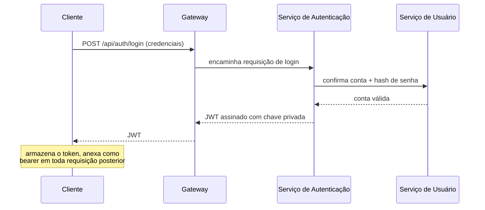

## Visão Geral

Um load balancer distribui tráfego entre cópias idênticas de *um* serviço. Uma vez que um sistema se divide em vários serviços — arquivos, notificações, autenticação, tempo real — um load balancer simples não tem como decidir que uma requisição de login pertence ao serviço de autenticação e um upload pertence ao serviço de arquivos; ele só sabe espalhar carga dentro de um único pool. O **API gateway** é a peça que fica na frente de todos eles: recebe toda requisição de cliente, decide qual serviço deve tratá-la, e faz o trabalho transversal (autenticação, agregação, rate limiting) que de outra forma teria que ser duplicado dentro de cada serviço.

## Roteando para o Serviço Certo

O gateway inspeciona cada requisição — caminho, método, cabeçalhos — e a encaminha para o serviço que possui aquele pedaço do domínio:

```
POST /api/auth/login       -> auth-service
POST /api/files/upload     -> file-service
GET  /api/notifications    -> notification-service
```

Isso é o mesmo roteamento consciente de conteúdo que um load balancer L7 faz, mas na granularidade de *serviços* em vez de *instâncias de servidor* dentro de um pool. Na prática, um deployment real frequentemente tem os dois: um load balancer L4/L7 na frente do gateway para throughput bruto e failover, e o gateway fazendo o roteamento em nível de serviço atrás dele.

## Agregação de Respostas

Uma única requisição de cliente às vezes precisa de dados que vivem em mais de um serviço. Renderizar a página de perfil de um usuário pode precisar do perfil base de um `user-service` e um resumo de plano/cobrança de um `billing-service`. Em vez de fazer o cliente chamar ambos os serviços separadamente e costurar os resultados, o gateway pode disparar ambas as chamadas ele mesmo e retornar uma resposta combinada:

```
GET /api/profile/42
  gateway -> user-service:    GET /users/42
  gateway -> billing-service: GET /billing/users/42
  gateway combina ambas as respostas -> um único payload JSON para o cliente
```

Isso troca um pouco de complexidade no gateway (e uma latência ligeiramente maior no lado do gateway, limitada pela mais lenta das chamadas disparadas) por um cliente muito mais simples que não precisa conhecer a topologia de serviços de forma alguma.

## Onde Vive a Autenticação

Dividir em serviços levanta uma pergunta concreta: todo serviço reverifica as credenciais do cliente, ou algo upstream faz isso uma vez? A resposta comum é que o gateway (ou uma camada de segurança logo à frente dele) valida o token — checando a assinatura e a expiração de um JWT, por exemplo — em toda requisição, antes dela ser roteada para qualquer lugar:

```
1. Cliente envia requisição com `Authorization: Bearer <jwt>`
2. Gateway verifica a assinatura e expiração do JWT (sem chamada de rede — a
   assinatura sozinha prova que foi emitido pelo serviço de autenticação)
3. Se inválido/expirado -> 401, a requisição nunca alcança um serviço de backend
4. Se válido -> encaminha para o serviço alvo, frequentemente com o id
   decodificado do usuário anexado como um cabeçalho confiável
```

Essa é uma preocupação distinta de *emitir* tokens em primeiro lugar, que é o que um serviço de autenticação faz no momento do login (veja o fluxo de login abaixo). Validar um token que o gateway não emitiu é possível precisamente porque JWTs são autocontidos e assinados — nenhuma ida e volta ao serviço de autenticação é necessária para confirmar que um token não foi adulterado, apenas para confirmar que não expirou de acordo com sua própria claim embutida.

**Autenticação** (você tem acesso ao sistema de alguma forma) é uma pergunta diferente de **autorização** (você tem permissão para fazer *esta coisa específica* — fazer upload para esta pasta, excluir esta mensagem). O gateway é um lugar natural para impor autenticação uniformemente, mas autorização é frequentemente mais granular do que o gateway consegue razoavelmente saber, então é frequentemente empurrada para o serviço proprietário, que entende suas próprias regras de posse de recursos.

## O Fluxo de Login

Emitir um token é um caminho diferente de validar um a cada requisição:



Como o token é assinado com uma chave privada que só o serviço de autenticação possui, qualquer serviço (ou o gateway) que tenha a chave pública correspondente pode verificar a autenticidade do token sem nunca chamar de volta o serviço de autenticação — essa assimetria é o que torna o passo 2 do caminho de leitura (validar a cada requisição) barato.

## Isolando a Rede Privada

Uma vez que um gateway existe como o único ponto de entrada, os serviços atrás dele não precisam ser alcançáveis de fora do cluster de forma alguma. Colocar todo serviço dentro de uma rede privada (uma VPC) e expor apenas a porta do gateway para a internet significa que um cliente — ou um atacante — não tem como chamar o serviço de notificação ou o serviço de arquivos diretamente, contornando qualquer autenticação e rate limiting que o gateway aplica:

```
Internet -> [Gateway :443]  (única porta exposta)
                |
          rede privada (VPC)
                |
    +-----------+-----------+-----------+
    v           v           v           v
 auth-svc   file-svc   notif-svc   realtime-svc
 (sem IP público, alcançável apenas de dentro da VPC)
```

Isso transforma "todo serviço precisa implementar sua própria autenticação e seu próprio endurecimento de rede" em "o gateway aplica isso uma vez, e a topologia de rede torna contorná-lo impossível, não apenas desencorajado."

## Trade-offs

- **Centralizar autenticação e roteamento simplifica cada serviço downstream, mas torna o gateway um ponto único de falha** — se o gateway está fora do ar, nada atrás dele é alcançável mesmo que todo serviço esteja saudável, o que é por que o próprio gateway geralmente é implantado atrás de seu próprio load balancer e escalado horizontalmente.
- **Agregação de respostas reduz a complexidade do cliente mas acopla o gateway à forma de múltiplos serviços** — um gateway que sabe demais sobre como combinar respostas de `user-service` e `billing-service` começa a acumular lógica de negócio que discutivelmente pertence mais perto do domínio, e pode se tornar um gargalo para mudanças (todo novo campo que um cliente precisa pode significar um deploy do gateway).
- **Validar tokens na borda é rápido (sem chamada de rede) mas só verifica assinatura e expiração, não revogação em tempo real** — um token roubado e ainda dentro de sua janela de expiração permanece válido no gateway até expirar naturalmente, a menos que o sistema pague por uma verificação extra (ex.: contra uma lista de revogação) em toda requisição.
- **Uma rede privada atrás do gateway é um forte padrão, mas não substitui autorização dentro de cada serviço** — isolamento de rede impede contorno externo, não um serviço interno comprometido ou com bugs chamando outro serviço interno que não deveria.

## Perguntas de Entrevista

- Como o roteamento que um API gateway faz difere do que um load balancer L7 faz, e por que muitos sistemas usam ambos?
- Por que um gateway pode validar um JWT sem fazer uma chamada de rede ao serviço de autenticação, e o que isso implica sobre revogação imediata de token?
- Qual é a diferença entre autenticação e autorização, e por que autorização pode precisar viver no serviço proprietário em vez do gateway?
- O que acontece com a disponibilidade geral do sistema se o gateway cair, e como os sistemas geralmente mitigam isso?
- Por que colocar serviços atrás de uma rede privada (VPC) com apenas o gateway exposto importa, mesmo que todo serviço já verifique o token de autenticação ele mesmo?

## Referências

- [NGINX Documentation — API Gateway](https://www.nginx.com/learn/api-gateway/)
- [microservices.io — Pattern: API Gateway](https://microservices.io/patterns/apigateway.html)
- [Auth0 — What Is an API Gateway?](https://auth0.com/blog/what-is-an-api-gateway/)
- [IETF RFC 7519 — JSON Web Token (JWT)](https://datatracker.ietf.org/doc/html/rfc7519)
- Sam Newman, *Building Microservices* (O'Reilly, 2nd Edition) — Capítulo sobre comunicação entre serviços e gateways
