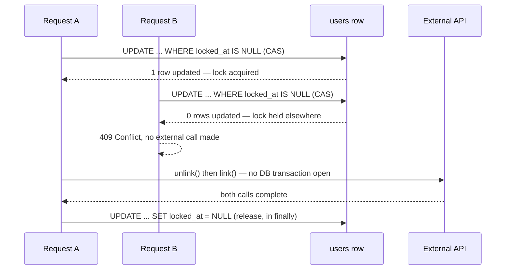

## Overview

A lot of mutual-exclusion problems reduce to "only one request for this user/order/account should be mutating this thing at a time." The textbook answers — a database transaction, `SELECT ... FOR UPDATE`, a Postgres advisory lock — all share one assumption: the critical section is short and only talks to the database. The moment the critical section has to call a third-party HTTP API in the middle (a payment provider, an identity provider, any partner integration), that assumption breaks, and reaching for the textbook answer anyway causes a *different* problem: it holds a database connection and a lock for as long as the external call takes, which can be seconds under retry/backoff, multiplied across every concurrent request. This article covers the pattern that fits that specific shape of problem — a lease-based lock implemented as one row in an existing table, acquired and released with a plain atomic `UPDATE`, never inside a transaction that also makes the external call.

## The Problem: Locking Around Slow I/O

Take a service that lets a user promote one of several linked third-party identities to be their "primary" one. Doing that safely against the third-party API is a two-step, non-atomic sequence: unlink the target identity from the current primary, then re-link it the other way round so it becomes the new primary. If two requests for the same user run this concurrently — a double click, a retried request, two browser tabs — they can interleave: request A unlinks identity X, request B (which read stale state) tries to unlink identity Y from what it still thinks is the primary, and the two re-links race to decide which identity actually ends up primary. The failure isn't a crash; it's silent data corruption in a third-party system that the local database has no way to detect after the fact.

The obvious fix — wrap the whole operation in `@Transactional` and rely on a row lock — makes it worse, not better:

```java
@Transactional
public void switchPrimaryIdentity(User user, String targetId) {
    // holds a DB connection + a row lock on `user` for the entire duration below
    auth0Client.unlink(user.getAuthId(), targetId);   // HTTP call #1, with retries
    auth0Client.link(targetId, user.getAuthId());      // HTTP call #2, with retries
    user.setAuthId(targetId);
}
```

Every concurrent caller now blocks on the database, not on the operation's actual bottleneck (the external API), and a connection pool sized for typical local-transaction durations (milliseconds) gets exhausted by a handful of requests each holding a connection for the seconds an HTTP retry sequence can take.

## The Solution: A Lease Row, Acquired Outside Any Transaction

Instead of a database lock held for the operation's duration, store the lock as ordinary data — a nullable `locked_at` timestamp column on the row being protected — and acquire it with a single, non-transactional, atomic `UPDATE ... WHERE`:

```sql
UPDATE users
SET identity_action_locked_at = NOW()
WHERE id = :id
  AND (identity_action_locked_at IS NULL OR identity_action_locked_at < :staleBefore)
```

The `WHERE` clause is the whole mechanism: Postgres only lets one concurrent `UPDATE` win a compare-and-swap on the same row (the second one blocks briefly on the row's write lock, then re-evaluates the `WHERE` against the just-committed value and matches zero rows). The caller checks the affected-row count — `1` means "I hold the lease," `0` means "someone else does" — and that check-and-set is a single round trip, committed immediately, not part of any longer-running transaction:

```java
int acquired = userRepository.tryAcquireLock(userId, Instant.now().minus(LEASE_TTL));
if (acquired == 0) {
    throw new ResponseStatusException(HttpStatus.CONFLICT, "Another operation is already in progress");
}
try {
    auth0Client.unlink(currentPrimary, targetId);   // no transaction, no lock held here
    auth0Client.link(targetId, currentPrimary);
    user.setAuthId(targetId);
    userRepository.save(user);
} finally {
    userRepository.releaseLock(userId);              // separate, independently committed UPDATE
}
```

The `staleBefore` parameter is a **lease TTL**, not just a lock: it's what makes the lock self-healing if the process dies between acquiring it and reaching the `finally`. Without it, a crash mid-operation would leave the row permanently locked, since nothing else ever clears a plain boolean flag. With it, a lock older than the TTL is simply treated as available again — the next caller's `WHERE` clause matches it, exactly like an unlocked row.

## Architecture



Two independent, tiny transactions bracket an arbitrarily long external operation that holds no database resource at all. This is the same shape as [the outbox pattern's](outbox-pattern) "commit locally, do the unreliable part outside the transaction" split, applied to mutual exclusion instead of message delivery.

## Failure Scenarios

- **Process crashes after acquiring the lock, before the external calls finish** — the row stays locked until `staleBefore` passes; the next caller (or a retry from the same client) can then acquire it. The TTL is a trade-off: too short and a legitimately slow-but-still-running operation can have its lock stolen out from under it (see below); too long and a genuine crash leaves the resource unavailable for that long.
- **Lock is stolen from a still-running operation because the TTL was too short** — two operations now believe they hold the lock and race exactly as if there had been no lock at all. This is the sharp edge of every lease-based scheme: the TTL must be set well above the operation's worst-case duration (including retries/backoff), not its typical one.
- **Release fails (DB blip) after the external calls already succeeded** — the `finally` block's `UPDATE` throws, but the external side effect is already done and irreversible; the row stays locked until the TTL expires. The caller sees an error for an operation that actually succeeded, which is confusing but not unsafe, since nothing else can run concurrently against the same resource in the meantime.
- **Two operations race on which one's `WHERE` clause commits first** — Postgres serializes this correctly at the row level; there's no "double acquire" possible, because a second concurrent `UPDATE` targeting the same row physically waits for the first to commit before it can even evaluate its own `WHERE` clause against the new value.

## Comparison with Alternatives

- **Postgres advisory locks (`pg_advisory_xact_lock`)** — the natively "correct" tool for this shape of problem *if* the critical section were DB-only: transaction-scoped advisory locks release automatically at commit, even on a crash, with no TTL bookkeeping needed. They don't fit here because a transaction-scoped lock must hold its transaction — and therefore its connection — open for as long as the lock is held, which is exactly what needs to be avoided when the critical section includes external HTTP calls. Session-scoped advisory locks avoid holding a transaction but then require pinning the *same physical connection* across the acquire and release calls, which doesn't compose cleanly with a connection-pooled, request-scoped ORM session.
- **Optimistic locking (`@Version`)** — detects that a row changed since it was read and fails the second writer's `save()` with `OptimisticLockException`. This is the right default for "don't silently overwrite someone else's edit," but it's a *detection* mechanism, not a *prevention* one: it doesn't stop two requests from both starting the external calls, it only catches the conflict on the final local write, by which point an external side effect (like linking the wrong identity) may already have happened.
- **A distributed lock service (Redis/Redlock, ZooKeeper, etcd)** — the standard answer once the acquiring process isn't a single database-backed monolith, or once true multi-node consensus on lock ownership matters (see [Consensus and Coordination Services](consensus-and-coordination-services)). It's new infrastructure with its own availability and clock-skew concerns; a database-row lease is the pragmatic choice when the system already has one Postgres instance as its source of truth and doesn't want to add a second stateful dependency just for mutual exclusion.
- **Idempotency keys** — a complementary, not competing, technique: an idempotency key makes *retrying the same logical request* safe, while a lease lock stops *two different concurrent requests* from interleaving. Systems that call external payment/identity APIs typically want both.

## Trade-offs

- **The TTL is a guess, not a guarantee** — there is no way to pick a lease duration that's simultaneously "long enough to never steal a lock from live work" and "short enough to recover quickly from a crash." Sizing it above the external call's worst-case retry/backoff window (not its median) is the safest bias, since a slightly-too-long TTL only delays crash recovery, while a slightly-too-short one reintroduces the exact race the lock exists to prevent.
- **Not mapped as an entity field** — the lock column deliberately isn't exposed as a JPA/ORM-managed field on the entity; every read and write goes through the dedicated acquire/release queries. Mapping it normally would let an unrelated `save()` of the same entity — one that happens to run inside the locked window, from stale in-memory state — silently stomp the lock value, since ORMs typically write back every mapped field on `save()`, not just the ones the calling code touched.
- **It's advisory, not enforced by the database** — nothing stops a different code path from writing to the same row and ignoring the lock column entirely. This works only because every writer of the protected resource is disciplined about going through the same acquire/release helper; it's an application-level convention, not a database-level constraint like a `UNIQUE` index would be.
- **Single point of coordination** — the lock's correctness depends on the row living in a single, strongly-consistent database. It does not generalize to a system with multiple independent databases or true multi-region active-active writes without falling back to one of the distributed-lock-service alternatives above.

## Real-World Usage

This is a common, mostly-unnamed pattern in monoliths and modular services that own a single Postgres/MySQL instance as their source of truth and occasionally need mutual exclusion around a call to a partner API — payment processors, identity providers (account linking/unlinking, exactly the example above), inventory reservation against a third-party warehouse system. It shows up under different local names ("processing flag", "in-progress lock", "claim column") but the shape is always the same: a nullable timestamp or boolean column, a CAS `UPDATE` to acquire, a `finally`-guarded release, and a TTL as the crash-safety net. Job queue and scheduler implementations (including database-backed ones like db-scheduler or Quartz's JDBC job store) use the identical technique internally to let multiple worker instances safely claim a job row without double-processing it.

## Interview Questions

- Why does wrapping an operation in `@Transactional` become the *wrong* answer once that operation calls an external API partway through?
- Walk through what happens if two requests call the acquire `UPDATE` at the exact same instant — how does the database guarantee only one of them gets the lock?
- What's the failure mode if the lease TTL is set too short? Too long? How would you pick a value?
- Why shouldn't the lock column be a normal JPA-mapped field on the entity?
- When would you reach for a Postgres advisory lock instead of this pattern, and when would you reach for Redis/Redlock instead of either?

## References

- [PostgreSQL Documentation — Advisory Locks](https://www.postgresql.org/docs/current/explicit-locking.html#ADVISORY-LOCKS)
- Martin Kleppmann, *Designing Data-Intensive Applications* (O'Reilly) — Chapter 8, "The Trouble with Distributed Systems" (clocks, timeouts, and why lease durations are fundamentally a guess).
- Martin Kleppmann — ["How to do distributed locking"](https://martin.kleppmann.com/2016/02/08/how-to-do-distributed-locking.html) — a critique of Redlock that explains why *any* lease-based lock, database-backed or Redis-backed, only provides an efficiency guarantee, not a correctness one, unless paired with fencing tokens.
- [db-scheduler — Task locking model](https://github.com/kagkarlsson/db-scheduler) — a JDBC job scheduler that uses the same claim-row-with-timestamp technique to let multiple instances safely pick up scheduled tasks.
