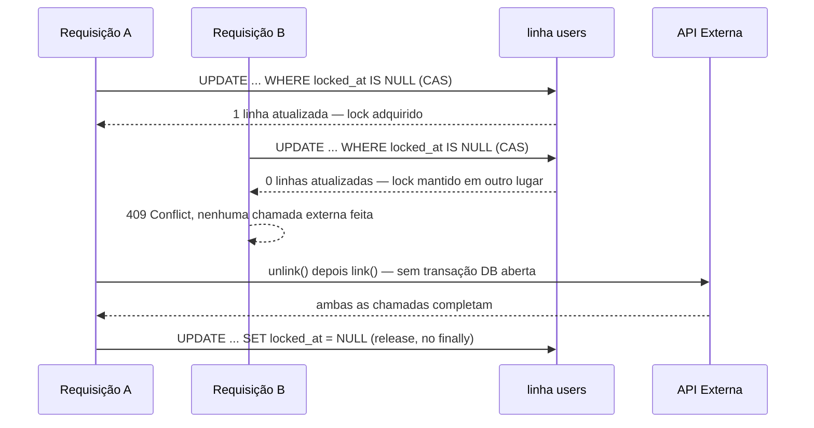

## Visão Geral

Muitos problemas de exclusão mútua se reduzem a "apenas uma requisição para este usuário/pedido/conta deve estar modificando esta coisa por vez". As respostas de livro-texto — uma transação de banco de dados, `SELECT ... FOR UPDATE`, um advisory lock do Postgres — todas compartilham uma suposição: a seção crítica é curta e só conversa com o banco de dados. No momento em que a seção crítica precisa chamar uma API HTTP de terceiros no meio (um provedor de pagamento, um provedor de identidade, qualquer integração parceira), essa suposição se quebra, e recorrer à resposta de livro-texto mesmo assim causa um problema *diferente*: mantém uma conexão de banco de dados e um lock pelo tempo que a chamada externa levar, o que pode ser segundos sob retry/backoff, multiplicado por cada requisição concorrente. Este artigo cobre o padrão que se encaixa nesse formato específico de problema — um lock baseado em lease implementado como uma linha em uma tabela existente, adquirido e liberado com um `UPDATE` atômico simples, nunca dentro de uma transação que também faz a chamada externa.

## O Problema: Bloqueio em Torno de I/O Lenta

Considere um serviço que permite a um usuário promover uma de várias identidades de terceiros vinculadas para ser sua identidade "primária". Fazer isso com segurança contra a API de terceiros é uma sequência não atômica de dois passos: desvincular a identidade alvo da primária atual, depois revincular na outra direção para que ela se torne a nova primária. Se duas requisições para o mesmo usuário rodarem isso concorrentemente — um clique duplo, uma requisição repetida, duas abas do navegador — elas podem se intercalar: a requisição A desvincula a identidade X, a requisição B (que leu estado obsoleto) tenta desvincular a identidade Y do que ela ainda pensa ser a primária, e as duas revinculações competem para decidir qual identidade realmente acaba como primária. A falha não é um crash; é corrupção silenciosa de dados em um sistema de terceiros que o banco de dados local não tem como detectar depois do fato.

A correção óbvia — envolver toda a operação em `@Transactional` e confiar em um lock de linha — piora as coisas, não melhora:

```java
@Transactional
public void switchPrimaryIdentity(User user, String targetId) {
    // mantém uma conexão DB + um lock de linha em `user` durante toda a operação abaixo
    auth0Client.unlink(user.getAuthId(), targetId);   // chamada HTTP #1, com retries
    auth0Client.link(targetId, user.getAuthId());      // chamada HTTP #2, com retries
    user.setAuthId(targetId);
}
```

Todo chamador concorrente agora bloqueia no banco de dados, não no gargalo real da operação (a API externa), e um pool de conexões dimensionado para durações típicas de transações locais (milissegundos) é esgotado por um punhado de requisições, cada uma mantendo uma conexão pelos segundos que uma sequência de retry HTTP pode levar.

## A Solução: Uma Linha de Lease, Adquirida Fora de Qualquer Transação

Em vez de um lock de banco de dados mantido pela duração da operação, armazene o lock como dado comum — uma coluna `locked_at` do tipo timestamp anulável na linha sendo protegida — e o adquira com um `UPDATE ... WHERE` único, atômico e não transacional:

```sql
UPDATE users
SET identity_action_locked_at = NOW()
WHERE id = :id
  AND (identity_action_locked_at IS NULL OR identity_action_locked_at < :staleBefore)
```

A cláusula `WHERE` é todo o mecanismo: o Postgres só permite que um `UPDATE` concorrente vença um compare-and-swap na mesma linha (o segundo bloqueia brevemente no lock de escrita da linha, depois reavalia o `WHERE` contra o valor recém-commitado e não corresponde a nenhuma linha). O chamador verifica a contagem de linhas afetadas — `1` significa "eu tenho a lease", `0` significa "outra pessoa tem" — e essa verificação-e-definição é uma única ida-e-volta, commitada imediatamente, não parte de nenhuma transação mais longa:

```java
int acquired = userRepository.tryAcquireLock(userId, Instant.now().minus(LEASE_TTL));
if (acquired == 0) {
    throw new ResponseStatusException(HttpStatus.CONFLICT, "Another operation is already in progress");
}
try {
    auth0Client.unlink(currentPrimary, targetId);   // sem transação, sem lock mantido aqui
    auth0Client.link(targetId, currentPrimary);
    user.setAuthId(targetId);
    userRepository.save(user);
} finally {
    userRepository.releaseLock(userId);              // UPDATE separado, commitado independentemente
}
```

O parâmetro `staleBefore` é um **TTL de lease**, não apenas um lock: é o que torna o lock auto-curativo se o processo morrer entre adquiri-lo e chegar ao `finally`. Sem ele, um crash no meio da operação deixaria a linha permanentemente bloqueada, já que nada mais jamais limpa um flag booleano simples. Com ele, um lock mais velho que o TTL é simplesmente tratado como disponível de novo — a cláusula `WHERE` do próximo chamador corresponde a ele, exatamente como uma linha desbloqueada.

## Arquitetura



Duas transações independentes e minúsculas cercam uma operação externa arbitrariamente longa que não mantém nenhum recurso de banco de dados. É o mesmo formato da divisão ["commite localmente, faça a parte não confiável fora da transação"](outbox-pattern) do outbox pattern, aplicado a exclusão mútua em vez de entrega de mensagens.

## Cenários de Falha

- **Processo trava depois de adquirir o lock, antes que as chamadas externas terminem** — a linha permanece bloqueada até que `staleBefore` passe; o próximo chamador (ou um retry do mesmo cliente) pode então adquiri-la. O TTL é um trade-off: curto demais e uma operação legitimamente lenta mas ainda em execução pode ter seu lock roubado (veja abaixo); longo demais e um crash genuíno deixa o recurso indisponível por esse tempo.
- **Lock é roubado de uma operação ainda em execução porque o TTL era curto demais** — duas operações agora acreditam que possuem o lock e competem exatamente como se não houvesse lock nenhum. Esta é a aresta afiada de todo esquema baseado em lease: o TTL deve ser configurado bem acima da duração de pior caso da operação (incluindo retries/backoff), não a típica.
- **Release falha (soluço no DB) depois que as chamadas externas já tiveram sucesso** — o `UPDATE` do bloco `finally` lança exceção, mas o efeito colateral externo já foi feito e é irreversível; a linha permanece bloqueada até o TTL expirar. O chamador vê um erro para uma operação que na verdade teve sucesso, o que é confuso mas não inseguro, já que nada mais pode rodar concorrentemente contra o mesmo recurso nesse meio tempo.
- **Duas operações competem por qual `WHERE` commita primeiro** — o Postgres serializa isso corretamente no nível da linha; não há "aquisição dupla" possível, porque um segundo `UPDATE` concorrente mirando a mesma linha fisicamente espera o primeiro commitar antes de poder sequer avaliar seu próprio `WHERE` contra o novo valor.

## Comparação com Alternativas

- **Advisory locks do Postgres (`pg_advisory_xact_lock`)**[^advisory-lock-burst] — a ferramenta nativamente "correta" para esse formato de problema *se* a seção crítica fosse apenas DB: advisory locks com escopo de transação liberam automaticamente no commit, mesmo em um crash, sem necessidade de gerenciamento de TTL. Não se encaixam aqui porque um lock com escopo de transação precisa manter sua transação — e portanto sua conexão — aberta pelo tempo que o lock for mantido, exatamente o que precisa ser evitado quando a seção crítica inclui chamadas HTTP externas. Advisory locks com escopo de sessão evitam manter uma transação, mas então exigem fixar a *mesma conexão física* entre as chamadas de aquisição e liberação, o que não se compõe de forma limpa com uma sessão de ORM com escopo de requisição, com pool de conexões.
- **Optimistic locking (`@Version`)** — detecta que uma linha mudou desde que foi lida e falha o `save()` do segundo escritor com `OptimisticLockException`. Este é o padrão certo para "não sobrescrever silenciosamente a edição de outra pessoa", mas é um mecanismo de *detecção*, não de *prevenção*: não impede que duas requisições comecem ambas as chamadas externas, só captura o conflito na escrita local final, momento em que um efeito colateral externo (como vincular a identidade errada) pode já ter acontecido.
- **Um serviço de lock distribuído (Redis/Redlock, ZooKeeper, etcd)** — a resposta padrão quando o processo que adquire não é mais um monólito único apoiado em banco de dados, ou quando consenso multi-nó verdadeiro sobre a posse do lock importa (veja [Consensus and Coordination Services](consensus-and-coordination-services)). É infraestrutura nova com suas próprias preocupações de disponibilidade e clock skew; um lease em linha de banco de dados é a escolha pragmática quando o sistema já tem uma instância Postgres como fonte de verdade e não quer adicionar uma segunda dependência com estado apenas para exclusão mútua.
- **Chaves de idempotência** — uma técnica complementar, não competidora: uma chave de idempotência torna segura a *repetição da mesma requisição lógica*, enquanto um lease lock impede que *duas requisições concorrentes diferentes* se intercalem. Sistemas que chamam APIs externas de pagamento/identidade tipicamente querem ambos.

[^advisory-lock-burst]: Vale expandir com números reais: digamos que a seção crítica faça duas chamadas HTTP com retry que levam ~1,5s no pior caso, e o endpoint veja 50 requisições concorrentes durante um pico. Com o lock de lease em linha, esse pico usa no máximo um punhado de conexões no total — 49 das 50 requisições recebem `0` linhas afetadas no `UPDATE` de aquisição (alguns milissegundos cada) e retornam `409` imediatamente sem nunca tocar a API externa. Com `pg_advisory_xact_lock`, os 49 perdedores não recebem uma rejeição instantânea; eles *bloqueiam esperando pelo próprio lock*, cada um mantendo uma conexão do pool durante todo o 1,5s de espera — o mesmo formato de problema de um pool de tamanho fixo sendo esgotado por um número muito menor de chamadores, cada um mantendo uma conexão por muito mais tempo do que o pool foi dimensionado para suportar.

## Trade-offs

- **O TTL é um chute, não uma garantia** — não há como escolher uma duração de lease que seja simultaneamente "longa o suficiente para nunca roubar um lock de trabalho vivo" e "curta o suficiente para se recuperar rapidamente de um crash". Dimensioná-lo acima da janela de pior caso de retry/backoff da chamada externa (não sua mediana) é o viés mais seguro, já que um TTL um pouco longo demais só atrasa a recuperação de crash, enquanto um pouco curto demais reintroduz exatamente a race condition que o lock existe para prevenir.
- **Não é mapeado como um campo de entidade** — a coluna de lock deliberadamente não é exposta como um campo gerenciado por JPA/ORM na entidade; toda leitura e escrita passa pelas queries dedicadas de aquisição/liberação. Mapeá-la normalmente permitiria que um `save()` não relacionado da mesma entidade — um que acontece de rodar dentro da janela bloqueada, a partir de estado obsoleto em memória — pisasse silenciosamente no valor do lock, já que ORMs tipicamente reescrevem todo campo mapeado no `save()`, não apenas os que o código chamador tocou.
- **É consultivo, não forçado pelo banco de dados** — nada impede que um caminho de código diferente escreva na mesma linha ignorando completamente a coluna de lock. Isso funciona apenas porque todo escritor do recurso protegido é disciplinado em passar pelo mesmo helper de aquisição/liberação; é uma convenção em nível de aplicação, não uma restrição em nível de banco de dados como um índice `UNIQUE` seria.
- **Ponto único de coordenação** — a correção do lock depende da linha viver em um único banco de dados fortemente consistente. Não generaliza para um sistema com múltiplos bancos de dados independentes ou verdadeira multi-região active-active sem recorrer a uma das alternativas de serviço de lock distribuído acima.

## Uso no Mundo Real

Este é um padrão comum, majoritariamente sem nome, em monólitos e serviços modulares que possuem uma única instância Postgres/MySQL como sua fonte de verdade e ocasionalmente precisam de exclusão mútua em torno de uma chamada a uma API parceira — processadores de pagamento, provedores de identidade (vinculação/desvinculação de contas, exatamente o exemplo acima), reserva de estoque contra um sistema de armazém de terceiros. Aparece sob nomes locais diferentes ("flag de processamento", "lock em andamento", "coluna de claim") mas o formato é sempre o mesmo: uma coluna de timestamp ou booleano anulável, um `UPDATE` CAS para adquirir, um release protegido por `finally`, e um TTL como rede de segurança contra crash. Implementações de fila de jobs e agendadores (incluindo as apoiadas em banco de dados como db-scheduler ou o JDBC job store do Quartz) usam a técnica idêntica internamente para permitir que múltiplas instâncias de worker reivindiquem com segurança uma linha de job sem processá-la duas vezes.

## Perguntas de Entrevista

- Por que envolver uma operação em `@Transactional` se torna a resposta *errada* assim que essa operação chama uma API externa no meio do caminho?
- Percorra o que acontece se duas requisições chamarem o `UPDATE` de aquisição no exato mesmo instante — como o banco de dados garante que apenas uma delas obtenha o lock?
- Qual é o modo de falha se o TTL da lease for muito curto? Muito longo? Como você escolheria um valor?
- Por que a coluna de lock não deveria ser um campo normal mapeado por JPA na entidade?
- Quando você recorreria a um advisory lock do Postgres em vez deste padrão, e quando recorreria a Redis/Redlock em vez de ambos?

## Referências

- [PostgreSQL Documentation — Advisory Locks](https://www.postgresql.org/docs/current/explicit-locking.html#ADVISORY-LOCKS)
- Martin Kleppmann, *Designing Data-Intensive Applications* (O'Reilly) — Capítulo 8, "The Trouble with Distributed Systems" (relógios, timeouts, e por que durações de lease são fundamentalmente um chute).
- Martin Kleppmann — ["How to do distributed locking"](https://martin.kleppmann.com/2016/02/08/how-to-do-distributed-locking.html) — uma crítica ao Redlock que explica por que *qualquer* lock baseado em lease, apoiado em banco de dados ou Redis, só fornece uma garantia de eficiência, não de correção, a menos que combinado com fencing tokens.
- [db-scheduler — Task locking model](https://github.com/kagkarlsson/db-scheduler) — um agendador de jobs JDBC que usa a mesma técnica de reivindicar linha com timestamp para permitir que múltiplas instâncias peguem tarefas agendadas com segurança.
