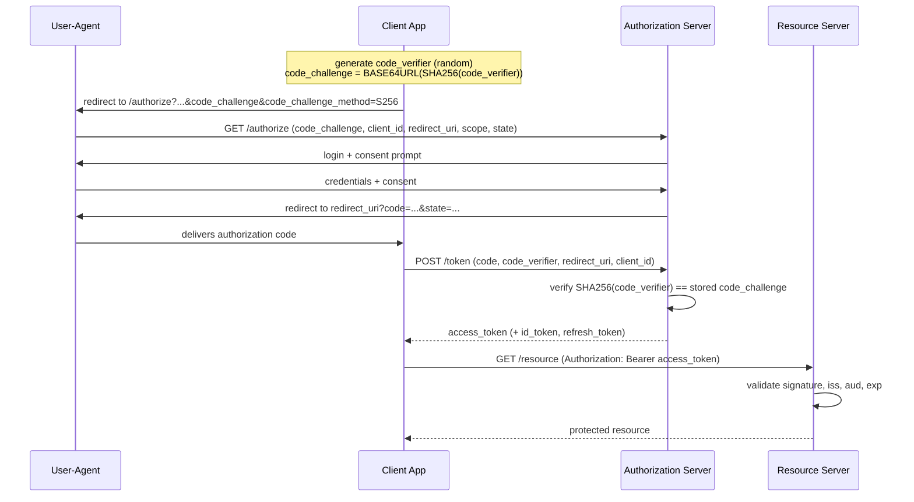

## Overview

In a monolith, authentication happens once, at one login page, and everything downstream is just a method call inside the same process trusting the same session. Split that monolith into dozens of services and the identity decision can't stay a single event — it has to be made once at the edge and then *propagated*, correctly and cheaply, across every hop a request makes afterward: gateway to order service, order service to inventory service, inventory service to a third-party payment API. Each hop needs an answer to two separate questions — who is calling, and what are they allowed to do — without a round trip back to a central login system every time, or the latency budget disappears into auth checks. The old fallback, "the request came from inside our network, so it's already authenticated," quietly assumed a perimeter that no longer exists once services span multiple data centers, multiple clouds, and third-party partners; a request "from inside the network" today may have crossed a VPN, a service mesh, and someone else's cloud account before it reached you. Getting authentication and authorization right at scale means picking mechanisms — OAuth 2.0, OpenID Connect, signed tokens, mutual TLS — that make the identity decision portable and independently verifiable, never dependent on which network segment a packet happened to arrive from.

## Authentication vs. Authorization

The two terms get used almost interchangeably in casual conversation and mean genuinely different things, and the confusion causes real design mistakes. **Authentication** (AuthN) answers "who is this?" — verifying that a caller is who they claim to be, typically by checking a credential (a password, a certificate, a signed token) against something only the real party could have produced. **Authorization** (AuthZ) answers "what is this identity allowed to do?" — a separate decision made *after* authentication succeeds, checking a verified identity against a policy: this user can read this document, this service can write to this queue, this token was scoped to `orders:read` and not `orders:write`.

The reason to keep them conceptually separate in a distributed system is that they're solved by different mechanisms at different points in the request path. Authentication of a human user usually happens once, at login, and produces a token that's then *carried* through the system. Authorization, by contrast, often has to be re-evaluated at every service boundary, because each service owns a different slice of the permission model — the order service knows whether this user owns this order, the inventory service doesn't and shouldn't need to. A token that proves identity convincingly can still be wrong to honor for a given action if the authorization check at that specific service says no.

## OAuth 2.0: Delegated Authorization, Not Authentication

OAuth 2.0 ([RFC 6749](https://datatracker.ietf.org/doc/html/rfc6749), October 2012) is the single most misused piece of terminology in this space: despite the name containing "authorization," it's routinely implemented as if it were an authentication protocol on its own. It isn't. OAuth 2.0 solves a delegation problem: a **client** application wants to act on a **resource owner's** behalf against a **resource server**, without the resource owner ever handing the client their actual password. The resource owner authenticates to an **authorization server** they already trust, grants a scoped, time-limited **access token** to the client, and the client presents that token on every call. The resource server never learns the resource owner's credentials and never has to trust the client with anything beyond what the token's scope permits.

Nothing in that flow tells anyone *who* the resource owner is as a person — an access token proves "the bearer may call this API with this scope," not "the bearer is Alice." A client that infers the user's identity from the mere fact that the OAuth dance succeeded is relying on an implementation detail, not a guarantee the spec makes; that exact conflation is what motivated OpenID Connect (below) to exist as a separate layer instead of leaving identity to be inferred.

OAuth 2.0 defines several grant types for how a client obtains a token, and their current-practice status has shifted since 2012. The **Implicit** grant — which returned an access token directly in a redirect URI fragment, with no client secret and no code-exchange step — was designed for browser-based apps that couldn't safely store a secret, but it leaks tokens into browser history and referrer headers, and has no way to bind the token to the client that requested it. [RFC 9700](https://datatracker.ietf.org/doc/html/rfc9700), *Best Current Practice for OAuth 2.0 Security* (January 2025, updating RFCs 6749, 6750, and 6819), explicitly deprecates the Implicit grant and the Resource Owner Password Credentials grant, and directs every client — including single-page apps and native mobile apps — to the **Authorization Code grant with PKCE** instead.

## The Authorization Code Flow with PKCE

PKCE (Proof Key for Code Exchange) closes the gap that made the Authorization Code grant unsafe for public clients that can't hold a secret: without it, an attacker who intercepts the authorization code mid-redirect (a real risk on mobile, where the redirect is an OS-level URI handoff another installed app can potentially intercept) can exchange that code for a token themselves. PKCE has the client generate a random `code_verifier`, derive a `code_challenge = BASE64URL(SHA256(code_verifier))`, send only the challenge in the initial authorization request, and present the original verifier when exchanging the code for a token — so an intercepted code is useless without the verifier that produced its challenge.



RFC 9700 recommends PKCE for *every* client type, not just public ones without a secret — it's cheap, and it defends against authorization-code interception regardless of whether the client is confidential. `state` (bound to the user's session, checked on the redirect back) is the separate defense against CSRF on the redirect itself; the two mechanisms address different attacks and neither substitutes for the other.

## OpenID Connect: Authentication on Top of OAuth

OpenID Connect (OIDC, formalized in [OpenID Connect Core 1.0](https://openid.net/specs/openid-connect-core-1_0.html)) exists to close exactly that gap: it's an identity layer built *on top of* OAuth 2.0, reusing the same authorization-server infrastructure and the same Authorization Code + PKCE flow, but adding an artifact plain OAuth never defined — the **ID token**. The ID token is a JWT, signed by the authorization server (now properly called an OpenID Provider), asserting specific claims about the authenticated user: `sub` (a stable subject identifier), `iss`, `aud`, `exp`, and optionally profile claims like `email` or `name`. Where the OAuth access token says "this bearer may call this API with this scope," the OIDC ID token says "this specific person authenticated, and here's cryptographic proof of when and by whom."

The rule that keeps the two straight: **use the ID token for identity, and access tokens only for calling resource servers — never infer who the user is from the mere presence of an access token.** Access tokens are often opaque to the client by design, and their content is a contract between the authorization server and the resource server; ID tokens are explicitly meant to be consumed and validated by the client. Conflating the two — common enough that OIDC's own spec calls it out — breaks the moment a resource server issues an access token whose subject isn't the originally authenticated user, which token exchange, service accounts, and other delegation patterns do routinely.

## JWTs and Their Real Validation Pitfalls

JSON Web Tokens show up as the encoding for both OAuth access tokens (frequently) and OIDC ID tokens (always), and their structure is three base64url-encoded segments joined by dots — `header.payload.signature`:

```
eyJhbGciOiJSUzI1NiIsInR5cCI6IkpXVCJ9.eyJzdWIiOiJ1c2VyLTQyMiIsImlzcyI6Imh0dHBzOi8vYXV0aC5leGFtcGxlLmNvbSIsImF1ZCI6ImFwaS5leGFtcGxlLmNvbSIsImV4cCI6MTc1ODQwMDAwMH0.QqZ...

// decoded header:  {"alg": "RS256", "typ": "JWT"}
// decoded payload: {"sub": "user-422", "iss": "https://auth.example.com",
//                    "aud": "api.example.com", "exp": 1758400000}
```

The signature covers the header and payload, so tampering with either invalidates it — *provided the verifier actually checks the signature against the right algorithm and the right key*, which is where real, historically significant vulnerabilities have lived, not in the token format itself.

**The `alg: none` vulnerability.** The JWT/JWS spec allows an `alg` value of `none`, meaning "unsecured, no signature." Several early JWT libraries, when asked to verify a token, read the algorithm out of the attacker-controlled header and dispatched to whatever verification routine that algorithm named — including, for `none`, a routine that just returned "valid" without checking anything. An attacker could take any legitimate token, strip the signature, set `alg` to `none`, and have it accepted as authentic. Auth0's security research ("Critical vulnerabilities in JSON Web Token libraries," Tim McLean) documented this affecting multiple mainstream libraries.

**Algorithm confusion between RS256 and HS256.** RS256 is asymmetric — a private key signs, the corresponding public key verifies — and that public key is usually published at a JWKS endpoint precisely so it's easy to fetch. If a verifier also supports HS256 (symmetric — one key both signs and verifies) and, like the `alg: none` case, trusts the header to pick the algorithm, an attacker can take the server's own *public* RSA key and use it as the HMAC secret to sign a forged token with `alg: HS256`. HMAC verification just checks "did signing with this key produce this signature," and the attacker signed with exactly that key, so it validates. It's the same root cause as `alg: none` wearing a different mask: the token's own header should never decide how it gets verified.

The fix in both cases is the same discipline, and it's the one real defense worth memorizing: **the verifier fixes the expected algorithm and key in advance, out of band from the token, and rejects anything that doesn't match — it never asks the token what algorithm to use.**

```java
JwtParser parser = Jwts.parser()
    // Pin the algorithm explicitly — never read `alg` from the token and dispatch on it.
    .verifyWith(publicKey)                 // RSA public key, fetched from a trusted JWKS
    .requireIssuer("https://auth.example.com")
    .requireAudience("api.example.com")
    .build();

try {
    Jws<Claims> jws = parser.parseSignedClaims(token);
    Claims claims = jws.getPayload();
    // exp is checked automatically by the parser above; still enforce clock skew tolerance
    // deliberately, and never treat "signature verified" as "safe to trust" without also
    // having checked iss/aud — a validly-signed token from the wrong issuer, or issued for
    // a different audience, is not a token this service should accept.
} catch (ExpiredJwtException | SignatureException | UnsupportedJwtException ex) {
    throw new UnauthorizedException("invalid token", ex);
}
```

Checking the signature is necessary but not sufficient. A token can be validly signed by a real, trusted authorization server and still be wrong to accept: `exp` has to be enforced with sane clock-skew tolerance, not waved through because "the signature was fine"; `iss` has to match an authorization server this service actually trusts, or a token legitimately issued by some other system in the org (a partner's auth server, a lower-trust environment) becomes valid everywhere; and `aud` has to match this specific resource server, or a token minted for one API becomes a skeleton key for every API that shares an issuer and the same carelessness about checking who the token was actually for.

## Service-to-Service: mTLS and Token Propagation

Everything above describes proving a human's or a client application's identity at the edge. Inside the system, services calling services face a related but distinct problem: how does the inventory service know it's really the order service calling, and not something else on the network pretending to be it? Bearer tokens solve this only partially — anyone who obtains a valid token, by any means, can present it and be believed, because a bearer token doesn't prove possession of anything beyond the string itself.

**Mutual TLS (mTLS)** closes that gap: instead of only the server presenting a certificate (as in ordinary TLS, where the client verifies the server but not vice versa), both sides present certificates and both verify them during the handshake, before any application data or bearer token is exchanged. Each service gets an identity in the form of a certificate — typically issued by an internal certificate authority and scoped to that service — and a peer without a valid certificate from a trusted CA never completes the handshake. This authenticates the *service*, cryptographically, at the transport layer, independent of whatever application-level token rides inside the request.

Running an internal CA, issuing per-service certificates, and rotating them before expiry is real operational weight, which is why **service meshes** (Istio, Linkerd) commonly automate it: a sidecar proxy next to each instance handles the mTLS handshake transparently, issuing and rotating short-lived certificates automatically, so every call between meshed services gets mutual authentication for free — see [Service Mesh and the Sidecar Pattern](service-mesh-and-sidecar-pattern). The two mechanisms compose rather than compete: mTLS authenticates *which service* is calling, while a propagated JWT still carries *which user's request this originated from* and what they were authorized to do, so the downstream service can decide on both facts at once.

## Zero Trust: Verify Every Call, Not Just the Perimeter

The traditional model — a hardened perimeter (firewall, VPN) around a network, with everything inside implicitly trusted — assumed that reaching the inside of the network was itself hard enough to count as a credential. That assumption fails for exactly the reasons this concept exists: services span multiple clouds and data centers with no single perimeter to defend, third parties need access to specific internal APIs without getting a VPN credential to everything, and a single compromised service or credential inside the perimeter has traditionally been able to move laterally with very little additional friction, because "inside" was treated as synonymous with "trusted."

**Zero trust architecture**, formalized in [NIST SP 800-207](https://csrc.nist.gov/pubs/sp/800/207/final) (2020) and given a fuller operational treatment in Evan Gilman and Doug Barth's *[Zero Trust Networks](https://www.oreilly.com/library/view/zero-trust-networks/9781491962183/)* (O'Reilly, 2017), replaces that assumption with one core tenet: **never trust a request based on its network location; authenticate and authorize every request, regardless of where it originates.** NIST 800-207 frames this as a shift from perimeter-based to resource-based protection — every access request to every resource is evaluated on its own merits (verified identity, device posture, requested scope, observed behavior), whether that request originates from the public internet or from a host sitting on the same subnet as the resource it's calling. There is no longer a "trusted zone" a request can sit inside to skip that evaluation.

Concretely, this is exactly the combination of mechanisms this article has covered, applied uniformly rather than only at the edge: OAuth-scoped tokens and OIDC identity assertions carried on every call, not just the first one from an external client; mTLS between every pair of services, not only ones crossing a network boundary someone decided was risky; and authorization checks re-evaluated at each hop rather than inherited from "it already got past the gateway." A service mesh with mandatory mTLS between sidecars and a policy engine that checks every call against explicit rules is a common concrete implementation of zero trust in practice — the perimeter firewall doesn't disappear, but it stops being the *only* thing standing between an attacker and a sensitive internal call.

## Trade-offs

- **OAuth 2.0 without OIDC gives you delegation, not identity — and treating an access token as proof of who the user is is the single most common misuse of the spec.** If a client needs to know who authenticated, it needs the ID token, not just a successfully-obtained access token.
- **PKCE and short-lived tokens raise the operational floor for every client, even ones that don't strictly need it.** RFC 9700's blanket recommendation trades a small amount of extra implementation complexity in every client for closing a class of interception attacks that used to only matter for public clients — a reasonable trade given how cheap PKCE is to implement, but it is still one more thing every client must get right.
- **Local JWT validation is fast (no network call) but weak on revocation.** A signature and `exp` check confirms a token hasn't been tampered with and hasn't expired on its own schedule, but a compromised token that's still within its validity window stays valid everywhere it's accepted unless the system pays for a real-time revocation check (a deny-list lookup, short token lifetimes plus refresh, or token introspection against the authorization server) on some or all calls.
- **mTLS authenticates the service, not the end user, and running an internal CA is real operational overhead.** It closes the "who is really calling" gap for service-to-service traffic, but a compromised service with a valid certificate can still make any call that certificate is authorized for — mTLS is a strong complement to application-level authorization, not a substitute for it.
- **Zero trust is a meaningful architectural shift, not a product you buy, and the migration cost is real.** Re-evaluating identity and authorization at every hop instead of once at the edge adds latency and infrastructure (mesh sidecars, policy engines, certificate rotation) to every call; the payoff — no single perimeter breach exposes everything behind it — is worth that cost for most production systems handling sensitive data, but it is a genuine cost, not a free security upgrade.

## Interview Questions

- What is the precise difference between what an OAuth 2.0 access token proves and what an OIDC ID token proves, and what goes wrong when a client conflates the two?
- Walk through the Authorization Code flow with PKCE end to end. What specific attack does PKCE defend against, and why doesn't `state` alone cover it?
- Why was the Implicit grant deprecated, and what does RFC 9700 recommend instead for a browser-based single-page app that can't hold a client secret?
- Explain the RS256/HS256 algorithm confusion attack on JWTs in your own words. What single validation rule prevents both this and the `alg: none` vulnerability?
- Why does checking a JWT's signature alone not make it safe to trust? Walk through what `iss`, `aud`, and `exp` each protect against if omitted.
- How does mTLS between two internal services differ from what a bearer token already provides, and why do service meshes commonly automate it rather than leaving it to each service?
- What specifically does "zero trust" mean per NIST SP 800-207, and how is it different from just having a well-configured firewall at the network edge?

## References

- [RFC 6749 — The OAuth 2.0 Authorization Framework](https://datatracker.ietf.org/doc/html/rfc6749) — IETF, October 2012
- [RFC 9700 — Best Current Practice for OAuth 2.0 Security](https://datatracker.ietf.org/doc/html/rfc9700) — IETF, January 2025
- [OpenID Connect Core 1.0 incorporating errata set 2](https://openid.net/specs/openid-connect-core-1_0.html) — OpenID Foundation
- [NIST SP 800-207 — Zero Trust Architecture](https://csrc.nist.gov/pubs/sp/800/207/final) — Rose, Borchert, Mitchell, Connelly; NIST, August 2020
- *[Zero Trust Networks: Building Secure Systems in Untrusted Networks](https://www.oreilly.com/library/view/zero-trust-networks/9781491962183/)* — Evan Gilman and Doug Barth, O'Reilly Media, 2017
- [Critical vulnerabilities in JSON Web Token libraries](https://auth0.com/blog/critical-vulnerabilities-in-json-web-token-libraries/) — Tim McLean, Auth0 blog
