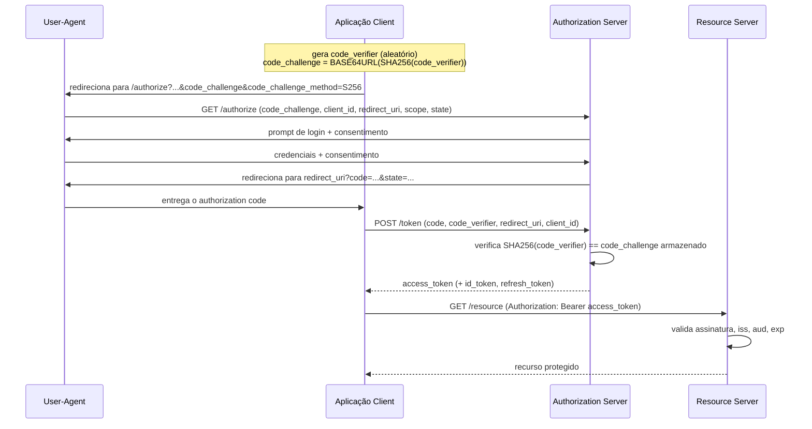

## Visão Geral

Em um monólito, autenticação acontece uma vez, em uma tela de login, e tudo a jusante é apenas uma chamada de método dentro do mesmo processo confiando na mesma sessão. Divida esse monólito em dezenas de serviços e a decisão de identidade não pode continuar sendo um evento único — ela precisa ser tomada uma vez na borda e depois *propagada*, corretamente e barato, através de cada salto que uma requisição dá depois: gateway para serviço de pedidos, serviço de pedidos para serviço de estoque, serviço de estoque para uma API de pagamento de terceiros. Cada salto precisa de uma resposta para duas perguntas separadas — quem está chamando, e o que essa pessoa pode fazer — sem uma ida-e-volta a um sistema de login central toda vez, ou o orçamento de latência desaparece em checagens de autenticação. O fallback antigo, "a requisição veio de dentro da nossa rede, então já está autenticada", assumia silenciosamente um perímetro que não existe mais quando serviços se estendem por múltiplos data centers, múltiplas nuvens e parceiros terceiros; uma requisição "de dentro da rede" hoje pode ter atravessado uma VPN, um service mesh e a conta de nuvem de outra pessoa antes de chegar até você. Acertar autenticação e autorização em escala significa escolher mecanismos — OAuth 2.0, OpenID Connect, tokens assinados, TLS mútuo — que tornem a decisão de identidade portátil e verificável independentemente, nunca dependente de qual segmento de rede um pacote acabou de chegar.

## Autenticação vs. Autorização

Os dois termos são usados quase de forma intercambiável em conversa casual e significam coisas genuinamente diferentes, e a confusão causa erros reais de design. **Autenticação** (AuthN) responde "quem é esse?" — verificar que um chamador é quem alega ser, tipicamente checando uma credencial (uma senha, um certificado, um token assinado) contra algo que só a parte real poderia ter produzido. **Autorização** (AuthZ) responde "o que essa identidade tem permissão para fazer?" — uma decisão separada tomada *depois* que a autenticação tem sucesso, checando uma identidade verificada contra uma política: este usuário pode ler este documento, este serviço pode escrever nesta fila, este token foi escopado para `orders:read` e não `orders:write`.

O motivo para mantê-los conceitualmente separados em um sistema distribuído é que são resolvidos por mecanismos diferentes em pontos diferentes do caminho da requisição. A autenticação de um usuário humano geralmente acontece uma vez, no login, e produz um token que é então *carregado* através do sistema. A autorização, em contraste, frequentemente precisa ser reavaliada em cada fronteira de serviço, porque cada serviço possui uma fatia diferente do modelo de permissões — o serviço de pedidos sabe se este usuário é dono deste pedido, o serviço de estoque não sabe e não deveria precisar saber. Um token que prova identidade de forma convincente ainda pode estar errado de ser honrado para uma ação específica se a checagem de autorização naquele serviço específico disser não.

## OAuth 2.0: Autorização Delegada, Não Autenticação

OAuth 2.0 ([RFC 6749](https://datatracker.ietf.org/doc/html/rfc6749), outubro de 2012) é a peça de terminologia mais mal utilizada nesse espaço: apesar do nome conter "authorization", é rotineiramente implementado como se fosse um protocolo de autenticação por si só. Não é. OAuth 2.0 resolve um problema de delegação: uma aplicação **client** quer agir em nome de um **resource owner** contra um **resource server**, sem que o resource owner jamais entregue ao client sua senha real. O resource owner se autentica em um **authorization server** em que já confia, concede um **access token** escopado e com prazo limitado ao client, e o client apresenta esse token em cada chamada. O resource server nunca aprende as credenciais do resource owner e nunca precisa confiar no client além do que o escopo do token permite.

Nada nesse fluxo diz a ninguém *quem* o resource owner é como pessoa — um access token prova "o portador pode chamar esta API com este escopo", não "o portador é a Alice". Um client que infere a identidade do usuário do mero fato de que a dança do OAuth teve sucesso está confiando em um detalhe de implementação, não em uma garantia que a spec faz; essa exata confusão foi o que motivou o OpenID Connect (abaixo) a existir como uma camada separada em vez de deixar a identidade ser inferida.

OAuth 2.0 define vários tipos de grant para como um client obtém um token, e seu status de prática atual mudou desde 2012. O grant **Implicit** — que retornava um access token diretamente em um fragmento de URI de redirecionamento, sem client secret e sem etapa de troca de código — foi projetado para apps baseados em navegador que não podiam armazenar um secret com segurança, mas vaza tokens no histórico do navegador e em cabeçalhos referrer, e não tem forma de vincular o token ao client que o requisitou. A [RFC 9700](https://datatracker.ietf.org/doc/html/rfc9700), *Best Current Practice for OAuth 2.0 Security* (janeiro de 2025, atualizando as RFCs 6749, 6750 e 6819), deprecia explicitamente o grant Implicit e o grant Resource Owner Password Credentials, e direciona todo client — incluindo single-page apps e apps móveis nativos — para o **Authorization Code grant com PKCE** em vez disso.

## O Fluxo Authorization Code com PKCE

PKCE (Proof Key for Code Exchange) fecha a lacuna que tornava o grant Authorization Code inseguro para clients públicos que não podem manter um secret: sem ele, um atacante que intercepta o código de autorização no meio do redirecionamento (um risco real em mobile, onde o redirecionamento é uma passagem de URI em nível de SO que outro app instalado pode potencialmente interceptar) pode trocar esse código por um token ele mesmo. PKCE faz o client gerar um `code_verifier` aleatório, derivar um `code_challenge = BASE64URL(SHA256(code_verifier))`, enviar apenas o challenge na requisição de autorização inicial, e apresentar o verifier original ao trocar o código por um token — então um código interceptado é inútil sem o verifier que produziu seu challenge.



A RFC 9700 recomenda PKCE para *todo* tipo de client, não apenas os públicos sem um secret — é barato, e defende contra interceptação de authorization code independentemente de o client ser confidencial. `state` (vinculado à sessão do usuário, checado no redirecionamento de volta) é a defesa separada contra CSRF no próprio redirecionamento; os dois mecanismos endereçam ataques diferentes e nenhum substitui o outro.

## OpenID Connect: Autenticação Sobre o OAuth

OpenID Connect (OIDC, formalizado no [OpenID Connect Core 1.0](https://openid.net/specs/openid-connect-core-1_0.html)) existe para fechar exatamente essa lacuna: é uma camada de identidade construída *sobre* OAuth 2.0, reutilizando a mesma infraestrutura de authorization server e o mesmo fluxo Authorization Code + PKCE, mas adicionando um artefato que o OAuth puro nunca definiu — o **ID token**. O ID token é um JWT, assinado pelo authorization server (agora propriamente chamado de OpenID Provider), afirmando claims específicas sobre o usuário autenticado: `sub` (um identificador de sujeito estável), `iss`, `aud`, `exp`, e opcionalmente claims de perfil como `email` ou `name`. Onde o access token do OAuth diz "este portador pode chamar esta API com este escopo", o ID token do OIDC diz "esta pessoa específica se autenticou, e aqui está a prova criptográfica de quando e por quem".

A regra que mantém os dois separados: **use o ID token para identidade, e access tokens apenas para chamar resource servers — nunca infira quem é o usuário da mera presença de um access token.** Access tokens são frequentemente opacos ao client por design, e seu conteúdo é um contrato entre o authorization server e o resource server; ID tokens são explicitamente feitos para serem consumidos e validados pelo client. Confundir os dois — comum o suficiente para a própria spec do OIDC chamar atenção para isso — quebra no momento em que um resource server emite um access token cujo sujeito não é o usuário originalmente autenticado, o que padrões de troca de token, service accounts, e outros padrões de delegação fazem rotineiramente.

## JWTs e Suas Armadilhas Reais de Validação

JSON Web Tokens aparecem como a codificação tanto para access tokens do OAuth (frequentemente) quanto para ID tokens do OIDC (sempre), e sua estrutura são três segmentos codificados em base64url unidos por pontos — `header.payload.signature`:

```
eyJhbGciOiJSUzI1NiIsInR5cCI6IkpXVCJ9.eyJzdWIiOiJ1c2VyLTQyMiIsImlzcyI6Imh0dHBzOi8vYXV0aC5leGFtcGxlLmNvbSIsImF1ZCI6ImFwaS5leGFtcGxlLmNvbSIsImV4cCI6MTc1ODQwMDAwMH0.QqZ...

// header decodificado:  {"alg": "RS256", "typ": "JWT"}
// payload decodificado: {"sub": "user-422", "iss": "https://auth.example.com",
//                         "aud": "api.example.com", "exp": 1758400000}
```

A assinatura cobre o header e o payload, então adulterar qualquer um dos dois a invalida — *desde que o verificador realmente cheque a assinatura contra o algoritmo e a chave corretos*, que é onde vulnerabilidades reais e historicamente significativas viveram, não no formato do token em si.

**A vulnerabilidade `alg: none`.** A spec JWT/JWS permite um valor `alg` de `none`, significando "não seguro, sem assinatura". Várias bibliotecas JWT antigas, ao serem solicitadas para verificar um token, liam o algoritmo do header controlado pelo atacante e despachavam para qualquer rotina de verificação que esse algoritmo nomeasse — incluindo, para `none`, uma rotina que simplesmente retornava "válido" sem checar nada. Um atacante podia pegar qualquer token legítimo, remover a assinatura, definir `alg` como `none`, e tê-lo aceito como autêntico. A pesquisa de segurança da Auth0 ("Critical vulnerabilities in JSON Web Token libraries", Tim McLean) documentou isso afetando múltiplas bibliotecas mainstream.

**Confusão de algoritmo entre RS256 e HS256.** RS256 é assimétrico — uma chave privada assina, a chave pública correspondente verifica — e essa chave pública normalmente é publicada em um endpoint JWKS precisamente para ser fácil de buscar. Se um verificador também suporta HS256 (simétrico — uma chave assina e verifica) e, como no caso `alg: none`, confia no header para escolher o algoritmo, um atacante pode pegar a chave RSA *pública* do próprio servidor e usá-la como o secret HMAC para assinar um token forjado com `alg: HS256`. A verificação HMAC apenas checa "assinar com esta chave produziu esta assinatura", e o atacante assinou com exatamente essa chave, então valida. É a mesma causa raiz de `alg: none` usando uma máscara diferente: o header do token nunca deveria decidir como ele é verificado.

A correção em ambos os casos é a mesma disciplina, e é a única defesa real que vale a pena memorizar: **o verificador fixa o algoritmo e a chave esperados de antemão, fora da banda do token, e rejeita qualquer coisa que não corresponda — nunca pergunta ao token qual algoritmo usar.**

```java
JwtParser parser = Jwts.parser()
    // Fixa o algoritmo explicitamente — nunca leia `alg` do token e despache com base nele.
    .verifyWith(publicKey)                 // chave pública RSA, buscada de um JWKS confiável
    .requireIssuer("https://auth.example.com")
    .requireAudience("api.example.com")
    .build();

try {
    Jws<Claims> jws = parser.parseSignedClaims(token);
    Claims claims = jws.getPayload();
    // exp é checado automaticamente pelo parser acima; ainda assim aplique tolerância a
    // clock skew deliberadamente, e nunca trate "assinatura verificada" como "seguro para
    // confiar" sem também ter checado iss/aud — um token validamente assinado do emissor
    // errado, ou emitido para uma audiência diferente, não é um token que este serviço
    // deveria aceitar.
} catch (ExpiredJwtException | SignatureException | UnsupportedJwtException ex) {
    throw new UnauthorizedException("invalid token", ex);
}
```

Checar a assinatura é necessário mas não suficiente. Um token pode estar validamente assinado por um authorization server real e confiável e ainda estar errado de ser aceito: `exp` tem que ser aplicado com tolerância sã a clock skew, não dispensado porque "a assinatura estava ok"; `iss` tem que corresponder a um authorization server em que este serviço realmente confia, ou um token legitimamente emitido por algum outro sistema na organização (o authorization server de um parceiro, um ambiente de menor confiança) se torna válido em todo lugar; e `aud` tem que corresponder a este resource server específico, ou um token cunhado para uma API se torna uma chave mestra para toda API que compartilha um emissor e o mesmo descuido sobre checar para quem o token realmente era.

## Serviço-para-Serviço: mTLS e Propagação de Token

Tudo acima descreve provar a identidade de um humano ou de uma aplicação client na borda. Dentro do sistema, serviços chamando serviços enfrentam um problema relacionado mas distinto: como o serviço de estoque sabe que é realmente o serviço de pedidos chamando, e não algo na rede fingindo ser ele? Bearer tokens resolvem isso apenas parcialmente — qualquer um que obtenha um token válido, por qualquer meio, pode apresentá-lo e ser acreditado, porque um bearer token não prova posse de nada além da própria string.

**Mutual TLS (mTLS)** fecha essa lacuna: em vez de apenas o servidor apresentar um certificado (como no TLS comum, onde o client verifica o servidor mas não vice-versa), ambos os lados apresentam certificados e ambos os verificam durante o handshake, antes de qualquer dado de aplicação ou bearer token ser trocado. Cada serviço recebe uma identidade na forma de um certificado — tipicamente emitido por uma autoridade certificadora interna e escopado para esse serviço — e um peer sem um certificado válido de uma CA confiável nunca completa o handshake. Isso autentica o *serviço*, criptograficamente, na camada de transporte, independente de qualquer token em nível de aplicação que viaje dentro da requisição.

Rodar uma CA interna, emitir certificados por serviço, e rotacioná-los antes de expirar é peso operacional real, motivo pelo qual **service meshes** (Istio, Linkerd) comumente automatizam isso: um sidecar proxy ao lado de cada instância lida com o handshake mTLS de forma transparente, emitindo e rotacionando certificados de curta duração automaticamente, então toda chamada entre serviços em mesh recebe autenticação mútua de graça — veja [Service Mesh and the Sidecar Pattern](service-mesh-and-sidecar-pattern). Os dois mecanismos se compõem em vez de competir: mTLS autentica *qual serviço* está chamando, enquanto um JWT propagado ainda carrega *de qual requisição de usuário isso se originou* e o que foi autorizado a fazer, então o serviço downstream pode decidir com base em ambos os fatos ao mesmo tempo.

## Zero Trust: Verifique Cada Chamada, Não Apenas o Perímetro

O modelo tradicional — um perímetro fortificado (firewall, VPN) ao redor de uma rede, com tudo dentro implicitamente confiado — assumia que alcançar o interior da rede era em si difícil o suficiente para contar como uma credencial. Essa suposição falha exatamente pelas razões por que este conceito existe: serviços se estendem por múltiplas nuvens e data centers sem um único perímetro para defender, terceiros precisam de acesso a APIs internas específicas sem receber uma credencial de VPN para tudo, e um único serviço ou credencial comprometido dentro do perímetro tradicionalmente tem sido capaz de se mover lateralmente com muito pouco atrito adicional, porque "dentro" era tratado como sinônimo de "confiável".

**Zero trust architecture**, formalizada no [NIST SP 800-207](https://csrc.nist.gov/pubs/sp/800/207/final) (2020) e detalhada em um tratamento operacional mais completo em *[Zero Trust Networks](https://www.oreilly.com/library/view/zero-trust-networks/9781491962183/)* de Evan Gilman e Doug Barth (O'Reilly, 2017), substitui essa suposição por um princípio central: **nunca confie em uma requisição com base em sua localização de rede; autentique e autorize toda requisição, independentemente de onde ela se origine.** O NIST 800-207 enquadra isso como uma mudança de proteção baseada em perímetro para proteção baseada em recurso — toda requisição de acesso a todo recurso é avaliada por seus próprios méritos (identidade verificada, postura do dispositivo, escopo requisitado, comportamento observado), quer essa requisição se origine da internet pública ou de um host sentado na mesma sub-rede do recurso que está chamando. Não existe mais uma "zona confiável" onde uma requisição pode se sentar para pular essa avaliação.

Concretamente, isso é exatamente a combinação de mecanismos que este artigo cobriu, aplicada uniformemente em vez de apenas na borda: tokens escopados por OAuth e afirmações de identidade OIDC carregados em cada chamada, não apenas na primeira de um client externo; mTLS entre cada par de serviços, não só os que cruzam uma fronteira de rede que alguém decidiu ser arriscada; e checagens de autorização reavaliadas em cada salto em vez de herdadas de "já passou pelo gateway". Um service mesh com mTLS obrigatório entre sidecars e um motor de política que checa cada chamada contra regras explícitas é uma implementação concreta comum de zero trust na prática — o firewall de perímetro não desaparece, mas deixa de ser a *única* coisa entre um atacante e uma chamada interna sensível.

## Trade-offs

- **OAuth 2.0 sem OIDC dá delegação, não identidade — e tratar um access token como prova de quem é o usuário é o uso incorreto mais comum da spec.** Se um client precisa saber quem se autenticou, precisa do ID token, não apenas de um access token obtido com sucesso.
- **PKCE e tokens de curta duração elevam o piso operacional de todo client, mesmo os que não estritamente precisam disso.** A recomendação geral da RFC 9700 troca uma pequena quantidade de complexidade extra de implementação em cada client por fechar uma classe de ataques de interceptação que costumavam importar apenas para clients públicos — uma troca razoável dado quão barato é implementar PKCE, mas ainda é mais uma coisa que todo client precisa acertar.
- **Validação local de JWT é rápida (sem chamada de rede) mas fraca em revogação.** Uma checagem de assinatura e `exp` confirma que um token não foi adulterado e não expirou em seu próprio cronograma, mas um token comprometido que ainda está dentro de sua janela de validade permanece válido em todo lugar onde é aceito a menos que o sistema pague por uma checagem de revogação em tempo real (uma consulta a deny-list, tempos de vida curtos de token mais refresh, ou introspecção de token contra o authorization server) em algumas ou todas as chamadas.
- **mTLS autentica o serviço, não o usuário final, e rodar uma CA interna é overhead operacional real.** Fecha a lacuna de "quem está realmente chamando" para tráfego serviço-para-serviço, mas um serviço comprometido com um certificado válido ainda pode fazer qualquer chamada para a qual esse certificado é autorizado — mTLS é um forte complemento à autorização em nível de aplicação, não um substituto para ela.
- **Zero trust é uma mudança arquitetural significativa, não um produto que se compra, e o custo de migração é real.** Reavaliar identidade e autorização em cada salto em vez de uma vez na borda adiciona latência e infraestrutura (sidecars de mesh, motores de política, rotação de certificados) a cada chamada; o retorno — nenhuma violação de perímetro único expõe tudo por trás dele — vale esse custo para a maioria dos sistemas de produção lidando com dados sensíveis, mas é um custo genuíno, não uma atualização de segurança gratuita.

## Perguntas de Entrevista

- Qual é a diferença precisa entre o que um access token OAuth 2.0 prova e o que um ID token OIDC prova, e o que dá errado quando um client confunde os dois?
- Percorra o fluxo Authorization Code com PKCE de ponta a ponta. Qual ataque específico o PKCE defende, e por que `state` sozinho não cobre isso?
- Por que o grant Implicit foi deprecado, e o que a RFC 9700 recomenda em vez disso para um single-page app baseado em navegador que não pode manter um client secret?
- Explique o ataque de confusão de algoritmo RS256/HS256 em JWTs com suas próprias palavras. Qual regra de validação única previne isso e a vulnerabilidade `alg: none`?
- Por que checar apenas a assinatura de um JWT não o torna seguro para confiar? Percorra o que `iss`, `aud`, e `exp` cada um protege se omitidos.
- Como mTLS entre dois serviços internos difere do que um bearer token já fornece, e por que service meshes comumente automatizam isso em vez de deixar para cada serviço?
- O que exatamente significa "zero trust" segundo o NIST SP 800-207, e como é diferente de apenas ter um firewall bem configurado na borda da rede?

## Referências

- [RFC 6749 — The OAuth 2.0 Authorization Framework](https://datatracker.ietf.org/doc/html/rfc6749) — IETF, outubro de 2012
- [RFC 9700 — Best Current Practice for OAuth 2.0 Security](https://datatracker.ietf.org/doc/html/rfc9700) — IETF, janeiro de 2025
- [OpenID Connect Core 1.0 incorporating errata set 2](https://openid.net/specs/openid-connect-core-1_0.html) — OpenID Foundation
- [NIST SP 800-207 — Zero Trust Architecture](https://csrc.nist.gov/pubs/sp/800/207/final) — Rose, Borchert, Mitchell, Connelly; NIST, agosto de 2020
- *[Zero Trust Networks: Building Secure Systems in Untrusted Networks](https://www.oreilly.com/library/view/zero-trust-networks/9781491962183/)* — Evan Gilman e Doug Barth, O'Reilly Media, 2017
- [Critical vulnerabilities in JSON Web Token libraries](https://auth0.com/blog/critical-vulnerabilities-in-json-web-token-libraries/) — Tim McLean, Auth0 blog
