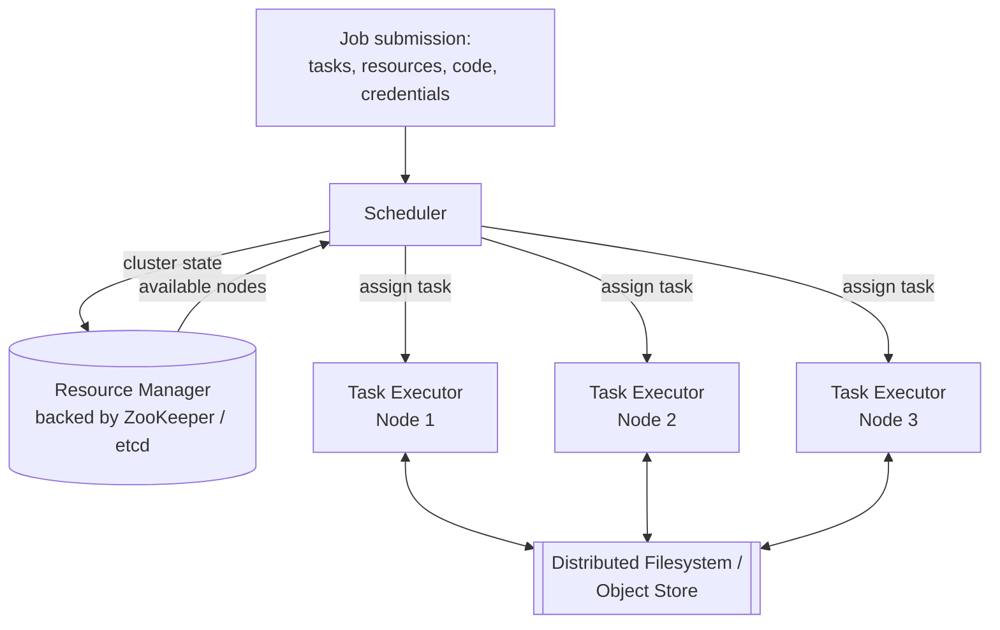

## Overview

Most of the systems this book of concepts has covered so far are *online*: a client sends a request, and the system races to answer it as fast as it can. Response time is the metric that matters, and availability under partial failure is the constant concern. **Batch processing** — sometimes called *offline* processing — is the other half of the picture: instead of answering one request at a time, a batch job reads a large, fixed body of input, runs a computation over all of it, and produces output, on a timescale of minutes to days rather than milliseconds. Training a model on a month of clickstream data, recomputing a recommendation index overnight, or turning a day's raw logs into an analytics table are all batch jobs.

The definition that makes batch processing behave so differently from online systems is deceptively simple: **input is read-only, and output is regenerated from scratch every run.** A batch job doesn't mutate data the way a read/write transaction does — it derives new output from existing input, the same "derived data" idea that underlies materialized views, search indexes, and caches. That one constraint is what makes a cluster of machines running batch jobs look, structurally, like an operating system: a distributed filesystem standing in for local disk, a resource manager and scheduler standing in for the kernel's process scheduler, and programs whose input and output are wired together — across machines instead of through a Unix pipe.

## Immutable Input, Regenerated Output, and "Time Travel"

Treating input as immutable and output as fully regenerated buys you a property Kleppmann calls **human fault tolerance**: if a bug ships and corrupts the output, the fix isn't a delicate data-repair script — it's rolling back to the previous code (or the previous output directory) and rerunning the job. Most object stores and open table formats support this directly as *time travel*: old output isn't destroyed, just superseded, so recovering from a bad deploy is as cheap as pointing readers at yesterday's version. A read/write OLTP database has no equivalent — if buggy code already wrote bad rows, rolling back the *code* does nothing to the *data* that's already there. This is also why batch pipelines make software teams more willing to ship changes quickly: minimizing irreversibility, not avoiding mistakes altogether, is what actually enables fast iteration.

The same property has a cost, though: because output is always regenerated wholesale, a change to even a single input byte forces the whole dataset to be reprocessed — there's no cheap way to patch just the affected rows the way an incremental system could. That trade-off (simplicity and recoverability versus reprocessing cost) is the central reason batch and stream processing are two different tools rather than one system covering both — stream processing exists precisely to keep working incrementally on data as it arrives, instead of finishing and starting over.

## The Distributed Operating System Analogy

A single-machine batch pipeline built from `awk`, `sort`, `uniq`, and a handful of Unix pipes relies on the operating system for three things: a filesystem, a scheduler that allocates CPU across processes, and pipes connecting one process's stdout to the next one's stdin. Distributed batch frameworks provide the exact same three things, just spread across a cluster:

- A **distributed filesystem (DFS)** or object store replaces local disk — HDFS, GlusterFS, and CephFS historically; increasingly S3-compatible object storage (S3, GCS, Azure Blob, or self-hosted MinIO/Tigris) today. DFS blocks are much larger than local filesystem blocks (HDFS defaults to 128 MB versus ext4's 4 KB) because petabyte-scale metadata gets expensive fast, and larger blocks amortize the cost of seeking to one.
- A **resource manager** replaces the kernel's process table — it tracks every node's available CPU, memory, disk, and GPUs, and gives the cluster a global view of what's free. YARN and Kubernetes both delegate this bookkeeping to a coordination service rather than holding it only in local memory — YARN uses ZooKeeper, Kubernetes uses etcd — because a resource manager that loses its state on restart would take the whole cluster's scheduling down with it.
- A **scheduler** replaces the kernel's CPU scheduler — given a request like "run 10 tasks on nodes with this Docker image and a specific GPU type," it decides which node runs which task, using the resource manager's current view of the cluster.
- **Task executors** — YARN's NodeManager, Kubernetes' kubelet — run on every node and are the ones that actually start a task, monitor it until it exits or crashes, and report status back. Most also lean on OS-level isolation (Linux cgroups) so one task can't starve or read data belonging to another sharing the same node.

A distributed filesystem also inherits the replication concerns from Chapter 6-style database replication: commodity hardware fails more than enterprise disks, so file blocks are replicated across machines (or protected with Reed–Solomon erasure coding for lower storage overhead than full copies). That replication is also what lets a scheduler place a task on *any* node holding a copy of its input — historically a real optimization for HDFS-backed frameworks, where running the task where the data already lives avoids shipping gigabytes over the network. Object stores mostly gave up on that optimization deliberately: they keep storage and compute separate, trading some network bandwidth for the ability to scale CPU and storage independently — a trade that's gotten easier to accept as datacenter networks have gotten faster.

## Resource Allocation Is Genuinely Hard

Deciding which job gets which slice of a shared cluster is NP-hard in general, so real schedulers use heuristics (FIFO, dominant resource fairness, priority queues, bin-packing) rather than provably optimal solutions. Even a toy example shows why: two jobs each want 100 of a cluster's 160 cores. Split them 80/80 and both jobs limp along under-resourced. Run one to completion before starting the other (**gang scheduling**) and the other job's cores sit idle in the meantime, risking starvation if a third job's request arrives before there's room. Preempt part of a running job to make room for another and you throw away the killed tasks' progress, which is exactly the mechanism behind **spot instances / preemptible VMs** — a scheduler intentionally kills your low-priority task the moment a higher-priority one needs the capacity, and batch jobs are disproportionately good candidates for that discount because they're rarely latency-sensitive and can simply be retried.

## Scheduling Workflows: DAGs of Dependent Jobs

Real pipelines are rarely a single job — one job's output routinely becomes several other jobs' input, mirroring the Unix pipe chain but at cluster scale and usually mediated by the DFS/object store rather than an in-memory buffer (decoupling producer and consumer so they don't need to run at the same time). This produces a **directed acyclic graph (DAG)** of jobs, and it's common for a data pipeline to have 50-100 jobs in it, sometimes owned by different teams. The per-job schedulers built into YARN or Spark don't manage these cross-job dependencies — that's the job of a separate **workflow scheduler**. Hadoop-era tools (Oozie, Azkaban) have largely given way to more general ones — Airflow, Dagster, Prefect — that work across whichever execution engines a pipeline actually uses, and wait for every upstream job to finish successfully before starting a job that depends on their output.

## Fault Handling: Why Retrying a Task Beats Retrying the Job

A batch job that runs for hours across thousands of parallel tasks will, statistically, hit at least one hardware fault or network blip before it finishes — and that's before counting *intentional* preemption of low-priority tasks for spot-instance economics. This is the actual reason frameworks like MapReduce mattered when they were new: the alternative to task-level fault tolerance is restarting the *entire* job from scratch every time any one task fails, which becomes untenable once a job spans enough machines that some failure during the run is close to guaranteed. A framework that isolates each task, retries just the failed one, and merges results once every task succeeds turns "we might have to restart a six-hour job because one disk hiccuped" into a non-event.

## Where This Shows Up Today

The book leans on MapReduce as its running example because of its historical role — Google published it in 2004, and it was implemented by Hadoop, CouchDB, and MongoDB, kicking off the "big data" era on commodity hardware. But MapReduce itself is now largely obsolete, including inside Google. Most batch processing today runs on **Spark** or **Flink** (in batch mode), or directly on data-warehouse query engines like BigQuery or Snowflake, which blur the line between "warehouse" and "batch framework" entirely. These newer engines keep the same resource-manager/scheduler/executor shape but add far more sophisticated caching, query planning, and higher-level APIs (DataFrames, SQL, dataflow APIs) on top.

The resource-manager layer has shifted too. **YARN**, once synonymous with Hadoop-ecosystem batch processing, is losing ground to **Kubernetes** as the default place to run Spark and Flink jobs — Spark has supported a Kubernetes cluster manager natively for years, and companies already running Kubernetes for their online services increasingly see standing up a separate YARN cluster just for batch as unnecessary operational overhead. Pinterest is a concrete, recent example at real scale: their Big Data Platform team built **Moka**, a Spark-on-Kubernetes replacement for their decade-old Hadoop/YARN-based platform (**Monarch**), migrating roughly 70% of batch Spark workloads by their own account, and adopting **Apache YuniKorn** as a queue-aware, YARN-like scheduler running on top of Kubernetes rather than YARN itself. The underlying storage layer has moved in a matching direction — from HDFS-style distributed filesystems toward S3-compatible object storage — for much the same reason: decoupling compute from storage lets each scale independently, which matters more once workloads live in the cloud instead of a fixed on-prem cluster.

## Trade-offs

- **Immutability and full regeneration are what make batch jobs safe to experiment with — and what make them expensive to run incrementally.** Rolling back a bad deploy is trivial; reprocessing a petabyte dataset because one input record changed is not. Stream processing exists specifically to avoid that reprocessing cost, at the price of giving up the simplicity of "just rerun everything."
- **Per-task fault tolerance is a deliberate design choice, not a free side effect of running on many machines.** A framework that only knows how to retry the whole job doesn't scale past the point where some task failure during a run becomes statistically inevitable — this is arguably MapReduce's most durable contribution, independent of whether MapReduce itself is still used.
- **Book vs. practice: MapReduce is the pedagogical example, not the production reality.** It's largely obsolete, including at Google where it originated; production batch workloads run on Spark, Flink, or warehouse query engines. Treat MapReduce the way this feature treats other historically foundational-but-superseded technologies — useful for building the mental model, not for describing what a new system should be built on today.
- **YARN vs. Kubernetes is a real, ongoing migration, not a settled choice.** Kubernetes brings container-native isolation, a single control plane shared with online services, and easier cloud elasticity; YARN still has an edge in some data-locality-sensitive, on-prem, HDFS-backed deployments where it's already deeply entrenched. Pinterest's Moka migration shows the direction of travel without erasing the fact that plenty of existing Hadoop-ecosystem infrastructure still runs on YARN today.
- **Gang scheduling and preemption trade cluster efficiency for different kinds of fairness, and neither is free.** Reserving resources until a full gang is available wastes idle capacity and risks deadlock; preempting running tasks to admit a new job discards the preempted work's progress. There's no scheduling policy that avoids both costs simultaneously — only ones that pick which cost a given workload can tolerate.

## Interview Questions

- Why does treating batch job output as "fully regenerated, never mutated" give you a rollback story that a read/write OLTP database fundamentally can't offer?
- What are the three components of a distributed batch framework that map onto a single machine's OS (filesystem, scheduler, kernel-managed processes), and what does each one actually do?
- Why is cluster resource allocation NP-hard, and what do real schedulers do instead of finding an optimal solution?
- What's the difference between a job-level scheduler (like Spark's or YARN's) and a workflow scheduler (like Airflow), and why do large pipelines need both?
- Why is retrying a single failed task, rather than restarting the whole job, the specific design feature that made frameworks like MapReduce useful once jobs spanned enough machines?
- MapReduce is described in this book as "largely obsolete." What replaced it in production, and what did those replacements keep versus change about the underlying execution model?
- What's driving the shift from YARN to Kubernetes as the resource manager for Spark and Flink batch jobs, and is it a strictly better choice in every deployment?

## References

- Martin Kleppmann, [*Designing Data-Intensive Applications*, 2nd Edition](https://www.oreilly.com/library/view/designing-data-intensive-applications/9781098119058/) (O'Reilly) — Chapter 11, "Batch Processing," section "Batch Processing in Distributed Systems"
- Jeffrey Dean and Sanjay Ghemawat, ["MapReduce: Simplified Data Processing on Large Clusters"](https://research.google/pubs/mapreduce-simplified-data-processing-on-large-clusters/) (OSDI 2004)
- [Apache Spark Documentation — Cluster Mode Overview](https://spark.apache.org/docs/latest/cluster-overview.html) (resource manager options, including YARN and Kubernetes)
- [Kubernetes Documentation — Jobs](https://kubernetes.io/docs/concepts/workloads/controllers/job/)
- Pinterest Engineering — ["Next Gen Data Processing at Massive Scale At Pinterest With Moka (Part 1 of 2)"](https://medium.com/pinterest-engineering/next-gen-data-processing-at-massive-scale-at-pinterest-with-moka-part-1-of-2-39a36d5e82c4)
