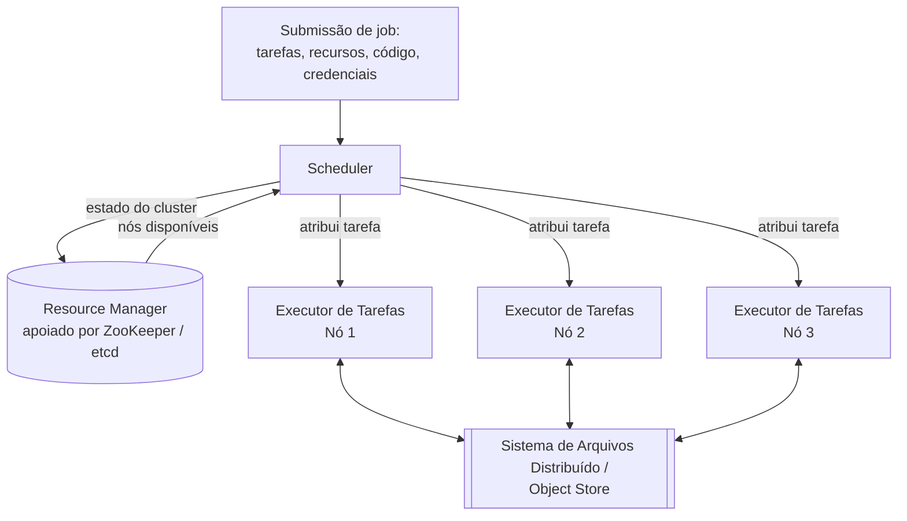

## Visão Geral

A maioria dos sistemas que este livro de conceitos cobriu até agora são *online*: um cliente envia uma requisição, e o sistema corre para respondê-la o mais rápido possível. Tempo de resposta é a métrica que importa, e disponibilidade sob falha parcial é a preocupação constante. **Processamento em lote (batch)** — às vezes chamado de processamento *offline* — é a outra metade do quadro: em vez de responder uma requisição por vez, um job batch lê um corpo grande e fixo de entrada, roda uma computação sobre tudo isso, e produz saída, em uma escala de tempo de minutos a dias em vez de milissegundos. Treinar um modelo com um mês de dados de clickstream, recomputar um índice de recomendações durante a noite, ou transformar os logs brutos de um dia em uma tabela de analytics são todos jobs batch.

A definição que faz o processamento em lote se comportar de forma tão diferente de sistemas online é enganosamente simples: **a entrada é somente leitura, e a saída é regenerada do zero a cada execução.** Um job batch não modifica dados da forma que uma transação de leitura/escrita faz — ele deriva nova saída a partir da entrada existente, a mesma ideia de "dados derivados" que fundamenta materialized views, índices de busca e caches. Essa única restrição é o que faz um cluster de máquinas rodando jobs batch parecer, estruturalmente, com um sistema operacional: um sistema de arquivos distribuído no lugar do disco local, um gerenciador de recursos e scheduler no lugar do scheduler de processos do kernel, e programas cujas entrada e saída estão conectadas — entre máquinas em vez de através de um pipe Unix.

## Entrada Imutável, Saída Regenerada, e "Viagem no Tempo"

Tratar a entrada como imutável e a saída como totalmente regenerada compra uma propriedade que Kleppmann chama de **tolerância a falhas humanas**: se um bug é lançado e corrompe a saída, a correção não é um script delicado de reparo de dados — é reverter para o código anterior (ou o diretório de saída anterior) e reexecutar o job. A maioria dos object stores e formatos de tabela abertos suportam isso diretamente como *time travel*: a saída antiga não é destruída, apenas superada, então recuperar-se de um deploy ruim é tão barato quanto apontar leitores para a versão de ontem. Um banco de dados OLTP de leitura/escrita não tem equivalente — se código com bug já escreveu linhas ruins, reverter o *código* não faz nada aos *dados* que já estão lá. É também por isso que pipelines batch tornam equipes de software mais dispostas a lançar mudanças rapidamente: minimizar irreversibilidade, não evitar erros completamente, é o que realmente permite iteração rápida.

A mesma propriedade tem um custo, no entanto: como a saída é sempre regenerada por completo, uma mudança em até mesmo um único byte de entrada força o dataset inteiro a ser reprocessado — não há forma barata de corrigir apenas as linhas afetadas como um sistema incremental poderia. Esse trade-off (simplicidade e recuperabilidade versus custo de reprocessamento) é a principal razão pela qual batch e stream processing são duas ferramentas diferentes em vez de um sistema cobrindo ambos — stream processing existe precisamente para continuar trabalhando incrementalmente nos dados conforme chegam, em vez de terminar e recomeçar.

## A Analogia do Sistema Operacional Distribuído

Um pipeline batch de máquina única construído com `awk`, `sort`, `uniq`, e um punhado de pipes Unix depende do sistema operacional para três coisas: um sistema de arquivos, um scheduler que aloca CPU entre processos, e pipes conectando o stdout de um processo ao stdin do próximo. Frameworks de batch distribuído fornecem exatamente as mesmas três coisas, apenas espalhadas por um cluster:

- Um **sistema de arquivos distribuído (DFS)** ou object store substitui o disco local — HDFS, GlusterFS, e CephFS historicamente; cada vez mais armazenamento de objetos compatível com S3 (S3, GCS, Azure Blob, ou MinIO/Tigris auto-hospedado) hoje. Blocos DFS são muito maiores que blocos de sistema de arquivos local (HDFS por padrão usa 128 MB versus 4 KB do ext4) porque metadados em escala de petabytes ficam caros rapidamente, e blocos maiores amortizam o custo de fazer seek até um deles.
- Um **gerenciador de recursos** substitui a tabela de processos do kernel — rastreia o CPU, memória, disco e GPUs disponíveis de cada nó, e dá ao cluster uma visão global do que está livre. YARN e Kubernetes ambos delegam essa contabilidade a um serviço de coordenação em vez de mantê-la apenas em memória local — YARN usa ZooKeeper, Kubernetes usa etcd — porque um gerenciador de recursos que perde seu estado ao reiniciar derrubaria todo o scheduling do cluster junto.
- Um **scheduler** substitui o scheduler de CPU do kernel — dado um pedido como "rode 10 tarefas em nós com esta imagem Docker e um tipo específico de GPU", ele decide qual nó roda qual tarefa, usando a visão atual do gerenciador de recursos sobre o cluster.
- **Executores de tarefas** — o NodeManager do YARN, o kubelet do Kubernetes — rodam em cada nó e são os que realmente iniciam uma tarefa, a monitoram até sair ou travar, e reportam o status de volta. A maioria também se apoia em isolamento em nível de SO (cgroups do Linux) para que uma tarefa não possa esfomear ou ler dados pertencentes a outra compartilhando o mesmo nó.

Um sistema de arquivos distribuído também herda as preocupações de replicação do estilo de replicação de banco de dados: hardware commodity falha mais que discos enterprise, então blocos de arquivo são replicados entre máquinas (ou protegidos com Reed–Solomon erasure coding para menor overhead de armazenamento que cópias completas). Essa replicação também é o que permite que um scheduler coloque uma tarefa em *qualquer* nó que tenha uma cópia de sua entrada — historicamente uma otimização real para frameworks apoiados em HDFS, onde rodar a tarefa onde os dados já vivem evita enviar gigabytes pela rede. Object stores em sua maioria desistiram dessa otimização deliberadamente: mantêm armazenamento e computação separados, trocando alguma largura de banda de rede pela capacidade de escalar CPU e armazenamento independentemente — uma troca que tem ficado mais fácil de aceitar conforme as redes de datacenter ficaram mais rápidas.

## Alocação de Recursos É Genuinamente Difícil

Decidir qual job recebe qual fatia de um cluster compartilhado é NP-difícil em geral, então schedulers reais usam heurísticas (FIFO, dominant resource fairness, filas de prioridade, bin-packing) em vez de soluções provadamente ótimas. Até um exemplo de brinquedo mostra por quê: dois jobs, cada um querendo 100 dos 160 cores do cluster. Divida-os 80/80 e ambos os jobs mancam com recursos insuficientes. Rode um até a conclusão antes de iniciar o outro (**gang scheduling**) e os cores do outro job ficam ociosos nesse meio tempo, arriscando starvation se a requisição de um terceiro job chegar antes de haver espaço. Preempte parte de um job em execução para dar espaço a outro e você joga fora o progresso das tarefas mortas, que é exatamente o mecanismo por trás de **spot instances / VMs preemptíveis** — um scheduler intencionalmente mata sua tarefa de baixa prioridade no momento em que uma de prioridade mais alta precisa da capacidade, e jobs batch são desproporcionalmente bons candidatos para esse desconto porque raramente são sensíveis a latência e podem simplesmente ser reexecutados.

## Agendando Workflows: DAGs de Jobs Dependentes

Pipelines reais raramente são um único job — a saída de um job rotineiramente se torna a entrada de vários outros jobs, espelhando a cadeia de pipes Unix mas em escala de cluster e normalmente mediada pelo DFS/object store em vez de um buffer em memória (desacoplando produtor e consumidor para que não precisem rodar ao mesmo tempo). Isso produz um **grafo acíclico dirigido (DAG)** de jobs, e é comum um pipeline de dados ter 50-100 jobs nele, às vezes possuídos por equipes diferentes. Os schedulers por job embutidos no YARN ou Spark não gerenciam essas dependências entre jobs — esse é o trabalho de um **workflow scheduler** separado. Ferramentas da era Hadoop (Oozie, Azkaban) em grande parte deram lugar a outras mais gerais — Airflow, Dagster, Prefect — que funcionam através de quaisquer motores de execução que um pipeline realmente use, e esperam que todo job upstream termine com sucesso antes de iniciar um job que dependa de sua saída.

## Tratamento de Falhas: Por Que Retentar uma Tarefa Vence Retentar o Job

Um job batch que roda por horas através de milhares de tarefas paralelas vai, estatisticamente, encontrar pelo menos uma falha de hardware ou soluço de rede antes de terminar — e isso antes de contar preempção *intencional* de tarefas de baixa prioridade por economia de spot instances. Essa é a razão real por que frameworks como MapReduce importaram quando eram novos: a alternativa à tolerância a falhas em nível de tarefa é reiniciar o job *inteiro* do zero toda vez que qualquer tarefa falha, o que se torna insustentável assim que um job se estende por máquinas suficientes para que alguma falha durante a execução seja quase garantida. Um framework que isola cada tarefa, retenta apenas a que falhou, e mescla resultados assim que toda tarefa tem sucesso transforma "podemos ter que reiniciar um job de seis horas porque um disco soluçou" em um não-evento.

## Onde Isso Aparece Hoje

O livro se apoia no MapReduce como seu exemplo corrente por causa de seu papel histórico — o Google o publicou em 2004, e foi implementado por Hadoop, CouchDB, e MongoDB, iniciando a era do "big data" em hardware commodity. Mas o MapReduce em si agora é largamente obsoleto, incluindo dentro do próprio Google. A maior parte do processamento batch hoje roda em **Spark** ou **Flink** (em modo batch), ou diretamente em motores de consulta de data warehouse como BigQuery ou Snowflake, que borram completamente a linha entre "warehouse" e "framework batch". Esses motores mais novos mantêm o mesmo formato resource-manager/scheduler/executor mas adicionam caching muito mais sofisticado, planejamento de query, e APIs de nível mais alto (DataFrames, SQL, APIs de dataflow) por cima.

A camada de gerenciador de recursos também mudou. O **YARN**, uma vez sinônimo de processamento batch do ecossistema Hadoop, está perdendo terreno para o **Kubernetes** como o lugar padrão para rodar jobs Spark e Flink — Spark suporta nativamente um gerenciador de cluster Kubernetes há anos, e empresas já rodando Kubernetes para seus serviços online cada vez mais veem levantar um cluster YARN separado só para batch como overhead operacional desnecessário. Pinterest é um exemplo concreto e recente em escala real: sua equipe de Big Data Platform construiu o **Moka**, uma substituição Spark-on-Kubernetes para sua plataforma de uma década baseada em Hadoop/YARN (**Monarch**), migrando aproximadamente 70% das cargas de trabalho batch em Spark segundo seu próprio relato, e adotando o **Apache YuniKorn** como um scheduler consciente de filas, estilo YARN, rodando sobre Kubernetes em vez do próprio YARN. A camada de armazenamento subjacente se moveu em uma direção correspondente — de sistemas de arquivos distribuídos estilo HDFS em direção a armazenamento de objetos compatível com S3 — pela mesma razão: desacoplar computação de armazenamento permite que cada um escale independentemente, o que importa mais assim que as cargas de trabalho vivem na nuvem em vez de um cluster on-prem fixo.

## Trade-offs

- **Imutabilidade e regeneração completa são o que torna jobs batch seguros para experimentar — e o que os torna caros de rodar incrementalmente.** Reverter um deploy ruim é trivial; reprocessar um dataset de um petabyte porque um registro de entrada mudou não é. Stream processing existe especificamente para evitar esse custo de reprocessamento, ao preço de abrir mão da simplicidade de "apenas reexecute tudo".
- **Tolerância a falhas por tarefa é uma escolha de design deliberada, não um efeito colateral gratuito de rodar em muitas máquinas.** Um framework que só sabe retentar o job inteiro não escala além do ponto onde alguma falha de tarefa durante uma execução se torna estatisticamente inevitável — isso é possivelmente a contribuição mais duradoura do MapReduce, independentemente de o MapReduce em si ainda ser usado.
- **Livro vs. prática: MapReduce é o exemplo pedagógico, não a realidade de produção.** É largamente obsoleto, inclusive no Google onde se originou; cargas de trabalho batch de produção rodam em Spark, Flink, ou motores de query de warehouse. Trate o MapReduce da forma que este recurso trata outras tecnologias historicamente fundamentais mas superadas — útil para construir o modelo mental, não para descrever sobre o que um novo sistema deveria ser construído hoje.
- **YARN vs. Kubernetes é uma migração real e em andamento, não uma escolha resolvida.** Kubernetes traz isolamento nativo de containers, um único plano de controle compartilhado com serviços online, e elasticidade de nuvem mais fácil; YARN ainda tem vantagem em alguns deployments on-prem, apoiados em HDFS, sensíveis a data-locality onde já está profundamente entrincheirado. A migração Moka da Pinterest mostra a direção da mudança sem apagar o fato de que muita infraestrutura existente do ecossistema Hadoop ainda roda em YARN hoje.
- **Gang scheduling e preempção trocam eficiência de cluster por diferentes tipos de justiça, e nenhum é grátis.** Reservar recursos até que um "gang" completo esteja disponível desperdiça capacidade ociosa e arrisca deadlock; preemptar tarefas em execução para admitir um novo job descarta o progresso do trabalho preemptado. Não há política de scheduling que evite ambos os custos simultaneamente — apenas as que escolhem qual custo uma dada carga de trabalho pode tolerar.

## Perguntas de Entrevista

- Por que tratar a saída de um job batch como "totalmente regenerada, nunca modificada" dá uma história de rollback que um banco de dados OLTP de leitura/escrita fundamentalmente não pode oferecer?
- Quais são os três componentes de um framework batch distribuído que se mapeiam para o SO de uma única máquina (sistema de arquivos, scheduler, processos gerenciados pelo kernel), e o que cada um realmente faz?
- Por que a alocação de recursos de cluster é NP-difícil, e o que schedulers reais fazem em vez de encontrar uma solução ótima?
- Qual é a diferença entre um scheduler em nível de job (como o do Spark ou YARN) e um workflow scheduler (como o Airflow), e por que grandes pipelines precisam de ambos?
- Por que retentar uma única tarefa que falhou, em vez de reiniciar o job inteiro, é a característica de design específica que tornou frameworks como MapReduce úteis assim que jobs se estendiam por máquinas suficientes?
- MapReduce é descrito neste livro como "largamente obsoleto". O que o substituiu em produção, e o que essas substituições mantiveram versus mudaram sobre o modelo de execução subjacente?
- O que está impulsionando a mudança do YARN para o Kubernetes como o gerenciador de recursos para jobs batch Spark e Flink, e é uma escolha estritamente melhor em todo deployment?

## Referências

- Martin Kleppmann, [*Designing Data-Intensive Applications*, 2nd Edition](https://www.oreilly.com/library/view/designing-data-intensive-applications/9781098119058/) (O'Reilly) — Capítulo 11, "Batch Processing", seção "Batch Processing in Distributed Systems"
- Jeffrey Dean e Sanjay Ghemawat, ["MapReduce: Simplified Data Processing on Large Clusters"](https://research.google/pubs/mapreduce-simplified-data-processing-on-large-clusters/) (OSDI 2004)
- [Apache Spark Documentation — Cluster Mode Overview](https://spark.apache.org/docs/latest/cluster-overview.html) (opções de gerenciador de recursos, incluindo YARN e Kubernetes)
- [Kubernetes Documentation — Jobs](https://kubernetes.io/docs/concepts/workloads/controllers/job/)
- Pinterest Engineering — ["Next Gen Data Processing at Massive Scale At Pinterest With Moka (Part 1 of 2)"](https://medium.com/pinterest-engineering/next-gen-data-processing-at-massive-scale-at-pinterest-with-moka-part-1-of-2-39a36d5e82c4)
