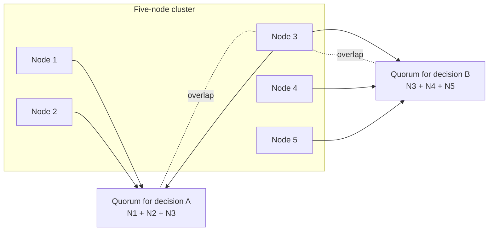

## Overview

In a distributed system, truth is not what one machine believes; it is what enough machines can agree on under an explicit fault model. A node can be alive from its own point of view while the rest of the cluster cannot hear it, or it can be acting on stale state after a pause, so production protocols lean on quorums: a majority vote can define the cluster's decision even when one participant insists the decision is wrong. That framing is the bridge from [the trouble with distributed systems](distributed-systems-partial-failures) to [consensus and coordination services](consensus-and-coordination-services): quorums, terms, epochs, and fencing tokens exist because a single local observation is not a reliable source of truth.

This concept narrows the focus to what happens when participants might do worse than crash. Most datacenter algorithms assume nodes are unreliable but honest: they may be slow, unreachable, restarted, or out of date, but they do not deliberately forge protocol messages. Byzantine systems remove that assumption, and system models make the assumption explicit so we can prove which properties always hold, which properties only eventually hold, and how testing can catch the implementation bugs that proofs and models miss.

## Majority Truth and Byzantine Faults

### Truth is defined by a quorum

A quorum is a deliberately social definition of truth: instead of asking "what does this node think?", the protocol asks "what can enough nodes agree to remember?" The usual quorum is a strict majority, because two majorities in the same finite set must overlap. That overlap is what prevents two conflicting decisions from both being considered valid in a non-Byzantine consensus protocol.

For example, a five-node cluster can usually tolerate two crash-recovery failures because any majority has three nodes. If one majority elects leader A for term 7 and another majority tries to elect leader B for the same term, the two majorities must share at least one voter. In a non-Byzantine model, that voter will not cast contradictory votes, so both elections cannot succeed.

That is also why fencing is needed around leases and locks. If a node was once the rightful owner of a lease, later pauses, and then resumes, it may still believe it is entitled to write. The system cannot rely on that old owner's self-assessment; downstream services must reject stale owners using monotonically increasing fencing tokens, as covered in [the trouble with distributed systems](distributed-systems-partial-failures). The quorum defines who won the next lease; the token makes that decision enforceable outside the lock service.

### The Byzantine Generals Problem

The Byzantine Generals Problem asks how a group of generals, separated by unreliable messengers, can agree on one battle plan when some generals may be traitors. Loyal generals follow the protocol and send truthful messages. Traitors may send arbitrary messages, omit messages, forge inconsistent stories to different recipients, or try to make loyal participants disagree. In distributed systems terms, a **Byzantine fault** is arbitrary behavior by a node or communication path, including malicious, corrupted, inconsistent, or protocol-violating messages.

That is stricter than a crash. A crashed node is silent; a Byzantine node can be actively misleading. It might vote for two leaders in the same term, claim to have stored data it discarded, return different account balances to different replicas, or attach a fake fencing token to a write. Once nodes can lie, quorum intersection is no longer enough by itself: the overlapping node might be the liar.

Byzantine fault-tolerant protocols therefore require larger quorums. The common threshold is **3f + 1 replicas to tolerate f Byzantine faults**. If one node in four is Byzantine, the remaining three can still form enough agreement to outvote arbitrary lies; if two of four are Byzantine, the honest nodes can be split and confused. The intuition is that the protocol needs enough honest overlap to distinguish a real decision from a fabricated one even when the faulty nodes coordinate against it.

### Where BFT matters, and where it usually does not

Byzantine fault tolerance is essential in environments where arbitrary behavior is a realistic failure mode and the cost of failure is high. Aerospace and safety-critical embedded systems must survive bit flips, radiation-induced corruption, and hardware faults that can make a component behave unpredictably. Permissionless blockchains need agreement among mutually distrustful parties with no central operator; proof-of-work, PBFT-style protocols, Tendermint-style voting, and related designs are all ways to make a ledger decision credible when participants may cheat.

Most server-side datacenter systems choose a cheaper assumption: nodes are controlled by one organization and are **non-Byzantine**. They may crash, restart, lose connectivity, or run slowly, but if they send a protocol message, peers assume it is honestly generated by the configured software. Full BFT is expensive in replica count, message complexity, latency, and operational complexity, and it does not solve correlated bugs when every replica runs the same flawed binary.

That does not mean ordinary systems trust everything blindly. They add cheap defenses against weak forms of lying: checksums at the storage or application-protocol layer, TLS or message authentication to catch corruption and tampering, strict input validation at trust boundaries, size limits, schema validation, and careful parser behavior. TCP and UDP checksums are useful but weak enough that serious systems often add their own end-to-end checks. These measures are not Byzantine fault tolerance; they are pragmatic guardrails for accidental corruption, bugs, and hostile clients.

## System Models and Correctness

### Node behavior models

A **system model** is a compact statement of what failures an algorithm is designed to handle. Without it, correctness claims are meaningless: "this consensus algorithm works" must be followed by "assuming which clocks, which network, and which node failures?"

| Model | Node behavior | Typical use |
| --- | --- | --- |
| Crash-stop | A node may halt forever and never return. | Simple theory and clean failure reasoning. |
| Crash-recovery | A node may crash, lose memory state, later restart, and keep durable state. | Most practical databases and coordination services. |
| Byzantine | A node may do anything: lie, equivocate, corrupt messages, or collude. | BFT systems, hostile federations, safety-critical designs. |

Crash-stop is clean but optimistic: real processes restart. Crash-recovery is usually the practical baseline: a server can disappear and later rejoin using durable logs, snapshots, or metadata. Byzantine is the strongest and most expensive model, reserved for cases where arbitrary or adversarial behavior is part of the problem rather than an exceptional operator incident.

### Timing models

Timing assumptions are just as important as failure assumptions.

| Model | Assumption | Reality check |
| --- | --- | --- |
| Synchronous | Message delay, process pauses, and clock error have known upper bounds. | Too strong for most distributed software. |
| Partially synchronous | Bounds usually hold, but can be exceeded for finite periods. | Realistic target for many consensus algorithms. |
| Asynchronous | No timing assumptions and no useful clocks or timeouts. | Powerful for theory, restrictive for practical liveness. |

The most useful production target is usually **partially synchronous + crash-recovery**. It admits that networks and processes are normally well behaved enough for progress, while still allowing partitions, pauses, slow nodes, and restarts. Consensus protocols can then keep safety through bad periods and recover liveness when the system eventually behaves well enough again.

### Safety versus liveness

Correctness properties split into two families. A **safety** property says nothing bad ever happens. If safety is violated, there is a specific irreversible moment: two leaders were elected for the same term, two clients received the same fencing token, or a committed write was acknowledged and then lost. Distributed algorithms normally aim to preserve safety in every execution allowed by the system model, even during total network failure.

A **liveness** property says something good eventually happens. A client eventually receives a fencing token, a committed value eventually becomes readable, or leader election eventually succeeds. Liveness usually needs caveats: enough nodes must remain alive, durable state must not be lost, and the network must eventually recover. This distinction explains why a conservative consensus system may stop accepting writes during a partition. Returning the wrong answer would break safety; waiting sacrifices liveness until the assumptions needed for progress return.

## Formal Methods and Randomized Testing

### Specifications, proofs, and model checking

Distributed algorithms have too many interleavings for intuition to be enough. A proof or specification reduces the algorithm to state transitions and invariants: what messages can be sent, what state each node records, and what must never become true. Formal verification can prove properties under a stated model, while model checking explores a finite approximation of the state space to find counterexamples.

TLA+ is the best-known specification language in this space. Leslie Lamport describes it as a high-level language for modeling programs and systems, especially concurrent and distributed ones, using simple mathematics. In practice, engineers write the core protocol in TLA+, state invariants such as "at most one leader per term" or "committed log entries are never overwritten," and use the TLC model checker to search many possible executions. The model is not the production code, so it can drift, but it is excellent at finding design bugs before implementation details obscure them.

### Jepsen and real-system fault injection

Formal models answer whether an abstract algorithm can satisfy its properties. Jepsen asks whether a real deployed system actually does. Kyle Kingsbury's Jepsen tests run databases and coordination systems under generated workloads while injecting partitions, process failures, clock disruption, and nemesis behaviors, then analyze operation histories for consistency violations. Jepsen is especially valuable because many bugs sit in the gap between the paper protocol and the running product: retries, client libraries, failover scripts, transaction APIs, and operational defaults.

Jepsen does not prove correctness. It samples executions, often adversarially, and produces concrete counterexamples when the system violates a claimed guarantee. That makes it a complement to TLA+, not a replacement. A strong distributed system often has both: a small model that checks the protocol's invariants and a destructive integration test that checks the implementation's behavior under realistic faults.

### Deterministic simulation testing

Deterministic simulation testing moves fault injection inside the runtime. Instead of waiting for rare production schedules, the test harness controls clocks, network delivery, disk behavior, task scheduling, random seeds, and process failures. A failing run can then be replayed exactly, making distributed bugs debuggable rather than anecdotal.

FoundationDB is the canonical example: much of the database was built to run inside a deterministic simulator that can create partitions, disk failures, machine reboots, and unlucky timings across many randomized seeds. TigerBeetle applies similar ideas to financial storage: simulation testing, strict assertions, and reproducible schedules are treated as core engineering infrastructure. Antithesis commercializes this style by repeatedly exploring deterministic executions of real software. The common lesson is simple: for distributed systems, testing the happy path is almost irrelevant; the product is the behavior under strange schedules.

## Trade-offs

- **Majority truth makes single-node confusion survivable, but it makes minority partitions powerless** — a node that believes it is alive or still owns a lease must defer to the quorum, which preserves safety but can reject work from nodes that are locally healthy and merely isolated.
- **Byzantine fault tolerance handles arbitrary lies at a steep price** — 3f + 1 replica thresholds, extra message rounds, cryptographic checks, and operational complexity are justified for hostile or safety-critical environments, but they are usually overkill inside one trusted datacenter.
- **Non-Byzantine models are cheaper because they are assumptions, not facts** — crash-recovery protocols work well when nodes are honest, durable storage mostly survives, and operators control the fleet; corruption, parser bugs, compromised hosts, and misconfiguration still need separate defenses.
- **Safety can be unconditional while liveness is conditional** — a consensus service should never return two conflicting decisions, even during a partition, but it may only promise progress once a majority is reachable and the system returns to a partially synchronous period.
- **Formal methods find design errors, randomized testing finds implementation surprises** — TLA+ can expose a broken invariant in the protocol, while Jepsen and deterministic simulation catch the messy behaviors introduced by real clients, disks, schedulers, retries, and deployment choices.

## Interview Questions

- Why does a quorum-based system treat a node as dead when the majority says it is dead, even if that node later resumes and believes it is still the leader?
- What is the difference between a crash fault and a Byzantine fault, and why does Byzantine fault tolerance commonly require 3f + 1 replicas?
- Why do most datacenter databases assume a non-Byzantine model, and what cheap defenses do they still use against corruption or malicious client input?
- Compare crash-stop, crash-recovery, synchronous, partially synchronous, and asynchronous models. Which combination is the usual practical target for consensus algorithms, and why?
- Give one safety property and one liveness property for a lock service that issues fencing tokens, then explain which one should hold during a network partition.

## References

- [Martin Kleppmann, "Designing Data-Intensive Applications", 2nd Edition (O'Reilly) — Chapter 9, "The Trouble with Distributed Systems", sections "Knowledge, Truth, and Lies", "System Model and Reality", and "Formal Methods and Randomized Testing"](https://www.oreilly.com/library/view/designing-data-intensive-applications/9781098119058/)
- [Leslie Lamport, Robert Shostak, and Marshall Pease — "The Byzantine Generals Problem" (ACM TOPLAS 1982)](https://dl.acm.org/doi/10.1145/357172.357176)
- [Miguel Castro and Barbara Liskov — "Practical Byzantine Fault Tolerance" (OSDI 1999)](https://pmg.csail.mit.edu/papers/osdi99.pdf)
- [Leslie Lamport — "My TLA+ Home Page"](https://lamport.azurewebsites.net/tla/tla.html)
- [Jepsen — Distributed Systems Safety Research](https://jepsen.io/)
- [FoundationDB — "Simulation and Testing"](https://apple.github.io/foundationdb/testing.html)
- [TigerBeetle — "Simulation Testing for Liveness"](https://tigerbeetle.com/blog/2023-07-06-simulation-testing-for-liveness/)
