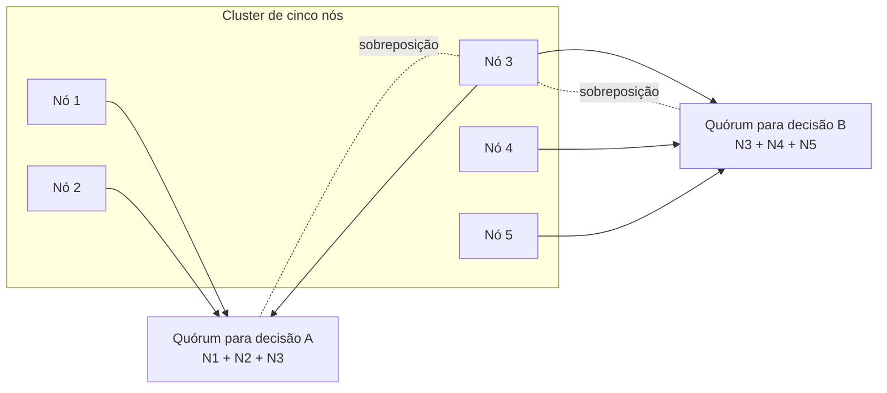

## Visão Geral

Em um sistema distribuído, a verdade não é o que uma máquina acredita; é o que máquinas suficientes conseguem concordar sob um modelo de falha explícito. Um nó pode estar vivo do seu próprio ponto de vista enquanto o resto do cluster não consegue ouvi-lo, ou pode estar agindo sobre estado obsoleto depois de uma pausa, então protocolos de produção se apoiam em quóruns: um voto majoritário pode definir a decisão do cluster mesmo quando um participante insiste que a decisão está errada. Esse enquadramento é a ponte de [a confusão dos sistemas distribuídos](distributed-systems-partial-failures) para [serviços de consenso e coordenação](consensus-and-coordination-services): quóruns, termos, épocas e fencing tokens existem porque uma única observação local não é uma fonte confiável de verdade.

Este conceito estreita o foco para o que acontece quando participantes podem fazer pior que travar. A maioria dos algoritmos de datacenter assume que os nós são não confiáveis mas honestos: podem ser lentos, inalcançáveis, reiniciados, ou desatualizados, mas não forjam deliberadamente mensagens do protocolo. Sistemas bizantinos removem essa suposição, e modelos de sistema tornam a suposição explícita para que possamos provar quais propriedades sempre valem, quais propriedades apenas eventualmente valem, e como testes podem capturar os bugs de implementação que provas e modelos deixam passar.

## Verdade por Maioria e Falhas Bizantinas

### Verdade é definida por um quórum

Um quórum é uma definição deliberadamente social de verdade: em vez de perguntar "o que este nó pensa?", o protocolo pergunta "o que nós suficientes conseguem concordar em lembrar?" O quórum usual é uma maioria estrita, porque duas maiorias no mesmo conjunto finito precisam se sobrepor. Essa sobreposição é o que impede que duas decisões conflitantes sejam ambas consideradas válidas em um protocolo de consenso não bizantino.

Por exemplo, um cluster de cinco nós geralmente pode tolerar duas falhas de crash-recovery porque qualquer maioria tem três nós. Se uma maioria elege o líder A para o termo 7 e outra maioria tenta eleger o líder B para o mesmo termo, as duas maiorias precisam compartilhar pelo menos um votante. Em um modelo não bizantino, esse votante não vai lançar votos contraditórios, então ambas as eleições não podem ter sucesso.

É por isso também que o fencing é necessário em torno de leases e locks. Se um nó já foi o dono legítimo de uma lease, depois pausa, e então retoma, ele pode ainda acreditar que tem direito a escrever. O sistema não pode confiar na autoavaliação desse dono antigo; serviços downstream precisam rejeitar donos obsoletos usando fencing tokens monotonicamente crescentes, como coberto em [a confusão dos sistemas distribuídos](distributed-systems-partial-failures). O quórum define quem ganhou a próxima lease; o token torna essa decisão aplicável fora do serviço de lock.

### O Problema dos Generais Bizantinos

O Problema dos Generais Bizantinos pergunta como um grupo de generais, separados por mensageiros não confiáveis, pode concordar em um único plano de batalha quando alguns generais podem ser traidores. Generais leais seguem o protocolo e enviam mensagens verdadeiras. Traidores podem enviar mensagens arbitrárias, omitir mensagens, forjar histórias inconsistentes para destinatários diferentes, ou tentar fazer participantes leais discordarem. Em termos de sistemas distribuídos, uma **falha bizantina** é um comportamento arbitrário por um nó ou caminho de comunicação, incluindo mensagens maliciosas, corrompidas, inconsistentes, ou que violam o protocolo.

Isso é mais rígido que um crash. Um nó travado é silencioso; um nó bizantino pode estar ativamente enganando. Ele pode votar em dois líderes no mesmo termo, alegar ter armazenado dados que descartou, retornar saldos de conta diferentes para réplicas diferentes, ou anexar um fencing token falso a uma escrita. Uma vez que nós podem mentir, a interseção de quóruns não é mais suficiente sozinha: o nó de sobreposição pode ser o mentiroso.

Protocolos tolerantes a falhas bizantinas, portanto, requerem quóruns maiores. O limite comum é **3f + 1 réplicas para tolerar f falhas bizantinas**. Se um nó em quatro é bizantino, os três restantes ainda conseguem formar acordo suficiente para vencer mentiras arbitrárias no voto; se dois de quatro são bizantinos, os nós honestos podem ser divididos e confundidos. A intuição é que o protocolo precisa de sobreposição honesta suficiente para distinguir uma decisão real de uma fabricada mesmo quando os nós faltosos coordenam contra ela.

### Onde BFT importa, e onde geralmente não importa

Tolerância a falhas bizantinas é essencial em ambientes onde comportamento arbitrário é um modo de falha realista e o custo da falha é alto. Sistemas aeroespaciais e embarcados críticos para segurança precisam sobreviver a bit flips, corrupção induzida por radiação, e falhas de hardware que podem fazer um componente se comportar de forma imprevisível. Blockchains sem permissão precisam de acordo entre partes mutuamente desconfiadas sem um operador central; proof-of-work, protocolos estilo PBFT, votação estilo Tendermint, e designs relacionados são todas formas de tornar a decisão de um ledger confiável quando participantes podem trapacear.

A maioria dos sistemas de datacenter no lado do servidor escolhe uma suposição mais barata: nós são controlados por uma organização e são **não bizantinos**. Podem travar, reiniciar, perder conectividade, ou rodar devagar, mas se enviarem uma mensagem de protocolo, peers assumem que ela foi honestamente gerada pelo software configurado. BFT completo é caro em contagem de réplicas, complexidade de mensagens, latência, e complexidade operacional, e não resolve bugs correlacionados quando toda réplica roda o mesmo binário defeituoso.

Isso não significa que sistemas comuns confiam em tudo cegamente. Eles adicionam defesas baratas contra formas fracas de mentira: checksums na camada de armazenamento ou protocolo de aplicação, TLS ou autenticação de mensagem para capturar corrupção e adulteração, validação estrita de entrada em fronteiras de confiança, limites de tamanho, validação de schema, e comportamento cuidadoso de parser. Checksums de TCP e UDP são úteis mas fracos o suficiente para que sistemas sérios frequentemente adicionem suas próprias checagens ponta a ponta. Essas medidas não são tolerância a falhas bizantinas; são guardas pragmáticas contra corrupção acidental, bugs, e clientes hostis.

## Modelos de Sistema e Correção

### Modelos de comportamento de nó

Um **modelo de sistema** é uma declaração compacta de quais falhas um algoritmo é projetado para lidar. Sem ele, alegações de correção não têm sentido: "este algoritmo de consenso funciona" precisa ser seguido de "assumindo quais relógios, qual rede, e quais falhas de nó?"

| Modelo | Comportamento do nó | Uso típico |
| --- | --- | --- |
| Crash-stop | Um nó pode parar para sempre e nunca retornar. | Teoria simples e raciocínio limpo sobre falhas. |
| Crash-recovery | Um nó pode travar, perder estado em memória, reiniciar depois, e manter estado durável. | A maioria dos bancos de dados práticos e serviços de coordenação. |
| Byzantine | Um nó pode fazer qualquer coisa: mentir, equivocar, corromper mensagens, ou conluir. | Sistemas BFT, federações hostis, designs críticos para segurança. |

Crash-stop é limpo mas otimista: processos reais reiniciam. Crash-recovery é geralmente a linha de base prática: um servidor pode desaparecer e depois se reintegrar usando logs duráveis, snapshots, ou metadados. Byzantine é o modelo mais forte e mais caro, reservado para casos onde comportamento arbitrário ou adversarial é parte do problema em vez de um incidente operacional excepcional.

### Modelos de tempo

Suposições de tempo são tão importantes quanto suposições de falha.

| Modelo | Suposição | Checagem de realidade |
| --- | --- | --- |
| Síncrono | Atraso de mensagem, pausas de processo, e erro de relógio têm limites superiores conhecidos. | Forte demais para a maioria dos softwares distribuídos. |
| Parcialmente síncrono | Limites geralmente valem, mas podem ser excedidos por períodos finitos. | Alvo realista para muitos algoritmos de consenso. |
| Assíncrono | Nenhuma suposição de tempo e nenhum relógio ou timeout útil. | Poderoso para teoria, restritivo para liveness prática. |

O alvo de produção mais útil é geralmente **parcialmente síncrono + crash-recovery**. Admite que redes e processos normalmente se comportam bem o suficiente para progresso, enquanto ainda permite partições, pausas, nós lentos, e reinícios. Protocolos de consenso então conseguem manter safety durante períodos ruins e recuperar liveness quando o sistema eventualmente se comporta bem o suficiente de novo.

### Safety versus liveness

Propriedades de correção se dividem em duas famílias. Uma propriedade de **safety** diz que nada de ruim jamais acontece. Se safety é violada, há um momento específico e irreversível: dois líderes foram eleitos para o mesmo termo, dois clients receberam o mesmo fencing token, ou uma escrita commitada foi confirmada e depois perdida. Algoritmos distribuídos normalmente visam preservar safety em toda execução permitida pelo modelo de sistema, mesmo durante falha total de rede.

Uma propriedade de **liveness** diz que algo bom eventualmente acontece. Um client eventualmente recebe um fencing token, um valor commitado eventualmente se torna legível, ou eleição de líder eventualmente tem sucesso. Liveness geralmente precisa de ressalvas: nós suficientes precisam permanecer vivos, estado durável não pode ser perdido, e a rede eventualmente precisa se recuperar. Essa distinção explica por que um sistema de consenso conservador pode parar de aceitar escritas durante uma partição. Retornar a resposta errada quebraria safety; esperar sacrifica liveness até que as suposições necessárias para progresso retornem.

## Métodos Formais e Testes Randomizados

### Especificações, provas, e model checking

Algoritmos distribuídos têm interleavings demais para que a intuição seja suficiente. Uma prova ou especificação reduz o algoritmo a transições de estado e invariantes: quais mensagens podem ser enviadas, qual estado cada nó registra, e o que nunca pode se tornar verdadeiro. Verificação formal pode provar propriedades sob um modelo declarado, enquanto model checking explora uma aproximação finita do espaço de estados para encontrar contraexemplos.

TLA+ é a linguagem de especificação mais conhecida nesse espaço. Leslie Lamport a descreve como uma linguagem de alto nível para modelar programas e sistemas, especialmente concorrentes e distribuídos, usando matemática simples. Na prática, engenheiros escrevem o núcleo do protocolo em TLA+, declaram invariantes como "no máximo um líder por termo" ou "entradas de log commitadas nunca são sobrescritas", e usam o model checker TLC para buscar muitas execuções possíveis. O modelo não é o código de produção, então pode divergir, mas é excelente em encontrar bugs de design antes que detalhes de implementação os obscureçam.

### Jepsen e injeção de falhas em sistemas reais

Modelos formais respondem se um algoritmo abstrato pode satisfazer suas propriedades. Jepsen pergunta se um sistema real implantado de fato satisfaz. Os testes Jepsen de Kyle Kingsbury rodam bancos de dados e sistemas de coordenação sob cargas de trabalho geradas enquanto injetam partições, falhas de processo, disrupção de relógio, e comportamentos de nemesis, depois analisam históricos de operações em busca de violações de consistência. Jepsen é especialmente valioso porque muitos bugs vivem na lacuna entre o protocolo em papel e o produto em execução: retries, bibliotecas cliente, scripts de failover, APIs de transação, e defaults operacionais.

Jepsen não prova correção. Amostra execuções, frequentemente de forma adversarial, e produz contraexemplos concretos quando o sistema viola uma garantia alegada. Isso o torna um complemento ao TLA+, não um substituto. Um sistema distribuído forte frequentemente tem ambos: um modelo pequeno que checa os invariantes do protocolo e um teste de integração destrutivo que checa o comportamento da implementação sob falhas realistas.

### Teste de simulação determinística

Teste de simulação determinística move a injeção de falhas para dentro do runtime. Em vez de esperar por schedulings raros de produção, o harness de teste controla relógios, entrega de rede, comportamento de disco, agendamento de tarefas, sementes aleatórias, e falhas de processo. Uma execução com falha pode então ser reproduzida exatamente, tornando bugs distribuídos depuráveis em vez de anedóticos.

FoundationDB é o exemplo canônico: grande parte do banco de dados foi construída para rodar dentro de um simulador determinístico que pode criar partições, falhas de disco, reinicializações de máquina, e timings azarados através de muitas sementes randomizadas. TigerBeetle aplica ideias similares a armazenamento financeiro: teste de simulação, asserções estritas, e schedulings reproduzíveis são tratados como infraestrutura de engenharia central. Antithesis comercializa esse estilo explorando repetidamente execuções determinísticas de software real. A lição comum é simples: para sistemas distribuídos, testar o caminho feliz é quase irrelevante; o produto é o comportamento sob schedulings estranhos.

## Trade-offs

- **Verdade por maioria torna a confusão de um único nó sobrevivível, mas torna partições minoritárias impotentes** — um nó que acredita estar vivo ou ainda dono de uma lease precisa deferir ao quórum, o que preserva safety mas pode rejeitar trabalho de nós que estão localmente saudáveis e apenas isolados.
- **Tolerância a falhas bizantinas lida com mentiras arbitrárias a um preço alto** — limites de réplicas de 3f + 1, rodadas extras de mensagens, checagens criptográficas, e complexidade operacional são justificados para ambientes hostis ou críticos para segurança, mas geralmente são exagero dentro de um datacenter confiável.
- **Modelos não bizantinos são mais baratos porque são suposições, não fatos** — protocolos crash-recovery funcionam bem quando nós são honestos, o armazenamento durável em sua maioria sobrevive, e operadores controlam a frota; corrupção, bugs de parser, hosts comprometidos, e má configuração ainda precisam de defesas separadas.
- **Safety pode ser incondicional enquanto liveness é condicional** — um serviço de consenso nunca deveria retornar duas decisões conflitantes, mesmo durante uma partição, mas pode apenas prometer progresso uma vez que uma maioria seja alcançável e o sistema retorne a um período parcialmente síncrono.
- **Métodos formais encontram erros de design, testes randomizados encontram surpresas de implementação** — TLA+ pode expor um invariante quebrado no protocolo, enquanto Jepsen e simulação determinística capturam os comportamentos confusos introduzidos por clients reais, discos, schedulers, retries, e escolhas de deployment reais.

## Perguntas de Entrevista

- Por que um sistema baseado em quórum trata um nó como morto quando a maioria diz que está morto, mesmo que esse nó depois retome e acredite que ainda é o líder?
- Qual é a diferença entre uma falha de crash e uma falha bizantina, e por que a tolerância a falhas bizantinas comumente requer 3f + 1 réplicas?
- Por que a maioria dos bancos de dados de datacenter assume um modelo não bizantino, e quais defesas baratas ainda usam contra corrupção ou entrada maliciosa de client?
- Compare crash-stop, crash-recovery, síncrono, parcialmente síncrono, e assíncrono. Qual combinação é o alvo prático usual para algoritmos de consenso, e por quê?
- Dê uma propriedade de safety e uma de liveness para um serviço de lock que emite fencing tokens, depois explique qual das duas deveria valer durante uma partição de rede.

## Referências

- [Martin Kleppmann, "Designing Data-Intensive Applications", 2nd Edition (O'Reilly) — Chapter 9, "The Trouble with Distributed Systems", sections "Knowledge, Truth, and Lies", "System Model and Reality", and "Formal Methods and Randomized Testing"](https://www.oreilly.com/library/view/designing-data-intensive-applications/9781098119058/)
- [Leslie Lamport, Robert Shostak, and Marshall Pease — "The Byzantine Generals Problem" (ACM TOPLAS 1982)](https://dl.acm.org/doi/10.1145/357172.357176)
- [Miguel Castro and Barbara Liskov — "Practical Byzantine Fault Tolerance" (OSDI 1999)](https://pmg.csail.mit.edu/papers/osdi99.pdf)
- [Leslie Lamport — "My TLA+ Home Page"](https://lamport.azurewebsites.net/tla/tla.html)
- [Jepsen — Distributed Systems Safety Research](https://jepsen.io/)
- [FoundationDB — "Simulation and Testing"](https://apple.github.io/foundationdb/testing.html)
- [TigerBeetle — "Simulation Testing for Liveness"](https://tigerbeetle.com/blog/2023-07-06-simulation-testing-for-liveness/)
