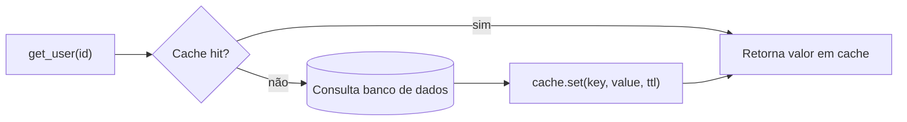

## Visão Geral

Um cache troca uma pequena quantidade de risco de desatualização por uma grande redução de latência e carga no banco de dados: em vez de toda leitura atingir o armazenamento primário de dados, uma camada rápida, geralmente em memória, responde à maioria das requisições, e apenas uma fração passa até a fonte da verdade. Quase toda decisão de caching em uma entrevista ou em produção é uma escolha entre um punhado de padrões bem conhecidos — cache-aside, write-through, write-behind — mais a pergunta de como você invalida um valor em cache uma vez que os dados subjacentes mudam, o que é de forma confiável a parte difícil.

## Cache-Aside (Carregamento Preguiçoso)

A aplicação, não o cache, é responsável por popular o cache em um miss:

```python
def get_user(user_id):
    user = cache.get(f"user:{user_id}")
    if user is not None:
        return user                      # cache hit
    user = db.query("SELECT * FROM users WHERE id = %s", user_id)
    cache.set(f"user:{user_id}", user, ttl=300)
    return user                          # cache miss, agora populado
```

Este é o padrão default para dados intensivos em leitura: o cache só mantém o que realmente foi requisitado (sem memória desperdiçada em dados frios), e uma queda do cache degrada para "toda leitura atinge o banco de dados" em vez de perder dados — o banco de dados continua sendo a fonte da verdade e nada foi escrito cache-first.



## Write-Through e Write-Behind

**Write-through** escreve no cache e no banco de dados de forma síncrona, como uma operação lógica, então o cache nunca fica desatualizado após uma escrita da qual participou:

```python
def update_user(user_id, data):
    db.execute("UPDATE users SET ... WHERE id = %s", user_id)
    cache.set(f"user:{user_id}", data, ttl=300)   # mesma requisição, antes de retornar
```

**Write-behind (write-back)** confirma a escrita depois de atualizar apenas o cache, e sincroniza com o banco de dados de forma assíncrona em lotes:

```python
def update_user(user_id, data):
    cache.set(f"user:{user_id}", data, ttl=300)
    write_queue.enqueue(("users", user_id, data))  # sincronizado ao BD por um worker em background
    return  # o chamador vê sucesso antes da escrita no BD ter acontecido
```

Write-behind é o caminho de escrita de menor latência dos três, e agrupa muitas escritas em menos idas e voltas ao banco de dados — ao custo de uma lacuna real de durabilidade: se o nó de cache morrer antes que a escrita enfileirada chegue ao banco de dados, essa atualização se perde. Aparece em cargas de trabalho que toleram isso (contadores de métricas, contagens de visualização) e raramente em qualquer coisa parecida com dinheiro.

## Invalidação: A Parte Difícil

A frase de Phil Karlton — "há apenas duas coisas difíceis em ciência da computação: invalidação de cache e nomear coisas" — é um clichê precisamente porque é precisa. Três abordagens práticas:

- **Expiração por TTL (time-to-live)** — a mais simples e comum: todo valor em cache expira após N segundos independentemente de os dados subjacentes terem realmente mudado. Limita a desatualização a uma janela conhecida com zero coordenação, ao custo de desatualização garantida por até essa janela mesmo quando nada mudou.
- **Invalidação explícita na escrita** — o caminho de escrita apaga ou atualiza a chave de cache ao mesmo tempo que escreve no banco de dados (esta é a prima só-de-invalidação do write-through: `cache.delete(key)` em vez de `cache.set(key, ...)`). Precisa, mas só tão completa quanto todo caminho de escrita que foi atualizado para lembrar de fazê-lo — um caminho de escrita adicionado depois que esquece de invalidar é um bug silencioso e difícil de notar.
- **Invalidação orientada a eventos** — um stream de change-data-capture ou uma mensagem a partir do banco de dados (veja o padrão outbox) dispara invalidação de cache como um efeito colateral da escrita, desacoplando "lembrar de invalidar" de cada ponto de escrita individual. Mais partes móveis, mas imune ao modo de falha "alguém adicionou um novo caminho de escrita e esqueceu" acima.

## CDN: Caching na Borda

Uma CDN (Content Delivery Network) é a mesma ideia — servir de uma camada rápida em vez da origem — aplicada geograficamente: dezenas a centenas de localizações de borda cacheiam respostas fisicamente próximas dos usuários finais, então uma requisição de Tóquio não faz ida e volta a um servidor de origem na Virgínia a cada acerto. Os cabeçalhos de resposta `Cache-Control` e `ETag`/`Last-Modified` dizem à CDN (e aos navegadores) por quanto tempo uma resposta é fresca e como validá-la barato uma vez que expira:

```
Cache-Control: public, max-age=86400, stale-while-revalidate=3600
ETag: "33a64df551425fcc55e4d42a148795d9f25f89d"
```

`stale-while-revalidate` permite que a CDN sirva a cópia em cache (agora expirada) imediatamente enquanto busca uma nova em background — trocando uma quantidade limitada de desatualização extra por zero latência adicionada na requisição que por acaso dispara a revalidação. CDNs são um encaixe natural para ativos estáticos (imagens, bundles JS) e cada vez mais para respostas de API personalizadas-mas-cacheáveis via computação de borda (Cloudflare Workers, Lambda@Edge) que variam a chave de cache por usuário ou região em vez de cachear uma resposta global única.

## Cache Stampede / Thundering Herd

Quando uma chave quente expira, toda requisição concorrente para ela erra no mesmo instante e passa para o banco de dados simultaneamente — uma estampida que pode derrubar exatamente o banco de dados que o cache existe para proteger, precisamente no momento em que o TTL de um item popular expira:

```python
def get_user(user_id):
    key = f"user:{user_id}"
    user = cache.get(key)
    if user is not None:
        return user
    lock = cache.acquire_lock(f"lock:{key}", ttl=5)
    if lock:
        user = db.query(...)
        cache.set(key, user, ttl=300)
        cache.release_lock(f"lock:{key}")
        return user
    else:
        time.sleep(0.05)             # alguém já está repopulando esta chave
        return get_user(user_id)     # tenta de novo, provavelmente acerta o cache agora quente
```

Um lock de curta duração por chave garante que apenas uma requisição repopule uma dada chave na expiração enquanto o resto espera brevemente e depois atinge o cache agora quente, em vez de todos atingirem o banco de dados. `stale-while-revalidate` (acima) e TTLs "com jitter" aleatorizados (para que um lote de chaves definidas ao mesmo tempo não expire todas no mesmo instante) são as outras duas mitigações padrão, frequentemente usadas juntas.

## Trade-offs

- **Cache-aside deixa uma janela de corrida em leituras e escritas concorrentes** — uma leitura que erra, depois uma escrita concorrente, depois a busca desatualizada da leitura terminando e sobrescrevendo o cache com dados antigos, é uma janela de inconsistência real (embora estreita) que write-through evita por construção.
- **Write-through adiciona latência a toda escrita, não apenas a misses de cache** — toda escrita agora paga por duas operações síncronas (BD + cache) em vez de uma, que é o custo direto de nunca deixar o cache ficar desatualizado após suas próprias escritas.
- **Um TTL mais longo significa menos carga no banco de dados mas uma janela de desatualização mais ampla** — esse número único geralmente é a decisão de caching mais consequente em um sistema, e o valor certo é uma propriedade da tolerância real de desatualização dos dados, não um padrão que vale a pena copiar de outro serviço.

## Perguntas de Entrevista

- Percorra o que acontece em um cache miss sob cache-aside versus write-through.
- Qual é o risco real de durabilidade do caching write-behind, e para que tipo de dado ele é aceitável?
- Por que a invalidação baseada em TTL é ao mesmo tempo a mais simples e a menos precisa das estratégias de invalidação?
- O que causa uma cache stampede, e cite duas mitigações independentes para ela.
- O que uma CDN adiciona sobre um cache em nível de aplicação que não é apenas "a mesma coisa, mais longe"?

## Referências

- [MDN — HTTP Caching](https://developer.mozilla.org/en-US/docs/Web/HTTP/Caching)
- Rajesh Nishtala et al., ["Scaling Memcache at Facebook"](https://www.usenix.org/conference/nsdi13/technical-sessions/presentation/nishtala) (NSDI 2013)
- [AWS — Caching Best Practices](https://aws.amazon.com/caching/best-practices/)
- [Cloudflare Learning Center — What is a CDN?](https://www.cloudflare.com/learning/cdn/what-is-a-cdn/)
