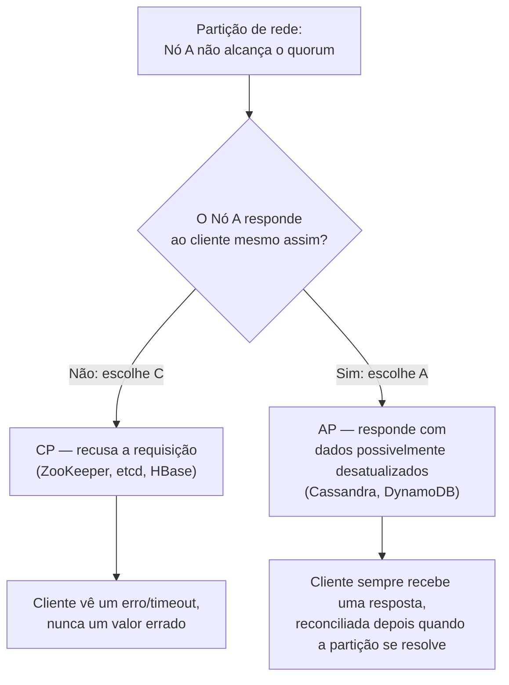

## Visão Geral

Qualquer sistema de dados distribuído — um banco de dados multi-nó, um cluster de cache, um key-value store replicado — precisa fazer uma escolha no momento em que ocorre uma partição de rede: um nó não consegue alcançar o restante do cluster, mas um cliente continua pedindo para ler ou escrever dados. Ele responde mesmo assim (possivelmente com dados desatualizados ou divergentes), ou recusa até conseguir confirmar que não está isolado? O teorema CAP, formalizado por Eric Brewer em 2000 e provado por Seth Gilbert e Nancy Lynch em 2002, diz que você não pode ter as três propriedades — Consistência, Disponibilidade e Tolerância a Partição — ao mesmo tempo. E, na prática, partições acontecem, então a escolha real é entre C e A.

## As Três Propriedades

- **Consistência (C)** — toda leitura recebe a escrita mais recente, ou um erro. Isso é *linearizabilidade*, não o "C" do ACID (que trata de invariantes de transação, não de atualidade entre nós) — um ponto comum de confusão em entrevistas.
- **Disponibilidade (A)** — toda requisição a um nó que não falhou recebe uma resposta (sem erro), sem garantir que seja a escrita mais recente.
- **Tolerância a Partição (P)** — o sistema continua operando mesmo com um número arbitrário de mensagens sendo perdidas ou atrasadas entre nós.

## Por Que Você Não Escolhe "C ou A" Livremente

O teorema costuma ser ensinado como "escolha 2 de 3", o que é enganoso. Tolerância a partição não é opcional — uma rede de máquinas independentes *vai* se particionar eventualmente (um switch falha, um cabo é cortado, um data center perde conectividade), e nenhuma escolha de software evita isso. Então P é um dado, não uma escolha. A decisão real e forçada só acontece *durante* uma partição: quando um nó não consegue confirmar que está sincronizado com o restante do cluster, ele continua atendendo requisições (escolhendo A, com o risco de retornar dados desatualizados) ou recusa atender até conseguir confirmar consistência (escolhendo C, ao custo da disponibilidade)? Fora de uma partição, um sistema bem projetado pode ser consistente e disponível ao mesmo tempo — o CAP não diz nada sobre o caso comum, apenas sobre o caso de falha.

## CP vs. AP: Como Cada Escolha se Parece na Prática



**CP (Consistente + Tolerante a Partição, sacrifica Disponibilidade):**

```
Cliente -> Nó A (isolado do cluster)
Nó A: "Não consigo confirmar quorum. Não vou responder a esta escrita."
Cliente: requisição falha / expira o tempo
```

ZooKeeper, etcd e HBase são comumente citados como sistemas CP: um ensemble ZooKeeper que perde o quorum para de atender escritas (e frequentemente leituras) em vez de arriscar retornar um valor que a maioria dos nós nunca concordou.

**AP (Disponível + Tolerante a Partição, sacrifica Consistência):**

```
Cliente -> Nó A (isolado do cluster)
Nó A: "Não sei se estou atualizado, mas aqui está o que eu tenho."
Cliente: recebe uma resposta, possivelmente desatualizada
```

Cassandra e DynamoDB usam esse comportamento por padrão: toda réplica alcançável responde, e escritas conflitantes feitas durante a partição são reconciliadas depois (last-write-wins, vector clocks, ou lógica de merge na aplicação) assim que a partição se resolve.

Nenhuma das duas é "correta" em abstrato — um ledger de pagamentos geralmente precisa de CP (um saldo não confirmado é pior que um indisponível), enquanto um carrinho de compras ou um feed social geralmente prefere AP (mostrar um carrinho levemente desatualizado é melhor que mostrar uma página de erro).

## PACELC: A Extensão que Ninguém Menciona em Entrevistas

Daniel Abadi apontou em 2010 que o CAP só descreve o comportamento *durante uma partição* (P), mas não diz nada sobre o trade-off que existe todo o resto do tempo, quando não há (**E**lse) partição — todo sistema ainda precisa escolher entre **L**atência e **C**onsistência em cada requisição, com ou sem partição. Um sistema que replica uma escrita de forma síncrona para todos os nós antes de confirmar (consistência forte) paga por isso com latência; um sistema que confirma após a escrita local e replica de forma assíncrona (menor latência) é apenas eventualmente consistente. É por isso que "PACELC" é um modelo mental estritamente mais útil em uma entrevista do que o CAP sozinho: ele te obriga a também declarar seu trade-off de consistência/latência no caso *normal*, não apenas no caso de partição.

## Interpretações Comuns Equivocadas do CAP

- **"NoSQL significa AP, SQL significa CP"** — falso como regra geral. Uma instância PostgreSQL de nó único não é significativamente "CP" (não há nada para particionar), e vários sistemas NewSQL/SQL distribuídos (CockroachDB, Google Spanner) são CP por design, usando consenso (Raft/Paxos) para manter toda escrita confirmada linearizável entre regiões.
- **"Você precisa escolher C ou A para todo o seu sistema"** — a escolha geralmente é feita *por subsistema*, não globalmente. Uma plataforma de e-commerce pode manter sua contagem de estoque como CP (nunca vender além do disponível) enquanto mantém seu feed de recomendações como AP (um "clientes também compraram" levemente desatualizado é inofensivo).
- **"Consistência eventual significa não confiável"** — consistência eventual é uma garantia precisa (todas as réplicas convergem para o mesmo valor *dado que não há novas escritas*), não um sinônimo de "ocasionalmente errado". O trade-off é uma janela de desatualização limitada, que muitos domínios toleram completamente.

## Trade-offs

- **CP custa disponibilidade exatamente quando você mais precisa dela** — o momento em que ocorre uma partição também é o momento em que o tráfego não pode ser rebalanceado uniformemente, então a recusa "segura" de um sistema CP em responder frequentemente coincide com o pior momento possível para uma indisponibilidade.
- **AP custa correção de uma forma que precisa ser resolvida em algum lugar** — escritas conflitantes aceitas por partições diferentes durante uma divisão não desaparecem; algo (vector clocks, CRDTs, "last write wins" ou um humano) precisa reconciliá-las assim que a partição se resolve, e essa lógica de reconciliação é trabalho de engenharia real, frequentemente negligenciado.
- **O erro em entrevista não é escolher C ou A — é não declarar de qual subsistema você está falando.** "Esse sistema é CP ou AP?" quase nunca tem uma única resposta para uma arquitetura inteira; nomear o dado específico (contagem de estoque vs. descrição de produto) para o qual você está fazendo o trade-off é o que separa uma resposta forte de uma decorada.

## Perguntas de Entrevista

- Por que "tolerância a partição" não é realmente uma terceira opção que você pode recusar?
- Para um encurtador de URLs, o caminho de escrita (criar um código curto) é CP ou AP, e por que o caminho de leitura (redirecionamento) pode fazer uma escolha diferente?
- O que o PACELC adiciona que o CAP não cobre?
- Dê um exemplo de um único sistema que é CP para um tipo de dado e AP para outro.
- Como escritas conflitantes feitas nos dois lados de uma partição seriam reconciliadas em um sistema AP assim que a partição se resolve?

## Referências

- Eric Brewer, ["CAP Twelve Years Later: How the 'Rules' Have Changed"](https://www.infoq.com/articles/cap-twelve-years-later-how-the-rules-have-changed/) (InfoQ / IEEE Computer, 2012)
- Daniel Abadi, ["Problems with CAP, and Yahoo's Little Known NoSQL System"](http://dbmsmusings.blogspot.com/2010/04/problems-with-cap-and-yahoos-little.html) (DBMS Musings, 2010) — o post que introduziu o PACELC
- [Wikipedia — CAP theorem](https://en.wikipedia.org/wiki/CAP_theorem) — visão geral e histórico, incluindo a prova de Gilbert & Lynch
- Martin Kleppmann, [*Designing Data-Intensive Applications*](https://www.oreilly.com/library/view/designing-data-intensive-applications/9781491903063/) (O'Reilly, 2017) — Capítulo 9, "Consistency and Consensus"
</content>
