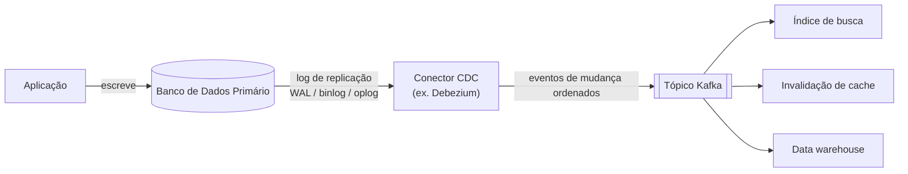

## Visão Geral

Toda escrita em um banco de dados é, por baixo da abstração de tabela, um evento: uma linha foi inserida, atualizada, ou excluída, em alguma ordem. Change Data Capture (CDC) é a prática de seguir o próprio log de replicação do banco de dados — o mesmo log que ele já usa para manter seus followers sincronizados — e transformar esse detalhe de implementação privado em um stream público de eventos de mudança ordenados que outros sistemas podem consumir. Em vez de um índice de busca, um cache, ou um serviço downstream fazendo polling do que mudou, eles simplesmente assinam o log.

## O Problema que o CDC Resolve: Manter Sistemas Sincronizados

Quase nenhum sistema não trivial armazena dados em apenas um lugar. A mesma linha pode precisar existir, em formas diferentes, em um banco de dados OLTP, um índice de busca, um cache, e um data warehouse. Manter essas cópias sincronizadas tradicionalmente significou uma de duas opções: ETL batch periódico (simples, mas lento e grosseiro — um dump completo ou incremental em uma agenda) ou *dual writes*, onde o código da aplicação escreve no banco de dados e depois explicitamente atualiza o índice de busca ou invalida o cache na mesma requisição.

Dual writes têm uma race condition fácil de perder: dois clients escrevendo valores conflitantes podem ter suas escritas chegando ao banco de dados e ao índice de busca em uma *ordem relativa diferente*, porque nada força os dois sistemas a concordarem em uma única ordem de operações. O banco de dados acaba com um valor final; o índice de busca acaba com outro. Nada travou — os dois sistemas estão apenas silenciosa e permanentemente inconsistentes um com o outro.

## Como o CDC Corrige o Problema de Ordenação

O CDC torna um banco de dados o líder e transforma toda outra representação dos dados em um follower dele — a mesma ideia de state-machine replication que um banco de dados usa para manter suas próprias réplicas sincronizadas, apenas estendida para sistemas heterogêneos. O banco de dados decide a ordem em que escritas conflitantes são aplicadas e registra essa ordem em seu log; todo consumidor downstream (índice de busca, cache, warehouse) aplica mudanças nessa mesma ordem, então todos convergem para o mesmo valor final que o líder tem. A ordem é decidida uma vez, na fonte — ninguém downstream precisa rederivar isso.

## Implementando CDC: Baseado em Log, Não em Query

Ferramentas CDC se conectam ao mecanismo de replicação já existente de um banco de dados em vez de rodar queries periódicas contra tabelas de aplicação:

- **PostgreSQL** — slots de replicação lógica (`pgoutput`, `wal2json`)
- **MySQL** — o binlog, em formato row-based
- **MongoDB** — o oplog
- **SQL Server, Oracle, Db2, Cassandra** — cada um tem seu próprio mecanismo nativo de log de mudanças

**Debezium** é a plataforma CDC de código aberto dominante hoje, com conectores de origem para todos os acima. É mais comumente implantado via **Kafka Connect** — os conectores do Debezium rodam como tarefas do Connect, publicando cada mudança como um registro Kafka — o que traz tolerância a falhas em modo distribuído, rebalanceamento, e gerenciamento de offset de graça. Contrário a uma suposição comum, Kafka Connect não é um requisito rígido do próprio Debezium: **Debezium Server** e um modo de motor incorporável existem para equipes que querem os mesmos conectores testados em batalha sem rodar um cluster Kafka Connect. Maxwell (binlog do MySQL), GoldenGate (Oracle), e pgcapture (PostgreSQL) resolvem o mesmo problema para equipes não padronizadas em Debezium.

## Bootstrapping: O Problema do Snapshot Inicial

Um log de replicação só contém mudanças daqui pra frente a partir de onde começa — não contém o histórico completo de uma tabela para sempre (manter cada mudança já feita precisaria de espaço em disco ilimitado). Então um consumidor totalmente novo — digamos, um índice de busca sendo construído pela primeira vez — não pode ser populado apenas a partir do log; ele precisa de um **snapshot consistente** do estado atual primeiro, tirado em uma posição conhecida no log, com mudanças baseadas em log aplicadas apenas a partir dessa posição em diante. Algumas ferramentas CDC lidam com isso automaticamente; o Debezium especificamente usa um algoritmo de snapshot incremental derivado do projeto DBLog da Netflix, para que um snapshot possa ser tirado sem bloquear a replicação em andamento.

## Log Compaction: Limitando o Log Sem Perder Correção

Manter o histórico de mudanças completo para sempre é frequentemente desperdício, mas truncar o log ingenuamente quebraria qualquer novo consumidor tentando reconstruir o estado atual a partir dele. **Log compaction** resolve isso: para cada chave, o log retém apenas o evento mais recente, descartando atualizações superadas mais antigas para essa mesma chave (uma exclusão é representada como um valor tombstone especial, que remove o histórico da chave inteiramente uma vez compactado). Um consumidor lendo um log compactado do início ainda tem a garantia de ver o valor atual para cada chave — apenas não verá o histórico intermediário. O Apache Kafka suporta isso como um recurso nativo de tópico, o que é o que permite que um tópico Kafka compactado sirva de fonte de verdade durável em vez de apenas mensageria transitória.

## CDC vs. Event Sourcing

Ambos fazem de um log de eventos a fundação do sistema, mas em níveis diferentes de abstração. CDC extrai eventos de mudança de um banco de dados que ainda é modificado de forma convencional (atualizado e excluído no lugar) — o log é um subproduto, reconstruído em baixo nível a partir do mecanismo de replicação. Event sourcing vai mais longe: a própria aplicação é construída em torno de um log append-only de eventos de domínio desde o início (`OrderPlaced`, `OrderShipped`), e o estado atual é uma *view* otimizada para leitura derivada de reproduzi-los — atualizações e exclusões no nível de armazenamento são evitadas por design, não apenas capturadas depois do fato. CDC pode ser retrofitado em um banco de dados existente com mudanças mínimas de aplicação; event sourcing é um compromisso arquitetural maior e mais invasivo.

## O Problema de Schema-como-API-Pública

A maior armadilha operacional do CDC: replicar o próprio schema de uma tabela transforma esse schema em uma API pública de fato para todo consumidor downstream, mesmo que a tabela nunca tenha sido projetada para ser uma. Renomear ou remover uma coluna que é inofensivo dentro de um único serviço pode silenciosamente quebrar todo consumidor CDC dependendo dela — e como CDC é um stream, a falha pode surgir como uma indisponibilidade voltada ao cliente em vez de uma falha contida de job ETL. Esse é exatamente o problema que **o outbox pattern foi projetado para contornar** — veja `outbox-pattern` — dando ao CDC uma tabela dedicada com seu próprio schema para capturar, desacoplada de como quer que as tabelas de negócio internas pareçam. Usar CDC para capturar uma tabela outbox feita sob medida (em vez de capturar tabelas de negócio diretamente) obtém os benefícios de baixa latência e sem polling do CDC sem acoplar o schema interno ao contrato público de eventos.

## Trade-offs

- **CDC é assíncrono, então herda todos os problemas de replication lag.** O sistema de registro faz commit antes de esperar qualquer consumidor CDC alcançá-lo — um consumidor lento não desacelera o banco de dados de origem, mas significa que sistemas derivados podem estar observavelmente atrasados, às vezes de forma significativa sob carga.
- **Transformar o log de replicação de um banco de dados em um stream não remove o custo operacional — ele o move.** Polling adiciona carga de query e latência ao banco de dados; CDC substitui isso por um cluster de conector/Kafka Connect (ou instância de Debezium Server) para rodar, monitorar, e manter compatível através de upgrades de versão do banco de dados.
- **Bancos de dados baseados em quórum e eventualmente consistentes (Cassandra, stores estilo DynamoDB) não têm um log óbvio único para assinar.** Não há um único líder cujo log seja autoritativo — Cassandra, por exemplo, expõe CDC como segmentos de log brutos por nó e deixa ao consumidor mesclá-los em um único stream ordenado, o mesmo problema que um leitor de quórum já precisa resolver.
- **Eventos consumidos por CDC tipicamente carregam a linha inteira atual a cada mudança, o que log compaction trata de forma diferente do que logs event-sourced.** Um evento de atualização CDC substitui completamente o anterior para essa chave, então a compaction pode descartar história com segurança; os eventos de um log event-sourced descrevem *intenção* ("enviado"), não estado completo, então a maioria deles não pode ser descartada da mesma forma sem perder informação necessária para reconstruir o histórico.

## Perguntas de Entrevista

- Por que escrever em um banco de dados e depois atualizar um índice de busca no mesmo código de tratamento de requisição (um "dual write") leva a inconsistência permanente, mesmo sem crashes envolvidos?
- Como a abordagem de log único líder do CDC resolve o problema de ordenação que dual writes não conseguem?
- Por que um novo consumidor CDC não pode simplesmente começar a ler o log de onde ele está atualmente — o que o snapshot inicial resolve?
- Qual é a diferença prática entre CDC e event sourcing, dado que ambos centram-se em um log de mudanças?
- Por que é arriscado apontar um conector CDC diretamente para uma tabela de negócio em vez de uma tabela outbox dedicada, e como o outbox pattern endereça esse risco?

## Referências

- Martin Kleppmann, [*Designing Data-Intensive Applications*, 2nd Edition](https://www.oreilly.com/library/view/designing-data-intensive-applications/9781098119058/) (O'Reilly) — Capítulo 12, "Stream Processing," seções "Databases and Streams" e "State, Streams, and Immutability"
- [Debezium Documentation — Features](https://debezium.io/documentation/reference/stable/features.html)
- [PostgreSQL Documentation — Logical Replication](https://www.postgresql.org/docs/current/logical-replication.html)
- [Google Cloud — Datastream Overview](https://cloud.google.com/datastream/docs/overview) (um serviço CDC gerenciado, um dentre vários — o modo CDC do AWS DMS e os conectores CDC gerenciados da Confluent resolvem o mesmo problema)
- [Netflix Tech Blog — DBLog: A Generic Change-Data-Capture Framework](https://netflixtechblog.com/dblog-a-generic-change-data-capture-framework-69351fb9099b)
