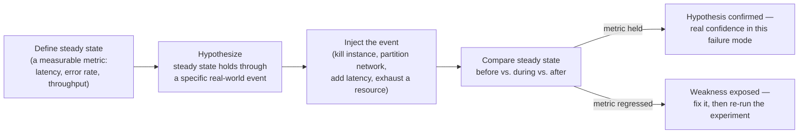

## Overview

Every resilient architecture is built on machinery that only runs during a failure: the circuit breaker that's supposed to trip, the replica that's supposed to get promoted, the retry-with-backoff that's supposed to ride out a blip, the DNS failover that's supposed to redirect traffic to another region. All of it is written, reviewed, and shipped with confidence — and almost none of it is ever exercised, because the failure it exists to handle is rare and hard to reproduce on demand. A unit test can call the failover code path directly, but it can't tell you whether the *real* trigger — an actual leader dying mid-transaction, an actual network partition splitting two data centers, an actual disk filling up under production load — fires that path correctly, in time, without some untested edge condition turning the recovery into a second outage. This is the uncomfortable truth about resilience machinery: the code paths that matter most in an incident are, by construction, the least-tested code in the system, because outages don't happen on a schedule that a normal test suite can rely on.

**Chaos engineering** is the discipline of closing that gap by deliberately injecting real failure into a real system — often the production system itself — to find out whether the machinery built to survive that failure actually does, before an uncontrolled version of the same failure finds out for you. It is not a testing framework and not a euphemism for recklessness; it's an experimental method, borrowed explicitly from the scientific method, for building empirical confidence in a system's behavior under conditions that are too rare, too distributed, or too consequential to fully rehearse any other way.

## Chaos Engineering Is an Experimental Method, Not Randomness

The name invites a shallow reading — "chaos" sounds like the opposite of discipline — but the practice as formalized by its Netflix originators is the opposite of random destruction. The community manifesto, [Principles of Chaos Engineering](https://principlesofchaos.org/), defines it precisely: "the discipline of experimenting on a system in order to build confidence in the system's capability to withstand turbulent conditions in production." Casey Rosenthal and Nora Jones's *Chaos Engineering: System Resiliency in Practice* (O'Reilly, 2020) — written by two of the Netflix engineers who built the practice into a formal discipline — is explicit that the point is not to cause chaos but to *reveal* chaos that already exists latently in the system's design, under controlled conditions where a human is watching and can intervene.

The distinction that matters is between chaos engineering and two things it's easily confused with:

- **It is not fault injection in general.** Fault injection — killing a process, dropping packets, adding latency — is the *mechanism* chaos engineering uses, but fault injection without a hypothesis and a comparison against expected behavior is just breaking something and looking at what happens. That can be useful for exploratory testing, but it doesn't produce the thing chaos engineering is after: a falsifiable claim about the system, tested and either confirmed or refuted.
- **It is not load testing.** Load testing asks "how much traffic can this system take before it degrades?" Chaos engineering asks "given the traffic it already handles, does this specific failure mode get handled the way we believe it does?" The variable under test is a failure event, not a volume.

Framed this way, chaos engineering is applied science: you don't run the experiment to see if something breaks for entertainment value, you run it because you have a specific, falsifiable belief about your system's resilience and no other way to test that belief against reality at the fidelity that matters — real infrastructure, real traffic, real timing, real operator tooling.

## The Steady-State Hypothesis

The formal method, as laid out in the Principles of Chaos Engineering and expanded on throughout Rosenthal and Jones's book, has four steps, and the rigor is entirely in doing them in this order rather than skipping straight to "inject failure and see":

1. **Define steady state as a measurable output**, not as an internal implementation detail. The steady state is something a user or the business actually cares about — request throughput, checkout success rate, p99 latency on the search endpoint, cache hit ratio — not "the number of healthy pods," which is an implementation detail that can be perfectly nominal while the metric that matters is on fire. A steady-state metric has to be something you can watch continuously on a dashboard *during* the experiment, in near-real time, because the whole method depends on comparing it before, during, and after the injected event.
2. **Hypothesize that the steady state holds through a specific real-world event.** This is the part that turns fault injection into an experiment: you state, before running anything, "throughput and error rate will remain within their normal envelope when instance X is terminated" or "checkout latency will not regress when the primary database fails over to a replica." A vague hypothesis like "the system should handle failure" isn't testable; a specific one — naming the exact fault and the exact metric — is.
3. **Introduce a variable that reflects a real-world event.** Not an arbitrary crash — a fault that corresponds to something that actually happens in the system's operating environment: a server or container dying, a dependency going unreachable, a network partition between two availability zones, elevated latency on a call path, a disk filling up, a certificate expiring. The credibility of the whole exercise rests on the injected fault being a plausible production event, not a contrived one that would never occur outside the experiment.
4. **Try to disprove the hypothesis by looking for a difference in steady state.** If the metric holds through the injected event, the hypothesis is confirmed — real, empirical confidence in that specific failure mode, not confidence inferred from a design doc or a code review. If it doesn't hold, the experiment has done its job: it has surfaced a weakness under controlled conditions, on a schedule the team chose, with people watching and ready to intervene — instead of at 3 a.m. during an unplanned outage with a customer-facing SLA burning down.

The Principles also add a set of "advanced" practices that separate a mature program from an occasional exercise: running experiments continuously rather than as one-off events (because a fix elsewhere in the system, or a config drift, can silently reintroduce a weakness that was already "proven" fixed), running them against production rather than a staging environment that never sees real traffic patterns, automating the experiments so they don't depend on a person remembering to run them, and prioritizing which failure modes to test by their estimated business impact and likelihood rather than testing whatever is easiest to simulate.

## Netflix's Chaos Monkey and the Simian Army

The discipline traces its lineage directly to Netflix's migration to AWS in the early 2010s. Moving off owned data centers meant Netflix's services now ran on commodity cloud instances that Amazon could — and routinely did — terminate without notice, and Netflix's own engineers realized the only reliable way to make sure every service tolerated that was to make instance termination a routine, expected event rather than a rare surprise. The tool they built for this, **Chaos Monkey**, does exactly one thing: it randomly terminates instances in production, on a schedule, during business hours when engineers are around to respond. Its own documentation states the reasoning plainly — the tool exists because "exposing engineers to failures more frequently incentivizes them to build resilient services." Netflix open-sourced it, and the current implementation is maintained at [Netflix/chaosmonkey](https://github.com/Netflix/chaosmonkey) on GitHub, now integrated with Netflix's Spinnaker delivery platform and supporting multiple cloud backends.

Chaos Monkey was the first member of what Netflix grew into the **Simian Army** — a set of tools that each escalate the blast radius or the kind of fault, described in the Netflix Tech Blog's "The Netflix Simian Army" post. The progression is the important part, not the individual tool names: each successive "monkey" tests a larger or different failure domain than the last, moving deliberately from small, frequent, low-risk faults toward large, infrequent, high-consequence ones.

| Tool | Failure simulated | Blast radius |
|---|---|---|
| Chaos Monkey | A single instance or container terminates | Instance |
| Latency Monkey | Artificial delay injected into a service call | Instance / service |
| Chaos Gorilla | An entire availability zone goes down | Availability zone |
| Chaos Kong | An entire AWS region becomes unavailable | Region |

Latency Monkey injects delay into the RESTful communication layer between services to check whether upstream callers degrade gracefully — a direct, deliberate exercise of exactly the circuit-breaker and timeout logic described in [Circuit Breakers and Bulkheads](circuit-breakers-and-bulkheads). Chaos Gorilla simulates the loss of an entire AZ, testing whether load balancing and auto-scaling correctly redistribute load to the surviving zones. Chaos Kong, the largest-blast-radius tool in the army, simulates the loss of a whole AWS region — testing the same multi-region failover and traffic-shifting machinery covered in [Multi-Region Architecture and Disaster Recovery](multi-region-architecture-and-disaster-recovery), at a scale that most organizations only ever exercise on paper. The Simian Army is the concrete illustration of a principle that governs the entire practice: you don't start chaos engineering at the region level, you earn your way there.

## Bounding the Blast Radius

The single practice that separates chaos engineering from recklessness is controlling how much of the system, and how much real user traffic, any one experiment can affect. This is not a minor implementation detail — it's the difference between an experiment and a self-inflicted incident, and every credible chaos program treats it as the first design question for any new experiment, not an afterthought.

The discipline has a few concrete rules of thumb:

- **Start at the smallest scope that can produce a meaningful result.** One instance, a single-digit percentage of traffic, a canary deployment, or a non-production environment that still mirrors production closely enough to be informative. Only after a small-scope run confirms the hypothesis (or a small-scope failure is fixed and re-verified) does the scope expand — to more instances, a larger traffic percentage, and eventually, for organizations with the operational maturity for it, an entire AZ or region.
- **Build a fast, reliable abort mechanism before running the experiment, not during it.** If the steady-state metric regresses beyond an agreed threshold, the experiment needs to stop immediately and automatically — waiting for a human to notice and react defeats the purpose of bounding the blast radius in the first place. Automated abort conditions, tied directly to the same steady-state dashboard the hypothesis is measured against, are what let teams run experiments against production with real customers on the other end of the request.
- **Expand scope only on earned confidence, not on a schedule.** A team that has never run a chaos experiment has no business starting with a region-level failure; the Simian Army's own progression, from Chaos Monkey to Chaos Kong, is the model — confidence built at each smaller scope is what justifies moving to the next.
- **Isolate the blast radius from customers who didn't opt into risk**, where possible — internal traffic, employee accounts, or a small cohort, rather than the entire user base, especially for a team's earliest experiments.

Blast-radius control is also why bulkheads and circuit breakers matter to a chaos program specifically, not just to production resilience in general: an experiment run against a system that already isolates failure domains is far less likely to spill outside its intended scope than one run against a system with shared, unbounded resource pools.

## Game Days

Individual chaos experiments are usually narrow and automatable — kill one instance, add latency to one call path — but organizations also run larger, scheduled, cross-team exercises called **game days**. A game day is a deliberate rehearsal of an entire incident, not just a technical failure: a team (or several teams) agrees in advance on a scenario, executes it against a real or production-like environment, and practices the full response — detection, diagnosis, communication, and recovery — the same way they would during an actual outage. AWS's Well-Architected Framework formalizes this as a best practice (["Conduct game days regularly"](https://docs.aws.amazon.com/wellarchitected/latest/framework/rel_testing_resiliency_game_days_resiliency.html)), describing the goal as running "the same actions the team would perform as if the event actually occurred," with the framework explicitly calling out common anti-patterns: documenting a runbook but never rehearsing it, excluding business stakeholders, and treating any failures surfaced during the exercise as something to assign blame for rather than fix.

Google's internal DiRT ("Disaster Recovery Testing") program, discussed at length in Rosenthal and Jones's book, is the other well-known example of this pattern at large scale, deliberately breaking both technical systems and organizational processes — testing whether the on-call engineer actually knows the runbook, whether the escalation path actually reaches the right team, whether the documented failover procedure actually works when someone unfamiliar with it has to execute it under time pressure. This is the piece a purely technical chaos experiment can't reach: Chaos Kong tells you whether your infrastructure survives a region failure, but a game day tells you whether *your organization* does — whether the humans, the runbooks, and the communication channels hold up under the same conditions.

## What Chaos Engineering Is Not

Given how often the term gets used loosely, it's worth being precise about what falls outside it:

- **It is not "randomly breaking production and hoping."** Every credible experiment has a stated hypothesis, a measurable steady state, and a bounded scope defined before the fault is injected — the opposite of arbitrary destruction.
- **It is not a substitute for basic reliability engineering.** Chaos engineering finds gaps in resilience machinery that already exists — retries, circuit breakers, replication, failover. It doesn't build that machinery, and running experiments against a system with no failure-handling design to speak of will just reproduce outages you already knew were possible, without teaching you anything new.
- **It is not only for organizations at Netflix's scale.** The scope just needs to shrink accordingly — a single team can run a chaos experiment against one service in a staging environment with a two-instance blast radius; the method is the same, the ambition is calibrated to what the team can safely absorb.
- **It is not a one-time compliance exercise.** A weakness fixed and never re-tested can regress silently as the system changes around it; the mature form of the practice is continuous, automated, and revisited as the architecture evolves, not a single game day run once a year to check a box.

## Trade-offs

- **Real confidence costs real risk.** Running experiments against production, by design, means an incorrect hypothesis can cause real user-facing impact — the entire discipline of blast-radius control exists to make that risk small and recoverable, but it is never zero, and an organization has to be honest about whether it can absorb that risk before it starts.
- **The method only tests what it thinks to hypothesize.** A chaos program is only as good as the failure modes someone thought to write hypotheses for; it doesn't discover unknown-unknowns on its own, and a team can build a false sense of security from a chaos suite that never tests the one failure mode that actually takes the system down.
- **Tooling and process overhead are real, ongoing costs.** Building safe fault-injection tooling, steady-state dashboards, automated abort conditions, and the organizational buy-in to run experiments against production is a sustained investment, not a one-time setup — treated as a checkbox project, it atrophies quickly.
- **Game days consume real organizational time and attention.** Pulling cross-team participants into a scheduled exercise has an opportunity cost, and if the lessons learned aren't fed back into runbooks and architecture, the exercise becomes theater rather than a driver of actual improvement.
- **Early results can be discouraging in a way that needs managing.** The first several experiments an organization runs frequently expose weaknesses rather than confirm resilience — which is the method working correctly, not a sign the practice is a waste of time, but it needs to be framed that way to stakeholders in advance or the program loses support before it produces value.

## Interview Questions

- Why is fault injection alone — killing a process, dropping packets — not the same thing as chaos engineering? What's missing?
- Walk through the four steps of a chaos experiment for a concrete hypothesis, such as "checkout latency stays within SLO when the primary payments database fails over to a replica."
- How would you bound the blast radius of your first-ever chaos experiment on a system that has never been tested this way, and what would justify expanding that scope later?
- What's the difference in purpose between Chaos Monkey and Chaos Kong, and why does an organization typically graduate from one to the other rather than starting at the top?
- What does a game day test that an automated, narrowly-scoped chaos experiment does not?
- A chaos experiment's steady-state metric regresses mid-run. What should happen automatically, and why can't that decision safely be left to a human noticing and reacting?

## References

- [Principles of Chaos Engineering](https://principlesofchaos.org/) — community manifesto, originally authored by Netflix engineers
- Casey Rosenthal & Nora Jones, [*Chaos Engineering: System Resiliency in Practice*](https://www.oreilly.com/library/view/chaos-engineering/9781492043850/) (O'Reilly, 2020)
- [The Netflix Simian Army](https://netflixtechblog.com/the-netflix-simian-army-16e57fbab116) — Netflix Technology Blog
- [Netflix/chaosmonkey](https://github.com/Netflix/chaosmonkey) — Netflix, GitHub repository
- [REL12-BP05 Conduct game days regularly](https://docs.aws.amazon.com/wellarchitected/latest/framework/rel_testing_resiliency_game_days_resiliency.html) — AWS Well-Architected Framework, Reliability Pillar
