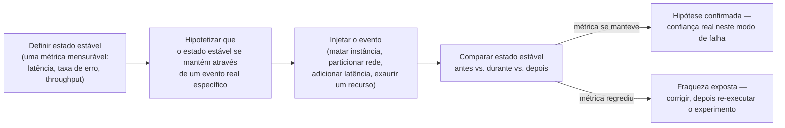

## Visão Geral

Toda arquitetura resiliente é construída sobre maquinário que só roda durante uma falha: o circuit breaker que deveria disparar, a réplica que deveria ser promovida, o retry-com-backoff que deveria aguentar um soluço, o failover de DNS que deveria redirecionar tráfego para outra região. Tudo isso é escrito, revisado, e lançado com confiança — e quase nunca é exercitado, porque a falha que existe para lidar é rara e difícil de reproduzir sob demanda. Um teste unitário pode chamar o caminho de código de failover diretamente, mas não consegue dizer se o gatilho *real* — um líder realmente morrendo no meio de uma transação, uma partição de rede realmente dividindo dois data centers, um disco realmente enchendo sob carga de produção — dispara esse caminho corretamente, a tempo, sem alguma condição de borda não testada transformando a recuperação em uma segunda indisponibilidade. Esta é a verdade desconfortável sobre maquinário de resiliência: os caminhos de código que mais importam em um incidente são, por construção, o código menos testado do sistema, porque indisponibilidades não acontecem em uma agenda em que uma suíte de testes normal possa confiar.

**Engenharia do caos** é a disciplina de fechar essa lacuna injetando deliberadamente falha real em um sistema real — frequentemente o próprio sistema de produção — para descobrir se o maquinário construído para sobreviver a essa falha realmente sobrevive, antes que uma versão descontrolada da mesma falha descubra isso por você. Não é um framework de testes e não é um eufemismo para imprudência; é um método experimental, emprestado explicitamente do método científico, para construir confiança empírica no comportamento de um sistema sob condições raras, distribuídas, ou consequentes demais para serem totalmente ensaiadas de outra forma.

## Engenharia do Caos É um Método Experimental, Não Aleatoriedade

O nome convida a uma leitura superficial — "caos" soa como o oposto de disciplina — mas a prática, como formalizada por seus originadores da Netflix, é o oposto de destruição aleatória. O manifesto da comunidade, [Principles of Chaos Engineering](https://principlesofchaos.org/), a define precisamente: "a disciplina de experimentar em um sistema para construir confiança na capacidade do sistema de suportar condições turbulentas em produção." *Chaos Engineering: System Resiliency in Practice* (O'Reilly, 2020), de Casey Rosenthal e Nora Jones — escrito por duas das engenheiras da Netflix que construíram a prática como uma disciplina formal — é explícito que o ponto não é causar caos mas *revelar* o caos que já existe latente no design do sistema, sob condições controladas onde um humano está observando e pode intervir.

A distinção que importa é entre engenharia do caos e duas coisas com as quais é facilmente confundida:

- **Não é injeção de falha em geral.** Injeção de falha — matar um processo, descartar pacotes, adicionar latência — é o *mecanismo* que a engenharia do caos usa, mas injeção de falha sem uma hipótese e uma comparação contra o comportamento esperado é apenas quebrar algo e ver o que acontece. Isso pode ser útil para testes exploratórios, mas não produz o que a engenharia do caos busca: uma alegação falsificável sobre o sistema, testada e confirmada ou refutada.
- **Não é teste de carga.** Teste de carga pergunta "quanto tráfego este sistema consegue aguentar antes de degradar?" Engenharia do caos pergunta "dado o tráfego que ele já lida, este modo de falha específico é tratado da forma que acreditamos que é?" A variável sob teste é um evento de falha, não um volume.

Enquadrada dessa forma, engenharia do caos é ciência aplicada: você não roda o experimento para ver se algo quebra por valor de entretenimento, você o roda porque tem uma crença específica e falsificável sobre a resiliência do seu sistema e nenhuma outra forma de testar essa crença contra a realidade na fidelidade que importa — infraestrutura real, tráfego real, timing real, ferramentas de operador reais.

## A Hipótese de Estado Estável

O método formal, conforme estabelecido nos Principles of Chaos Engineering e expandido ao longo do livro de Rosenthal e Jones, tem quatro passos, e o rigor está inteiramente em fazê-los nessa ordem em vez de pular direto para "injete falha e veja":

1. **Defina estado estável como uma saída mensurável**, não como um detalhe interno de implementação. O estado estável é algo com o qual um usuário ou o negócio realmente se importa — throughput de requisições, taxa de sucesso de checkout, latência p99 no endpoint de busca, taxa de acerto do cache — não "o número de pods saudáveis", que é um detalhe de implementação que pode estar perfeitamente nominal enquanto a métrica que importa está pegando fogo. Uma métrica de estado estável precisa ser algo que você consiga observar continuamente em um dashboard *durante* o experimento, em tempo quase real, porque o método inteiro depende de comparar antes, durante, e depois do evento injetado.
2. **Hipotetize que o estado estável se mantém através de um evento real específico.** Esta é a parte que transforma injeção de falha em experimento: você declara, antes de rodar qualquer coisa, "throughput e taxa de erro permanecerão dentro de seu envelope normal quando a instância X for terminada" ou "a latência do checkout não vai regredir quando o banco de dados primário fizer failover para uma réplica". Uma hipótese vaga como "o sistema deveria lidar com falha" não é testável; uma específica — nomeando a falha exata e a métrica exata — é.
3. **Introduza uma variável que reflita um evento do mundo real.** Não um crash arbitrário — uma falha que corresponde a algo que realmente acontece no ambiente operacional do sistema: um servidor ou container morrendo, uma dependência ficando inalcançável, uma partição de rede entre duas availability zones, latência elevada em um caminho de chamada, um disco enchendo, um certificado expirando. A credibilidade de todo o exercício depende de a falha injetada ser um evento de produção plausível, não um artificial que nunca ocorreria fora do experimento.
4. **Tente refutar a hipótese procurando uma diferença no estado estável.** Se a métrica se mantém através do evento injetado, a hipótese é confirmada — confiança empírica real nesse modo de falha específico, não confiança inferida de um documento de design ou revisão de código. Se não se mantém, o experimento fez seu trabalho: revelou uma fraqueza sob condições controladas, em uma agenda que a equipe escolheu, com pessoas observando e prontas para intervir — em vez de às 3 da manhã durante uma indisponibilidade não planejada com um SLA voltado ao cliente se esgotando.

Os Principles também adicionam um conjunto de práticas "avançadas" que separam um programa maduro de um exercício ocasional: rodar experimentos continuamente em vez de como eventos únicos (porque uma correção em outro lugar do sistema, ou config drift, pode reintroduzir silenciosamente uma fraqueza que já estava "provada" corrigida), rodá-los contra produção em vez de um ambiente de staging que nunca vê padrões reais de tráfego, automatizar os experimentos para que não dependam de uma pessoa lembrando de executá-los, e priorizar quais modos de falha testar por seu impacto de negócio e probabilidade estimados em vez de testar o que for mais fácil de simular.

## Chaos Monkey e o Simian Army da Netflix

A disciplina traça sua linhagem diretamente à migração da Netflix para a AWS no início dos anos 2010. Sair de data centers próprios significava que os serviços da Netflix agora rodavam em instâncias de nuvem commodity que a Amazon podia — e rotineiramente fazia — terminar sem aviso, e os próprios engenheiros da Netflix perceberam que a única forma confiável de garantir que todo serviço tolerasse isso era tornar a terminação de instância um evento rotineiro e esperado em vez de uma surpresa rara. A ferramenta que construíram para isso, **Chaos Monkey**, faz exatamente uma coisa: termina instâncias aleatoriamente em produção, em uma agenda, durante o horário comercial quando engenheiros estão por perto para responder. Sua própria documentação declara o raciocínio claramente — a ferramenta existe porque "expor engenheiros a falhas mais frequentemente os incentiva a construir serviços resilientes". A Netflix a abriu como código aberto, e a implementação atual é mantida em [Netflix/chaosmonkey](https://github.com/Netflix/chaosmonkey) no GitHub, agora integrada com a plataforma de entrega Spinnaker da Netflix e suportando múltiplos backends de nuvem.

Chaos Monkey foi o primeiro membro do que a Netflix cresceu no **Simian Army** — um conjunto de ferramentas que cada uma escala o raio de impacto ou o tipo de falha, descrito no post "The Netflix Simian Army" do Netflix Tech Blog. A progressão é a parte importante, não os nomes individuais das ferramentas: cada "macaco" sucessivo testa um domínio de falha maior ou diferente do anterior, movendo-se deliberadamente de falhas pequenas, frequentes, de baixo risco para as grandes, infrequentes, de alta consequência.

| Ferramenta | Falha simulada | Raio de impacto |
|---|---|---|
| Chaos Monkey | Uma única instância ou container termina | Instância |
| Latency Monkey | Delay artificial injetado em uma chamada de serviço | Instância / serviço |
| Chaos Gorilla | Uma availability zone inteira cai | Availability zone |
| Chaos Kong | Uma região AWS inteira fica indisponível | Região |

Latency Monkey injeta delay na camada de comunicação RESTful entre serviços para checar se os chamadores upstream degradam graciosamente — um exercício direto e deliberado exatamente da lógica de circuit breaker e timeout descrita em [Circuit Breakers and Bulkheads](circuit-breakers-and-bulkheads). Chaos Gorilla simula a perda de uma AZ inteira, testando se load balancing e auto-scaling redistribuem corretamente a carga para as zonas sobreviventes. Chaos Kong, a ferramenta de maior raio de impacto no exército, simula a perda de uma região inteira da AWS — testando o mesmo maquinário de failover multi-região e mudança de tráfego coberto em [Multi-Region Architecture and Disaster Recovery](multi-region-architecture-and-disaster-recovery), em uma escala que a maioria das organizações só exercita no papel. O Simian Army é a ilustração concreta de um princípio que governa toda a prática: você não começa engenharia do caos no nível de região, você conquista o direito de chegar lá.

## Limitando o Raio de Impacto

A única prática que separa engenharia do caos de imprudência é controlar quanto do sistema, e quanto de tráfego real do usuário, qualquer experimento pode afetar. Isso não é um detalhe menor de implementação — é a diferença entre um experimento e um incidente autoinfligido, e todo programa de caos confiável trata isso como a primeira questão de design para qualquer novo experimento, não uma reflexão tardia.

A disciplina tem algumas regras práticas concretas:

- **Comece no menor escopo que possa produzir um resultado significativo.** Uma instância, uma porcentagem de um dígito de tráfego, um deployment canário, ou um ambiente de não-produção que ainda espelhe produção de perto o suficiente para ser informativo. Só depois que uma execução de pequeno escopo confirma a hipótese (ou uma falha de pequeno escopo é corrigida e re-verificada) o escopo se expande — para mais instâncias, uma porcentagem maior de tráfego, e eventualmente, para organizações com a maturidade operacional para isso, uma AZ ou região inteira.
- **Construa um mecanismo de abort rápido e confiável antes de rodar o experimento, não durante.** Se a métrica de estado estável regredir além de um limite acordado, o experimento precisa parar imediatamente e automaticamente — esperar que um humano perceba e reaja derrota o propósito de limitar o raio de impacto em primeiro lugar. Condições de abort automatizadas, ligadas diretamente ao mesmo dashboard de estado estável contra o qual a hipótese é medida, são o que permite que equipes rodem experimentos contra produção com clientes reais do outro lado da requisição.
- **Expanda o escopo apenas com confiança conquistada, não em uma agenda.** Uma equipe que nunca rodou um experimento de caos não tem razão para começar com uma falha em nível de região; a própria progressão do Simian Army, de Chaos Monkey a Chaos Kong, é o modelo — confiança construída em cada escopo menor é o que justifica passar para o próximo.
- **Isole o raio de impacto de clientes que não optaram pelo risco**, quando possível — tráfego interno, contas de funcionários, ou um pequeno grupo, em vez da base de usuários inteira, especialmente para os primeiros experimentos de uma equipe.

Controle de raio de impacto também é por que bulkheads e circuit breakers importam para um programa de caos especificamente, não apenas para resiliência de produção em geral: um experimento rodado contra um sistema que já isola domínios de falha é muito menos propenso a vazar para fora de seu escopo pretendido do que um rodado contra um sistema com pools de recursos compartilhados e ilimitados.

## Game Days

Experimentos de caos individuais são geralmente estreitos e automatizáveis — mate uma instância, adicione latência a um caminho de chamada — mas organizações também rodam exercícios maiores, agendados, e entre equipes chamados de **game days**. Um game day é um ensaio deliberado de um incidente inteiro, não apenas uma falha técnica: uma equipe (ou várias equipes) concorda antecipadamente sobre um cenário, o executa contra um ambiente real ou similar à produção, e pratica a resposta completa — detecção, diagnóstico, comunicação, e recuperação — da mesma forma que fariam durante uma indisponibilidade real. O Well-Architected Framework da AWS formaliza isso como uma melhor prática (["Conduct game days regularly"](https://docs.aws.amazon.com/wellarchitected/latest/framework/rel_testing_resiliency_game_days_resiliency.html)), descrevendo o objetivo como executar "as mesmas ações que a equipe realizaria como se o evento realmente tivesse ocorrido", com o framework explicitamente apontando antipadrões comuns: documentar um runbook mas nunca ensaiá-lo, excluir stakeholders de negócio, e tratar quaisquer falhas reveladas durante o exercício como algo a ser culpado em vez de corrigido.

O programa interno DiRT ("Disaster Recovery Testing") do Google, discutido extensamente no livro de Rosenthal e Jones, é o outro exemplo bem conhecido desse padrão em grande escala, quebrando deliberadamente tanto sistemas técnicos quanto processos organizacionais — testando se o engenheiro de plantão realmente conhece o runbook, se o caminho de escalação realmente alcança a equipe certa, se o procedimento documentado de failover realmente funciona quando alguém não familiarizado com ele tem que executá-lo sob pressão de tempo. Esta é a peça que um experimento de caos puramente técnico não consegue alcançar: Chaos Kong diz se sua infraestrutura sobrevive a uma falha de região, mas um game day diz se *sua organização* sobrevive — se os humanos, os runbooks, e os canais de comunicação aguentam sob as mesmas condições.

## O Que a Engenharia do Caos Não É

Dado quão frequentemente o termo é usado de forma solta, vale a pena ser preciso sobre o que fica fora dele:

- **Não é "quebrar produção aleatoriamente e torcer."** Todo experimento confiável tem uma hipótese declarada, um estado estável mensurável, e um escopo limitado definido antes da falha ser injetada — o oposto de destruição arbitrária.
- **Não é um substituto para engenharia de confiabilidade básica.** Engenharia do caos encontra lacunas em maquinário de resiliência que já existe — retries, circuit breakers, replicação, failover. Ela não constrói esse maquinário, e rodar experimentos contra um sistema sem design de tratamento de falha algum vai apenas reproduzir indisponibilidades que você já sabia que eram possíveis, sem ensinar nada novo.
- **Não é apenas para organizações na escala da Netflix.** O escopo apenas precisa encolher de acordo — uma única equipe pode rodar um experimento de caos contra um serviço em um ambiente de staging com um raio de impacto de duas instâncias; o método é o mesmo, a ambição é calibrada ao que a equipe consegue absorver com segurança.
- **Não é um exercício de compliance único.** Uma fraqueza corrigida e nunca re-testada pode regredir silenciosamente conforme o sistema muda ao redor dela; a forma madura da prática é contínua, automatizada, e revisitada conforme a arquitetura evolui, não um único game day rodado uma vez por ano para marcar uma caixa.

## Trade-offs

- **Confiança real custa risco real.** Rodar experimentos contra produção, por design, significa que uma hipótese incorreta pode causar impacto real voltado ao usuário — toda a disciplina de controle de raio de impacto existe para tornar esse risco pequeno e recuperável, mas nunca é zero, e uma organização precisa ser honesta sobre se consegue absorver esse risco antes de começar.
- **O método só testa o que pensa em hipotetizar.** Um programa de caos só é tão bom quanto os modos de falha que alguém pensou em escrever hipóteses para; não descobre unknown-unknowns por conta própria, e uma equipe pode construir uma falsa sensação de segurança a partir de uma suíte de caos que nunca testa o único modo de falha que realmente derruba o sistema.
- **Ferramental e overhead de processo são custos reais e contínuos.** Construir ferramental seguro de injeção de falha, dashboards de estado estável, condições automatizadas de abort, e a adesão organizacional para rodar experimentos contra produção é um investimento sustentado, não uma configuração única — tratado como um projeto de checkbox, ele atrofia rapidamente.
- **Game days consomem tempo e atenção organizacional reais.** Trazer participantes entre equipes para um exercício agendado tem um custo de oportunidade, e se as lições aprendidas não forem realimentadas em runbooks e arquitetura, o exercício se torna teatro em vez de motor de melhoria real.
- **Resultados iniciais podem ser desanimadores de uma forma que precisa ser gerenciada.** Os primeiros vários experimentos que uma organização roda frequentemente expõem fraquezas em vez de confirmar resiliência — o que é o método funcionando corretamente, não um sinal de que a prática é perda de tempo, mas precisa ser enquadrado dessa forma para stakeholders antecipadamente ou o programa perde apoio antes de produzir valor.

## Perguntas de Entrevista

- Por que injeção de falha sozinha — matar um processo, descartar pacotes — não é a mesma coisa que engenharia do caos? O que está faltando?
- Percorra os quatro passos de um experimento de caos para uma hipótese concreta, como "a latência do checkout permanece dentro do SLO quando o banco de dados primário de pagamentos faz failover para uma réplica".
- Como você limitaria o raio de impacto do primeiro experimento de caos já feito em um sistema que nunca foi testado dessa forma, e o que justificaria expandir esse escopo depois?
- Qual é a diferença de propósito entre Chaos Monkey e Chaos Kong, e por que uma organização tipicamente gradua de um para o outro em vez de começar pelo topo?
- O que um game day testa que um experimento de caos automatizado e estreitamente escopado não testa?
- A métrica de estado estável de um experimento de caos regride no meio da execução. O que deveria acontecer automaticamente, e por que essa decisão não pode ser deixada com segurança para um humano perceber e reagir?

## Referências

- [Principles of Chaos Engineering](https://principlesofchaos.org/) — manifesto da comunidade, originalmente escrito por engenheiros da Netflix
- Casey Rosenthal & Nora Jones, [*Chaos Engineering: System Resiliency in Practice*](https://www.oreilly.com/library/view/chaos-engineering/9781492043850/) (O'Reilly, 2020)
- [The Netflix Simian Army](https://netflixtechblog.com/the-netflix-simian-army-16e57fbab116) — Netflix Technology Blog
- [Netflix/chaosmonkey](https://github.com/Netflix/chaosmonkey) — Netflix, repositório GitHub
- [REL12-BP05 Conduct game days regularly](https://docs.aws.amazon.com/wellarchitected/latest/framework/rel_testing_resiliency_game_days_resiliency.html) — AWS Well-Architected Framework, Reliability Pillar
