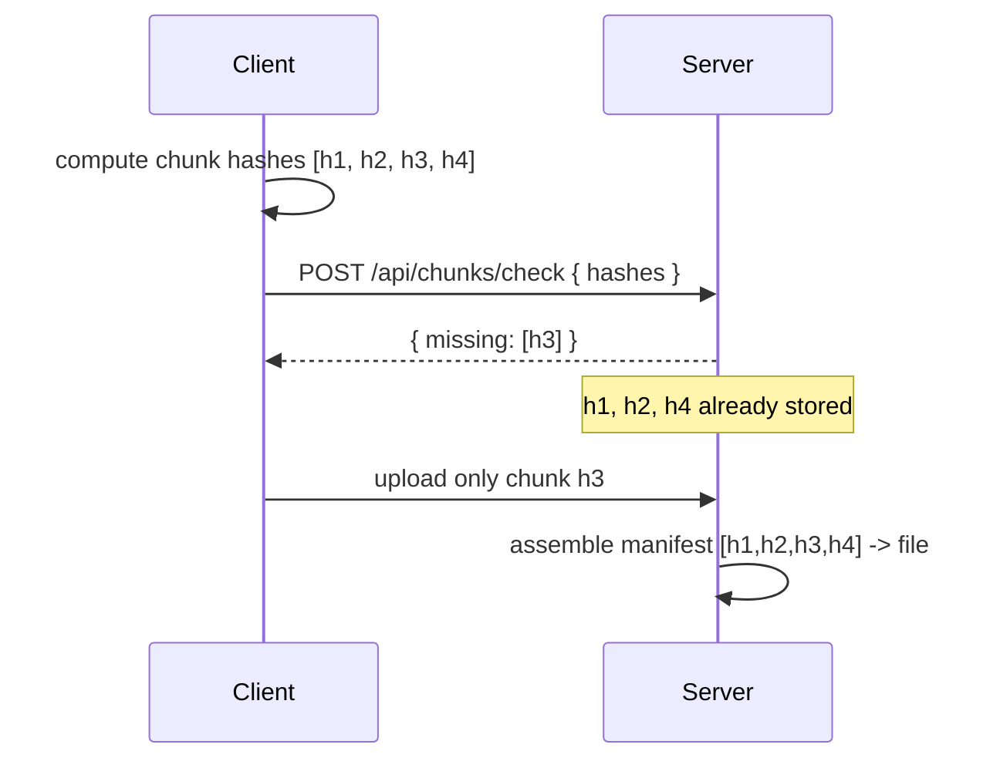

## Overview

The Direct-Upload Pattern (see Object Storage and the Direct-Upload Pattern) solves how bytes get from a client to a bucket without routing them through the application server, but it still treats a file as one indivisible blob: one presigned URL, one PUT, one all-or-nothing transfer. That's fine for a 2 MB profile picture. It breaks down for a sync product — a 20 GB video, a spotty connection that drops mid-upload, or a user who edits three lines in a 500-page document and now has to somehow avoid re-uploading the other 499 pages. The fix in all three cases is the same underlying move: stop treating the file as one blob and start treating it as a set of smaller, independently addressable **chunks**.

## Fixed-Size Chunking

The first step is mechanical: split the file into fixed-size pieces — typically 5-10MB — and upload them independently, in parallel, each to its own object key or via a storage provider's native multipart upload API (S3's Multipart Upload API is the common case: each part is uploaded with a part number, validated via an ETag, and the parts are stitched into one object server-side once all are present).

```
movie.mp4 (214 MB)
  chunk-0 [0MB   - 10MB)  -> upload -> ETag: a1b2...
  chunk-1 [10MB  - 20MB)  -> upload -> ETag: c3d4...
  chunk-2 [20MB  - 30MB)  -> upload -> ETag: e5f6...
  ...
  chunk-21 [210MB - 214MB) -> upload -> ETag: 9f8e...
```

This alone buys two things a single-request upload can't: a **progress indicator** the client can render honestly (22 of 22 chunks done, not a fake percentage estimated from elapsed time), and **resumability** — if the connection drops after chunk 14, the client re-requests only chunks 15-21 instead of restarting a 214 MB transfer from zero. Both follow directly from the same principle behind the direct-upload pattern: give the client something narrow and resumable to do, and keep the server out of the byte path.

## Content-Defined Chunking: Fixing the Edit Problem

Fixed-size chunking has a specific failure mode: it draws chunk boundaries by *offset*, not by *content*. Insert one byte at the start of a file and every chunk boundary after that point shifts — chunk 1 no longer starts where it used to, so its hash changes, and so does every chunk after it, even though the actual content is 99.9% identical to the previous version. For a sync product, where "the user changed one paragraph" needs to translate into "re-transfer one chunk," this is disqualifying.

**Content-Defined Chunking (CDC)** fixes this by choosing chunk boundaries based on the file's *content* using a rolling hash (e.g. a Rabin fingerprint) scanned byte-by-byte over the file: whenever the rolling hash of the last N bytes matches a fixed pattern (say, its low 13 bits are all zero — which happens on average once every 2^13 bytes), that byte position becomes a chunk boundary. Because the boundary is a function of local content rather than a distance from the start of the file, inserting or deleting bytes only shifts the boundaries *immediately around* the edit — every chunk before and after that neighborhood stays byte-identical to the previous version, and keeps the same hash.

```
Fixed-size chunking (insert 1 byte at offset 0):
  v1: [AAAAAAAAAA][BBBBBBBBBB][CCCCCCCCCC]
  v2: [XAAAAAAAAA][ABBBBBBBBB][BCCCCCCCCC]   <- every chunk changed

Content-defined chunking (same edit):
  v1: [AAAAAAAAAA][BBBBBBBBBB][CCCCCCCCCC]
  v2: [XAAAAAAAAA][BBBBBBBBBB][CCCCCCCCCC]   <- only the touched chunk changed
```

## Fingerprinting and Deduplication

Once a file is chunked, each chunk gets a content hash — SHA-256 is the common choice — computed client-side before upload. That hash is the chunk's fingerprint, and it does two jobs at once. First, it's the integrity check: after upload, the server (or the client, on download) re-hashes and compares, catching silent corruption in transit. Second, and more valuably, it's a dedup key: before uploading a chunk, the client asks the server "do you already have a chunk with this hash?" If the answer is yes — because another file shares that content, or because this exact chunk already exists from a previous version of this same file — the upload is skipped entirely and the server just adds a reference to the existing chunk.



This is what makes cross-user and cross-version deduplication possible: two users who both have the same stock PDF template store it once at the chunk level, and a user who saves ten versions of a document while editing pays for the *union* of chunks that ever existed across those versions, not ten full copies. The trade-off is that the server now needs a chunk-reference-count model (a chunk can't be deleted until no file manifest references it anymore) — deletion becomes garbage collection instead of a direct delete.

## Delta Sync

Everything above converges on **delta sync**: when a file changes, only its state is transferred, not its bytes. On save, the client re-runs content-defined chunking on the new version, computes hashes for the new chunk boundaries, and diffs that list against the previous version's manifest — chunks with fingerprints already in the previous manifest need no network operation at all, so only chunks that are new or changed actually get the dedup-check-then-upload flow above.

```
Sync state after edit:
  old manifest: [h1, h2, h3,     h4]
  new manifest: [h1, h2, h3_new, h4]
                          |
                          v
              only h3_new goes through
              the dedup-check-then-upload flow;
              h1, h2, h4 require zero network I/O
```

The same manifest diff runs in reverse for other devices: instead of re-downloading the whole file, a device compares its local manifest to the new one, finds it already holds three of the four chunks, and only fetches the one chunk it's missing — which is why editing a single paragraph in a large document syncs to other devices in seconds instead of minutes.

## Client-Side Compression

Chunks are commonly compressed (e.g. with Zstandard) before upload, on top of chunking and dedup rather than instead of them — compression and content-defined chunking don't conflict, since compression happens per-chunk after boundaries are already decided by content. The benefit is content-dependent: text, source code, and other low-entropy formats compress well and shrink transfer size significantly; already-compressed formats like video, images, or zip archives gain little to nothing and can even grow slightly, so it's typically applied conditionally by content type rather than unconditionally.

## Trade-offs

- **Content-defined chunking makes edits cheap to sync, at the cost of variable, unpredictable chunk sizes** — unlike fixed-size chunking, you can't assume every chunk is exactly 10MB, which complicates progress estimation and means the rolling-hash scan itself costs CPU on every save, not just on first upload.
- **Chunk-level deduplication saves storage and bandwidth across users and versions, but turns deletion into reference counting** — a chunk can only be reclaimed once no manifest anywhere still points to it, which means storage reclamation is eventually consistent, not immediate, and requires a garbage-collection pass.
- **Delta sync minimizes bytes transferred, but requires every client to maintain accurate local chunk manifests** — if a client's manifest drifts from what the server actually has (a failed partial sync, a bug), the diff is wrong, and getting back to a correct state requires either re-fingerprinting the whole file or trusting a full resync as a fallback.
- **Client-side compression trades CPU for bandwidth, and that trade isn't universally worth making** — applying it unconditionally wastes CPU on already-compressed media for little to no size reduction, so it needs to be content-type-aware rather than blanket policy.

## Interview Questions

- Why does fixed-size chunking make single-byte edits expensive to sync, and what specifically does content-defined chunking change to fix that?
- How does a rolling hash decide where a chunk boundary goes, and why does that make boundaries stable across edits elsewhere in the file?
- What does chunk-level deduplication require the server to track that whole-file deduplication doesn't, and why does that make deletion harder?
- Walk through what happens end-to-end when a user changes one paragraph in a large document that's synced across three devices.
- When would client-side compression before upload not be worth doing, and how would you decide whether to apply it?

## References

- [Rabin, M. O. — "Fingerprinting by Random Polynomials" (Harvard, 1981) — the rolling-hash technique behind content-defined chunking](https://www.cs.hmc.edu/~geoff/classes/hmc.cs070.200101/homework10/rabinfingerprint.pdf)
- [AWS S3 Documentation — Uploading and copying objects using multipart upload](https://docs.aws.amazon.com/AmazonS3/latest/userguide/mpuoverview.html)
- [Dropbox Tech Blog — "Rewriting the heart of our sync engine"](https://dropbox.tech/infrastructure/rewriting-the-heart-of-our-sync-engine)
- [rsync — "The rsync algorithm" (Andrew Tridgell, Paul Mackerras)](https://rsync.samba.org/tech_report/)
- [Facebook Engineering — Zstandard: "Smaller and faster data compression with Zstandard"](https://engineering.fb.com/2016/08/31/core-data/smaller-and-faster-data-compression-with-zstandard/)
